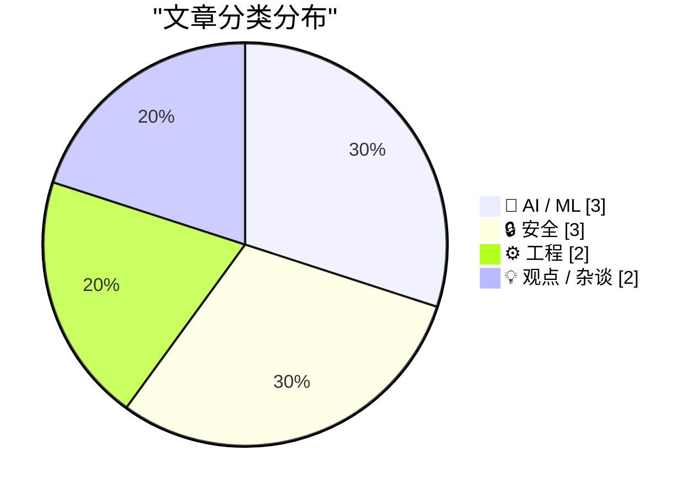
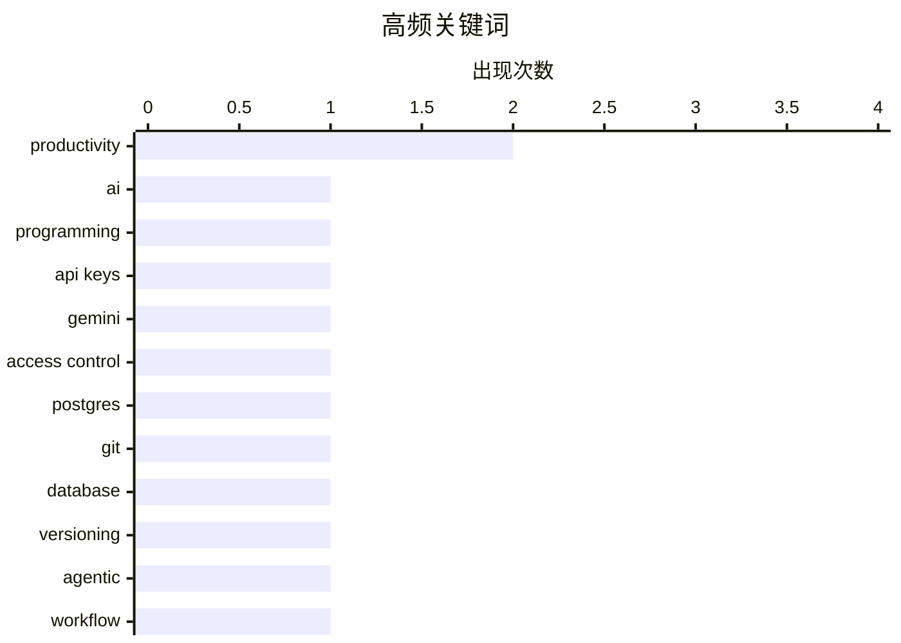

+++
date = '2026-02-27T09:00:00+08:00'
draft = false
title = '2月27日 AI 日报'
tags = ['AI', '日报']
+++

# 📰 AI 博客每日精选 — 2026-02-27

> 来自 Karpathy 推荐的 92 个顶级技术博客，AI 精选 Top 10

## 📝 今日看点

今天技术圈的焦点集中在三条主线：一是 AI 能力在编程与高风险应用上出现质变，同时也引发“能做什么、不能做什么”的边界争论。二是安全与隐私成为硬约束，从 API Key 的设计假设冲突到匿名集合缩水，传统机制正在被现实推翻。三是工程与基础设施层面在“重构底座”，无论是把 Git 语义搬进数据库，还是公共关键系统外包，都指向对可控性与可扩展性的重新权衡。总体看，技术进步更快，但治理与架构的压力同样在加速。

---

## 🏆 今日必读

🥇 **引用 Andrej Karpathy 的话**

[Quoting Andrej Karpathy](https://simonwillison.net/2026/Feb/26/andrej-karpathy/#atom-everything) — simonwillison.net · 5 小时前 · 🤖 AI / ML

> 核心聚焦于过去两个月 AI 对编程方式的剧烈改变，尤其是 12 月的突变。Karpathy 认为变化不是“渐进改良”，而是模型质量、长期连贯性与韧性突然跃升。由此带来“编码代理在 12 月前基本不可用、此后基本可用”的分水岭判断。观点强调大模型已经能持续推进大型任务而不是轻易放弃。结论是编程范式在短期内发生了质变。

💡 **为什么值得读**: 短时间内模型能力跃迁的第一手观察，能帮助判断是否要调整开发流程与工具链。

🏷️ AI, programming, productivity

🥈 **Google API Key 曾不是秘密，但 Gemini 改变了规则**

[Google API Keys Weren't Secrets. But then Gemini Changed the Rules.](https://simonwillison.net/2026/Feb/26/google-api-keys/#atom-everything) — simonwillison.net · 20 小时前 · 🔒 安全

> 核心主题是 Google API Key 设计假设与 Gemini 安全边界发生冲突。Gemini 与 Google Maps 等服务共享同一类 API Key，而 Maps 的 Key 本就被设计为公开嵌入网页。问题在于 Gemini Key 可访问私有文件并触发可计费请求，风险等级完全不同。由此导致“公开 Key”在新场景下变成高危凭据。结论是共享 Key 体系需要重新设计权限与隔离。

💡 **为什么值得读**: 揭示了 API Key 复用导致的安全与计费风险，适合安全与平台团队快速自查。

🏷️ API keys, Gemini, access control

🥉 **把 Git 放进 Postgres**

[Git in Postgres](https://nesbitt.io/2026/02/26/git-in-postgres.html) — nesbitt.io · 14 小时前 · ⚙️ 工程

> 主题是反转思路：不用 Git 充当数据库，而让数据库实现 Git。作者提出用 Postgres 来承载 Git 的版本管理语义与对象模型。这样做的潜在好处是获得事务、查询与扩展能力，同时挑战在于如何映射 Git 的数据结构与性能需求。文章在“传统 Git 文件存储”与“关系型数据库实现”之间进行概念层面对比。结论是该方向可行性值得探索，但需要权衡复杂度。

💡 **为什么值得读**: 对版本控制与数据库融合的另类思路，能启发存储架构与工具设计。

🏷️ Postgres, git, database, versioning

---

## 📊 数据概览

| 扫描源 | 抓取文章 | 时间范围 | 精选 |
|:---:|:---:|:---:|:---:|
| 86/92 | 2360 篇 → 28 篇 | 24h | **10 篇** |

### 分类分布



### 高频关键词



<details>
<summary>📈 纯文本关键词图（终端友好）</summary>

```
productivity   │ ████████████████████ 2
ai             │ ██████████░░░░░░░░░░ 1
programming    │ ██████████░░░░░░░░░░ 1
api keys       │ ██████████░░░░░░░░░░ 1
gemini         │ ██████████░░░░░░░░░░ 1
access control │ ██████████░░░░░░░░░░ 1
postgres       │ ██████████░░░░░░░░░░ 1
git            │ ██████████░░░░░░░░░░ 1
database       │ ██████████░░░░░░░░░░ 1
versioning     │ ██████████░░░░░░░░░░ 1
```

</details>

### 🏷️ 话题标签

**productivity**(2) · **ai**(1) · **programming**(1) · api keys(1) · gemini(1) · access control(1) · postgres(1) · git(1) · database(1) · versioning(1) · agentic(1) · workflow(1) · autonomous-weapons(1) · llm(1) · defense(1) · anonymity(1) · privacy(1) · tracking(1) · metadata(1) · anthropic(1)

---

## 🤖 AI / ML

### 1. 引用 Andrej Karpathy 的话

[Quoting Andrej Karpathy](https://simonwillison.net/2026/Feb/26/andrej-karpathy/#atom-everything) — **simonwillison.net** · 5 小时前 · ⭐ 23/30

> 核心聚焦于过去两个月 AI 对编程方式的剧烈改变，尤其是 12 月的突变。Karpathy 认为变化不是“渐进改良”，而是模型质量、长期连贯性与韧性突然跃升。由此带来“编码代理在 12 月前基本不可用、此后基本可用”的分水岭判断。观点强调大模型已经能持续推进大型任务而不是轻易放弃。结论是编程范式在短期内发生了质变。

🏷️ AI, programming, productivity

---

### 2. 退役美国空军将军 Jack Shanahan 谈 Anthropic 与五角大楼的张力

[Retired US Air Force General Jack Shanahan on the Anthropic-Pentagon tensions](https://garymarcus.substack.com/p/retired-us-air-force-general-jack) — **garymarcus.substack.com** · 1 小时前 · ⭐ 21/30

> 核心议题是 LLM 在军事场景，尤其是致命自主武器中的适用性与边界。Shanahan 明确表示，当前任何 LLM 都不应被用于完全致命的自主武器系统。该观点针对的是“把现有模型直接嵌入武器决策链”的趋势。它强调技术成熟度与伦理风险之间的巨大落差。结论是应当在政策层面设定明确禁区。

🏷️ autonomous-weapons, LLM, defense

---

### 3. Dario Amodei 的历史性声明

[Historic statement from Dario Amodei](https://garymarcus.substack.com/p/historic-statement-from-dario-amodei) — **garymarcus.substack.com** · 1 小时前 · ⭐ 20/30

> 核心是 Dario Amodei 的一份被称为“历史性”的声明。现有摘录只包含致谢信息，没有提供具体论点或数据。可以确定的是该声明被认为具有行业或政策上的重要性。缺少正文内容使得技术细节与结论无法判断。结论是需要阅读全文才能把握其真实影响。

🏷️ Anthropic, AI-safety, policy

---

## 🔒 安全

### 4. Google API Key 曾不是秘密，但 Gemini 改变了规则

[Google API Keys Weren't Secrets. But then Gemini Changed the Rules.](https://simonwillison.net/2026/Feb/26/google-api-keys/#atom-everything) — **simonwillison.net** · 20 小时前 · ⭐ 23/30

> 核心主题是 Google API Key 设计假设与 Gemini 安全边界发生冲突。Gemini 与 Google Maps 等服务共享同一类 API Key，而 Maps 的 Key 本就被设计为公开嵌入网页。问题在于 Gemini Key 可访问私有文件并触发可计费请求，风险等级完全不同。由此导致“公开 Key”在新场景下变成高危凭据。结论是共享 Key 体系需要重新设计权限与隔离。

🏷️ API keys, Gemini, access control

---

### 5. 仅限会员：你的匿名集合已经崩塌，而你还不知道

[Members Only: Your anonymity set has collapsed and you don't know it yet](https://www.joanwestenberg.com/members-only-your-anonymity-set-has-collapsed-and-you-dont-know-it-yet/) — **joanwestenberg.com** · 23 小时前 · ⭐ 21/30

> 主题指向“匿名集合缩小”导致的去匿名化风险。标题暗示会员制或封闭社区正在削弱匿名保护，使可识别性上升。核心问题是身份与行为在更小的样本空间中更容易被关联。可推知涉及登录、订阅、设备指纹等现代追踪机制的叠加效应。结论指向匿名保护正在被结构性侵蚀。

🏷️ anonymity, privacy, tracking, metadata

---

### 6. iPhone 和 iPad 获准处理北约机密信息

[iPhone and iPad Approved to Handle Classified NATO Information](https://nr.apple.com/Do0I6B8WX0) — **daringfireball.net** · 3 小时前 · ⭐ 19/30

> 核心内容是 Apple 宣布 iPhone 和 iPad 通过北约信息保障要求认证。它们可在不需要特殊软件或设置的情况下处理至 NATO Restricted 级别的机密信息。Apple 声称这是首个且唯一达到该标准的消费级设备。评论指出 iPhone 只是第二个获批处理机密信息的手机。结论是消费设备正在进入更高等级的政府安全场景。

🏷️ NATO, device compliance, mobile security

---

## ⚙️ 工程

### 7. 把 Git 放进 Postgres

[Git in Postgres](https://nesbitt.io/2026/02/26/git-in-postgres.html) — **nesbitt.io** · 14 小时前 · ⭐ 23/30

> 主题是反转思路：不用 Git 充当数据库，而让数据库实现 Git。作者提出用 Postgres 来承载 Git 的版本管理语义与对象模型。这样做的潜在好处是获得事务、查询与扩展能力，同时挑战在于如何映射 Git 的数据结构与性能需求。文章在“传统 Git 文件存储”与“关系型数据库实现”之间进行概念层面对比。结论是该方向可行性值得探索，但需要权衡复杂度。

🏷️ Postgres, git, database, versioning

---

### 8. 囤积你知道怎么做的事

[Hoard things you know how to do](https://simonwillison.net/guides/agentic-engineering-patterns/hoard-things-you-know-how-to-do/#atom-everything) — **simonwillison.net** · 4 小时前 · ⭐ 21/30

> 核心强调软件开发中“知道能做什么”本身就是关键能力。作者把与编码代理协作的经验延伸为职业建议：要持续积累可执行的能力清单。这样的“可行性知识库”能加速需求拆解与方案选择。它也帮助在与代理协作时更好地设定目标与边界。结论是能力的“可调用性”比单次技巧更重要。

🏷️ agentic, productivity, workflow

---

## 💡 观点 / 杂谈

### 9. 美国正在运行我们的增值税

[Amerika runt binnenkort onze BTW](https://berthub.eu/articles/posts/btw-as-an-american-service/) — **berthub.eu** · 11 小时前 · ⭐ 20/30

> 主题是荷兰税务系统（BTW/增值税）基础设施的外包与主权风险。文章指出 DigiD 平台的托管已由美国公司负责，而税务部门计划把更多关键系统交给美国供应商。作者将其视为从“技术外包”走向“国家核心职能外包”的升级。论点强调这不是原本的设想，却正在成为现实。结论是对数据主权与公共基础设施控制权的担忧升级。

🏷️ DigiD, cloud, sovereignty, government

---

### 10. 引用 Benedict Evans 的话

[Quoting Benedict Evans](https://simonwillison.net/2026/Feb/26/benedict-evans/#atom-everything) — **simonwillison.net** · 21 小时前 · ⭐ 19/30

> 核心问题是 OpenAI 是否真正找到产品市场契合度。Evans 认为若用户一周只用几次、日常缺乏用途，这说明并未改变生活。OpenAI 提到“能力差距”被他视为回避“产品不够清晰”的说法。该观点把焦点从模型能力转向用户价值与使用频次。结论是 AI 产品仍面临现实场景落地的挑战。

🏷️ OpenAI, adoption, product-market-fit

---

*生成于 2026-02-27 00:45 | 扫描 86 源 → 获取 2360 篇 → 精选 10 篇*
*基于 [Hacker News Popularity Contest 2025](https://refactoringenglish.com/tools/hn-popularity/) RSS 源列表，由 [Andrej Karpathy](https://x.com/karpathy) 推荐*
*由「懂点儿AI」制作，欢迎关注同名微信公众号获取更多 AI 实用技巧 💡*
