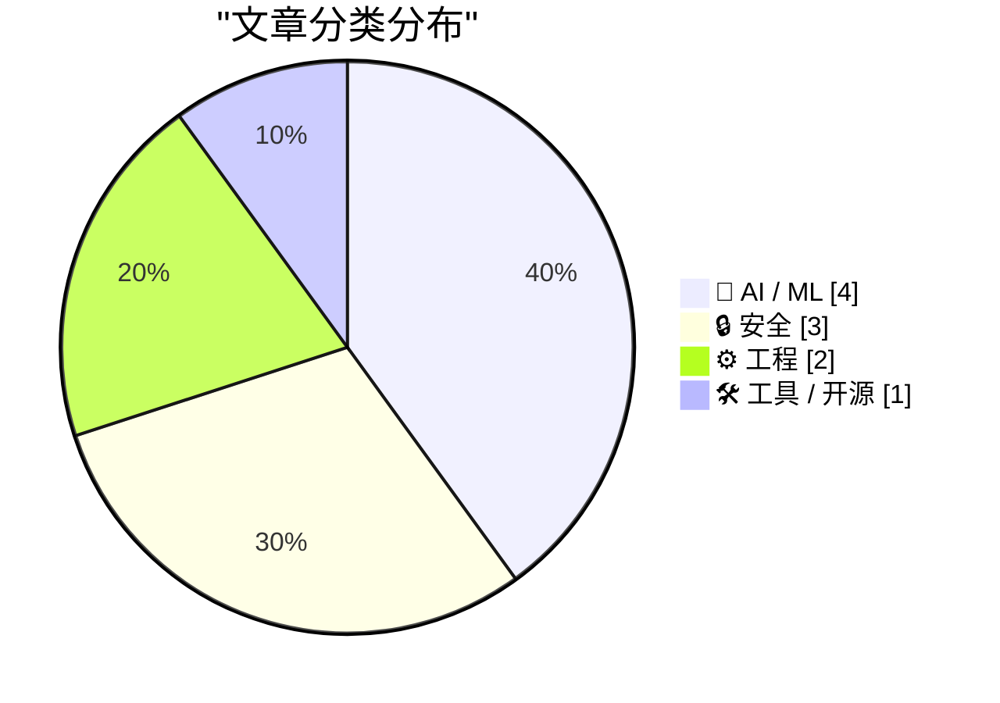
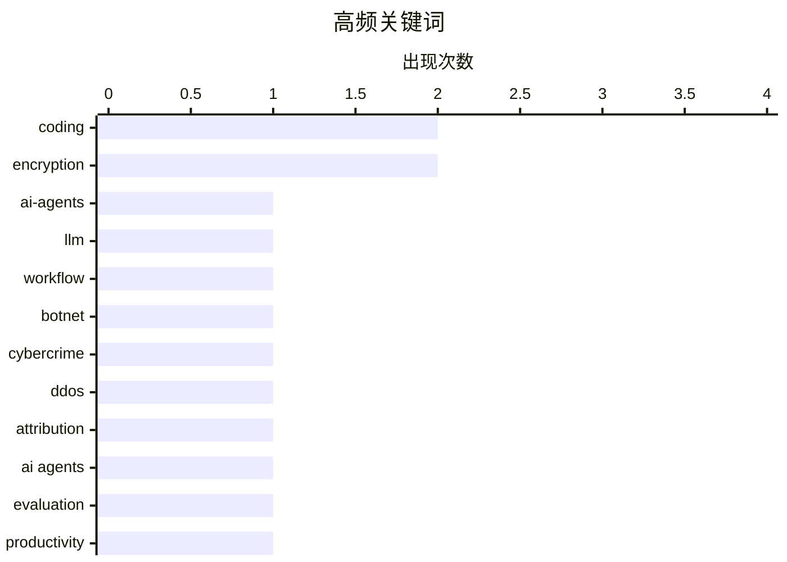

+++
date = '2026-02-28T09:00:00+08:00'
draft = false
title = '2月28日 AI 日报'
tags = ['AI', '日报']
+++

# 📰 AI 博客每日精选 — 2026-02-28

> 来自 Karpathy 推荐的 92 个顶级技术博客，AI 精选 Top 10

## 📝 今日看点

今天技术圈的焦点集中在 AI 代理与大模型生态的“可用性与可信度”之争：从工程可用性实测到融资合理性、再到平台是否应被军事化改造，争议全面升温。安全领域则聚焦于执法与隐私的边界以及数据加密实践的反思，围绕僵尸网络报复、CSAM 取证合法性和通行密钥误用引发警惕。工程侧更强调底层机制与轻量化探索：从 Windows 消息过滤到移动端 Range 请求的高效数据检索，体现对性能与控制的精细化追求。

---

## 🏆 今日必读

🥇 **一个对 AI 编码代理持怀疑态度的人尝试了 AI 编码代理（超详细记录）**

[An AI agent coding skeptic tries AI agent coding, in excessive detail](https://simonwillison.net/2026/Feb/27/ai-agent-coding-in-excessive-detail/#atom-everything) — simonwillison.net · 18 小时前 · 🤖 AI / ML

> 文章聚焦“AI 编码代理在 2025 年末是否真正变得好用”的核心争议。作者记录了一系列由浅入深的代理项目，从简单的 YouTube 元数据爬取逐步扩展到更复杂的工程任务。叙述强调过程细节、决策路径和代理的能力边界。整体论证指向“编码代理在近期有明显跃迁”，但仍需要清晰的任务拆解与迭代控制。结论是：在合适的任务设定下，编码代理已具备可观生产力。 

💡 **为什么值得读**: 它提供了一条从“小工具”到“复杂项目”的真实进阶路径，便于评估代理适用范围。

🏷️ ai-agents, coding, llm, workflow

🥈 **金狼（Kimwolf）僵尸网络操纵者“Dort”是谁？**

[Who is the Kimwolf Botmaster “Dort”?](https://krebsonsecurity.com/2026/02/who-is-the-kimwolf-botmaster-dort/) — krebsonsecurity.com · 2 小时前 · 🔒 安全

> 文章围绕全球最大、最具破坏性的 Kimwolf 僵尸网络及其操纵者“Dort”展开。披露者此前揭示了被利用的漏洞，而 Dort 随后组织了 DDoS、开盒、人肉邮箱轰炸等报复行动。事件升级到对研究人员进行“swatting”，导致警方突袭其住处。作者梳理了事件时间线与攻击模式，聚焦威胁升级的现实风险。结论指向：匿名操纵者已具备针对研究者与媒体的系统性报复能力。

💡 **为什么值得读**: 内容把技术漏洞外溢成现实安全威胁的链条说得很清楚，适合理解网络犯罪的升级逻辑。

🏷️ botnet, cybercrime, ddos, attribution

🥉 **一个对 AI 编码代理持怀疑态度的人尝试了 AI 编码代理（超详细记录）**

[An AI agent coding skeptic tries AI agent coding, in excessive detail](https://minimaxir.com/2026/02/ai-agent-coding/) — minimaxir.com · 20 小时前 · 🤖 AI / ML

> 文章聚焦“AI 编码代理是否已具备工程可用性”的核心问题，并以超长篇幅展开。作者通过一系列逐步升级的实战项目验证代理能力，从基础抓取工具到更复杂的工程任务。叙述强调过程细节、失败与修正策略，展示代理的边界与可控性。阅读时间很长，暗示内容覆盖了大量实践细节。结论倾向于：在明确约束与迭代机制下，编码代理具备实用价值。

💡 **为什么值得读**: 它是一份“完整实操日志”，能帮助判断代理是否适合你的工作流。

🏷️ AI agents, coding, evaluation, productivity

---

## 📊 数据概览

| 扫描源 | 抓取文章 | 时间范围 | 精选 |
|:---:|:---:|:---:|:---:|
| 88/92 | 2493 篇 → 25 篇 | 24h | **10 篇** |

### 分类分布



### 高频关键词



<details>
<summary>📈 纯文本关键词图（终端友好）</summary>

```
coding      │ ████████████████████ 2
encryption  │ ████████████████████ 2
ai-agents   │ ██████████░░░░░░░░░░ 1
llm         │ ██████████░░░░░░░░░░ 1
workflow    │ ██████████░░░░░░░░░░ 1
botnet      │ ██████████░░░░░░░░░░ 1
cybercrime  │ ██████████░░░░░░░░░░ 1
ddos        │ ██████████░░░░░░░░░░ 1
attribution │ ██████████░░░░░░░░░░ 1
ai agents   │ ██████████░░░░░░░░░░ 1
```

</details>

### 🏷️ 话题标签

**coding**(2) · **encryption**(2) · **ai-agents**(1) · llm(1) · workflow(1) · botnet(1) · cybercrime(1) · ddos(1) · attribution(1) · ai agents(1) · evaluation(1) · productivity(1) · passkeys(1) · key-management(1) · user-data(1) · anthropic(1) · llm policy(1) · ethics(1) · defense(1) · claude(1)

---

## 🤖 AI / ML

### 1. 一个对 AI 编码代理持怀疑态度的人尝试了 AI 编码代理（超详细记录）

[An AI agent coding skeptic tries AI agent coding, in excessive detail](https://simonwillison.net/2026/Feb/27/ai-agent-coding-in-excessive-detail/#atom-everything) — **simonwillison.net** · 18 小时前 · ⭐ 25/30

> 文章聚焦“AI 编码代理在 2025 年末是否真正变得好用”的核心争议。作者记录了一系列由浅入深的代理项目，从简单的 YouTube 元数据爬取逐步扩展到更复杂的工程任务。叙述强调过程细节、决策路径和代理的能力边界。整体论证指向“编码代理在近期有明显跃迁”，但仍需要清晰的任务拆解与迭代控制。结论是：在合适的任务设定下，编码代理已具备可观生产力。 

🏷️ ai-agents, coding, llm, workflow

---

### 2. 一个对 AI 编码代理持怀疑态度的人尝试了 AI 编码代理（超详细记录）

[An AI agent coding skeptic tries AI agent coding, in excessive detail](https://minimaxir.com/2026/02/ai-agent-coding/) — **minimaxir.com** · 20 小时前 · ⭐ 23/30

> 文章聚焦“AI 编码代理是否已具备工程可用性”的核心问题，并以超长篇幅展开。作者通过一系列逐步升级的实战项目验证代理能力，从基础抓取工具到更复杂的工程任务。叙述强调过程细节、失败与修正策略，展示代理的边界与可控性。阅读时间很长，暗示内容覆盖了大量实践细节。结论倾向于：在明确约束与迭代机制下，编码代理具备实用价值。

🏷️ AI agents, coding, evaluation, productivity

---

### 3. 给 Dario 一块饼干？——Anthropic 与“售卖死亡”

[A Cookie for Dario? — Anthropic and selling death](https://anildash.com/2026/02/27/a-cookie-for-dario/) — **anildash.com** · 14 小时前 · ⭐ 22/30

> 文章聚焦 Anthropic 是否应按政府要求改造 Claude 以支持战争犯罪。美国国防部长要求平台“合法用途”改造，但政府也将自身行动宣称为合法。Anthropic CEO Dario Amodei拒绝配合，引发争议。作者将该事件置于科技公司与国家权力的张力中讨论。结论强调：技术平台有责任拒绝被用于明显的暴力与侵害。

🏷️ Anthropic, LLM policy, ethics, defense

---

### 4. OpenAI 的新一轮融资合理吗？

[Does OpenAI’s new financing make sense?](https://garymarcus.substack.com/p/does-openais-new-financing-make-sense) — **garymarcus.substack.com** · 18 小时前 · ⭐ 21/30

> 文章直指 OpenAI 最新融资是否合理这一核心问题。作者明确表示对融资逻辑抱有强烈怀疑。质疑点集中在融资结构或估值是否与现实能力和可持续性匹配。文章强调这种怀疑并非个例，而是行业内普遍存在。结论是：OpenAI 的融资叙事仍有重大合理性缺口。

🏷️ OpenAI, financing, AI industry, funding

---

## 🔒 安全

### 5. 金狼（Kimwolf）僵尸网络操纵者“Dort”是谁？

[Who is the Kimwolf Botmaster “Dort”?](https://krebsonsecurity.com/2026/02/who-is-the-kimwolf-botmaster-dort/) — **krebsonsecurity.com** · 2 小时前 · ⭐ 25/30

> 文章围绕全球最大、最具破坏性的 Kimwolf 僵尸网络及其操纵者“Dort”展开。披露者此前揭示了被利用的漏洞，而 Dort 随后组织了 DDoS、开盒、人肉邮箱轰炸等报复行动。事件升级到对研究人员进行“swatting”，导致警方突袭其住处。作者梳理了事件时间线与攻击模式，聚焦威胁升级的现实风险。结论指向：匿名操纵者已具备针对研究者与媒体的系统性报复能力。

🏷️ botnet, cybercrime, ddos, attribution

---

### 6. 请停止使用通行密钥为用户数据加密

[Please, please, please stop using passkeys for encrypting user data](https://simonwillison.net/2026/Feb/27/passkeys/#atom-everything) — **simonwillison.net** · 15 小时前 · ⭐ 22/30

> 核心观点是：不要用 passkeys 为用户数据加密。关键原因是用户经常丢失 passkeys，一旦丢失就会导致数据不可恢复。作者提醒身份与安全行业不要将 passkeys 作为数据加密的关键材料。文中强调风险来自“不可逆”的加密结果而非认证安全性本身。结论是：passkeys 应用于登录认证而非数据加密场景。

🏷️ passkeys, encryption, key-management, user-data

---

### 7. 西弗吉尼亚州反苹果 CSAM 诉讼反而会让儿童犯罪者脱罪

[West Virginia’s Anti-Apple CSAM Lawsuit Would Help Child Predators Walk Free](https://www.techdirt.com/2026/02/25/west-virginias-anti-apple-csam-lawsuit-would-help-child-predators-walk-free/) — **daringfireball.net** · 19 小时前 · ⭐ 21/30

> 文章讨论西弗吉尼亚州要求苹果扫描 iCloud CSAM 的诉讼风险。若法院强制苹果进行扫描，所得证据将被视为无令搜查。依据第四修正案的排除规则，这些证据可能被法庭排除。结果是辩护律师可轻易要求证据无效。结论指出：此类诉讼反而可能帮助犯罪者脱罪。

🏷️ csam, privacy, encryption, law

---

## ⚙️ 工程

### 8. 在 IsDialogMessage 内拦截消息：精细化调校消息过滤器

[Intercepting messages inside Is­Dialog­Message, fine-tuning the message filter](https://devblogs.microsoft.com/oldnewthing/20260227-00/?p=112094) — **devblogs.microsoft.com/oldnewthing** · 23 小时前 · ⭐ 20/30

> 文章围绕 Windows 的 `IsDialogMessage` 消息处理机制展开。作者讨论如何在该函数内部拦截消息以定制行为。重点是让消息过滤器在需要时触发，而不是误触发。内容强调对消息循环和对话框消息的细粒度控制。结论是：通过定制拦截逻辑可实现更精准的消息路由。

🏷️ Windows, message loop, Win32, IsDialogMessage

---

### 9. 使用二分查找与 fetch() HTTP Range 请求的 Unicode Explorer

[Unicode Explorer using binary search over fetch() HTTP range requests](https://simonwillison.net/2026/Feb/27/unicode-explorer/#atom-everything) — **simonwillison.net** · 20 小时前 · ⭐ 19/30

> 文章展示一个用 HTTP Range 请求实现的 Unicode Explorer 原型。核心技术是用 `fetch()` 的 Range 请求做二分查找，按需加载数据。作者在手机上完成了该实验，强调快速试验的可行性。该项目也被用作“用 LLM 满足好奇心”的案例。结论是：Range 请求与二分策略可高效探索大体量数据。

🏷️ http-range, binary-search, unicode, fetch

---

## 🛠 工具 / 开源

### 10. 大型开源项目维护者可免费使用 Claude Max（6 个月）

[Free Claude Max for (large project) open source maintainers](https://simonwillison.net/2026/Feb/27/claude-max-oss-six-months/#atom-everything) — **simonwillison.net** · 20 小时前 · ⭐ 21/30

> 文章说明 Anthropic 向开源维护者提供 Claude Max 20x 计划的免费额度。免费期为 6 个月，原价 200 美元/月。资格门槛包括：GitHub 仓库 5000+ 星或 NPM 月下载 100 万+。该政策面向核心维护者或主维护者。结论是：这是面向高影响力开源项目的有限期限资助。

🏷️ claude, open-source, ai-tools, pricing

---

*生成于 2026-02-28 14:45 | 扫描 88 源 → 获取 2493 篇 → 精选 10 篇*
*基于 [Hacker News Popularity Contest 2025](https://refactoringenglish.com/tools/hn-popularity/) RSS 源列表，由 [Andrej Karpathy](https://x.com/karpathy) 推荐*
*由「懂点儿AI」制作，欢迎关注同名微信公众号获取更多 AI 实用技巧 💡*
