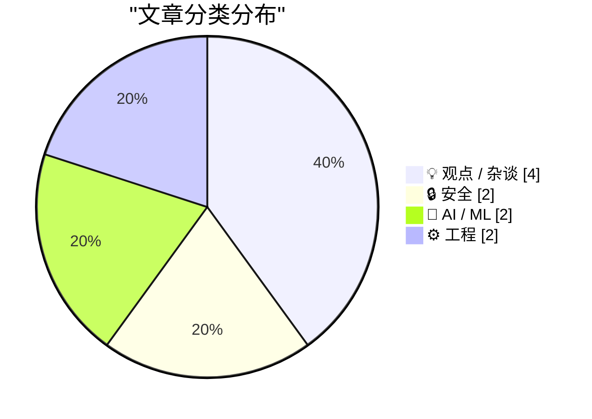
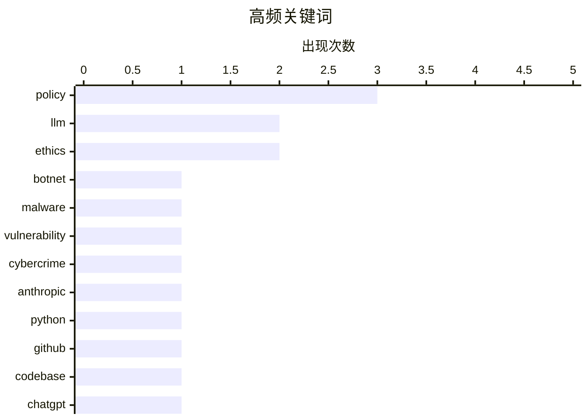

+++
date = '2026-03-01T09:00:00+08:00'
draft = false
title = '3月1日 AI 日报'
tags = ['AI', '日报']
+++

# 📰 AI 博客每日精选 — 2026-02-28

> 来自 Karpathy 推荐的 92 个顶级技术博客，AI 精选 Top 10

## 📝 今日看点

今天的技术圈聚焦在安全与治理：从大型僵尸网络操控者曝光到 GDPR 数据访问请求，隐私与基础设施安全仍是核心战场。AI 议题继续升温，围绕大模型在军事用途、监控风险与代码生态渗透的争论，显示技术伦理与应用边界正在被重新定义。同时，开发者生态在生成式 AI 与“无限代码生成”背景下出现反馈稀释的担忧，而工程实践仍在强调高效脚本技巧与真实能源数据的价值。

---

## 🏆 今日必读

🥇 **Kimwolf 僵尸网络操控者“Dort”是谁？**

[Who is the Kimwolf Botmaster “Dort”?](https://krebsonsecurity.com/2026/02/who-is-the-kimwolf-botmaster-dort/) — krebsonsecurity.com · 11 小时前 · 🔒 安全

> 核心问题聚焦于 Kimwolf 这一“全球最大且最具破坏性”的僵尸网络背后的操控者身份与行为。文章回顾了 2026 年 1 月披露的漏洞如何被利用来组建 Kimwolf，并点名操控者网名“Dort”。随后“Dort”对研究者和作者发动了 DDoS、开盒与邮件轰炸等报复行动。事件升级到触发 SWAT 上门，显示其攻击已超出网络层面并产生现实安全风险。作者意在追踪并揭示该操控者的背景与动机，以理解攻击持续的根源。

💡 **为什么值得读**: 如果想了解大型僵尸网络如何从技术漏洞走向现实威胁，这篇文章提供了清晰的时间线与风险画像。

🏷️ botnet, malware, vulnerability, cybercrime

🥈 **给 Dario 一块饼干？——Anthropic 与“出售死亡”**

[A Cookie for Dario? — Anthropic and selling death](https://anildash.com/2026/02/27/a-cookie-for-dario/) — anildash.com · 23 小时前 · 🤖 AI / ML

> 文章围绕 Anthropic 是否应按美国国防部长要求修改 Claude 以支持军事用途的争议展开。作者指出，Anthropic CEO Dario Amodei 明确拒绝为所谓“合法用途”的战争行为提供技术支持。文章强调政府将请求包装为“合法”，但其自身对争议行动同样宣称合法。作者将这一冲突置于更广泛的 AI 伦理与战争责任框架中讨论。结论倾向于肯定拒绝配合的立场，认为技术公司应抵制被用于战争犯罪。

💡 **为什么值得读**: 这是理解 AI 公司在军事化压力下如何划定伦理边界的关键案例。

🏷️ Anthropic, LLM, ethics, policy

🥉 **LLM 在 Python 源代码中的使用**

[LLM Use in the Python Source Code](https://blog.miguelgrinberg.com/post/llm-use-in-the-python-source-code) — miguelgrinberg.com · 7 小时前 · 🤖 AI / ML

> 核心主题是如何从 GitHub 信号中识别 Python 代码库对 LLM 编码代理的依赖。文章提到一个社交媒体上的技巧：屏蔽 GitHub 用户 `claude` 后，访问包含其提交的仓库会出现提示横幅。作者将这一方法用于观察 CPython 仓库的提交情况，引发对 LLM 参与核心语言开发的关注。该技巧把 LLM 使用从隐性行为转为可见线索。结论是，开源项目已出现显著的 LLM 参与迹象，值得社区关注其影响。

💡 **为什么值得读**: 能快速学会一种检测 LLM 介入开源项目的实用方法，并理解其潜在影响。

🏷️ Python, LLM, GitHub, codebase

---

## 📊 数据概览

| 扫描源 | 抓取文章 | 时间范围 | 精选 |
|:---:|:---:|:---:|:---:|
| 89/92 | 2508 篇 → 16 篇 | 24h | **10 篇** |

### 分类分布



### 高频关键词



<details>
<summary>📈 纯文本关键词图（终端友好）</summary>

```
policy        │ ████████████████████ 3
llm           │ █████████████░░░░░░░ 2
ethics        │ █████████████░░░░░░░ 2
botnet        │ ███████░░░░░░░░░░░░░ 1
malware       │ ███████░░░░░░░░░░░░░ 1
vulnerability │ ███████░░░░░░░░░░░░░ 1
cybercrime    │ ███████░░░░░░░░░░░░░ 1
anthropic     │ ███████░░░░░░░░░░░░░ 1
python        │ ███████░░░░░░░░░░░░░ 1
github        │ ███████░░░░░░░░░░░░░ 1
```

</details>

### 🏷️ 话题标签

**policy**(3) · **llm**(2) · **ethics**(2) · botnet(1) · malware(1) · vulnerability(1) · cybercrime(1) · anthropic(1) · python(1) · github(1) · codebase(1) · chatgpt(1) · surveillance(1) · gdpr(1) · privacy(1) · data request(1) · compliance(1) · open source(1) · saas(1) · code generation(1)

---

## 💡 观点 / 杂谈

### 1. 够了，我要取消我的 ChatGPT 账号

[That's it, I'm cancelling my ChatGPT](https://idiallo.com/byte-size/im-cancelling-my-chatgpt-openai-account?src=feed) — **idiallo.com** · 5 小时前 · ⭐ 21/30

> 文章的核心问题是 ChatGPT 进入国防部机密网络可能带来的大规模监控与武器化风险。作者引用 Sam Altman 的表态，认为这是“进入点”，将技术推向军事与监控场景。作者指出，社会已具备大规模监控基础设施，而此举可能成为关键“使能器”。文章对比了 Anthropic CEO 拒绝与国防部合作的公开立场。结论是，作者因此决定取消 ChatGPT 账号，以表达对技术军事化的反对。

🏷️ ChatGPT, surveillance, ethics, policy

---

### 2. 开源、SaaS 与无限代码生成之后的沉默

[Open Source, SaaS, and the Silence After Unlimited Code Generation](https://worksonmymachine.ai/p/open-source-saas-and-the-silence) — **worksonmymachine.substack.com** · 8 小时前 · ⭐ 19/30

> 文章以“反馈的终结”为切口，讨论开源与 SaaS 在“无限代码生成”出现后的生态变化。标题暗示开发者反馈与社区互动正在减少。作者可能在探讨生成式 AI 对产品反馈循环的冲击。重点可能落在开源项目与商业 SaaS 的角色再平衡。结论倾向于警惕生成式工具导致的沉默与失联。

🏷️ open source, SaaS, code generation, feedback

---

### 3. 这一切都是骗局

[The whole thing was a scam](https://garymarcus.substack.com/p/the-whole-thing-was-scam) — **garymarcus.substack.com** · 6 小时前 · ⭐ 16/30

> 文章以“修复被内定”与“Dario 没有机会”为线索展开批判。标题与摘要暗示一场对 Dario 不利的局势早已被操控。内容似乎指向某种被安排的结局或不公过程。作者的语气强烈，强调其认为整体是“骗局”。结论是对事件公正性持否定态度。

🏷️ AI, industry, critique

---

### 4. 阅读清单 02/28/26

[Reading List 02/28/26](https://www.construction-physics.com/p/reading-list-022826) — **construction-physics.com** · 9 小时前 · ⭐ 16/30

> 这是一期阅读清单，涵盖多个跨领域主题。内容包含洛杉矶许可成本、涓滴住房理论、松下停止生产电视、机器人出租车远程操作员和地热进展等条目。文章的价值在于将分散资讯聚合成一份清单。它为读者提供快速浏览不同产业动态的入口。结论是通过精选链接帮助读者高效跟踪趋势。

🏷️ housing, robotaxi, geothermal, policy

---

## 🔒 安全

### 5. Kimwolf 僵尸网络操控者“Dort”是谁？

[Who is the Kimwolf Botmaster “Dort”?](https://krebsonsecurity.com/2026/02/who-is-the-kimwolf-botmaster-dort/) — **krebsonsecurity.com** · 11 小时前 · ⭐ 26/30

> 核心问题聚焦于 Kimwolf 这一“全球最大且最具破坏性”的僵尸网络背后的操控者身份与行为。文章回顾了 2026 年 1 月披露的漏洞如何被利用来组建 Kimwolf，并点名操控者网名“Dort”。随后“Dort”对研究者和作者发动了 DDoS、开盒与邮件轰炸等报复行动。事件升级到触发 SWAT 上门，显示其攻击已超出网络层面并产生现实安全风险。作者意在追踪并揭示该操控者的背景与动机，以理解攻击持续的根源。

🏷️ botnet, malware, vulnerability, cybercrime

---

### 6. npm 数据主体访问请求（DSAR）

[npm Data Subject Access Request](https://nesbitt.io/2026/02/28/npm-data-subject-access-request.html) — **nesbitt.io** · 13 小时前 · ⭐ 20/30

> 主题是一份针对 GDPR 数据主体访问请求（DSAR）的回应。文章聚焦于用户向 npm 提交 DSAR 后获得的答复内容。它传达了对个人数据访问与透明度的现实体验。文本暗示这一流程对开发者生态的重要性。结论是，DSAR 在开发者平台上的执行方式值得被记录与审视。

🏷️ GDPR, privacy, data request, compliance

---

## 🤖 AI / ML

### 7. 给 Dario 一块饼干？——Anthropic 与“出售死亡”

[A Cookie for Dario? — Anthropic and selling death](https://anildash.com/2026/02/27/a-cookie-for-dario/) — **anildash.com** · 23 小时前 · ⭐ 22/30

> 文章围绕 Anthropic 是否应按美国国防部长要求修改 Claude 以支持军事用途的争议展开。作者指出，Anthropic CEO Dario Amodei 明确拒绝为所谓“合法用途”的战争行为提供技术支持。文章强调政府将请求包装为“合法”，但其自身对争议行动同样宣称合法。作者将这一冲突置于更广泛的 AI 伦理与战争责任框架中讨论。结论倾向于肯定拒绝配合的立场，认为技术公司应抵制被用于战争犯罪。

🏷️ Anthropic, LLM, ethics, policy

---

### 8. LLM 在 Python 源代码中的使用

[LLM Use in the Python Source Code](https://blog.miguelgrinberg.com/post/llm-use-in-the-python-source-code) — **miguelgrinberg.com** · 7 小时前 · ⭐ 22/30

> 核心主题是如何从 GitHub 信号中识别 Python 代码库对 LLM 编码代理的依赖。文章提到一个社交媒体上的技巧：屏蔽 GitHub 用户 `claude` 后，访问包含其提交的仓库会出现提示横幅。作者将这一方法用于观察 CPython 仓库的提交情况，引发对 LLM 参与核心语言开发的关注。该技巧把 LLM 使用从隐性行为转为可见线索。结论是，开源项目已出现显著的 LLM 参与迹象，值得社区关注其影响。

🏷️ Python, LLM, GitHub, codebase

---

## ⚙️ 工程

### 9. 在 Bash 脚本中处理文件扩展名

[Working with file extensions in bash scripts](https://www.johndcook.com/blog/2026/02/28/file-extensions-bash/) — **johndcook.com** · 4 小时前 · ⭐ 18/30

> 核心主题是用 Bash 处理文件扩展名这一常见脚本需求。作者坦承更偏好 Python，但指出 shell 在某些场景下更简洁。文章强调某些 Bash 特性虽然简短却能高效解决常见问题。重点例子围绕扩展名提取与操作。结论是，适度掌握 Bash 的“简洁语法”能提升脚本效率。

🏷️ bash, scripting, file extension

---

### 10. 30 个月达到 3MWh：更多家庭电池统计

[30 months to 3MWh - some more home battery stats](https://shkspr.mobi/blog/2026/02/30-months-to-3mwh-some-more-home-battery-stats/) — **shkspr.mobi** · 10 小时前 · ⭐ 15/30

> 主题是家庭太阳能电池系统在 30 个月内的实际运行数据。作者在 2023 年 8 月安装 Moixa 4.8kWh 电池后，记录其持续运行情况。文章估算该系统累计节省约 3MWh 电量。描述还涉及电池风扇与网络指示灯等运行细节，体现稳定性。结论是该家用电池在长期使用中带来了可量化的节能收益。

🏷️ battery, solar, energy, monitoring

---

*生成于 2026-02-28 23:04 | 扫描 89 源 → 获取 2508 篇 → 精选 10 篇*
*基于 [Hacker News Popularity Contest 2025](https://refactoringenglish.com/tools/hn-popularity/) RSS 源列表*
