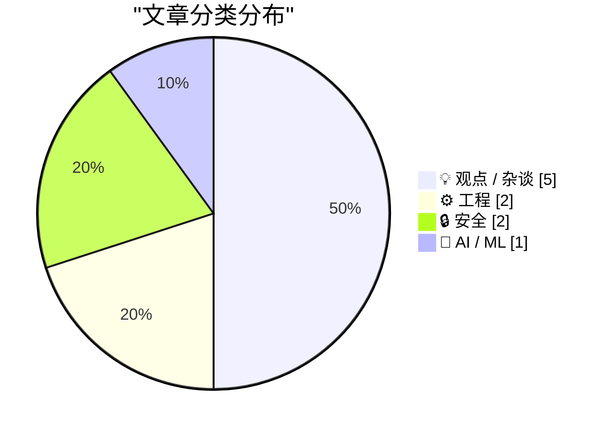
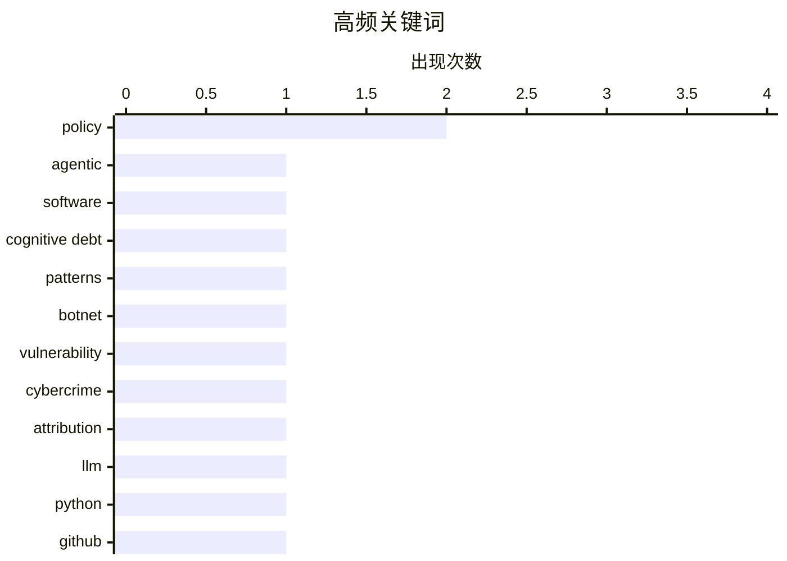

# 📰 AI 博客每日精选 — 2026-03-01

> 来自 Karpathy 推荐的 92 个顶级技术博客，AI 精选 Top 10

## 📝 今日看点

今天的技术讨论集中在三条主线：生成式编程带来的认知债务与协作失语、AI 与国防/监管的紧张关系、以及平台对开放生态与隐私权的重塑压力。工程层面，一边在强调可解释性与“用对工具”的务实取舍，另一边却在担忧无限代码生成削弱反馈与社区互动。安全与治理话题明显升温，从僵尸网络溯源到数据访问权利，再到 AI 军事化争议，技术正被推到更高风险与更强监管的前线。整体氛围是：效率在加速，但信任、透明与开放正在被重新考验。

---

## 🏆 今日必读

🥇 **交互式解释**

[Interactive explanations](https://simonwillison.net/guides/agentic-engineering-patterns/interactive-explanations/#atom-everything) — simonwillison.net · 47 分钟前 · ⚙️ 工程

> 核心议题是当代理生成的代码无法被理解时会形成“认知债务”。作者指出很多简单功能（例如从数据库取数据并输出 JSON）实现细节不必过度关注，因为行为可通过试运行推断。更复杂或风险更高的场景则需要可解释性与可验证的交互式说明来降低理解成本。交互式解释被视为在“能用”与“能理解”之间建立桥梁的方法。结论是应根据风险与复杂度选择解释深度，避免长期积累不可见的维护成本。

💡 **为什么值得读**: 用“认知债务”框架解释为何要为代理代码做交互式说明，帮助你判断哪些代码值得深挖。

🏷️ agentic, software, cognitive debt, patterns

🥈 **Kimwolf 僵尸网络主控“Dort”是谁？**

[Who is the Kimwolf Botmaster “Dort”?](https://krebsonsecurity.com/2026/02/who-is-the-kimwolf-botmaster-dort/) — krebsonsecurity.com · 11 小时前 · 🔒 安全

> 文章聚焦于全球最大、破坏力最强的 Kimwolf 僵尸网络及其操控者“Dort”。起因是 2026 年 1 月披露的漏洞被用于组建该僵尸网络。此后 Dort 对披露者与作者发起 DDoS、开盒和邮件洪泛攻击，并导致研究者遭遇 SWAT 上门。文章试图追踪 Dort 的身份与动机，并梳理攻击升级的时间线。作者的核心观点是，公开披露漏洞后的威胁报复已演变为系统化的暴力与骚扰。

💡 **为什么值得读**: 从漏洞披露到人身威胁的全链路剖析，帮助安全从业者理解公开披露的现实风险。

🏷️ botnet, vulnerability, cybercrime, attribution

🥉 **Python 源码中的 LLM 使用情况**

[LLM Use in the Python Source Code](https://blog.miguelgrinberg.com/post/llm-use-in-the-python-source-code) — miguelgrinberg.com · 8 小时前 · 🤖 AI / ML

> 主题是通过 GitHub 账号标记来识别项目中 LLM 参与的提交。作者指出阻止 claude 账号可让 GitHub 显示相关提交警示，从而发现项目是否依赖编码代理。令人意外的是 CPython 仓库也出现了该账号的提交迹象。文章借此讨论开源项目对 LLM 代码的透明度与可追踪性。结论是可见性工具正在改变开发者对 LLM 贡献的信任与审查方式。

💡 **为什么值得读**: 提供了一个可操作的方法快速识别 LLM 贡献，适合关心代码来源与审计的人。

🏷️ LLM, Python, GitHub

---

## 📊 数据概览

| 扫描源 | 抓取文章 | 时间范围 | 精选 |
|:---:|:---:|:---:|:---:|
| 89/92 | 2508 篇 → 18 篇 | 24h | **10 篇** |

### 分类分布



### 高频关键词



<details>
<summary>📈 纯文本关键词图（终端友好）</summary>

```
policy         │ ████████████████████ 2
agentic        │ ██████████░░░░░░░░░░ 1
software       │ ██████████░░░░░░░░░░ 1
cognitive debt │ ██████████░░░░░░░░░░ 1
patterns       │ ██████████░░░░░░░░░░ 1
botnet         │ ██████████░░░░░░░░░░ 1
vulnerability  │ ██████████░░░░░░░░░░ 1
cybercrime     │ ██████████░░░░░░░░░░ 1
attribution    │ ██████████░░░░░░░░░░ 1
llm            │ ██████████░░░░░░░░░░ 1
```

</details>

### 🏷️ 话题标签

**policy**(2) · **agentic**(1) · **software**(1) · cognitive debt(1) · patterns(1) · botnet(1) · vulnerability(1) · cybercrime(1) · attribution(1) · llm(1) · python(1) · github(1) · chatgpt(1) · surveillance(1) · ethics(1) · bash(1) · shell(1) · files(1) · scripting(1) · open-source(1)

---

## 💡 观点 / 杂谈

### 1. 我决定取消我的 ChatGPT 账户

[That's it, I'm cancelling my ChatGPT](https://idiallo.com/byte-size/im-cancelling-my-chatgpt-openai-account?src=feed) — **idiallo.com** · 6 小时前 · ⭐ 19/30

> 核心观点是将 ChatGPT 引入国防相关网络是大规模监控与武器化的入口。作者引用 Sam Altman 关于“国防部网络”合作的推文，并将其视为技术被军事化的标志。文章对比 Anthropic CEO 公开拒绝参与国防合作的立场，强调价值观分歧。作者认为现有的监控基础设施只缺“启用者”，而这次合作正是触发点。结论是基于伦理与公民自由的考量选择停止订阅。

🏷️ ChatGPT, surveillance, policy, ethics

---

### 2. 开源、SaaS 与无限代码生成后的沉默

[Open Source, SaaS, and the Silence After Unlimited Code Generation](https://worksonmymachine.ai/p/open-source-saas-and-the-silence) — **worksonmymachine.substack.com** · 9 小时前 · ⭐ 19/30

> 主题是“无限代码生成”之后社区反馈的消失。文章以“反馈的终结”为线索，指出开源与 SaaS 生态中交流正在枯竭。作者暗示生成式工具改变了用户与维护者的互动方式，导致沉默蔓延。标题强调开源与商业模式之间的张力。结论是缺失反馈会削弱产品改进与社区健康。

🏷️ open-source, SaaS, code-generation

---

### 3. 给 Dario 一块饼干？——Anthropic 与“贩卖死亡”

[A Cookie for Dario? — Anthropic and selling death](https://anildash.com/2026/02/27/a-cookie-for-dario/) — **anildash.com** · 23 小时前 · ⭐ 19/30

> 文章围绕 Anthropic 拒绝国防部要求修改模型以支持战争犯罪展开。作者指出政府将请求包装为“合法用途”，但与其战争行为的合法性叙事相冲突。文中强调 CEO Dario Amodei 的拒绝立场，并将其置于更广泛的道德争议中。作者批评以技术之名服务暴力的行为。结论是企业不应为战争犯罪提供技术背书。

🏷️ Anthropic, AI-ethics, policy

---

### 4. Apple 进军视频播客可能危及播客最重要的力量

[Why Apple’s move to video could endanger podcasting's greatest power](https://anildash.com/2026/02/28/apple-video-podcast-power/) — **anildash.com** · 23 小时前 · ⭐ 17/30

> 文章关注苹果在播客 App 中加入视频播客支持的影响。作者强调播客基于开放标准，因此不受算法支配且不依赖窥探式广告。苹果的新视频播客体系打破旧标准，要求创作者把视频托管在少数指定平台。进一步风险是独立视频基础设施公司已被私募收购，同时政治环境对创作者不友好。结论是这一变化可能削弱播客开放生态与创作者自主权。

🏷️ podcasting, Apple, open-standards

---

### 5. 一切都是骗局

[The whole thing was a scam](https://garymarcus.substack.com/p/the-whole-thing-was-scam) — **garymarcus.substack.com** · 7 小时前 · ⭐ 16/30

> 文章标题和摘要暗示一场早已被操控的结果。作者以“Dario 没有机会”概括局势，指出结果在开始前就已注定。内容聚焦于权力与流程被操纵的判断。整体语气批判且断言。结论是这是一次被设计好的失败。

🏷️ AI, critique, scam, industry

---

## ⚙️ 工程

### 6. 交互式解释

[Interactive explanations](https://simonwillison.net/guides/agentic-engineering-patterns/interactive-explanations/#atom-everything) — **simonwillison.net** · 47 分钟前 · ⭐ 24/30

> 核心议题是当代理生成的代码无法被理解时会形成“认知债务”。作者指出很多简单功能（例如从数据库取数据并输出 JSON）实现细节不必过度关注，因为行为可通过试运行推断。更复杂或风险更高的场景则需要可解释性与可验证的交互式说明来降低理解成本。交互式解释被视为在“能用”与“能理解”之间建立桥梁的方法。结论是应根据风险与复杂度选择解释深度，避免长期积累不可见的维护成本。

🏷️ agentic, software, cognitive debt, patterns

---

### 7. 在 Bash 脚本中处理文件扩展名

[Working with file extensions in bash scripts](https://www.johndcook.com/blog/2026/02/28/file-extensions-bash/) — **johndcook.com** · 5 小时前 · ⭐ 19/30

> 文章强调尽管作者偏好 Python，但某些任务用 shell 更简洁。核心问题是如何在 bash 中优雅处理文件扩展名。作者指出某些 shell 特性之所以看似晦涩，是因为它们对常见问题提供了极简解法。示例围绕扩展名提取与处理的惯用法展开。结论是掌握少量关键语法即可显著提升 shell 脚本的表达力。

🏷️ bash, shell, files, scripting

---

## 🔒 安全

### 8. Kimwolf 僵尸网络主控“Dort”是谁？

[Who is the Kimwolf Botmaster “Dort”?](https://krebsonsecurity.com/2026/02/who-is-the-kimwolf-botmaster-dort/) — **krebsonsecurity.com** · 11 小时前 · ⭐ 24/30

> 文章聚焦于全球最大、破坏力最强的 Kimwolf 僵尸网络及其操控者“Dort”。起因是 2026 年 1 月披露的漏洞被用于组建该僵尸网络。此后 Dort 对披露者与作者发起 DDoS、开盒和邮件洪泛攻击，并导致研究者遭遇 SWAT 上门。文章试图追踪 Dort 的身份与动机，并梳理攻击升级的时间线。作者的核心观点是，公开披露漏洞后的威胁报复已演变为系统化的暴力与骚扰。

🏷️ botnet, vulnerability, cybercrime, attribution

---

### 9. npm 数据主体访问请求（DSAR）

[npm Data Subject Access Request](https://nesbitt.io/2026/02/28/npm-data-subject-access-request.html) — **nesbitt.io** · 13 小时前 · ⭐ 16/30

> 文章回应一次 GDPR 数据主体访问请求（DSAR）。核心是作者向 npm 提交请求并获得官方回应。内容围绕个人数据获取、处理与透明度展开。文章记录了请求流程与结果。结论是该回应体现了平台对隐私权利的实际执行方式。

🏷️ GDPR, privacy, data-access

---

## 🤖 AI / ML

### 10. Python 源码中的 LLM 使用情况

[LLM Use in the Python Source Code](https://blog.miguelgrinberg.com/post/llm-use-in-the-python-source-code) — **miguelgrinberg.com** · 8 小时前 · ⭐ 22/30

> 主题是通过 GitHub 账号标记来识别项目中 LLM 参与的提交。作者指出阻止 claude 账号可让 GitHub 显示相关提交警示，从而发现项目是否依赖编码代理。令人意外的是 CPython 仓库也出现了该账号的提交迹象。文章借此讨论开源项目对 LLM 代码的透明度与可追踪性。结论是可见性工具正在改变开发者对 LLM 贡献的信任与审查方式。

🏷️ LLM, Python, GitHub

---

*生成于 2026-02-28 23:57 | 扫描 89 源 → 获取 2508 篇 → 精选 10 篇*
*基于 [Hacker News Popularity Contest 2025](https://refactoringenglish.com/tools/hn-popularity/) RSS 源列表*
