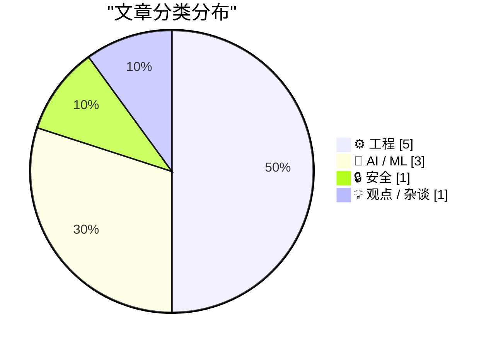
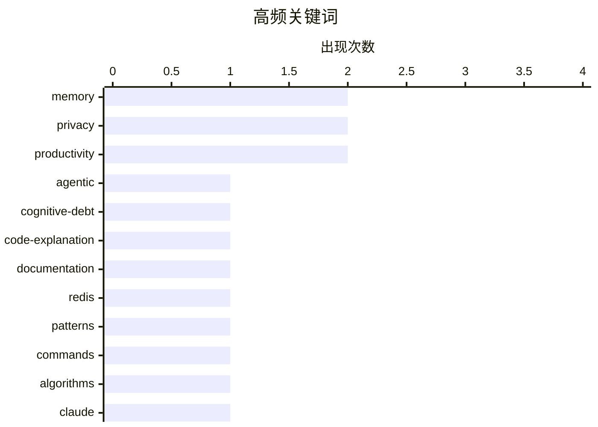

# 📰 AI 博客每日精选 — 2026-03-02

> 来自 Karpathy 推荐的 92 个顶级技术博客，AI 精选 Top 10

## 📝 今日看点

今天的技术讨论集中在三股主线：一是如何在 AI 生成代码与复杂系统中恢复可解释性与可靠性，避免“认知债务”失控，并辅以更扎实的错误处理与下游测试。二是 AI 体系的边界被反复拷问，从端侧代理的性能瓶颈到记忆导出与安全责任，现实约束开始压过想象力。三是基础设施与开发效率仍在被细节推动，Redis 知识系统化与 Shell 小技巧都指向更低摩擦的工程实践。总体来看，行业在加速落地的同时，正被迫重构可信与可控的底层支撑。

---

## 🏆 今日必读

🥇 **交互式解释**

[Interactive explanations](https://simonwillison.net/guides/agentic-engineering-patterns/interactive-explanations/#atom-everything) — simonwillison.net · 23 小时前 · ⚙️ 工程

> 核心问题是代理生成代码带来的“认知债务”如何被控制。文章指出，当代码只是简单的数据读取与 JSON 输出时，细节不重要，但一旦功能复杂，缺乏可解释性会让团队丧失对系统行为的把握。作者强调需要通过交互式解释机制，让人能追问“为什么这样做”，并逐步拆解代理的推理链条。这样可以把理解成本前置，避免未来维护时的高额负担。结论是：为代理输出配套可追溯的解释，是减少认知债务的关键。

💡 **为什么值得读**: 适合需要依赖 AI 代理产出代码的团队，用来建立可维护与可解释的工程规范。

🏷️ agentic, cognitive-debt, code-explanation, documentation

🥈 **用于编码的 Redis 模式**

[Redis patterns for coding](http://antirez.com/news/161) — antirez.com · 13 小时前 · ⚙️ 工程

> 核心主题是为 LLM 和编码代理提供系统化的 Redis 知识入口。作者发布了 redis.antirez.com，汇总 Redis 命令、数据类型的详尽文档，以及常见使用模式和配置提示。站点还整理了可用 Redis 命令实现的算法方案，方便快速检索和组合。作者希望通过集中化资料降低检索成本，并让搜索引擎更好索引。结论是这是一个面向机器与人都实用的 Redis 模式库入口。

💡 **为什么值得读**: 需要快速查 Redis 命令与设计模式的人，会发现这是高密度的一站式索引。

🏷️ Redis, patterns, commands, algorithms

🥉 **引用 claude.com/import-memory**

[Quoting claude.com/import-memory](https://simonwillison.net/2026/Mar/1/claude-import-memory/#atom-everything) — simonwillison.net · 11 小时前 · 🤖 AI / ML

> 核心问题是用户如何导出 AI 服务保存的个人记忆与上下文。引用内容给出明确指令：列出所有已保存记忆与历史对话中学到的上下文，并以单一代码块输出。格式要求为“[保存日期] - 记忆内容”，并尽可能保留原话。强调要覆盖所有类别并完整输出，便于迁移到其他服务。结论是导出记忆需要可复制、结构化、可追溯的格式规范。

💡 **为什么值得读**: 关注数据可携带性或 AI 记忆透明度的人会获得明确可用的导出模板。

🏷️ Claude, data-export, memory, privacy

---

## 📊 数据概览

| 扫描源 | 抓取文章 | 时间范围 | 精选 |
|:---:|:---:|:---:|:---:|
| 86/92 | 2470 篇 → 15 篇 | 24h | **10 篇** |

### 分类分布



### 高频关键词



<details>
<summary>📈 纯文本关键词图（终端友好）</summary>

```
memory           │ ████████████████████ 2
privacy          │ ████████████████████ 2
productivity     │ ████████████████████ 2
agentic          │ ██████████░░░░░░░░░░ 1
cognitive-debt   │ ██████████░░░░░░░░░░ 1
code-explanation │ ██████████░░░░░░░░░░ 1
documentation    │ ██████████░░░░░░░░░░ 1
redis            │ ██████████░░░░░░░░░░ 1
patterns         │ ██████████░░░░░░░░░░ 1
commands         │ ██████████░░░░░░░░░░ 1
```

</details>

### 🏷️ 话题标签

**memory**(2) · **privacy**(2) · **productivity**(2) · agentic(1) · cognitive-debt(1) · code-explanation(1) · documentation(1) · redis(1) · patterns(1) · commands(1) · algorithms(1) · claude(1) · data-export(1) · age-verification(1) · os(1) · regulation(1) · ai(1) · warfare(1) · targeting(1) · safety(1)

---

## ⚙️ 工程

### 1. 交互式解释

[Interactive explanations](https://simonwillison.net/guides/agentic-engineering-patterns/interactive-explanations/#atom-everything) — **simonwillison.net** · 23 小时前 · ⭐ 23/30

> 核心问题是代理生成代码带来的“认知债务”如何被控制。文章指出，当代码只是简单的数据读取与 JSON 输出时，细节不重要，但一旦功能复杂，缺乏可解释性会让团队丧失对系统行为的把握。作者强调需要通过交互式解释机制，让人能追问“为什么这样做”，并逐步拆解代理的推理链条。这样可以把理解成本前置，避免未来维护时的高额负担。结论是：为代理输出配套可追溯的解释，是减少认知债务的关键。

🏷️ agentic, cognitive-debt, code-explanation, documentation

---

### 2. 用于编码的 Redis 模式

[Redis patterns for coding](http://antirez.com/news/161) — **antirez.com** · 13 小时前 · ⭐ 22/30

> 核心主题是为 LLM 和编码代理提供系统化的 Redis 知识入口。作者发布了 redis.antirez.com，汇总 Redis 命令、数据类型的详尽文档，以及常见使用模式和配置提示。站点还整理了可用 Redis 命令实现的算法方案，方便快速检索和组合。作者希望通过集中化资料降低检索成本，并让搜索引擎更好索引。结论是这是一个面向机器与人都实用的 Redis 模式库入口。

🏷️ Redis, patterns, commands, algorithms

---

### 3. 两种错误

[The two kinds of error](https://evanhahn.com/the-two-kinds-of-error/) — **evanhahn.com** · 23 小时前 · ⭐ 20/30

> 核心主题是将错误分为“可预期”与“不可预期”两类。可预期错误如用户输入无效，属于正常流程，需要妥善处理；不可预期错误如空指针异常，意味着缺陷，可以让程序崩溃以暴露问题。作者强调错误处理被低估，却直接影响用户体验与系统质量。区分两类错误能帮助开发者在恢复能力与可见性之间做取舍。结论是错误分类是制定可靠错误策略的基础。

🏷️ error-handling, exceptions, software-design

---

### 4. 下游测试

[Downstream Testing](https://nesbitt.io/2026/03/01/downstream-testing.html) — **nesbitt.io** · 23 小时前 · ⭐ 19/30

> 核心问题是库维护者难以在发布前验证对依赖方的影响。文章指出多数维护者没有渠道或资源进行下游测试，导致发布后才发现破坏性变更。缺乏对依赖图的覆盖会让语义化版本难以真正保障稳定。作者暗示需要新的工具或流程来模拟真实依赖环境。结论是下游测试缺失是库生态稳定性的长期痛点。

🏷️ testing, library-maintenance, dependencies

---

### 5. Shell 变量 ~-

[Shell variable ~-](https://www.johndcook.com/blog/2026/03/01/tilde-dash/) — **johndcook.com** · 4 小时前 · ⭐ 16/30

> 核心主题是 Bash 中不常见的快捷符号 ~-。作者在阅读文档时发现 ~- 是 $OLDPWD 的快捷方式，可用于引用上一个工作目录。对比常用的 `cd -`，~- 能在路径拼接等场景更灵活。文章强调这是一个容易被忽略但实用的 shell 细节。结论是掌握 ~- 可以让目录切换与脚本编写更高效。

🏷️ bash, shell, OLDPWD, productivity

---

## 🤖 AI / ML

### 6. 引用 claude.com/import-memory

[Quoting claude.com/import-memory](https://simonwillison.net/2026/Mar/1/claude-import-memory/#atom-everything) — **simonwillison.net** · 11 小时前 · ⭐ 21/30

> 核心问题是用户如何导出 AI 服务保存的个人记忆与上下文。引用内容给出明确指令：列出所有已保存记忆与历史对话中学到的上下文，并以单一代码块输出。格式要求为“[保存日期] - 记忆内容”，并尽可能保留原话。强调要覆盖所有类别并完整输出，便于迁移到其他服务。结论是导出记忆需要可复制、结构化、可追溯的格式规范。

🏷️ Claude, data-export, memory, privacy

---

### 7. AI 是否已在意外致人死亡？

[Is AI already killing people by accident?](https://garymarcus.substack.com/p/is-ai-already-killing-people-by-accident) — **garymarcus.substack.com** · 4 小时前 · ⭐ 21/30

> 核心问题是军事误伤事件是否可能由 AI 导致。作者转述 Tyler Austin Harper 的提问，关注伊朗一场误击导致近 150 名学童死亡的事件。文章探讨 AI 在目标识别与决策链中的潜在角色与责任归因。重点在于现有事实尚不清晰，但必须认真审视 AI 参与军事行动的风险。结论是需要对 AI 介入致命决策保持高度警惕与透明调查。

🏷️ AI, warfare, targeting, safety

---

### 8. 为何端侧智能代理跟不上需求

[Why on-device agentic AI can't keep up](https://martinalderson.com/posts/why-on-device-agentic-ai-cant-keep-up/?utm_source=rss) — **martinalderson.com** · 23 小时前 · ⭐ 21/30

> 核心问题是端侧 agentic AI 的性能瓶颈。文章用 KV cache 扩展、内存预算和推理速度的数学约束说明端侧难以支持复杂代理。随着上下文增长，缓存与 RAM 成本迅速膨胀，使长链推理变得不可持续。作者指出相比云端，端侧在吞吐和延迟上都难以竞争。结论是端侧代理在当前硬件条件下很难“跟上”实际需求。

🏷️ on-device-ai, inference, memory

---

## 🔒 安全

### 9. “你多大了？”操作系统问

[&ldquo;How old are you?&rdquo; Asked the OS](https://idiallo.com/byte-size/how-old-are-you-asked-the-os?src=feed) — **idiallo.com** · 21 小时前 · ⭐ 21/30

> 核心主题是加州 AB-1043 要求操作系统在创建账户时收集用户年龄。作者提出关键疑问：离线系统是否适用、树莓派是否强制、填错年龄是否违法、儿童共用设备如何处理。文章指出该法缺乏可执行性，现实中无法强制验证。作者推测立法意图可能并非技术可行，而是政策姿态或责任转移。结论是这类年龄收集要求在技术层面难以落地且问题重重。

🏷️ privacy, age-verification, OS, regulation

---

## 💡 观点 / 杂谈

### 10. 专家初学者与独行侠将主导 LLM 早期时代

[Expert Beginners and Lone Wolves will dominate this early LLM era](https://www.jeffgeerling.com/blog/2026/expert-beginners-and-lone-wolves-dominate-llm-era/) — **jeffgeerling.com** · 1 小时前 · ⭐ 19/30

> 核心问题是 LLM 时代初期谁最具优势。作者回顾自身博客迁移经历，强调个人规模与快速迭代的价值。文章提出“专家初学者”既懂领域又愿意重新学习，而“独行侠”能以低成本快速试验。大型组织的流程与协作成本在早期反而成为劣势。结论是小团队和个人在 LLM 早期更容易占据先机。

🏷️ LLM, career, expert-beginners, productivity

---

*生成于 2026-03-02 23:04 | 扫描 86 源 → 获取 2470 篇 → 精选 10 篇*
*基于 [Hacker News Popularity Contest 2025](https://refactoringenglish.com/tools/hn-popularity/) RSS 源列表*
