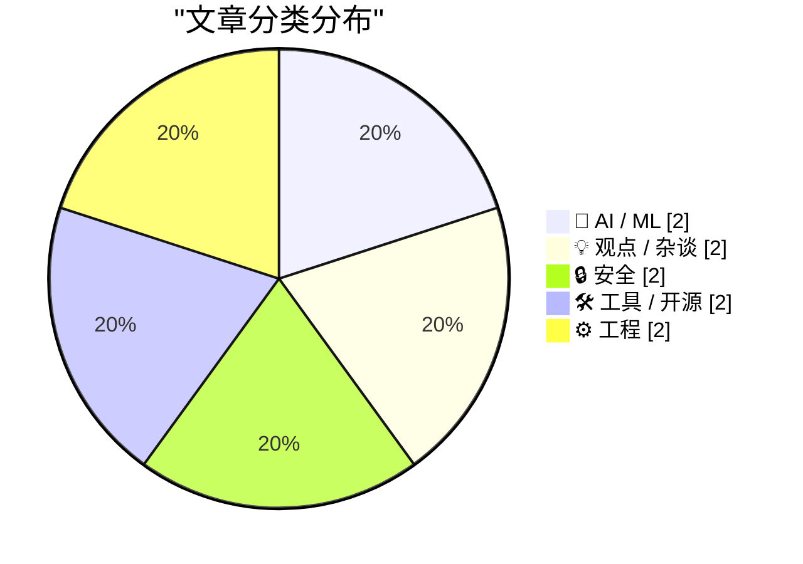
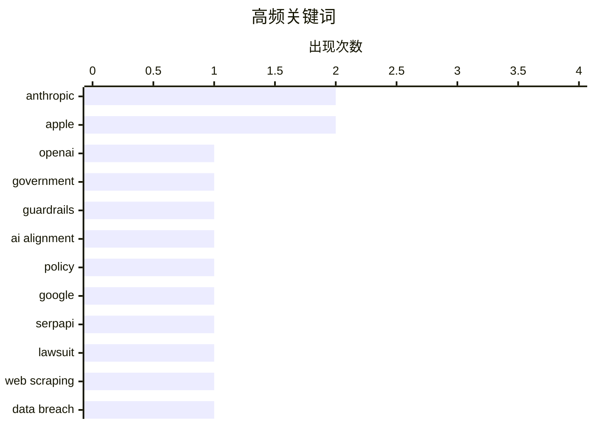

# 📰 AI 博客每日精选 — 2026-03-03

> 来自 Karpathy 推荐的 92 个顶级技术博客，AI 精选 Top 10

## 📝 今日看点

今天技术圈的焦点集中在三条主线：一是AI治理与国家权力博弈升温，从政府模型选择到“对齐”边界争议，安全与可用性拉扯加剧。二是数据与内容生态的控制权之争持续发酵，既有平台诉讼与“互联网所有权”的争议，也有对AI内容灌水的强烈反弹。三是安全与工程侧同步推进，供应链信任链条与数据泄露暴露出系统性风险，而硬件与工具更新则在性能与效率上继续快跑。

---

## 🏆 今日必读

🥇 **WSJ：特朗普政府回避 Anthropic、在“护栏”争议中转向 OpenAI**

[WSJ: ‘Trump Administration Shuns Anthropic, Embraces OpenAI in Clash Over Guardrails’](https://www.wsj.com/tech/ai/trump-will-end-government-use-of-anthropics-ai-models-ff3550d9) — daringfireball.net · 5 小时前 · 🤖 AI / ML

> 核心问题是美国政府在军方用途的 AI 模型上如何取舍安全护栏与可用性。报道指出，特朗普宣布结束政府使用 Anthropic 模型，时间点紧贴五角大楼要求其允许“所有合法用途”的最后期限。Anthropic 拒绝在国内大规模监控与自主武器上让步，并由 CEO Dario Amodei 明确表示不会接受该要求。军方坚持更宽泛的授权范围，意味着安全红线与国防需求发生正面冲突。结论是政府选择与更愿意配合军方需求的 OpenAI 合作，Anthropic 的护栏立场导致其在政府采购中失利。

💡 **为什么值得读**: 想了解政府采购如何影响 AI 安全政策与商业格局，这篇提供了清晰的冲突与取舍样本。

🏷️ OpenAI, Anthropic, government, guardrails

🥈 **Anthropic 与对齐**

[‘Anthropic and Alignment’](https://stratechery.com/2026/anthropic-and-alignment/) — daringfireball.net · 4 小时前 · 🤖 AI / ML

> 主题是当 AI 能力逼近战略级别时，私营公司能否以“对齐”为由约束国家权力。文章引用 Amodei 的比喻：如果核武器由私企开发并试图对美国军方设定条件，美国会有动机摧毁该公司。作者将问题引向国际法与现实政治，强调“国际法最终是权力的函数”。在这种语境下，“对齐”并不能凌驾于国家安全与主权决策。结论是强权逻辑将主导高风险能力的治理边界，而非企业单方面的伦理框架。

💡 **为什么值得读**: 这篇把 AI 对齐的伦理议题放进地缘政治框架，适合理解技术治理的现实边界。

🏷️ Anthropic, AI alignment, policy

🥉 **SerpApi 提交动议要求驳回谷歌的诉讼**

[SerpApi Filed Motion to Dismiss Google’s Lawsuit](https://serpapi.com/blog/google-v-serpapi-motion-to-dismiss-why-were-in-the-right/) — daringfireball.net · 2 小时前 · 💡 观点 / 杂谈

> 核心问题是谷歌起诉 SerpApi 是否试图以“互联网所有权”来限制合法数据访问。SerpApi CEO 表示谷歌的诉讼潜台词是“谷歌拥有互联网”，但法律并不支持这一点。文章回顾了 SerpApi 在 1 月承诺将为其商业模式和依赖其技术的研究者与创新者抗争。公司在 2026 年 2 月 20 日正式提交动议要求驳回诉讼，进入程序性对抗阶段。结论是 SerpApi 将把争议聚焦在法律对公开网络的访问权利上，而非单纯的商业冲突。

💡 **为什么值得读**: 关注搜索数据、抓取合规或平台垄断的人，会从中看到关键法律论点的实操走向。

🏷️ Google, SerpApi, lawsuit, web scraping

---

## 📊 数据概览

| 扫描源 | 抓取文章 | 时间范围 | 精选 |
|:---:|:---:|:---:|:---:|
| 89/92 | 2510 篇 → 21 篇 | 24h | **10 篇** |

### 分类分布



### 高频关键词



<details>
<summary>📈 纯文本关键词图（终端友好）</summary>

```
anthropic    │ ████████████████████ 2
apple        │ ████████████████████ 2
openai       │ ██████████░░░░░░░░░░ 1
government   │ ██████████░░░░░░░░░░ 1
guardrails   │ ██████████░░░░░░░░░░ 1
ai alignment │ ██████████░░░░░░░░░░ 1
policy       │ ██████████░░░░░░░░░░ 1
google       │ ██████████░░░░░░░░░░ 1
serpapi      │ ██████████░░░░░░░░░░ 1
lawsuit      │ ██████████░░░░░░░░░░ 1
```

</details>

### 🏷️ 话题标签

**anthropic**(2) · **apple**(2) · **openai**(1) · government(1) · guardrails(1) · ai alignment(1) · policy(1) · google(1) · serpapi(1) · lawsuit(1) · web scraping(1) · data breach(1) · odido(1) · leak(1) · incident(1) · auth0(1) · mastodon(1) · oauth(1) · sso(1) · supply chain(1)

---

## 🤖 AI / ML

### 1. WSJ：特朗普政府回避 Anthropic、在“护栏”争议中转向 OpenAI

[WSJ: ‘Trump Administration Shuns Anthropic, Embraces OpenAI in Clash Over Guardrails’](https://www.wsj.com/tech/ai/trump-will-end-government-use-of-anthropics-ai-models-ff3550d9) — **daringfireball.net** · 5 小时前 · ⭐ 24/30

> 核心问题是美国政府在军方用途的 AI 模型上如何取舍安全护栏与可用性。报道指出，特朗普宣布结束政府使用 Anthropic 模型，时间点紧贴五角大楼要求其允许“所有合法用途”的最后期限。Anthropic 拒绝在国内大规模监控与自主武器上让步，并由 CEO Dario Amodei 明确表示不会接受该要求。军方坚持更宽泛的授权范围，意味着安全红线与国防需求发生正面冲突。结论是政府选择与更愿意配合军方需求的 OpenAI 合作，Anthropic 的护栏立场导致其在政府采购中失利。

🏷️ OpenAI, Anthropic, government, guardrails

---

### 2. Anthropic 与对齐

[‘Anthropic and Alignment’](https://stratechery.com/2026/anthropic-and-alignment/) — **daringfireball.net** · 4 小时前 · ⭐ 23/30

> 主题是当 AI 能力逼近战略级别时，私营公司能否以“对齐”为由约束国家权力。文章引用 Amodei 的比喻：如果核武器由私企开发并试图对美国军方设定条件，美国会有动机摧毁该公司。作者将问题引向国际法与现实政治，强调“国际法最终是权力的函数”。在这种语境下，“对齐”并不能凌驾于国家安全与主权决策。结论是强权逻辑将主导高风险能力的治理边界，而非企业单方面的伦理框架。

🏷️ Anthropic, AI alignment, policy

---

## 💡 观点 / 杂谈

### 3. SerpApi 提交动议要求驳回谷歌的诉讼

[SerpApi Filed Motion to Dismiss Google’s Lawsuit](https://serpapi.com/blog/google-v-serpapi-motion-to-dismiss-why-were-in-the-right/) — **daringfireball.net** · 2 小时前 · ⭐ 22/30

> 核心问题是谷歌起诉 SerpApi 是否试图以“互联网所有权”来限制合法数据访问。SerpApi CEO 表示谷歌的诉讼潜台词是“谷歌拥有互联网”，但法律并不支持这一点。文章回顾了 SerpApi 在 1 月承诺将为其商业模式和依赖其技术的研究者与创新者抗争。公司在 2026 年 2 月 20 日正式提交动议要求驳回诉讼，进入程序性对抗阶段。结论是 SerpApi 将把争议聚焦在法律对公开网络的访问权利上，而非单纯的商业冲突。

🏷️ Google, SerpApi, lawsuit, web scraping

---

### 4. Pluralistic：没人想读你的 AI 垃圾内容（2026-03-02）

[Pluralistic: No one wants to read your AI slop (02 Mar 2026)](https://pluralistic.net/2026/03/02/nonconsensual-slopping/) — **pluralistic.net** · 13 小时前 · ⭐ 19/30

> 主题是反对未经同意的 AI 内容灌水，强调读者体验与写作者责任。作者主张如果一定要用 AI 生成内容，也应私下使用而非公开投放。文章在长列表栏目中穿插这一观点，凸显对“AI 垃圾内容”扩散的强烈不满。它把问题定性为公共信息空间的污染，而非单纯的效率工具争议。结论是 AI 生成内容不该以牺牲读者体验为代价。

🏷️ AI content, media, authenticity

---

## 🔒 安全

### 5. 每周更新 493

[Weekly Update 493](https://www.troyhunt.com/weekly-update-493/) — **troyhunt.com** · 15 小时前 · ⭐ 21/30

> 主题聚焦于一周内的安全事件与个人工作进展，重点是 Odido 数据泄露。作者记录了第二次数据泄露后次日录制更新，而第三次泄露在数小时后出现。随后又发生了最终的完整数据泄露，显示事件在短时间内持续升级。该节奏反映了泄露事件的演变速度与信息不确定性。结论是这一周的更新以追踪泄露进展为主，强调快速变化的安全态势。

🏷️ data breach, Odido, leak, incident

---

### 6. 传递性信任

[Transitive Trust](https://nesbitt.io/2026/03/02/transitive-trust.html) — **nesbitt.io** · 13 小时前 · ⭐ 20/30

> 核心问题是开源供应链中的信任链条是否可靠。你信任维护者，但维护者又信任他们的维护者，这种“信任的信任”可能无限传递。文章质疑这种链式依赖是否有明确的边界与验证机制。它暗示维护者关系并不能自动转化为安全保证。结论是应当重新审视传递性信任的假设，避免盲目依赖上游。

🏷️ supply chain, trust, maintainers

---

## 🛠 工具 / 开源

### 7. 在 Auth0 中添加“使用 Mastodon 登录”

[Adding "Log In With Mastodon" to Auth0](https://shkspr.mobi/blog/2026/03/adding-log-in-with-mastodon-to-auth0/) — **shkspr.mobi** · 10 小时前 · ⭐ 20/30

> 核心问题是 Auth0 默认不支持 Mastodon 社交登录，但作者希望在 OpenBenches 网站上提供该选项。文章解释为何使用 Auth0：不自建账号体系，避免管理密码与账户。作者指出 Auth0 已支持 Facebook、Twitter、WordPress、Discord 等常见平台，却缺少 Mastodon。解决思路是通过自定义方式把 Mastodon 作为登录提供方接入 Auth0。结论是即使平台缺失官方支持，也能通过扩展机制补齐功能。

🏷️ Auth0, Mastodon, OAuth, SSO

---

### 8. 基于 WebAssembly 和 Gifsicle 的 GIF 优化工具

[GIF optimization tool using WebAssembly and Gifsicle](https://simonwillison.net/guides/agentic-engineering-patterns/gif-optimization/#atom-everything) — **simonwillison.net** · 6 小时前 · ⭐ 18/30

> 核心问题是如何压缩用于写作演示的动画 GIF 体积。作者提到常用 LICEcap 录制 GIF，但文件通常很大。文章介绍一种基于 WebAssembly 和 Gifsicle 的优化方案，用于减小 GIF 体积。该工具面向博客或技术写作中的演示素材优化。结论是通过 WASM 方案可在不牺牲可用性的前提下降低 GIF 负担。

🏷️ WebAssembly, GIF, optimization, gifsicle

---

## ⚙️ 工程

### 9. 苹果发布搭载 M4 的新款 iPad Air

[Apple Introduces New iPad Air With M4](https://www.apple.com/newsroom/2026/03/apple-introduces-the-new-ipad-air-powered-by-m4/) — **daringfireball.net** · 5 小时前 · ⭐ 19/30

> 主题是苹果推出搭载 M4 的新 iPad Air，并在同起售价下提升性能与内存。新机具备更快的 CPU/GPU，面向剪辑与游戏等任务性能提升。神经引擎更快、内存带宽更高，统一内存比上一代多 50%。性能对比显示：较 M3 版快 30%，较 M1 版快 2.3 倍。结论是 iPad Air 在不涨价的前提下完成一次显著的性能与 AI 能力升级。

🏷️ Apple, M4, iPad, Neural Engine

---

### 10. 苹果发布 iPhone 17e

[Apple Introduces the iPhone 17e](https://www.apple.com/newsroom/2026/03/apple-introduces-iphone-17e/) — **daringfireball.net** · 7 小时前 · ⭐ 19/30

> 核心主题是 iPhone 17e 作为更实惠的 iPhone 17 系列新成员发布。它搭载最新 A19 芯片，并引入苹果自研的 C1X 基带。C1X 相比 iPhone 16e 的 C1 最快可达 2× 速度提升。相机升级为 48MP Fusion，支持下一代人像与 4K Dolby Vision 视频。结论是 17e 以性能与影像升级打造更高性价比的中端机型。

🏷️ Apple, A19, iPhone, cellular

---

*生成于 2026-03-03 23:01 | 扫描 89 源 → 获取 2510 篇 → 精选 10 篇*
*基于 [Hacker News Popularity Contest 2025](https://refactoringenglish.com/tools/hn-popularity/) RSS 源列表*
