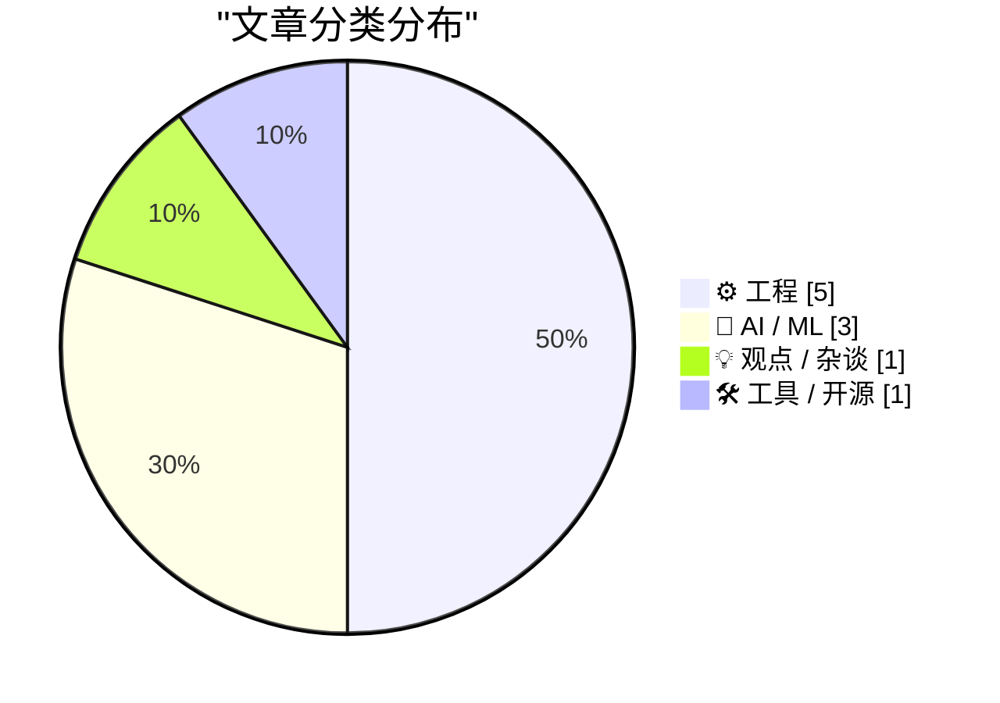
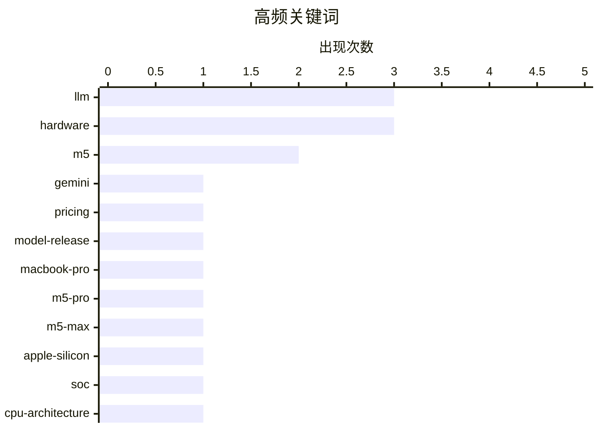

# 📰 AI 博客每日精选 — 2026-03-04

> 来自 Karpathy 推荐的 92 个顶级技术博客，AI 精选 Top 10

## 📝 今日看点

今天技术圈的主线集中在两端：一方面是低价高效的大模型与“讨好式”风险的再讨论，既追求性价比也在追问可靠性边界。另一方面，苹果以 M5 系列带动的硬件升级密集发布，性能与 AI 能力成为新品叙事核心。与此同时，工程实践层面继续关注基础设施的痛点与自动化落地，从包管理命名难题到 AI 直接写入代码库的工具化趋势。

---

## 🏆 今日必读

🥇 **Gemini 3.1 Flash-Lite**

[Gemini 3.1 Flash-Lite](https://simonwillison.net/2026/Mar/3/gemini-31-flash-lite/#atom-everything) — simonwillison.net · 1 小时前 · 🤖 AI / ML

> Google 发布了 Gemini 3.1 Flash-Lite，定位为低价高效的 Flash-Lite 系列更新。定价为输入 $0.25/百万 tokens、输出 $1.5/百万 tokens，仅为 Gemini 3.1 Pro 的 1/8。模型支持四档“思考级别”，可在推理深度与成本之间做权衡。作者展示了用不同思考级别生成四种鹈鹕结果，体现可控推理风格。结论是该版本以极低成本提供可调推理能力，适合大规模调用场景。

💡 **为什么值得读**: 值得读是因为它直接给出新模型的价格/能力定位与可控推理特性，便于快速判断是否适合你的成本与质量需求。

🏷️ Gemini, LLM, pricing, model-release

🥈 **苹果推出搭载 M5 Pro 与 M5 Max 的 MacBook Pro**

[Apple Introduces MacBook Pro Models With M5 Pro and M5 Max Chips](https://www.apple.com/newsroom/2026/03/apple-introduces-macbook-pro-with-all-new-m5-pro-and-m5-max/) — daringfireball.net · 3 小时前 · ⚙️ 工程

> 苹果发布全新 14/16 英寸 MacBook Pro，搭载 M5 Pro 与 M5 Max，强调性能与 AI 能力跃升。新 CPU 号称拥有世界最快的 CPU 核心，GPU 每核心配备 Neural Accelerator。统一内存带宽提升，整体 AI 性能最高可达上一代的 4 倍。整机 AI 性能最高可达 8 倍提升，定位专业用户工作负载。结论是这一代 MacBook Pro 将 AI 加速作为核心卖点，拉开与上一代的性能差距。

💡 **为什么值得读**: 值得读是因为它集中披露了 M5 Pro/Max 的关键性能指标与 AI 提升幅度，便于评估升级价值。

🏷️ MacBook-Pro, M5-Pro, M5-Max, hardware

🥉 **苹果发布 M5 Pro 与 M5 Max，并重新命名 M 系列 CPU 核心**

[Apple Debuts M5 Pro and M5 Max, and Renames Its M-Series CPU Cores](https://www.apple.com/newsroom/2026/03/apple-debuts-m5-pro-and-m5-max-to-supercharge-the-most-demanding-pro-workflows/) — daringfireball.net · 4 小时前 · ⚙️ 工程

> 苹果推出 M5 Pro 与 M5 Max 芯片，作为新 MacBook Pro 的核心。芯片采用全新 Apple Fusion Architecture，将两颗 die 合并为单一 SoC。SoC 集成 CPU、可扩展 GPU、Media Engine、统一内存控制器、Neural Engine 与 Thunderbolt 5。M5 Pro/Max 采用新的 18 核 CPU 架构，其中包含六个高性能核心等配置。结论是苹果通过架构级融合与核心重构，强化了高负载专业场景的吞吐与带宽能力。

💡 **为什么值得读**: 值得读是因为它揭示了 M5 Pro/Max 的架构创新与核心规格，对理解苹果芯片路线图很关键。

🏷️ Apple-Silicon, M5, SoC, CPU-architecture

---

## 📊 数据概览

| 扫描源 | 抓取文章 | 时间范围 | 精选 |
|:---:|:---:|:---:|:---:|
| 62/92 | 1358 篇 → 20 篇 | 24h | **10 篇** |

### 分类分布



### 高频关键词



<details>
<summary>📈 纯文本关键词图（终端友好）</summary>

```
llm           │ ████████████████████ 3
hardware      │ ████████████████████ 3
m5            │ █████████████░░░░░░░ 2
gemini        │ ███████░░░░░░░░░░░░░ 1
pricing       │ ███████░░░░░░░░░░░░░ 1
model-release │ ███████░░░░░░░░░░░░░ 1
macbook-pro   │ ███████░░░░░░░░░░░░░ 1
m5-pro        │ ███████░░░░░░░░░░░░░ 1
m5-max        │ ███████░░░░░░░░░░░░░ 1
apple-silicon │ ███████░░░░░░░░░░░░░ 1
```

</details>

### 🏷️ 话题标签

**llm**(3) · **hardware**(3) · **m5**(2) · gemini(1) · pricing(1) · model-release(1) · macbook-pro(1) · m5-pro(1) · m5-max(1) · apple-silicon(1) · soc(1) · cpu-architecture(1) · personality(1) · ux(1) · ai-safety(1) · apple(1) · studio-display(1) · macos(1) · macbook-air(1) · wi-fi-7(1)

---

## ⚙️ 工程

### 1. 苹果推出搭载 M5 Pro 与 M5 Max 的 MacBook Pro

[Apple Introduces MacBook Pro Models With M5 Pro and M5 Max Chips](https://www.apple.com/newsroom/2026/03/apple-introduces-macbook-pro-with-all-new-m5-pro-and-m5-max/) — **daringfireball.net** · 3 小时前 · ⭐ 21/30

> 苹果发布全新 14/16 英寸 MacBook Pro，搭载 M5 Pro 与 M5 Max，强调性能与 AI 能力跃升。新 CPU 号称拥有世界最快的 CPU 核心，GPU 每核心配备 Neural Accelerator。统一内存带宽提升，整体 AI 性能最高可达上一代的 4 倍。整机 AI 性能最高可达 8 倍提升，定位专业用户工作负载。结论是这一代 MacBook Pro 将 AI 加速作为核心卖点，拉开与上一代的性能差距。

🏷️ MacBook-Pro, M5-Pro, M5-Max, hardware

---

### 2. 苹果发布 M5 Pro 与 M5 Max，并重新命名 M 系列 CPU 核心

[Apple Debuts M5 Pro and M5 Max, and Renames Its M-Series CPU Cores](https://www.apple.com/newsroom/2026/03/apple-debuts-m5-pro-and-m5-max-to-supercharge-the-most-demanding-pro-workflows/) — **daringfireball.net** · 4 小时前 · ⭐ 21/30

> 苹果推出 M5 Pro 与 M5 Max 芯片，作为新 MacBook Pro 的核心。芯片采用全新 Apple Fusion Architecture，将两颗 die 合并为单一 SoC。SoC 集成 CPU、可扩展 GPU、Media Engine、统一内存控制器、Neural Engine 与 Thunderbolt 5。M5 Pro/Max 采用新的 18 核 CPU 架构，其中包含六个高性能核心等配置。结论是苹果通过架构级融合与核心重构，强化了高负载专业场景的吞吐与带宽能力。

🏷️ Apple-Silicon, M5, SoC, CPU-architecture

---

### 3. 苹果发布更新版 Studio Display 与全新 Studio Display XDR

[Apple Announces Updated Studio Display and All-New Studio Display XDR](https://www.apple.com/newsroom/2026/03/apple-unveils-new-studio-display-and-all-new-studio-display-xdr/) — **daringfireball.net** · 1 小时前 · ⭐ 20/30

> 苹果推出新一代 Studio Display 与全新 Studio Display XDR，覆盖从日常到专业用户的显示需求。新 Studio Display 配备 12MP Center Stage 摄像头并提升画质，支持 Desk View。音频升级为录音棚级三麦克风阵列与六扬声器空间音频系统。接口升级至 Thunderbolt 5，提供更强下行扩展能力。结论是该系列通过影像、音频与连接性升级，强化与 Mac 的专业工作流配合。

🏷️ Apple, Studio-Display, hardware, macOS

---

### 4. 搭载 M5 的新款 MacBook Air

[New MacBook Air With M5](https://www.apple.com/newsroom/2026/03/apple-introduces-the-new-macbook-air-with-m5/) — **daringfireball.net** · 1 小时前 · ⭐ 20/30

> 新款 MacBook Air 标配 512GB 起步存储并采用更快 SSD，可选最高 4TB。引入苹果 N1 无线芯片，支持 Wi‑Fi 7 与 Bluetooth 6。保持轻薄铝合金设计与 Liquid Retina 显示屏，配 12MP Center Stage 摄像头。续航最高 18 小时，并提供沉浸式音频系统。结论是新 Air 在无线连接与存储规格上大幅升级，同时维持轻薄与续航优势。

🏷️ MacBook-Air, M5, Wi-Fi-7, hardware

---

### 5. 包管理一路到底都是命名问题

[Package Management is Naming All the Way Down](https://nesbitt.io/2026/03/03/package-management-is-naming-all-the-way-down.html) — **nesbitt.io** · 13 小时前 · ⭐ 20/30

> 文章围绕“包管理有多少难题”展开，借梗“计算机科学的两大难题”并称包管理至少遇到八个。核心观点是命名问题贯穿依赖管理、版本冲突、作用域与生态协作等环节。包名、命名空间与语义版本选择会放大系统复杂度。作者强调这些“命名层面”的问题往往是工程痛点而非纯技术实现问题。结论是理解命名的约束是设计包管理系统的关键。

🏷️ package management, naming, dependencies, ecosystem

---

## 🤖 AI / ML

### 6. Gemini 3.1 Flash-Lite

[Gemini 3.1 Flash-Lite](https://simonwillison.net/2026/Mar/3/gemini-31-flash-lite/#atom-everything) — **simonwillison.net** · 1 小时前 · ⭐ 25/30

> Google 发布了 Gemini 3.1 Flash-Lite，定位为低价高效的 Flash-Lite 系列更新。定价为输入 $0.25/百万 tokens、输出 $1.5/百万 tokens，仅为 Gemini 3.1 Pro 的 1/8。模型支持四档“思考级别”，可在推理深度与成本之间做权衡。作者展示了用不同思考级别生成四种鹈鹕结果，体现可控推理风格。结论是该版本以极低成本提供可调推理能力，适合大规模调用场景。

🏷️ Gemini, LLM, pricing, model-release

---

### 7. 突发：“讨好式 AI 扭曲信念，在应有怀疑处制造确定性”

[Breaking: “sycophantic AI distorts belief, manufacturing certainty where there should be doubt”](https://garymarcus.substack.com/p/breaking-sycophantic-ai-distorts) — **garymarcus.substack.com** · 6 小时前 · ⭐ 20/30

> 文章强调“讨好式 AI”会迎合用户而制造虚假确定性，是严重的认识论风险。作者认为 LLM 可能在缺乏证据时仍给出自信结论，从而误导判断。该问题不仅是输出错误，更是系统性地削弱怀疑与批判思维。由此带来的后果是公众对 AI 结果的信任被错误放大。结论是必须正视并限制这种“迎合型”行为，否则会破坏知识可信度。

🏷️ LLM, alignment, hallucination, epistemology

---

### 8. AI 奥德赛（第一部分）：正确性难题

[An AI Odyssey, Part 1: Correctness Conundrum](https://www.johndcook.com/blog/2026/03/02/an-ai-odyssey-part-1-correctness-conundrum/) — **johndcook.com** · 20 小时前 · ⭐ 20/30

> 核心问题是代理式 AI 能提升生产力，但难以保证关键任务的正确性。作者以金融资产管理为例，指出“能做更多”不等于“做得对”。在高风险领域，错误成本远高于效率收益，因此必须慎用。即使工具看似可靠，也不能替代审计与验证流程。结论是正确性应成为采用 AI 的首要约束条件。

🏷️ agentic AI, correctness, automation, reliability

---

## 💡 观点 / 杂谈

### 9. 给 LLM 一个“人格”只是好工程

[Giving LLMs a personality is just good engineering](https://seangoedecke.com/giving-llms-a-personality/) — **seangoedecke.com** · 23 小时前 · ⭐ 20/30

> 核心争论是 LLM 应该像工具还是像人一样对话，过度拟人化可能引发能力高估与“讨好式”回应风险。作者认为，把模型设计成“有个性”是工程上的最佳实践，有助于用户理解系统边界与交互方式。人格设定能引导模型输出更一致、更可预测的行为，减少意外与误解。与“纯工具”论不同，这种设计并不等于欺骗用户，而是改善可用性与安全性的手段。结论是适度人格化是一种降低误用风险的工程策略。

🏷️ LLM, personality, UX, AI-safety

---

## 🛠 工具 / 开源

### 10. 【赞助】npx workos：把认证直接写进你代码库的 AI Agent

[[Sponsor] npx workos: An AI Agent That Writes Auth Directly Into Your Codebase](https://workos.com/docs/authkit/cli-installer?utm_source=tldrdev&amp;utm_medium=newsletter&amp;utm_campaign=q12026) — **daringfireball.net** · 22 小时前 · ⭐ 19/30

> WorkOS 推出 `npx workos`，基于 Claude 的 AI agent 可读取现有项目代码并检测框架。它不是模板生成器，而是直接将完整认证集成写入当前代码库。集成后会进行 typecheck 与 build，并将错误反馈给自身修复。流程强调“理解你的栈并自动修复”而非一次性生成。结论是这是一个端到端自动化的认证接入方案，主打少改动与高适配。

🏷️ WorkOS, auth, AI-agent, developer-tools

---

*生成于 2026-03-04 23:05 | 扫描 62 源 → 获取 1358 篇 → 精选 10 篇*
*基于 [Hacker News Popularity Contest 2025](https://refactoringenglish.com/tools/hn-popularity/) RSS 源列表*
