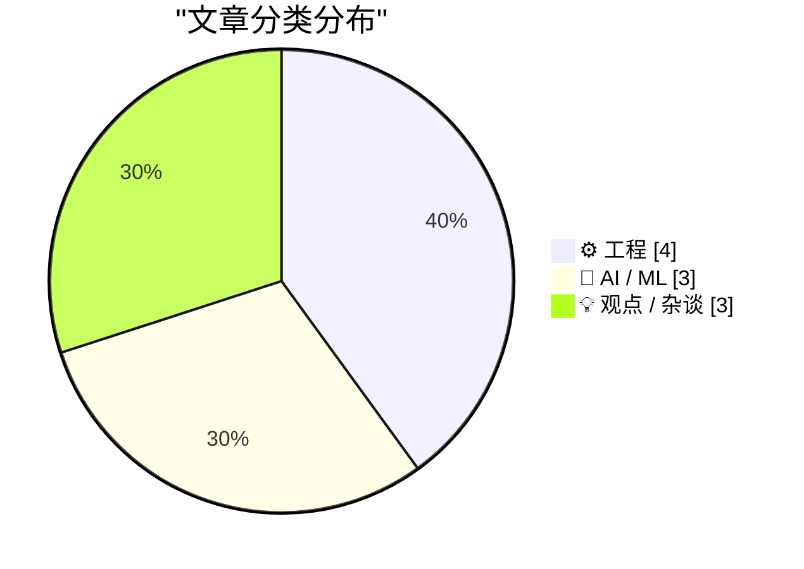
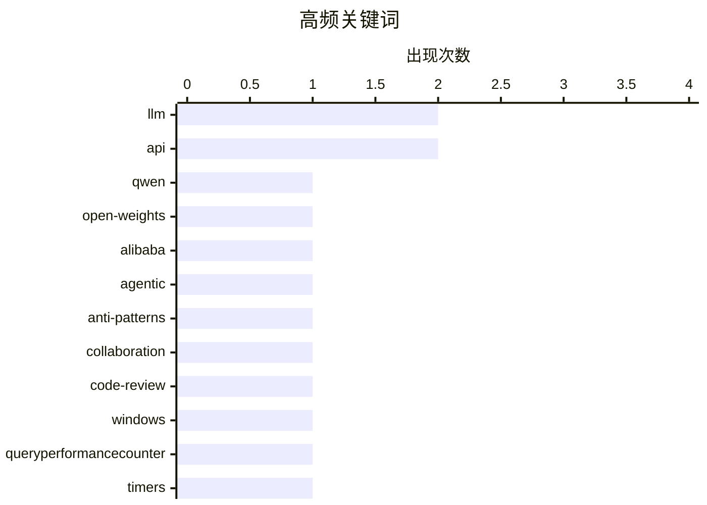

# 📰 AI 博客每日精选 — 2026-03-05

> 来自 Karpathy 推荐的 92 个顶级技术博客，AI 精选 Top 10

## 📝 今日看点

今天的技术圈一边在加速大模型竞赛：开源模型高频迭代，规模效应带来能力跃迁，同时关于提示与推理参数的理解偏差也被持续纠偏。工程实践则更强调秩序与可靠性，从避免未审代码的协作反模式，到系统 API“不会失败”的迷思，再到依赖更新冷却期，都是在为质量与安全降噪。硬件生态聚焦 Apple Silicon 的新一轮叙事与兼容性取舍，产品路线与品牌话语一起转向更明确的阵营分化。总体看，速度、可靠性与平台选择构成今日主轴。

---

## 🏆 今日必读

🥇 **Qwen 大地上出了大事**

[Something is afoot in the land of Qwen](https://simonwillison.net/2026/Mar/4/qwen/#atom-everything) — simonwillison.net · 11 小时前 · 🤖 AI / ML

> 文章聚焦阿里巴巴 Qwen 团队发布的 Qwen 3.5 开源权重模型家族及其背后的团队动荡。作者强调 Qwen 3.5 在近期几周密集发布，体现出模型能力和节奏上的显著进步。与此同时，24 小时内出现多位核心成员高调离职的消息，引发对团队稳定性的担忧。文中以 Junyang Lin 的推文为起点，串联外界对 Qwen 动向的讨论。作者的核心观点是希望 Qwen 3.5 不是“绝唱”，并对团队未来表示关注。

💡 **为什么值得读**: 能快速了解 Qwen 3.5 技术发布与团队变动的关联，对关注开源大模型生态的人很有参考价值。

🏷️ Qwen, open-weights, LLM, Alibaba

🥈 **反模式：需要避免的事**

[Anti-patterns: things to avoid](https://simonwillison.net/guides/agentic-engineering-patterns/anti-patterns/#atom-everything) — simonwillison.net · 10 小时前 · ⚙️ 工程

> 文章讨论代理式工程（agentic engineering）中的常见反模式。重点指出向协作者提交未经自己审查的代码是高频且令人沮丧的错误。作者明确要求不要提交自己未审阅过的 PR，以避免质量失控和协作成本上升。该观点强调在自动化与代理驱动的流程中，责任归属与质量控制依然必须由人把关。结论是即使有智能代理参与，代码审查责任不可外包。

💡 **为什么值得读**: 对正在使用 AI 代理或自动化流程的团队，能直击协作质量风险与流程底线。

🏷️ agentic, anti-patterns, collaboration, code-review

🥉 **我找到文档中“QueryPerformanceCounter 从不失败”的反例了**

[Aha, I found a counterexample to the documentation that says that Query­Performance­Counter never fails](https://devblogs.microsoft.com/oldnewthing/20260304-00/?p=112110) — devblogs.microsoft.com/oldnewthing · 12 小时前 · ⚙️ 工程

> 文章围绕 Windows API QueryPerformanceCounter “从不失败”的文档断言提出反例。作者指出只要违反使用规则，任何 API 都可能失败。该结论挑战了对系统级 API 的绝对信任，强调前置条件与正确用法的重要性。核心意思是失败不是不可能，而是被规则限制所掩盖。作者观点是开发者应对失败保持防御性设计。

💡 **为什么值得读**: 提供对系统文档“绝对保证”的现实校正，适合写底层或性能计时代码的人。

🏷️ Windows, QueryPerformanceCounter, timers, API

---

## 📊 数据概览

| 扫描源 | 抓取文章 | 时间范围 | 精选 |
|:---:|:---:|:---:|:---:|
| 88/92 | 2486 篇 → 13 篇 | 24h | **10 篇** |

### 分类分布



### 高频关键词



<details>
<summary>📈 纯文本关键词图（终端友好）</summary>

```
llm           │ ████████████████████ 2
api           │ ████████████████████ 2
qwen          │ ██████████░░░░░░░░░░ 1
open-weights  │ ██████████░░░░░░░░░░ 1
alibaba       │ ██████████░░░░░░░░░░ 1
agentic       │ ██████████░░░░░░░░░░ 1
anti-patterns │ ██████████░░░░░░░░░░ 1
collaboration │ ██████████░░░░░░░░░░ 1
code-review   │ ██████████░░░░░░░░░░ 1
windows       │ ██████████░░░░░░░░░░ 1
```

</details>

### 🏷️ 话题标签

**llm**(2) · **api**(2) · **qwen**(1) · open-weights(1) · alibaba(1) · agentic(1) · anti-patterns(1) · collaboration(1) · code-review(1) · windows(1) · queryperformancecounter(1) · timers(1) · package-manager(1) · dependencies(1) · supply-chain(1) · update(1) · logistic-regression(1) · neural-networks(1) · machine-learning(1) · openai(1)

---

## ⚙️ 工程

### 1. 反模式：需要避免的事

[Anti-patterns: things to avoid](https://simonwillison.net/guides/agentic-engineering-patterns/anti-patterns/#atom-everything) — **simonwillison.net** · 10 小时前 · ⭐ 23/30

> 文章讨论代理式工程（agentic engineering）中的常见反模式。重点指出向协作者提交未经自己审查的代码是高频且令人沮丧的错误。作者明确要求不要提交自己未审阅过的 PR，以避免质量失控和协作成本上升。该观点强调在自动化与代理驱动的流程中，责任归属与质量控制依然必须由人把关。结论是即使有智能代理参与，代码审查责任不可外包。

🏷️ agentic, anti-patterns, collaboration, code-review

---

### 2. 我找到文档中“QueryPerformanceCounter 从不失败”的反例了

[Aha, I found a counterexample to the documentation that says that Query­Performance­Counter never fails](https://devblogs.microsoft.com/oldnewthing/20260304-00/?p=112110) — **devblogs.microsoft.com/oldnewthing** · 12 小时前 · ⭐ 21/30

> 文章围绕 Windows API QueryPerformanceCounter “从不失败”的文档断言提出反例。作者指出只要违反使用规则，任何 API 都可能失败。该结论挑战了对系统级 API 的绝对信任，强调前置条件与正确用法的重要性。核心意思是失败不是不可能，而是被规则限制所掩盖。作者观点是开发者应对失败保持防御性设计。

🏷️ Windows, QueryPerformanceCounter, timers, API

---

### 3. 包管理器需要冷静一下

[Package Managers Need to Cool Down](https://nesbitt.io/2026/03/04/package-managers-need-to-cool-down.html) — **nesbitt.io** · 17 小时前 · ⭐ 20/30

> 文章调查各类包管理器和更新工具对“依赖冷却期（dependency cooldown）”的支持现状。冷却期用于限制过于频繁的依赖更新，以降低供应链风险和变更噪音。作者对比多个生态的策略，展示哪些工具允许设置更新时间窗口或延迟策略。调查揭示行业在更新频率与稳定性之间的拉锯。结论是包管理生态应更系统地支持冷却期机制。

🏷️ package-manager, dependencies, supply-chain, update

---

### 4. 新款 Studio Display 的兼容性说明

[Compatibility Notes on the New Studio Displays](https://www.macrumors.com/2026/03/03/apple-studio-display-no-intel-mac-support/) — **daringfireball.net** · 11 小时前 · ⭐ 18/30

> 文章整理新款 Studio Display 与 Studio Display XDR 的兼容性限制。两款显示器均不支持 Intel Mac，仅兼容 Apple Silicon。搭载任意 M1、基础款 M2 或 M3 的 Mac 只能以 60 Hz 驱动 XDR。只有 M2/M3 Pro 或更高、或任意 M4/M5 才能达到 120 Hz。结论是显示器升级对芯片型号有明确门槛。

🏷️ compatibility, Mac, display, refresh-rate

---

## 🤖 AI / ML

### 5. Qwen 大地上出了大事

[Something is afoot in the land of Qwen](https://simonwillison.net/2026/Mar/4/qwen/#atom-everything) — **simonwillison.net** · 11 小时前 · ⭐ 25/30

> 文章聚焦阿里巴巴 Qwen 团队发布的 Qwen 3.5 开源权重模型家族及其背后的团队动荡。作者强调 Qwen 3.5 在近期几周密集发布，体现出模型能力和节奏上的显著进步。与此同时，24 小时内出现多位核心成员高调离职的消息，引发对团队稳定性的担忧。文中以 Junyang Lin 的推文为起点，串联外界对 Qwen 动向的讨论。作者的核心观点是希望 Qwen 3.5 不是“绝唱”，并对团队未来表示关注。

🏷️ Qwen, open-weights, LLM, Alibaba

---

### 6. 从逻辑回归到 AI

[From logistic regression to AI](https://www.johndcook.com/blog/2026/03/04/from-logistic-regression-to-ai/) — **johndcook.com** · 13 小时前 · ⭐ 19/30

> 文章探讨“神经网络只是逻辑回归的放大版”的观点。作者承认神经网络本质上是逻辑回归的扩展，但强调参数规模巨大时会出现新的涌现现象。规模带来的是质变而非简单线性改进，这也是 LLM 能力超预期的原因之一。文中强调“更多参数”并不只是更多的相同，而是引入新的行为。核心结论是规模效应使 AI 与传统统计模型出现本质差异。

🏷️ logistic-regression, neural-networks, LLM, machine-learning

---

### 7. AI 奥德赛·第二部分：提示的风险

[An AI Odyssey, Part 2: Prompting Peril](https://www.johndcook.com/blog/2026/03/04/an-ai-odyssey-part-2-prompting-peril/) — **johndcook.com** · 13 小时前 · ⭐ 19/30

> 文章围绕 OpenAI API 调用中的“增加推理量是否能提升准确率”展开讨论。作者在与同事合作时提出通过修改 API 请求来提升推理深度的设想，并验证其可行性。故事强调对提示与推理参数的误解可能带来预期偏差或风险。作者借此提醒不要把“更多推理”当成万能解法。结论是提示工程既有收益也有陷阱，需要谨慎验证。

🏷️ OpenAI, prompting, reasoning, API

---

## 💡 观点 / 杂谈

### 8. 关于 MacBook Neo 的想法与观察

[★ Thoughts and Observations on the MacBook Neo](https://daringfireball.net/2026/03/599_not_a_piece_of_junk_macbook_neo) — **daringfireball.net** · 7 小时前 · ⭐ 18/30

> 文章评价 MacBook Neo 作为 Apple Silicon 时代首个面向消费者的大改款 Mac。作者认为它意在提升 Mac 在整体 PC 市场的份额，即使幅度可能很小。文中强调这是一次面向大众市场而非专业用户的战略动作。其定位显示苹果希望以新产品拉动更广泛人群的购买。结论是 MacBook Neo 的意义在于市场扩张而非单纯性能升级。

🏷️ MacBook, Apple, hardware, consumer

---

### 9. “也就是说，蝙蝠侠成了超人，罗宾成了蝙蝠侠”

[‘In Other Words, Batman Has Become Superman and Robin Has Become Batman’](https://sixcolors.com/post/2026/03/apple-gives-in-to-temptation-and-renames-its-cpu-cores/) — **daringfireball.net** · 13 小时前 · ⭐ 18/30

> 文章引用 Jason Snell 对苹果重命名 CPU 核心的评论。苹果高层长期对外界低估“效率核”性能的印象感到不满，并在多代 M 系列中反复强调其性能不弱。此次更名被视为一次品牌与叙事调整，试图改变“效率核=弱核”的固有认知。作者认为新命名反映了核心性能角色的重新划分。结论是苹果试图通过命名重塑对核心能力的理解。

🏷️ Apple Silicon, performance, efficiency-cores, architecture

---

### 10. 中断驱动式开发

[Interruption-Driven Development](https://idiallo.com/blog/interruption-driven-development?src=feed) — **idiallo.com** · 15 小时前 · ⭐ 18/30

> 文章讲述作者在工作中被频繁打断的体验与应对策略。作者不听音乐却戴耳机，目的是向同事传递“在专注工作”的信号。虽然并不能完全阻止打断，但能争取更多不被打扰的时间。文中表达对沟通本身并不反感，真正的痛点是被打断导致的注意力切换成本。结论是通过环境信号和习惯来减轻中断影响。

🏷️ focus, productivity, interruptions, work-habits

---

*生成于 2026-03-05 03:40 | 扫描 88 源 → 获取 2486 篇 → 精选 10 篇*
*基于 [Hacker News Popularity Contest 2025](https://refactoringenglish.com/tools/hn-popularity/) RSS 源列表*
