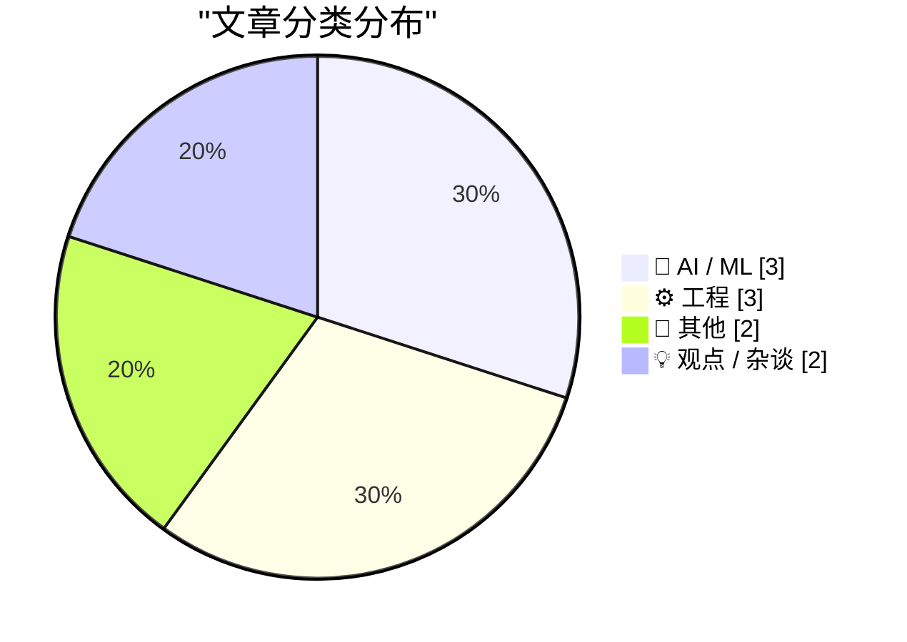
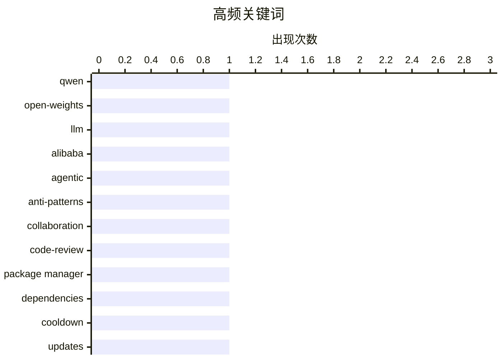

# 📰 AI 博客每日精选 — 2026-03-05

> 来自 Karpathy 推荐的 92 个顶级技术博客，AI 精选 Top 10

## 📝 今日看点

今天技术圈的主线集中在两端：一边是开源大模型快速迭代与提示工程边界的再讨论，反映出对“能力提升”与“方法论风险”的双重关注；另一边是工程实践的自省，从反模式、依赖冷却期到“看似不会失败”的 API，都在提醒稳定性和协作质量才是底盘。与此同时，硬件与平台话题继续升温，苹果的产品兼容与芯片定位变化折射出生态重心的迁移。整体看，行业在性能竞速与工程秩序之间寻找新的平衡点。

---

## 🏆 今日必读

🥇 **Qwen 的局势似乎有变**

[Something is afoot in the land of Qwen](https://simonwillison.net/2026/Mar/4/qwen/#atom-everything) — simonwillison.net · 11 小时前 · 🤖 AI / ML

> 核心焦点是阿里 Qwen 团队近期发布的 Qwen 3.5 开源大模型家族与团队动向。作者认为 Qwen 3.5 过去几周的密集发布非常突出，可能代表该系列的里程碑。与此同时，过去 24 小时内的高层离职引发对团队未来的担忧。文章以 Junyang Lin 的一条推文为导火索，串联事件背景。作者的态度是希望 Qwen 3.5 不会成为“绝唱”。

💡 **为什么值得读**: 既有模型发布进展，也涉及团队变动与风险判断，适合关注国产开源大模型生态的人快速把握风向。

🏷️ Qwen, open-weights, LLM, Alibaba

🥈 **反模式：应避免的做法**

[Anti-patterns: things to avoid](https://simonwillison.net/guides/agentic-engineering-patterns/anti-patterns/#atom-everything) — simonwillison.net · 10 小时前 · ⚙️ 工程

> 主题是“代理式工程”中常见但有害的行为模式。作者强调最糟的反模式之一是把未经自我审查的代码直接提交给协作者。此类行为会造成协作负担、信任受损和质量下降。文章通过明确的禁令式建议，要求提交 PR 前必须自行完整评审。核心观点是把审查责任前置到作者本人是协作工程的基本礼仪。

💡 **为什么值得读**: 如果你正在做 agentic workflow 或多人协作，这篇能直接避免最让人崩溃的协作坑。

🏷️ agentic, anti-patterns, collaboration, code-review

🥉 **包管理器需要降温**

[Package Managers Need to Cool Down](https://nesbitt.io/2026/03/04/package-managers-need-to-cool-down.html) — nesbitt.io · 17 小时前 · ⚙️ 工程

> 主题是依赖“冷却期（cooldown）”机制在各类包管理器与更新工具中的支持现状。文章以调查形式汇总不同生态对 cooldown 的实现与缺失。对比对象涵盖主流包管理器和自动更新工具，指出支持差异明显。作者意图是推动生态降低依赖更新的频率与冲击。结论是现有支持并不统一，仍有改进空间。

💡 **为什么值得读**: 对构建稳定依赖策略的人来说，这是一次跨生态的机制盘点与选型参考。

🏷️ package manager, dependencies, cooldown, updates

---

## 📊 数据概览

| 扫描源 | 抓取文章 | 时间范围 | 精选 |
|:---:|:---:|:---:|:---:|
| 88/92 | 2486 篇 → 13 篇 | 24h | **10 篇** |

### 分类分布



### 高频关键词



<details>
<summary>📈 纯文本关键词图（终端友好）</summary>

```
qwen            │ ████████████████████ 1
open-weights    │ ████████████████████ 1
llm             │ ████████████████████ 1
alibaba         │ ████████████████████ 1
agentic         │ ████████████████████ 1
anti-patterns   │ ████████████████████ 1
collaboration   │ ████████████████████ 1
code-review     │ ████████████████████ 1
package manager │ ████████████████████ 1
dependencies    │ ████████████████████ 1
```

</details>

### 🏷️ 话题标签

**qwen**(1) · **open-weights**(1) · **llm**(1) · alibaba(1) · agentic(1) · anti-patterns(1) · collaboration(1) · code-review(1) · package manager(1) · dependencies(1) · cooldown(1) · updates(1) · openai api(1) · prompting(1) · reasoning(1) · accuracy(1) · windows(1) · queryperformancecounter(1) · edge-cases(1) · documentation(1)

---

## 🤖 AI / ML

### 1. Qwen 的局势似乎有变

[Something is afoot in the land of Qwen](https://simonwillison.net/2026/Mar/4/qwen/#atom-everything) — **simonwillison.net** · 11 小时前 · ⭐ 25/30

> 核心焦点是阿里 Qwen 团队近期发布的 Qwen 3.5 开源大模型家族与团队动向。作者认为 Qwen 3.5 过去几周的密集发布非常突出，可能代表该系列的里程碑。与此同时，过去 24 小时内的高层离职引发对团队未来的担忧。文章以 Junyang Lin 的一条推文为导火索，串联事件背景。作者的态度是希望 Qwen 3.5 不会成为“绝唱”。

🏷️ Qwen, open-weights, LLM, Alibaba

---

### 2. AI 奥德赛（二）：提示的风险

[An AI Odyssey, Part 2: Prompting Peril](https://www.johndcook.com/blog/2026/03/04/an-ai-odyssey-part-2-prompting-peril/) — **johndcook.com** · 13 小时前 · ⭐ 20/30

> 核心问题是通过调整 OpenAI API 的调用方式来提升回答准确性是否可行。作者与同事讨论“增加推理量”的想法，并向 ChatGPT 验证可行性。文章聚焦提示工程的边界与潜在陷阱，而非盲目增加推理参数。由此引出对提示可靠性与响应质量关系的怀疑。作者的态度是对“通过提示提升准确性”的简单化认识保持警惕。

🏷️ OpenAI API, prompting, reasoning, accuracy

---

### 3. 从逻辑回归到 AI

[From logistic regression to AI](https://www.johndcook.com/blog/2026/03/04/from-logistic-regression-to-ai/) — **johndcook.com** · 13 小时前 · ⭐ 19/30

> 主题是神经网络与逻辑回归之间的关系及规模效应。作者承认神经网络在某种意义上是“参数更多的逻辑回归”。但强调“更多不只是更多”，当参数规模扩大时会出现不可预期的新现象。文章将 LLM 归为神经网络体系，提醒不要忽视结构和规模带来的质变。核心观点是规模导致新行为与能力涌现。

🏷️ logistic-regression, neural-networks, AI, modeling

---

## ⚙️ 工程

### 4. 反模式：应避免的做法

[Anti-patterns: things to avoid](https://simonwillison.net/guides/agentic-engineering-patterns/anti-patterns/#atom-everything) — **simonwillison.net** · 10 小时前 · ⭐ 22/30

> 主题是“代理式工程”中常见但有害的行为模式。作者强调最糟的反模式之一是把未经自我审查的代码直接提交给协作者。此类行为会造成协作负担、信任受损和质量下降。文章通过明确的禁令式建议，要求提交 PR 前必须自行完整评审。核心观点是把审查责任前置到作者本人是协作工程的基本礼仪。

🏷️ agentic, anti-patterns, collaboration, code-review

---

### 5. 包管理器需要降温

[Package Managers Need to Cool Down](https://nesbitt.io/2026/03/04/package-managers-need-to-cool-down.html) — **nesbitt.io** · 17 小时前 · ⭐ 22/30

> 主题是依赖“冷却期（cooldown）”机制在各类包管理器与更新工具中的支持现状。文章以调查形式汇总不同生态对 cooldown 的实现与缺失。对比对象涵盖主流包管理器和自动更新工具，指出支持差异明显。作者意图是推动生态降低依赖更新的频率与冲击。结论是现有支持并不统一，仍有改进空间。

🏷️ package manager, dependencies, cooldown, updates

---

### 6. 我找到文档里“QueryPerformanceCounter 从不失败”的反例

[Aha, I found a counterexample to the documentation that says that Query­Performance­Counter never fails](https://devblogs.microsoft.com/oldnewthing/20260304-00/?p=112110) — **devblogs.microsoft.com/oldnewthing** · 12 小时前 · ⭐ 19/30

> 文章讨论 QueryPerformanceCounter 在文档中被描述为“不会失败”的说法。作者给出一个反例，指出在违反使用规则时该函数仍可能失败。核心点是“任何事情都有可能发生”，尤其是在破坏前提条件的情况下。文章以反例纠正文档的绝对化表述。结论是 API 的“永不失败”前提依赖正确使用场景。

🏷️ Windows, QueryPerformanceCounter, edge-cases, documentation

---

## 📝 其他

### 7. 对 MacBook Neo 的想法与观察

[★ Thoughts and Observations on the MacBook Neo](https://daringfireball.net/2026/03/599_not_a_piece_of_junk_macbook_neo) — **daringfireball.net** · 7 小时前 · ⭐ 18/30

> 文章聚焦 MacBook Neo 作为 Apple Silicon 时代首款面向消费者的重大新 Mac。作者认为它目标是扩大 Mac 在整体 PC 市场中的份额。定位上强调“消费者市场”和“市场份额扩张”。评价基调是对其市场意义的解读，而非单纯硬件评测。核心观点是它旨在对 PC 市场格局产生影响。

🏷️ MacBook, Apple, hardware, consumer

---

### 8. 新款 Studio Display 的兼容性说明

[Compatibility Notes on the New Studio Displays](https://www.macrumors.com/2026/03/03/apple-studio-display-no-intel-mac-support/) — **daringfireball.net** · 11 小时前 · ⭐ 17/30

> 核心问题是新款 Studio Display 与 Studio Display XDR 的兼容限制。文章指出两款新显示器都不支持 Intel Mac。另一个限制是：任何 M1、基础款 M2/M3 只能以 60 Hz 驱动 XDR。若要 120 Hz，需要 Pro 级及以上 M2/M3，或任何 M4/M5 芯片。结论是购买前必须核对芯片级别与刷新率需求。

🏷️ Studio Display, compatibility, M1, refresh-rate

---

## 💡 观点 / 杂谈

### 9. “换句话说，蝙蝠侠成了超人，罗宾成了蝙蝠侠”

[‘In Other Words, Batman Has Become Superman and Robin Has Become Batman’](https://sixcolors.com/post/2026/03/apple-gives-in-to-temptation-and-renames-its-cpu-cores/) — **daringfireball.net** · 14 小时前 · ⭐ 17/30

> 主题是苹果对 M 系列芯片核心命名的改变。文章引述 Jason Snell 解释苹果高层长期对“效率核不强”的认知偏见感到不满。新一代命名意在强调效率核的性能并不弱。文中回顾苹果在多代简报中反复澄清这一点。结论是命名调整反映了对核心性能认知的重新定位。

🏷️ Apple Silicon, performance, efficiency-cores, marketing

---

### 10. 中断驱动的开发

[Interruption-Driven Development](https://idiallo.com/blog/interruption-driven-development?src=feed) — **idiallo.com** · 15 小时前 · ⭐ 17/30

> 核心主题是工作中断对专注力的破坏及其应对方式。作者描述自己无法在思考时听音乐，却仍戴耳机作为“勿扰信号”。这种做法并不能完全阻止同事打断，但能争取一点缓冲时间。文章强调不反对沟通，而是反感“被打断”的过程本身。结论是开发效率常被外部中断主导，需要主动设置信号与边界。

🏷️ productivity, focus, interruptions, work-habits

---

*生成于 2026-03-05 03:44 | 扫描 88 源 → 获取 2486 篇 → 精选 10 篇*
*基于 [Hacker News Popularity Contest 2025](https://refactoringenglish.com/tools/hn-popularity/) RSS 源列表*
