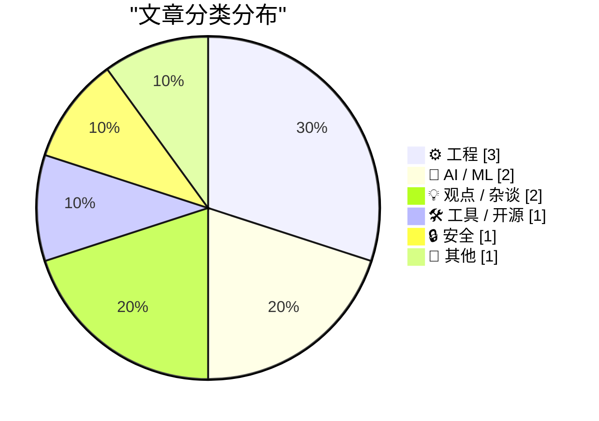
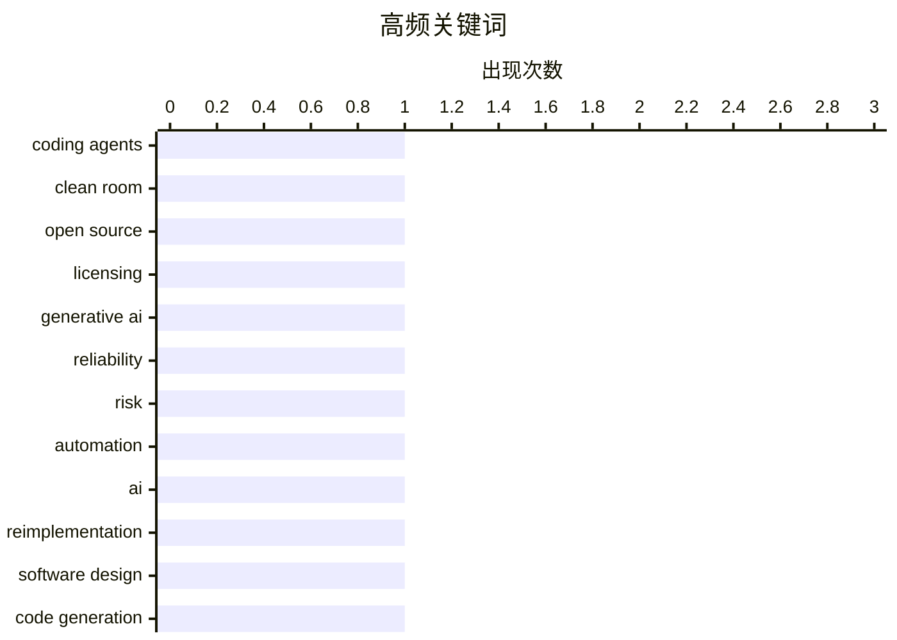

# 📰 AI 博客每日精选 — 2026-03-06

> 来自 Karpathy 推荐的 92 个顶级技术博客，AI 精选 Top 10

## 📝 今日看点

今天的技术讨论集中在两条主线上：一是 AI 代码生成与重写带来的身份与授权边界问题，洁净室模式与“忒修斯之船”式重实现引发新的法律与项目归属争议。二是生成式 AI 在高风险场景的可靠性与责任缺位被再次敲响警钟，税务与医疗等领域强调可解释、可审计而非概率拼接。工程实践层面则关注构建与系统机制的“隐形规则”，从包管理器的魔法文件到 Windows 消息派发时序，体现了基础设施细节对行为的决定性影响。工具生态继续探索更统一的交互体验，把复杂版本控制操作抽象到 LSP 级别，试图跨编辑器复用能力。

---

## 🏆 今日必读

🥇 **编码代理能否通过“洁净室”实现重新许可开源代码？**

[Can coding agents relicense open source through a “clean room” implementation of code?](https://simonwillison.net/2026/Mar/5/chardet/#atom-everything) — simonwillison.net · 6 小时前 · ⚙️ 工程

> 核心问题是编码代理生成的“洁净室”式实现是否会改变开源代码的许可边界与法律风险。文章回顾了 Compaq 1982 年通过双团队隔离逆向 IBM BIOS 的经典洁净室案例，说明其关键在于规格与实现团队的严格隔离。作者指出如今的编码代理可以从测试、接口描述或自然语言需求生成全新实现，形成“功能等价但路径不同”的代码。以 chardet 等项目为例，新的实现可能不含原代码，却在行为上兼容，模糊了许可与衍生作品的界限。结论是：技术上可行不等于法律上安全，必须重新审视“洁净室”在 AI 时代的合规标准。

💡 **为什么值得读**: 它把 AI 代码生成与开源许可的灰色地带讲清楚，适合需要评估合规风险的开发者阅读。

🏷️ coding agents, clean room, open source, licensing

🥈 **别让生成式 AI 报税，更别把人命交给它**

[Don’t trust Generative AI to do your taxes — and don’t trust it with people’s lives](https://garymarcus.substack.com/p/dont-trust-generative-ai-to-do-your) — garymarcus.substack.com · 5 小时前 · 🤖 AI / ML

> 主题是生成式 AI 在高风险任务上的不可靠性。作者指出聊天机器人基于概率生成而非可验证推理，天然容易编造与遗漏关键细节。税务与医疗等领域需要可解释、可审计与责任明确的输出，而现有模型缺乏这些机制。即便给出正确答案，也可能无法稳定复现或给出可靠依据，导致系统性风险。结论是：生成式 AI 适合辅助而非替代关键决策，特别是涉及法律与生命安全的场景。

💡 **为什么值得读**: 文章把“模型机制导致的不可靠性”说透，比单纯警告更有说服力。

🏷️ generative AI, reliability, risk, automation

🥉 **AI 与忒修斯之船：当代码被重新实现**

[AI And The Ship of Theseus](https://lucumr.pocoo.org/2026/3/5/theseus/) — lucumr.pocoo.org · 23 小时前 · 🤖 AI / ML

> 核心议题是 AI 重新实现代码后“还是不是同一项目”。作者讲到 AI 把库移植到另一语言时选择了不同设计，但通过测试套件保持功能等价。chardet 的案例中，新维护者从零重写，接口与行为延续但实现完全不同。测试驱动让替代实现更容易出现，也让“身份”变得模糊：是同一库的延续还是新项目？结论是：随着实现成本降低，功能等价与实现身份的分离将成为常态。

💡 **为什么值得读**: 它用测试驱动与重写案例解释“同一性”问题，能帮你理解开源维护的新现实。

🏷️ AI, reimplementation, software design, code generation

---

## 📊 数据概览

| 扫描源 | 抓取文章 | 时间范围 | 精选 |
|:---:|:---:|:---:|:---:|
| 89/92 | 2511 篇 → 10 篇 | 24h | **10 篇** |

### 分类分布



### 高频关键词



<details>
<summary>📈 纯文本关键词图（终端友好）</summary>

```
coding agents    │ ████████████████████ 1
clean room       │ ████████████████████ 1
open source      │ ████████████████████ 1
licensing        │ ████████████████████ 1
generative ai    │ ████████████████████ 1
reliability      │ ████████████████████ 1
risk             │ ████████████████████ 1
automation       │ ████████████████████ 1
ai               │ ████████████████████ 1
reimplementation │ ████████████████████ 1
```

</details>

### 🏷️ 话题标签

**coding agents**(1) · **clean room**(1) · **open source**(1) · licensing(1) · generative ai(1) · reliability(1) · risk(1) · automation(1) · ai(1) · reimplementation(1) · software design(1) · code generation(1) · package manager(1) · configuration(1) · build tooling(1) · dependency management(1) · windows(1) · message loop(1) · debugging(1) · win32(1)

---

## ⚙️ 工程

### 1. 编码代理能否通过“洁净室”实现重新许可开源代码？

[Can coding agents relicense open source through a “clean room” implementation of code?](https://simonwillison.net/2026/Mar/5/chardet/#atom-everything) — **simonwillison.net** · 6 小时前 · ⭐ 24/30

> 核心问题是编码代理生成的“洁净室”式实现是否会改变开源代码的许可边界与法律风险。文章回顾了 Compaq 1982 年通过双团队隔离逆向 IBM BIOS 的经典洁净室案例，说明其关键在于规格与实现团队的严格隔离。作者指出如今的编码代理可以从测试、接口描述或自然语言需求生成全新实现，形成“功能等价但路径不同”的代码。以 chardet 等项目为例，新的实现可能不含原代码，却在行为上兼容，模糊了许可与衍生作品的界限。结论是：技术上可行不等于法律上安全，必须重新审视“洁净室”在 AI 时代的合规标准。

🏷️ coding agents, clean room, open source, licensing

---

### 2. 包管理器的魔法文件清单

[Package Manager Magic Files](https://nesbitt.io/2026/03/05/package-manager-magic-files.html) — **nesbitt.io** · 13 小时前 · ⭐ 20/30

> 主题是各生态系统里决定构建与发布行为的“魔法文件”。文章列举 .npmrc、MANIFEST.in、Directory.Packages.props、.pnpmfile.cjs 等配置文件，并说明它们如何影响依赖解析、打包内容与构建流程。不同语言与包管理器对默认行为的约定各异，常因忽略这些文件导致版本漂移或发布缺失。作者强调理解这些文件比记命令更关键，因为它们定义了项目的真实构建语义。结论是：掌握“魔法文件”是跨生态稳定交付的基础能力。

🏷️ package manager, configuration, build tooling, dependency management

---

### 3. 已发布消息为何在进入主消息循环前就被分发？

[The mystery of the posted message that was dispatched before reaching the main message loop](https://devblogs.microsoft.com/oldnewthing/20260305-00/?p=112114) — **devblogs.microsoft.com/oldnewthing** · 8 小时前 · ⭐ 19/30

> 核心问题是 Windows 消息机制中“已 post 的消息为何先被派发”。文章解释了消息可能被提前 dispatch 的原因，重点在于调用方自身可能触发了派发路径。作者以具体 API 行为为线索，说明消息队列与主消息循环并非唯一分发入口。若程序在特定时机主动处理队列，会让“消息未进主循环就被处理”的现象出现。结论是：这不是系统异常，而是应用自身的调度逻辑导致的正常结果。

🏷️ Windows, message loop, debugging, Win32

---

## 🤖 AI / ML

### 4. 别让生成式 AI 报税，更别把人命交给它

[Don’t trust Generative AI to do your taxes — and don’t trust it with people’s lives](https://garymarcus.substack.com/p/dont-trust-generative-ai-to-do-your) — **garymarcus.substack.com** · 5 小时前 · ⭐ 22/30

> 主题是生成式 AI 在高风险任务上的不可靠性。作者指出聊天机器人基于概率生成而非可验证推理，天然容易编造与遗漏关键细节。税务与医疗等领域需要可解释、可审计与责任明确的输出，而现有模型缺乏这些机制。即便给出正确答案，也可能无法稳定复现或给出可靠依据，导致系统性风险。结论是：生成式 AI 适合辅助而非替代关键决策，特别是涉及法律与生命安全的场景。

🏷️ generative AI, reliability, risk, automation

---

### 5. AI 与忒修斯之船：当代码被重新实现

[AI And The Ship of Theseus](https://lucumr.pocoo.org/2026/3/5/theseus/) — **lucumr.pocoo.org** · 23 小时前 · ⭐ 21/30

> 核心议题是 AI 重新实现代码后“还是不是同一项目”。作者讲到 AI 把库移植到另一语言时选择了不同设计，但通过测试套件保持功能等价。chardet 的案例中，新维护者从零重写，接口与行为延续但实现完全不同。测试驱动让替代实现更容易出现，也让“身份”变得模糊：是同一库的延续还是新项目？结论是：随着实现成本降低，功能等价与实现身份的分离将成为常态。

🏷️ AI, reimplementation, software design, code generation

---

## 💡 观点 / 杂谈

### 6. 乔布斯 2007：苹果追求 PC 市场份额？“我们不能出垃圾”

[Steve Jobs in 2007, on Apple’s Pursuit of PC Market Share: ‘We Just Can’t Ship Junk’](https://www.youtube.com/watch?v=U37Ds3RvyoM) — **daringfireball.net** · 3 小时前 · ⭐ 13/30

> 主题是 2007 年乔布斯关于市场份额的公开态度。文章回顾当年 iMac、iLife ’08、iWork ’08 发布后的媒体问答场景。面对“是否目标超越 PC 市场份额”的提问，乔布斯强调不愿为份额牺牲品质。现场还有库克与施乐作为旁证，体现苹果当时的产品与品牌策略。结论是：苹果宁愿慢增长，也不以妥协质量换规模。

🏷️ Apple, Steve Jobs, product quality

---

### 7. Pluralistic：火炬烤青蛙（2026-03-05）

[Pluralistic: Blowtorching the frog (05 Mar 2026) executive-dysfunction](https://pluralistic.net/2026/03/05/executive-dysfunction/) — **pluralistic.net** · 3 小时前 · ⭐ 10/30

> 本期是作者的链接合集与评论，主题涵盖政治、文化与科技杂谈。内容包括美国威权主义、教育课程之争（代数 II vs. 统计公民课）、TSA 行李限制、Banksy 与俄国涂鸦、以及“持续劣化”的平台现象。文章还列出近期与即将到来的公开活动与演讲信息。整体风格为时评+资源汇总，强调“缓慢但持续的制度性退化”。结论是：这是一次跨领域的批判性观察快照。

🏷️ policy, society, commentary

---

## 🛠 工具 / 开源

### 8. JJ LSP 后续：用 LSP 打造 Magit 风格 UX

[JJ LSP Follow Up](https://matklad.github.io/2026/03/05/jj-lsp-followup.html) — **matklad.github.io** · 23 小时前 · ⭐ 19/30

> 主题是将 Magit 式交互体验引入 jj 的 LSP 实现。作者回顾了 Majjit LSP 的设想，提出用 LSP 协议统一承载复杂 Git 类交互。相比传统命令行或 UI 插件，各编辑器可复用同一语义层来实现一致操作体验。文章聚焦如何把 jj 的操作模型映射到 LSP 的请求/响应上。结论是：LSP 可以成为版本控制工具交互层的通用载体。

🏷️ LSP, jj, UX, developer tools

---

## 🔒 安全

### 9. 回忆米开朗基罗病毒

[Remembering the Michelangelo virus](https://dfarq.homeip.net/remembering-michelangelo/?utm_source=rss&#038;utm_medium=rss&#038;utm_campaign=remembering-michelangelo) — **dfarq.homeip.net** · 11 小时前 · ⭐ 14/30

> 核心内容是回顾 1992 年的 Michelangelo 病毒事件。该病毒被设定在 3 月 6 日覆盖硬盘前 100 个扇区，虽不如全盘格式化破坏性强，但对当时用户足以致命。文章解释了它的触发方式与当年的媒体恐慌，以及对公众安全意识的影响。作者强调这类定时破坏型病毒在早期 PC 时代具有象征意义。结论是：它是计算机安全史上一次值得记住的集体警示。

🏷️ virus, malware history, Michelangelo, legacy systems

---

## 📝 其他

### 10. 书评：《Katabasis》— R. F. Kuang ★★★★⯪

[Book Review: Katabasis by R. F. Kuang ★★★★⯪](https://shkspr.mobi/blog/2026/03/book-review-katabasis-by-r-f-kuang/) — **shkspr.mobi** · 10 小时前 · ⭐ 9/30

> 核心是对 R. F. Kuang 新作《Katabasis》的评价。故事设定为导师去世、主角必须下地狱救回导师才能毕业，兼具黑色幽默与学术讽刺。作者认为这是 Kuang 首部“真正好笑”的作品，同时延续了《Babel》的锋利批判。书中的大学创伤与心理压力被转化为叙事动力。结论是：这是一本既好笑又沉重的高质量作品，值得推荐。

🏷️ book review, fiction, R F Kuang

---

*生成于 2026-03-06 23:02 | 扫描 89 源 → 获取 2511 篇 → 精选 10 篇*
*基于 [Hacker News Popularity Contest 2025](https://refactoringenglish.com/tools/hn-popularity/) RSS 源列表*
