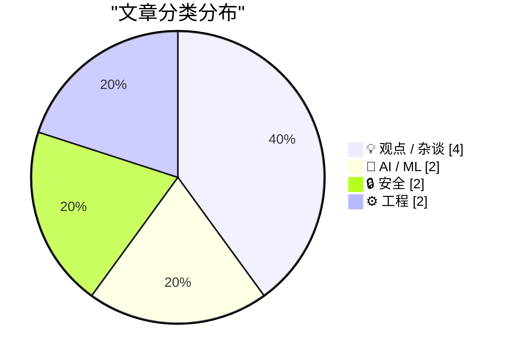
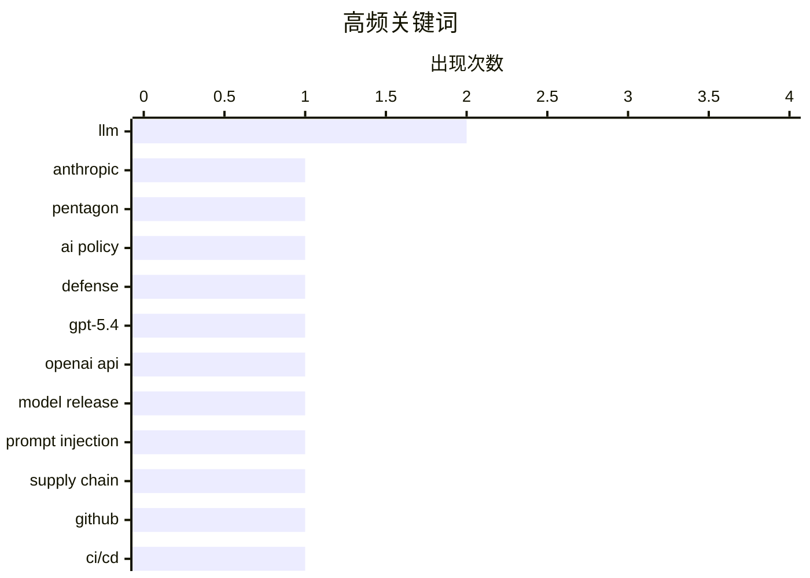

# 📰 AI 博客每日精选 — 2026-03-07

> 来自 Karpathy 推荐的 92 个顶级技术博客，AI 精选 Top 10

## 📝 今日看点

今天的技术焦点集中在三条主线：一是大模型能力持续迭代并加速走向“代理化”，从自动化测试到更多软件流程都在被重塑。二是AI与安全的对抗明显升温，提示注入这类“人机流程漏洞”开始威胁供应链，同时移动端高强度利用链也在抬头。三是科技产业的权力博弈与监管讨论仍在发酵，从平台规则之争到国防合作议题，技术进步正更直接地牵动商业与社会边界。

---

## 🏆 今日必读

🥇 **Anthropic and the Pentagon**

[Anthropic and the Pentagon](https://simonwillison.net/2026/Mar/6/anthropic-and-the-pentagon/#atom-everything) — simonwillison.net · 5 小时前 · 💡 观点 / 杂谈

> Anthropic and the Pentagon

🏷️ Anthropic, Pentagon, AI policy, defense

🥈 **Introducing GPT‑5.4**

[Introducing GPT‑5.4](https://simonwillison.net/2026/Mar/5/introducing-gpt54/#atom-everything) — simonwillison.net · 23 小时前 · 🤖 AI / ML

> Introducing GPT‑5.4

🏷️ GPT-5.4, OpenAI API, LLM, model release

🥉 **Clinejection — Compromising Cline's Production Releases just by Prompting an Issue Triager**

[Clinejection — Compromising Cline's Production Releases just by Prompting an Issue Triager](https://simonwillison.net/2026/Mar/6/clinejection/#atom-everything) — simonwillison.net · 20 小时前 · 🔒 安全

> Clinejection — Compromising Cline's Production Releases just by Prompting an Issue Triager

🏷️ prompt injection, supply chain, GitHub, CI/CD

---

## 📊 数据概览

| 扫描源 | 抓取文章 | 时间范围 | 精选 |
|:---:|:---:|:---:|:---:|
| 88/92 | 2293 篇 → 27 篇 | 24h | **10 篇** |

### 分类分布



### 高频关键词



<details>
<summary>📈 纯文本关键词图（终端友好）</summary>

```
llm              │ ████████████████████ 2
anthropic        │ ██████████░░░░░░░░░░ 1
pentagon         │ ██████████░░░░░░░░░░ 1
ai policy        │ ██████████░░░░░░░░░░ 1
defense          │ ██████████░░░░░░░░░░ 1
gpt-5.4          │ ██████████░░░░░░░░░░ 1
openai api       │ ██████████░░░░░░░░░░ 1
model release    │ ██████████░░░░░░░░░░ 1
prompt injection │ ██████████░░░░░░░░░░ 1
supply chain     │ ██████████░░░░░░░░░░ 1
```

</details>

### 🏷️ 话题标签

**llm**(2) · **anthropic**(1) · **pentagon**(1) · ai policy(1) · defense(1) · gpt-5.4(1) · openai api(1) · model release(1) · prompt injection(1) · supply chain(1) · github(1) · ci/cd(1) · ios(1) · exploit kit(1) · threat intelligence(1) · zero-day(1) · antitrust(1) · app-store(1) · epic-google(1) · mobile(1)

---

## 💡 观点 / 杂谈

### 1. Anthropic and the Pentagon

[Anthropic and the Pentagon](https://simonwillison.net/2026/Mar/6/anthropic-and-the-pentagon/#atom-everything) — **simonwillison.net** · 5 小时前 · ⭐ 27/30

> Anthropic and the Pentagon

🏷️ Anthropic, Pentagon, AI policy, defense

---

### 2. The Verge Interviews Tim Sweeney After Victory in ‘Epic v. Google’

[The Verge Interviews Tim Sweeney After Victory in ‘Epic v. Google’](https://www.theverge.com/23996474/epic-tim-sweeney-interview-win-google-antitrust-lawsuit-district-court) — **daringfireball.net** · 4 小时前 · ⭐ 24/30

> The Verge Interviews Tim Sweeney After Victory in ‘Epic v. Google’

🏷️ antitrust, app-store, Epic-Google, mobile

---

### 3. I don't know if my job will still exist in ten years

[I don't know if my job will still exist in ten years](https://seangoedecke.com/will-my-job-still-exist/) — **seangoedecke.com** · 23 小时前 · ⭐ 23/30

> I don't know if my job will still exist in ten years

🏷️ career, AI, software engineering, job market

---

### 4. Tim Sweeney Signed Away His Right to Criticize Google’s Play Store Until 2032

[Tim Sweeney Signed Away His Right to Criticize Google’s Play Store Until 2032](https://www.theverge.com/news/889595/tim-sweeney-signed-away-his-right-to-criticize-google-until-2032) — **daringfireball.net** · 5 小时前 · ⭐ 23/30

> Tim Sweeney Signed Away His Right to Criticize Google’s Play Store Until 2032

🏷️ settlement, Play-Store, gag-order, Epic

---

## 🤖 AI / ML

### 5. Introducing GPT‑5.4

[Introducing GPT‑5.4](https://simonwillison.net/2026/Mar/5/introducing-gpt54/#atom-everything) — **simonwillison.net** · 23 小时前 · ⭐ 27/30

> Introducing GPT‑5.4

🏷️ GPT-5.4, OpenAI API, LLM, model release

---

### 6. Agentic manual testing

[Agentic manual testing](https://simonwillison.net/guides/agentic-engineering-patterns/agentic-manual-testing/#atom-everything) — **simonwillison.net** · 17 小时前 · ⭐ 23/30

> Agentic manual testing

🏷️ agentic, LLM, testing, automation

---

## 🔒 安全

### 7. Clinejection — Compromising Cline's Production Releases just by Prompting an Issue Triager

[Clinejection — Compromising Cline's Production Releases just by Prompting an Issue Triager](https://simonwillison.net/2026/Mar/6/clinejection/#atom-everything) — **simonwillison.net** · 20 小时前 · ⭐ 26/30

> Clinejection — Compromising Cline's Production Releases just by Prompting an Issue Triager

🏷️ prompt injection, supply chain, GitHub, CI/CD

---

### 8. Google’s Threat Intelligence Group on Coruna a Powerful iOS Exploit Kit of Mysterious Origin

[Google’s Threat Intelligence Group on Coruna a Powerful iOS Exploit Kit of Mysterious Origin](https://cloud.google.com/blog/topics/threat-intelligence/coruna-powerful-ios-exploit-kit) — **daringfireball.net** · 2 小时前 · ⭐ 25/30

> Google’s Threat Intelligence Group on Coruna a Powerful iOS Exploit Kit of Mysterious Origin

🏷️ iOS, exploit kit, threat intelligence, zero-day

---

## ⚙️ 工程

### 9. How to Host your Own Email Server

[How to Host your Own Email Server](https://blog.miguelgrinberg.com/post/how-to-host-your-own-email-server) — **miguelgrinberg.com** · 6 小时前 · ⭐ 22/30

> How to Host your Own Email Server

🏷️ email, SMTP, DKIM, self-hosting

---

### 10. When Read­Directory­ChangesW reports that a deletion occurred, how can I learn more about the deleted thing?

[When Read­Directory­ChangesW reports that a deletion occurred, how can I learn more about the deleted thing?](https://devblogs.microsoft.com/oldnewthing/20260306-00/?p=112116) — **devblogs.microsoft.com/oldnewthing** · 8 小时前 · ⭐ 21/30

> When Read­Directory­ChangesW reports that a deletion occurred, how can I learn more about the deleted thing?

🏷️ Windows, Win32, filesystem, ReadDirectoryChangesW

---

*生成于 2026-03-07 23:05 | 扫描 88 源 → 获取 2293 篇 → 精选 10 篇*
*基于 [Hacker News Popularity Contest 2025](https://refactoringenglish.com/tools/hn-popularity/) RSS 源列表*
