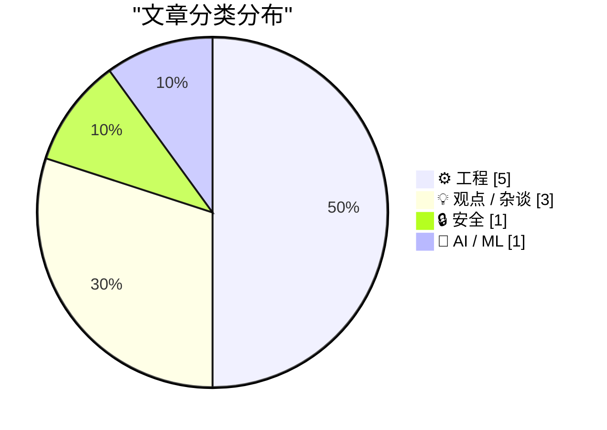
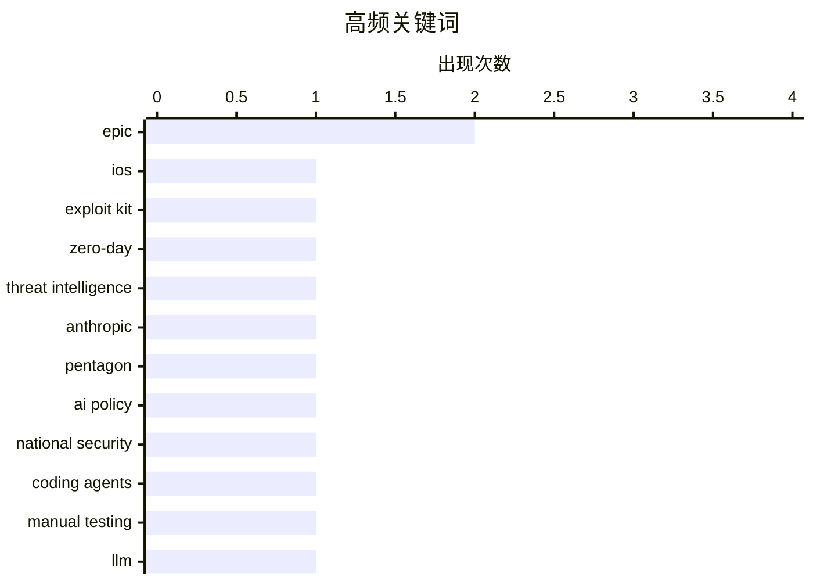

# 📰 AI 博客每日精选 — 2026-03-07

> 来自 Karpathy 推荐的 92 个顶级技术博客，AI 精选 Top 10

## 📝 今日看点

今天技术圈的焦点，正从“功能创新”转向“底层控制权”之争：一边是持续多年未被察觉的 iOS 高强度利用工具包曝光，提醒人们移动安全与供应链防御仍存在深层脆弱点；另一边，AI 公司与国防体系的合作加速，显示大模型竞争正从产品赛道升级为国家战略与产业分层的博弈。与此同时，工程实践也在回归现实主义——无论是代理式测试、遗留系统审计，还是自建邮件与基础设施折腾，核心都指向一个共识：技术价值不只在“能做什么”，更在“是否可验证、可掌控、可长期运行”。平台治理与生态控制同样升温，从应用商店反垄断到去中心化社区再评价，行业正在重新审视“谁拥有入口、谁定义规则”。

---

## 🏆 今日必读

🥇 **Google 威胁情报团队披露：来源神秘的强大 iOS 利用工具包 Coruna**

[Google’s Threat Intelligence Group on Coruna a Powerful iOS Exploit Kit of Mysterious Origin](https://cloud.google.com/blog/topics/threat-intelligence/coruna-powerful-ios-exploit-kit) — daringfireball.net · 6 小时前 · 🔒 安全

> 一套名为“Coruna”的高强度 iOS 利用工具包，暴露出 2019 年 9 月发布的 iOS 13.0 到 2023 年 12 月发布的 iOS 17.2.1 之间，苹果 iPhone 长时间存在可被系统化利用的攻击面。Google Threat Intelligence Group 识别出该工具包包含 5 条完整 iOS 攻击链、共 23 个漏洞利用，核心价值不在单点 0day，而在于覆盖面完整、组件化程度高，足以支撑稳定实战攻击。它表明攻击者不仅掌握内核、沙箱逃逸等关键环节，还具备把多代系统漏洞串联成“可运营武器库”的工程能力。对防御方而言，这类 exploit kit 的危险在于可复用、可组合、可迁移，意味着补丁管理和版本滞后会被持续放大。结论是，Coruna 不是零散漏洞集合，而是接近工业级的 iOS 攻击平台，反映出高端移动端攻防已进入体系化阶段。

💡 **为什么值得读**: 值得读，因为它把“单个 iPhone 漏洞”提升到“整套工业化利用平台”的层面，能帮助你重新评估 iOS 安全边界、补丁时效和高端攻击者能力。

🏷️ iOS, exploit kit, zero-day, threat intelligence

🥈 **Anthropic 与五角大楼**

[Anthropic and the Pentagon](https://simonwillison.net/2026/Mar/6/anthropic-and-the-pentagon/#atom-everything) — simonwillison.net · 9 小时前 · 🤖 AI / ML

> OpenAI、Anthropic 与五角大楼之间的合作，不应只被理解为单一商业合同，而是 AI 模型商品化之后的战略分层竞争。Bruce Schneier 和 Nathan E. Sanders 的核心判断是，顶级模型在性能上正快速趋同，真正的差异化越来越来自访问权、部署环境、合规资质和政府关系，而不是纯模型指标。随着前沿模型能力逐渐变成“可替代资源”，国防与安全场景会把供应链可信度、控制权和组织绑定推到比 benchmark 更重要的位置。这个框架也解释了为什么 Pentagon/OpenAI/Anthropic 的合作争议，本质上是产业结构与国家权力如何共同塑造 AI 市场。结论是，未来 AI 竞争的胜负手未必是模型本身最强，而是谁更深地嵌入制度、基础设施与国家级采购体系。

💡 **为什么值得读**: 值得读，因为它把热闹的 AI 军工合作新闻，上升成“模型商品化之后谁掌握分发与权力入口”的结构性分析。

🏷️ Anthropic, Pentagon, AI policy, national security

🥉 **代理式手动测试**

[Agentic manual testing](https://simonwillison.net/guides/agentic-engineering-patterns/agentic-manual-testing/#atom-everything) — simonwillison.net · 21 小时前 · ⚙️ 工程

> 编码代理真正区别于只会生成代码的 LLM，在于它能执行自己写出的代码，并通过运行结果验证正确性。核心原则是“永远不要假设 LLM 生成的代码能工作，除非它已经被执行过”，因此测试不再是事后补充，而是代理工作流的中心环节。文章强调，代理式工程的价值来自快速生成—运行—观察—修正的闭环，其中手动测试依然关键，因为很多真实行为、界面细节和边界条件无法仅靠静态推断保证。相比只输出代码片段的模型，能调用工具、跑程序、检查反馈的 agent 才更接近可靠的软件协作者。结论是，执行与验证能力不是附加功能，而是 coding agent 从“会写”走向“能交付”的决定性门槛。

💡 **为什么值得读**: 值得读，因为它准确点破了 coding agent 的核心护城河不是“生成代码”，而是“能运行并验证代码”。

🏷️ coding agents, manual testing, LLM, agentic workflows

---

## 📊 数据概览

| 扫描源 | 抓取文章 | 时间范围 | 精选 |
|:---:|:---:|:---:|:---:|
| 88/92 | 2492 篇 → 22 篇 | 24h | **10 篇** |

### 分类分布



### 高频关键词



<details>
<summary>📈 纯文本关键词图（终端友好）</summary>

```
epic                │ ████████████████████ 2
ios                 │ ██████████░░░░░░░░░░ 1
exploit kit         │ ██████████░░░░░░░░░░ 1
zero-day            │ ██████████░░░░░░░░░░ 1
threat intelligence │ ██████████░░░░░░░░░░ 1
anthropic           │ ██████████░░░░░░░░░░ 1
pentagon            │ ██████████░░░░░░░░░░ 1
ai policy           │ ██████████░░░░░░░░░░ 1
national security   │ ██████████░░░░░░░░░░ 1
coding agents       │ ██████████░░░░░░░░░░ 1
```

</details>

### 🏷️ 话题标签

**epic**(2) · **ios**(1) · **exploit kit**(1) · zero-day(1) · threat intelligence(1) · anthropic(1) · pentagon(1) · ai policy(1) · national security(1) · coding agents(1) · manual testing(1) · llm(1) · agentic workflows(1) · rails(1) · legacy code(1) · code audit(1) · technical debt(1) · google(1) · antitrust(1) · app stores(1)

---

## ⚙️ 工程

### 1. 代理式手动测试

[Agentic manual testing](https://simonwillison.net/guides/agentic-engineering-patterns/agentic-manual-testing/#atom-everything) — **simonwillison.net** · 21 小时前 · ⭐ 25/30

> 编码代理真正区别于只会生成代码的 LLM，在于它能执行自己写出的代码，并通过运行结果验证正确性。核心原则是“永远不要假设 LLM 生成的代码能工作，除非它已经被执行过”，因此测试不再是事后补充，而是代理工作流的中心环节。文章强调，代理式工程的价值来自快速生成—运行—观察—修正的闭环，其中手动测试依然关键，因为很多真实行为、界面细节和边界条件无法仅靠静态推断保证。相比只输出代码片段的模型，能调用工具、跑程序、检查反馈的 agent 才更接近可靠的软件协作者。结论是，执行与验证能力不是附加功能，而是 coding agent 从“会写”走向“能交付”的决定性门槛。

🏷️ coding agents, manual testing, LLM, agentic workflows

---

### 2. 引用 Ally Piechowski

[Quoting Ally Piechowski](https://simonwillison.net/2026/Mar/6/ally-piechowski/#atom-everything) — **simonwillison.net** · 4 小时前 · ⭐ 22/30

> 审计遗留 Rails 代码库时，最有价值的信息往往不是来自代码本身，而是来自团队对风险、交付和故障的真实感受。Ally Piechowski 给出的提问非常具体：问开发者“最不敢碰的区域”“上次周五发版是什么时候”“过去 90 天哪些生产事故没被测试捕获”，问 CTO/EM“哪个功能被卡了一年以上”“是否有实时错误可见性”等，用组织行为反推系统脆弱点。这样的访谈能快速识别测试盲区、部署恐惧、长期阻塞和监控缺口，比单纯看仓库结构更容易发现技术债的业务后果。它强调遗留系统评估是技术问题，也是信任、流程和反馈机制的问题。结论是，想看清旧系统的真实健康状况，先问团队害怕什么、看不见什么、一直做不成什么。

🏷️ Rails, legacy code, code audit, technical debt

---

### 3. 当 ReadDirectoryChangesW 报告发生删除时，如何了解被删除对象的更多信息？

[When Read­Directory­ChangesW reports that a deletion occurred, how can I learn more about the deleted thing?](https://devblogs.microsoft.com/oldnewthing/20260306-00/?p=112116) — **devblogs.microsoft.com/oldnewthing** · 11 小时前 · ⭐ 21/30

> `ReadDirectoryChangesW` 只会告诉你“删除发生了”，不会在对象已消失后再提供更多关于该文件或目录的元数据。根本原因很直接：对象已经不存在，系统无法从一个已删除实体中再查询名称以外的补充属性，因此如果需要大小、时间戳、类型或自定义上下文，必须在删除前自行记录。实际可行的方案是维护自己的目录缓存或索引，在创建、修改、重命名时同步更新状态，等收到删除通知后再从本地状态中查回细节。这个问题本质上不是 API 用法技巧，而是文件系统事件模型的限制：通知流并不等于对象历史数据库。结论是，删除事件只能做触发器，想知道“删掉的到底是什么”，必须提前记账。

🏷️ Windows, filesystem, ReadDirectoryChangesW, file deletion

---

### 4. 如何托管你自己的邮件服务器

[How to Host your Own Email Server](https://blog.miguelgrinberg.com/post/how-to-host-your-own-email-server) — **miguelgrinberg.com** · 10 小时前 · ⭐ 21/30

> 为了给自建售卖平台发送邮箱验证和密码重置邮件，作者没有继续依赖 Mailgun、SendGrid 这类付费服务，而是选择自己搭建邮件服务器。文章的重点不是“邮件很难做”的泛泛而谈，而是把实际可行路径拆开：如何处理发信基础设施、域名与 DNS 配置，以及让账户相关邮件在现实互联网环境中尽量可靠送达。它直接回应了“自建发信在今天是否仍可行”的问题，给出一条减少第三方依赖、控制成本和数据链路的技术方案。与此同时，这类方案也默认你要承担可达性、信誉和运维复杂度，而不是把问题完全外包。结论是，自建邮件服务器并非不可能，但只有在你愿意接手交付质量和基础设施责任时才真正划算。

🏷️ email, self-hosting, SMTP, infrastructure

---

### 5. PTP 挂钟并不实用，而且精度高得有点过头

[A PTP Wall Clock is impractical and a little too precise](https://www.jeffgeerling.com/blog/2026/ptp-wall-clock-impractical-too-precise/) — **jeffgeerling.com** · 11 小时前 · ⭐ 18/30

> 受 39C3 上 Oliver Ettlin 演示启发，作者尝试复刻一台基于 PTP（Precision Time Protocol，精密时间协议）的挂钟，用来展示高精度时钟同步。实践结果表明，PTP 的技术魅力非常强，但放到墙钟这种日常设备上却显得不太实用，因为它追求的同步精度远超人眼和家庭场景需求。文章的价值在于把“能做”与“值得做”分开：PTP 在工业、实验室或高精度网络环境中意义重大，但在家用可视化时钟里，复杂度、成本与收益并不匹配。这个项目更像一次对精密时钟系统的工程探索，而不是通用产品方案。结论是，PTP 挂钟是个很酷的技术展示，但它证明的恰恰是超高精度在很多消费场景里属于过度设计。

🏷️ PTP, time sync, hardware, clock

---

## 💡 观点 / 杂谈

### 6. The Verge 采访 Tim Sweeney：赢下“Epic 诉 Google”之后

[The Verge Interviews Tim Sweeney After Victory in ‘Epic v. Google’](https://www.theverge.com/23996474/epic-tim-sweeney-interview-win-google-antitrust-lawsuit-district-court) — **daringfireball.net** · 8 小时前 · ⭐ 22/30

> Tim Sweeney 将针对 Apple 与 Google 的反垄断案件差异概括为“Apple 是冰，Google 是火”，核心在于两家公司维持平台控制力的手段完全不同。按他的说法，Apple 更多依靠 App Store、支付体系以及对开发者、OEM 和运营商的一致性合同，把限制内化为封闭平台规则；Google 则为了巩固 Android 生态中的分发优势，采取对外付费、拉拢游戏开发者等更主动的市场操作。这个对比暗示，尽管两家都面临平台垄断指控，但案件证据结构、行为模式和司法说服路径并不相同。采访也让外界更容易理解为什么 Epic 在两个战场上的叙事和胜负表现会出现分化。结论是，Apple 与 Google 的平台权力都强，但一个更像制度化封闭控制，另一个更像激进的市场操纵。

🏷️ Epic, Google, antitrust, app stores

---

### 7. Tim Sweeney 签字放弃了到 2032 年前批评 Google Play 商店的权利

[Tim Sweeney Signed Away His Right to Criticize Google’s Play Store Until 2032](https://www.theverge.com/news/889595/tim-sweeney-signed-away-his-right-to-criticize-google-until-2032) — **daringfireball.net** · 9 小时前 · ⭐ 21/30

> Epic 与 Google 的和解条款不仅结束了诉讼，还对 Tim Sweeney 未来数年的公开行动设置了实质性限制。根据 The Verge 披露，Sweeney 在 3 月 3 日签署的 binding term sheet 中，放弃了 Epic 就相关条款再次起诉和贬损 Google 的权利，范围覆盖 Google 的应用分发实践、收费方式以及对游戏和应用的待遇。更重要的是，这份协议不仅限制诉讼，还限制他继续倡议推动 Google 应用商店政策变化，而且期限一直延续到 2032 年。这个结果与他长期高调批评平台抽成和分发垄断的公众形象形成强烈反差。结论是，这场看似胜利的法律战，最终也以一份长期“噤声协议”交换了冲突的阶段性结束。

🏷️ Epic, Google Play, settlement, platform policy

---

### 8. 天哪，我之前对联邦宇宙的看法错了

[Boy I was wrong about the Fediverse](https://matduggan.com/boy-i-was-wrong-about-the-fediverse/) — **matduggan.com** · 14 小时前 · ⭐ 19/30

> 作者重新评价 Fediverse，不再把它视为小众理想主义社区，而是承认自己此前低估了它的实际价值。因为他本就不是“线上社区优先”的用户，也不是靠在 Twitter 上与陌生人互动获得乐趣的人，所以这种转变更说明问题不在社交成瘾，而在平台结构本身。文章的核心转向通常来自一种体验上的发现：去中心化网络不必依赖单一平台规则和算法分发，也能承载真实关系、稳定交流与更健康的在线存在方式。与传统大平台相比，Fediverse 的吸引力不一定是规模或娱乐性，而是控制权、社区质感与长期可持续性。结论是，即使不是重度社交媒体用户，也可能在 Fediverse 中发现比中心化平台更合适的网络生活方式。

🏷️ Fediverse, social media, online communities, decentralization

---

## 🔒 安全

### 9. Google 威胁情报团队披露：来源神秘的强大 iOS 利用工具包 Coruna

[Google’s Threat Intelligence Group on Coruna a Powerful iOS Exploit Kit of Mysterious Origin](https://cloud.google.com/blog/topics/threat-intelligence/coruna-powerful-ios-exploit-kit) — **daringfireball.net** · 6 小时前 · ⭐ 26/30

> 一套名为“Coruna”的高强度 iOS 利用工具包，暴露出 2019 年 9 月发布的 iOS 13.0 到 2023 年 12 月发布的 iOS 17.2.1 之间，苹果 iPhone 长时间存在可被系统化利用的攻击面。Google Threat Intelligence Group 识别出该工具包包含 5 条完整 iOS 攻击链、共 23 个漏洞利用，核心价值不在单点 0day，而在于覆盖面完整、组件化程度高，足以支撑稳定实战攻击。它表明攻击者不仅掌握内核、沙箱逃逸等关键环节，还具备把多代系统漏洞串联成“可运营武器库”的工程能力。对防御方而言，这类 exploit kit 的危险在于可复用、可组合、可迁移，意味着补丁管理和版本滞后会被持续放大。结论是，Coruna 不是零散漏洞集合，而是接近工业级的 iOS 攻击平台，反映出高端移动端攻防已进入体系化阶段。

🏷️ iOS, exploit kit, zero-day, threat intelligence

---

## 🤖 AI / ML

### 10. Anthropic 与五角大楼

[Anthropic and the Pentagon](https://simonwillison.net/2026/Mar/6/anthropic-and-the-pentagon/#atom-everything) — **simonwillison.net** · 9 小时前 · ⭐ 25/30

> OpenAI、Anthropic 与五角大楼之间的合作，不应只被理解为单一商业合同，而是 AI 模型商品化之后的战略分层竞争。Bruce Schneier 和 Nathan E. Sanders 的核心判断是，顶级模型在性能上正快速趋同，真正的差异化越来越来自访问权、部署环境、合规资质和政府关系，而不是纯模型指标。随着前沿模型能力逐渐变成“可替代资源”，国防与安全场景会把供应链可信度、控制权和组织绑定推到比 benchmark 更重要的位置。这个框架也解释了为什么 Pentagon/OpenAI/Anthropic 的合作争议，本质上是产业结构与国家权力如何共同塑造 AI 市场。结论是，未来 AI 竞争的胜负手未必是模型本身最强，而是谁更深地嵌入制度、基础设施与国家级采购体系。

🏷️ Anthropic, Pentagon, AI policy, national security

---

*生成于 2026-03-07 02:57 | 扫描 88 源 → 获取 2492 篇 → 精选 10 篇*
*基于 [Hacker News Popularity Contest 2025](https://refactoringenglish.com/tools/hn-popularity/) RSS 源列表*
