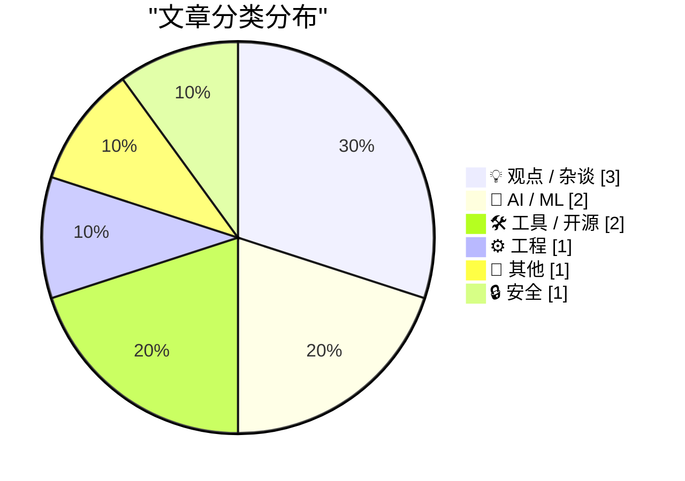
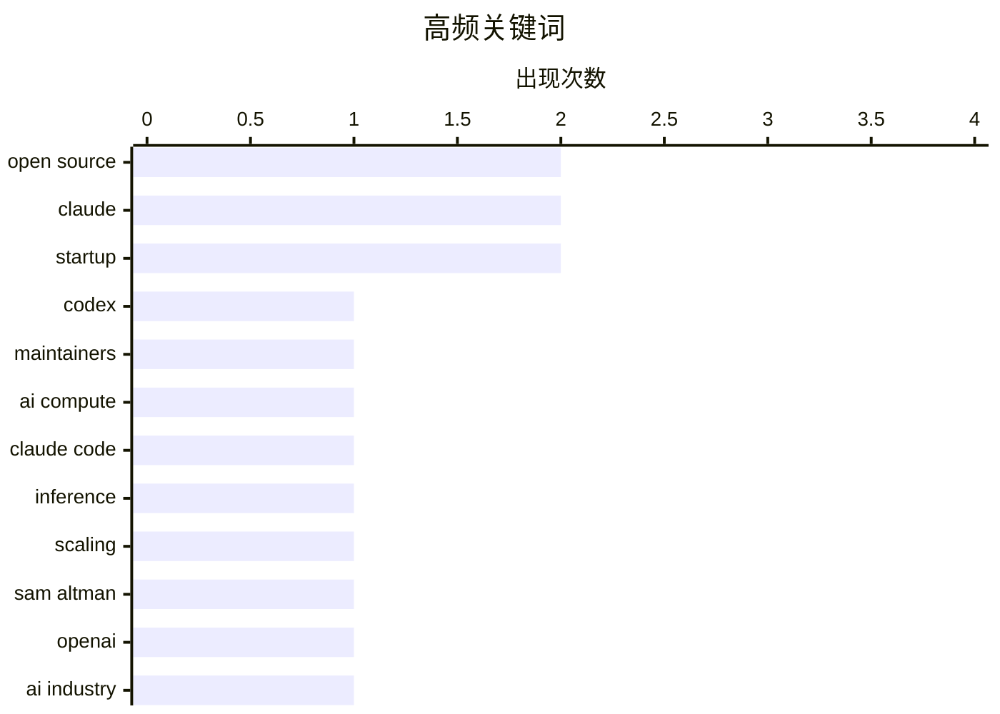

# 📰 AI 博客每日精选 — 2026-03-08

> 来自 Karpathy 推荐的 92 个顶级技术博客，AI 精选 Top 10

## 📝 今日看点

今天技术圈的主线，正在从“AI 能做什么”转向“AI 该如何持续供给、分发与治理”。一边是面向开源维护者的 AI 扶持计划、基金会新工作组等动作，说明大模型能力正加速嵌入开源基础设施；另一边，关于算力紧张、免费层商业模式和平台信誉的讨论升温，暴露出 AI 普及背后的成本压力与治理焦虑。与此同时，开发者工具、个性化阅读和轻量化 Web 体验持续受关注，也反映出技术社区开始重新重视效率、控制权和更可持续的数字生态。

---

## 🏆 今日必读

🥇 **面向开源的 Codex**

[Codex for Open Source](https://simonwillison.net/2026/Mar/7/codex-for-open-source/#atom-everything) — simonwillison.net · 4 小时前 · 🤖 AI / ML

> OpenAI 针对开源项目维护者推出了与 Anthropic 类似的扶持计划：为符合条件的热门开源项目维护者提供 6 个月 ChatGPT Pro 使用资格，定价对标 Claude Max 的 200 美元/月套餐。该计划的核心卖点不只是 ChatGPT Pro 本身，还包含 Codex，以及“有条件的 API 额度”，明显瞄准需要借助 AI 提升维护、审查和开发效率的开源作者群体。时间点上，这一动作紧随 Anthropic 在 2 月 27 日宣布向满足 5,000+ GitHub stars 或 100 万+ NPM 下载量项目维护者赠送 6 个月 Claude Max 之后，形成直接竞争。两家模型公司都在争夺高影响力开源维护者，因为这类用户既是技术意见领袖，也是 AI 编程产品的重要示范人群。作者传递出的关键信号是：面向开源维护者的 AI 补贴战已经开始，OpenAI 正在正面回应 Anthropic 的攻势。

💡 **为什么值得读**: 值得读，因为它抓住了 OpenAI 与 Anthropic 围绕开源维护者展开的最新竞争态势，能帮助你快速判断 AI 编程工具的生态补贴和战略风向。

🏷️ Codex, open source, Claude, maintainers

🥈 **Is the AI Compute Crunch Here?**

[Is the AI Compute Crunch Here?](https://martinalderson.com/posts/is-the-ai-compute-crunch-here/?utm_source=rss&amp;utm_medium=rss&amp;utm_campaign=feed) — martinalderson.com · 23 小时前 · 🤖 AI / ML

> Claude Code has 2-3 million users. That's 1% of knowledge workers. The compute math gets scary from here.

🏷️ AI compute, Claude Code, inference, scaling

🥉 **BREAKING: Sam Altman’s greed and dishonesty are finally catching up to him**

[BREAKING: Sam Altman’s greed and dishonesty are finally catching up to him](https://garymarcus.substack.com/p/breaking-sam-altmans-greed-and-dishonesty) — garymarcus.substack.com · 4 小时前 · 💡 观点 / 杂谈

> It’s about time

🏷️ Sam Altman, OpenAI, AI industry, leadership

---

## 📊 数据概览

| 扫描源 | 抓取文章 | 时间范围 | 精选 |
|:---:|:---:|:---:|:---:|
| 89/92 | 2514 篇 → 12 篇 | 24h | **10 篇** |

### 分类分布



### 高频关键词



<details>
<summary>📈 纯文本关键词图（终端友好）</summary>

```
open source │ ████████████████████ 2
claude      │ ████████████████████ 2
startup     │ ████████████████████ 2
codex       │ ██████████░░░░░░░░░░ 1
maintainers │ ██████████░░░░░░░░░░ 1
ai compute  │ ██████████░░░░░░░░░░ 1
claude code │ ██████████░░░░░░░░░░ 1
inference   │ ██████████░░░░░░░░░░ 1
scaling     │ ██████████░░░░░░░░░░ 1
sam altman  │ ██████████░░░░░░░░░░ 1
```

</details>

### 🏷️ 话题标签

**open source**(2) · **claude**(2) · **startup**(2) · codex(1) · maintainers(1) · ai compute(1) · claude code(1) · inference(1) · scaling(1) · sam altman(1) · openai(1) · ai industry(1) · leadership(1) · cli(1) · authentication(1) · ai agent(1) · working groups(1) · governance(1) · foundation(1) · hacker news(1)

---

## 💡 观点 / 杂谈

### 1. BREAKING: Sam Altman’s greed and dishonesty are finally catching up to him

[BREAKING: Sam Altman’s greed and dishonesty are finally catching up to him](https://garymarcus.substack.com/p/breaking-sam-altmans-greed-and-dishonesty) — **garymarcus.substack.com** · 4 小时前 · ⭐ 21/30

> It’s about time

🏷️ Sam Altman, OpenAI, AI industry, leadership

---

### 2. The Ghost in the Funnel

[The Ghost in the Funnel](https://worksonmymachine.ai/p/the-ghost-in-the-funnel) — **worksonmymachine.substack.com** · 8 小时前 · ⭐ 19/30

> Your Free Tier is Someone Else's Twenty-Minute Side Project

🏷️ free tier, startup, distribution, product

---

### 3. Pluralistic: The web is bearable with RSS (07 Mar 2026)

[Pluralistic: The web is bearable with RSS (07 Mar 2026)](https://pluralistic.net/2026/03/07/reader-mode/) — **pluralistic.net** · 4 小时前 · ⭐ 18/30

> Today's links The web is bearable with RSS: And don't forget "Reader Mode." Hey look at this: Delights to delectate. Object permanence: Eyemodule x Disneyland; Scott Walker lies; Brother's demon-haunt

🏷️ RSS, Reader Mode, web, productivity

---

## 🤖 AI / ML

### 4. 面向开源的 Codex

[Codex for Open Source](https://simonwillison.net/2026/Mar/7/codex-for-open-source/#atom-everything) — **simonwillison.net** · 4 小时前 · ⭐ 26/30

> OpenAI 针对开源项目维护者推出了与 Anthropic 类似的扶持计划：为符合条件的热门开源项目维护者提供 6 个月 ChatGPT Pro 使用资格，定价对标 Claude Max 的 200 美元/月套餐。该计划的核心卖点不只是 ChatGPT Pro 本身，还包含 Codex，以及“有条件的 API 额度”，明显瞄准需要借助 AI 提升维护、审查和开发效率的开源作者群体。时间点上，这一动作紧随 Anthropic 在 2 月 27 日宣布向满足 5,000+ GitHub stars 或 100 万+ NPM 下载量项目维护者赠送 6 个月 Claude Max 之后，形成直接竞争。两家模型公司都在争夺高影响力开源维护者，因为这类用户既是技术意见领袖，也是 AI 编程产品的重要示范人群。作者传递出的关键信号是：面向开源维护者的 AI 补贴战已经开始，OpenAI 正在正面回应 Anthropic 的攻势。

🏷️ Codex, open source, Claude, maintainers

---

### 5. Is the AI Compute Crunch Here?

[Is the AI Compute Crunch Here?](https://martinalderson.com/posts/is-the-ai-compute-crunch-here/?utm_source=rss&amp;utm_medium=rss&amp;utm_campaign=feed) — **martinalderson.com** · 23 小时前 · ⭐ 24/30

> Claude Code has 2-3 million users. That's 1% of knowledge workers. The compute math gets scary from here.

🏷️ AI compute, Claude Code, inference, scaling

---

## 🛠 工具 / 开源

### 6. ‘npx workos’

[‘npx workos’](https://workos.com/docs/authkit/cli-installer?utm_source=tldrdev&amp;utm_medium=newsletter&amp;utm_campaign=q12026) — **daringfireball.net** · 8 分钟前 · ⭐ 20/30

> My thanks, once again, to WorkOS for sponsor this week at DF. npx workos is a CLI tool, replete with cool ASCII art, that launches an AI agent, powered by Claude, that reads your project, detects your

🏷️ CLI, authentication, AI agent, Claude

---

### 7. HN Skins 0.3.0

[HN Skins 0.3.0](https://susam.net/code/news/hnskins/0.3.0.html) — **susam.net** · 23 小时前 · ⭐ 19/30

> HN Skins 0.3.0 is a minor update to HN Skins, a web browser
  userscript that adds custom themes to Hacker News and allows you to
  browse HN with a variety of visual styles. This release includes
  f

🏷️ Hacker News, userscript, themes, browser

---

## ⚙️ 工程

### 8. Announcing New Working Groups

[Announcing New Working Groups](https://nesbitt.io/2026/03/07/announcing-new-working-groups.html) — **nesbitt.io** · 13 小时前 · ⭐ 19/30

> The Open Source Foundations Consortium announces seven new working groups.

🏷️ open source, working groups, governance, foundation

---

## 📝 其他

### 9. Reading List 03/07/2026

[Reading List 03/07/2026](https://www.construction-physics.com/p/reading-list-03072026) — **construction-physics.com** · 9 小时前 · ⭐ 17/30

> Data centers disconnecting from the grid, solar PV efficiency records, repairs for the Strategic Petroleum Reserve, Ford’s EV missteps, former OpenAI CTO’s new startup.

🏷️ data centers, solar, EV, startup

---

## 🔒 安全

### 10. Book Review: The Electronic Criminals by Robert Farr (1975) ★★★⯪☆

[Book Review: The Electronic Criminals by Robert Farr (1975) ★★★⯪☆](https://shkspr.mobi/blog/2026/03/book-review-the-electronic-criminals-by-robert-farr-1975/) — **shkspr.mobi** · 10 小时前 · ⭐ 15/30

> What can a fifty-year-old book teach us about cybersecurity? Written just as computing was beginning to enter the mainstream, The Electronic Criminals takes us into a terrifying new world of crime!  F

🏷️ cybersecurity, history, mainframe, passwords

---

*生成于 2026-03-08 23:01 | 扫描 89 源 → 获取 2514 篇 → 精选 10 篇*
*基于 [Hacker News Popularity Contest 2025](https://refactoringenglish.com/tools/hn-popularity/) RSS 源列表*
