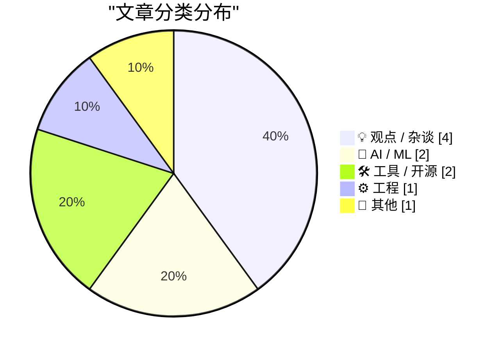
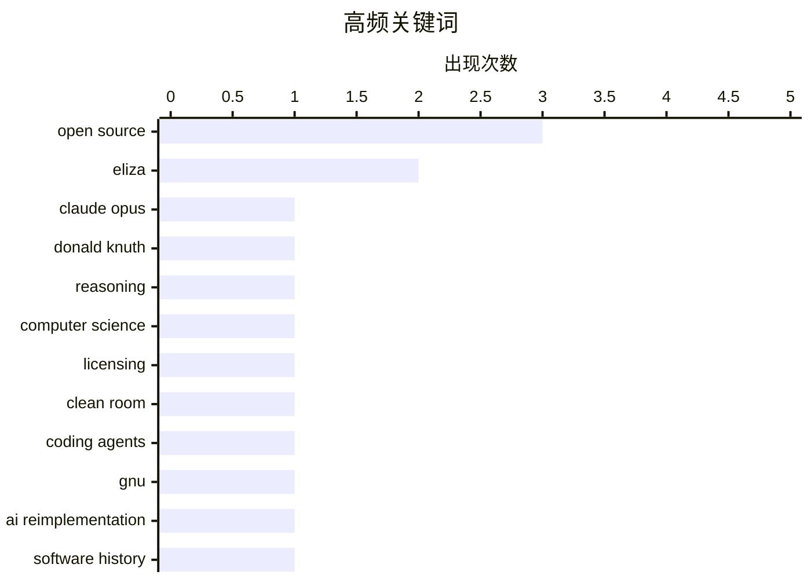

# 📰 AI 博客每日精选 — 2026-03-09

> 来自 Karpathy 推荐的 92 个顶级技术博客，AI 精选 Top 10

## 📝 今日看点

今天技术圈的焦点，集中在“AI 已从辅助走向实质性智力参与”：从前沿模型解答计算机科学难题，到开发者在高压场景下借助生成式工具快速交付，AI 正在逼近研究与工程生产力的核心环节。与此同时，围绕“AI 重写软件”引发的许可、伦理与历史正当性之争明显升温，开源世界开始重新审视“重新实现”这件事在 AI 时代的边界。另一个值得注意的信号是，行业对 AI 的态度正变得更冷静——无论是对商业 AI 权力结构的质疑，还是对 ELIZA 式拟人错觉、伪包管理器和“最小可用工具”的反思，都说明技术圈正在从狂热转向务实。

---

## 🏆 今日必读

🥇 **Donald Knuth 谈 Claude Opus 解出一个计算机科学问题**

[Donald Knuth on Claude Opus Solving a Computer Science Problem](https://www-cs-faculty.stanford.edu/~knuth/papers/claude-cycles.pdf) — daringfireball.net · 5 小时前 · 🤖 AI / ML

> Knuth 记录了自己研究数周的一个开放计算机科学问题，被 Anthropic 在三周前发布的混合推理模型 Claude Opus 4.6 解出的经历。核心信息不只是“模型答对了”，而是它给出了让 Knuth 认可的、漂亮且可验证的解法，这对长期以严谨著称的理论计算机科学语境尤其关键。文章强调，生成式 AI 在某些高难度推理任务上，已经不再只是辅助写作或代码补全工具，而开始触及真正的数学与算法发现。Knuth 也据此公开修正自己对 generative AI 的既有看法，把这次结果视为一次具有标志性的能力跃迁。

💡 **为什么值得读**: 值得读，因为它提供了 Donald Knuth 这样级别的计算机科学家对 Claude Opus 4.6 推理能力的第一手认可，是评估当代 AI 是否开始具备“研究级解题能力”的罕见案例。

🏷️ Claude Opus, Donald Knuth, reasoning, computer science

🥈 **编程代理能否通过“洁净室”代码实现为开源软件重新授权？**

[Can Coding Agents Relicense Open Source Through a ‘Clean Room’ Implementation of Code?](https://simonwillison.net/2026/Mar/5/chardet/) — daringfireball.net · 5 小时前 · 💡 观点 / 杂谈

> 文章围绕 Python 老牌字符编码检测库 chardet 的一次许可变更，讨论 AI 编程代理生成“洁净室实现”后，是否能绕开原有开源许可证的伦理与法律问题。chardet 由 Mark Pilgrim 于 2006 年以 LGPL 发布，Dan Blanchard 自 2012 年 7 月的 1.1 版本起主导后续发布，而最新的 chardet 7.0.0 引发了关于 AI 重写代码与再授权边界的争议。关键问题在于：如果新实现并非逐行复制，而是由模型基于行为与接口“重新生成”，这种产物究竟是原项目的派生作品，还是可按新许可证发布的独立实现。作者没有给出简单定论，而是指出这一案例会把“AI 代码生成 + 开源合规”中的模糊地带推到台前，迫使社区、维护者与法律体系正面回应。

💡 **为什么值得读**: 值得读，因为它抓住了 AI 代码生成时代最实际也最棘手的问题：模型重写代码到底会不会改变开源许可证的约束边界。

🏷️ open source, licensing, clean room, coding agents

🥉 **GNU 与 AI 重新实现**

[GNU and the AI reimplementations](http://antirez.com/news/162) — antirez.com · 6 小时前 · 💡 观点 / 杂谈

> 文章把当下“用 AI 重写现有软件是否公平”的争论，放回 GNU 在 1980 年代到 1990 年代通过重新实现 Unix 工具链所塑造的历史背景中审视。作者认为，很多人今天反对 AI 复刻项目，却忽略了自由软件运动本身就是靠兼容实现、替代实现和行为级复现建立起来的，这说明“重新实现”并不是新现象。关键差别不在于是否重写，而在于训练数据来源、版权边界、社区关系和权力结构：GNU 的重写目标是自由替代，而 AI 重写则可能服务于平台与资本集中。文章最终的立场不是为 AI 重写无条件背书，而是提醒读者不要用失忆式的双重标准看待技术演化，应把争论焦点放在具体权利与制度后果上。

💡 **为什么值得读**: 值得读，因为它用 GNU/Unix 的历史对照，迫使人重新思考“AI 重写代码到底哪里不一样”，比单纯道德谴责更有解释力。

🏷️ GNU, AI reimplementation, open source, software history

---

## 📊 数据概览

| 扫描源 | 抓取文章 | 时间范围 | 精选 |
|:---:|:---:|:---:|:---:|
| 89/92 | 2514 篇 → 13 篇 | 24h | **10 篇** |

### 分类分布



### 高频关键词



<details>
<summary>📈 纯文本关键词图（终端友好）</summary>

```
open source      │ ████████████████████ 3
eliza            │ █████████████░░░░░░░ 2
claude opus      │ ███████░░░░░░░░░░░░░ 1
donald knuth     │ ███████░░░░░░░░░░░░░ 1
reasoning        │ ███████░░░░░░░░░░░░░ 1
computer science │ ███████░░░░░░░░░░░░░ 1
licensing        │ ███████░░░░░░░░░░░░░ 1
clean room       │ ███████░░░░░░░░░░░░░ 1
coding agents    │ ███████░░░░░░░░░░░░░ 1
gnu              │ ███████░░░░░░░░░░░░░ 1
```

</details>

### 🏷️ 话题标签

**open source**(3) · **eliza**(2) · **claude opus**(1) · donald knuth(1) · reasoning(1) · computer science(1) · licensing(1) · clean room(1) · coding agents(1) · gnu(1) · ai reimplementation(1) · software history(1) · commercial ai(1) · ai ethics(1) · sam altman(1) · dario amodei(1) · llm cli(1) · plugin(1) · chatbot(1) · vibe coding(1)

---

## 💡 观点 / 杂谈

### 1. 编程代理能否通过“洁净室”代码实现为开源软件重新授权？

[Can Coding Agents Relicense Open Source Through a ‘Clean Room’ Implementation of Code?](https://simonwillison.net/2026/Mar/5/chardet/) — **daringfireball.net** · 5 小时前 · ⭐ 26/30

> 文章围绕 Python 老牌字符编码检测库 chardet 的一次许可变更，讨论 AI 编程代理生成“洁净室实现”后，是否能绕开原有开源许可证的伦理与法律问题。chardet 由 Mark Pilgrim 于 2006 年以 LGPL 发布，Dan Blanchard 自 2012 年 7 月的 1.1 版本起主导后续发布，而最新的 chardet 7.0.0 引发了关于 AI 重写代码与再授权边界的争议。关键问题在于：如果新实现并非逐行复制，而是由模型基于行为与接口“重新生成”，这种产物究竟是原项目的派生作品，还是可按新许可证发布的独立实现。作者没有给出简单定论，而是指出这一案例会把“AI 代码生成 + 开源合规”中的模糊地带推到台前，迫使社区、维护者与法律体系正面回应。

🏷️ open source, licensing, clean room, coding agents

---

### 2. GNU 与 AI 重新实现

[GNU and the AI reimplementations](http://antirez.com/news/162) — **antirez.com** · 6 小时前 · ⭐ 25/30

> 文章把当下“用 AI 重写现有软件是否公平”的争论，放回 GNU 在 1980 年代到 1990 年代通过重新实现 Unix 工具链所塑造的历史背景中审视。作者认为，很多人今天反对 AI 复刻项目，却忽略了自由软件运动本身就是靠兼容实现、替代实现和行为级复现建立起来的，这说明“重新实现”并不是新现象。关键差别不在于是否重写，而在于训练数据来源、版权边界、社区关系和权力结构：GNU 的重写目标是自由替代，而 AI 重写则可能服务于平台与资本集中。文章最终的立场不是为 AI 重写无条件背书，而是提醒读者不要用失忆式的双重标准看待技术演化，应把争论焦点放在具体权利与制度后果上。

🏷️ GNU, AI reimplementation, open source, software history

---

### 3. 商业 AI 中没有英雄

[There are no heroes in commercial AI](https://garymarcus.substack.com/p/there-are-no-heroes-in-commercial) — **garymarcus.substack.com** · 2 小时前 · ⭐ 23/30

> Gary Marcus 的核心观点是，商业 AI 公司的领军人物无论话术如何不同，本质上都受制于相似的资本逻辑、市场激励与权力结构。文章点名 Dario Amodei 与 Sam Altman，认为两者在公共叙事上也许风格不同，但在推动大模型商业化、扩大影响力和争夺监管话语权上并没有根本差异。作者质疑外界把某些 AI 公司包装成“更负责任”或“更道德”的例外，指出这种英雄化叙事会掩盖行业在安全、透明度、版权和社会影响上的系统性问题。结论是，理解商业 AI 不能寄望个人救世主，而应聚焦制度约束、问责机制与行业整体行为。

🏷️ commercial AI, AI ethics, Sam Altman, Dario Amodei

---

### 4. 极简主义者的付费墙

[Paywalls For Minimalists](https://feed.tedium.co/link/15204/17295750/minimal-paywall-setup-idea) — **tedium.co** · 9 小时前 · ⭐ 15/30

> 文章探讨了面向内容创作者的一个务实问题：怎样用尽可能少的组件，搭建一个有效且大体基于开源的付费墙系统。重点不在复杂订阅平台，而在“最小可行方案”——保留内容开放性的同时，通过轻量身份验证、支付接入和访问控制实现可持续变现。作者的思路隐含着对现有大平台抽成与锁定效应的不满，认为如果极简、可自托管的 paywall 方案足够易用，创作者就更有机会脱离中心化平台。结论偏向工具主义：真正重要的不是功能堆叠，而是找到让独立创作者能低成本落地的最小闭环。

🏷️ paywall, open source, creator economy, platforms

---

## 🤖 AI / ML

### 5. Donald Knuth 谈 Claude Opus 解出一个计算机科学问题

[Donald Knuth on Claude Opus Solving a Computer Science Problem](https://www-cs-faculty.stanford.edu/~knuth/papers/claude-cycles.pdf) — **daringfireball.net** · 5 小时前 · ⭐ 27/30

> Knuth 记录了自己研究数周的一个开放计算机科学问题，被 Anthropic 在三周前发布的混合推理模型 Claude Opus 4.6 解出的经历。核心信息不只是“模型答对了”，而是它给出了让 Knuth 认可的、漂亮且可验证的解法，这对长期以严谨著称的理论计算机科学语境尤其关键。文章强调，生成式 AI 在某些高难度推理任务上，已经不再只是辅助写作或代码补全工具，而开始触及真正的数学与算法发现。Knuth 也据此公开修正自己对 generative AI 的既有看法，把这次结果视为一次具有标志性的能力跃迁。

🏷️ Claude Opus, Donald Knuth, reasoning, computer science

---

### 6. 引用 Joseph Weizenbaum

[Quoting Joseph Weizenbaum](https://simonwillison.net/2026/Mar/8/joseph-weizenbaum/#atom-everything) — **simonwillison.net** · 8 小时前 · ⭐ 19/30

> Simon Willison 引用了 ELIZA 创造者 Joseph Weizenbaum 在 1976 年的警示：即使是非常简单、短暂接触的程序，也足以让正常人产生强烈的错觉性认知。这个观点直接映射到今天的生成式 AI 热潮，说明人类对“会说话的机器”进行拟人化投射，并不是大模型时代才出现的新问题。引用的价值在于，它把当前围绕 ChatGPT、Claude 等系统的情感依赖、能力误判和人格化理解，放回已有近 50 年历史的计算机文化脉络中。核心结论很明确：面对能流畅对话的系统，最需要警惕的也许不是机器“太聪明”，而是人类太容易高估它们的理解与意图。

🏷️ Weizenbaum, ELIZA, AI psychology, LLM

---

## 🛠 工具 / 开源

### 7. 介绍 llm-eliza

[Introducing llm-eliza](https://evanhahn.com/llm-eliza/) — **evanhahn.com** · 23 小时前 · ⭐ 23/30

> 作者发布了 llm-eliza，一个为 LLM 命令行工具提供 ELIZA 对话体验的插件，把经典心理治疗式聊天程序以现代 CLI 插件形式复活。这个项目的关键不在于模型能力增强，而在于证明 LLM 生态中的接口、插件机制和 persona 封装足以低成本复现早期人机对话范式。通过将 ELIZA 接入 llm.datasette.io 对应的工具链，用户可以像调用现代大模型一样与这一历史程序风格交互，从而直观比较规则驱动对话与当代生成式模型的差异。作者的隐含观点是，很多“像人在对话”的体验并不一定来自更强智能，接口设计与角色设定同样能塑造强烈的交互错觉。

🏷️ LLM CLI, ELIZA, plugin, chatbot

---

### 8. 如果它叫起来像包管理器

[If It Quacks Like a Package Manager](https://nesbitt.io/2026/03/08/if-it-quacks-like-a-package-manager.html) — **nesbitt.io** · 13 小时前 · ⭐ 20/30

> 文章批评了一类“看起来像包管理器”的工具：它们具备安装、分发或依赖处理的一部分表象，却没有真正解决包管理中的版本解析、可重复构建、依赖图治理和生态兼容等核心问题。作者借“像鸭子一样叫却不会游泳”的比喻指出，开发者容易被命令行体验或营销语言误导，把某些下载器、运行器或任务工具误认为成熟包管理系统。关键论点是，包管理器的本质不只是拉取文件，而是维护长期可演化的软件供应链契约；缺少这一层，工具规模一大就会暴露脆弱性。结论偏向工程现实主义：判断一个工具是不是包管理器，应该看它如何处理依赖与演进，而不是看它表面功能是否相似。

🏷️ package manager, dependencies, tooling, software distribution

---

## ⚙️ 工程

### 9. Vibe Coding 体验报告：制作一个赞助商面板

[Vibe Coding Trip Report: Making a sponsor panel](https://xeiaso.net/blog/2026/vibe-coding-sponsor-panel/) — **xeiaso.net** · -58 分钟前 · ⭐ 21/30

> 作者为了在手术前尽快上线功能，采用“vibe coding”的方式快速做出了一个赞助商展示面板。文章重点不是炫耀 AI 自动生成代码，而是复盘这种高压、时间受限场景下，人如何借助生成式工具完成 UI、布局与集成工作的实际过程。作者承认结果“足够好”而非完美，说明 vibe coding 的优势在于缩短交付时间、降低从想法到可用版本的阻力，但代价通常是可维护性、细节质量与后续清理工作。最终态度比较务实：在明确目标、可接受技术债且需要快速上线时，vibe coding 是有价值的，但不应被误当成通用的软件工程方法论。

🏷️ vibe coding, rapid prototyping, UI, developer workflow

---

## 📝 其他

### 10. 多大的确定性才值得？

[How much certainty is worthwhile?](https://www.johndcook.com/blog/2026/03/08/how-much-certainty-is-worthwhile/) — **johndcook.com** · 4 小时前 · ⭐ 16/30

> 文章从作者此前整理三角函数与反三角函数“组合表”时出现并修正错误的经历出发，讨论在数学写作与技术工作中追求确定性的成本与收益。作者指出，即使是结构清晰的表格化推导，也可能因为边界条件、定义域或符号约定而出错，这说明“再确认一遍”并不总能以合理成本换来更高把握。核心问题不是要不要追求正确，而是在哪个阶段、用什么程度的验证才最划算：过度检查会拖慢进度，不足检查又会传播错误。结论是，应根据任务的重要性、后果和修正成本决定验证强度，而不是抽象地追求绝对确定性。

🏷️ mathematics, certainty, error correction, analysis

---

*生成于 2026-03-09 23:02 | 扫描 89 源 → 获取 2514 篇 → 精选 10 篇*
*基于 [Hacker News Popularity Contest 2025](https://refactoringenglish.com/tools/hn-popularity/) RSS 源列表*
