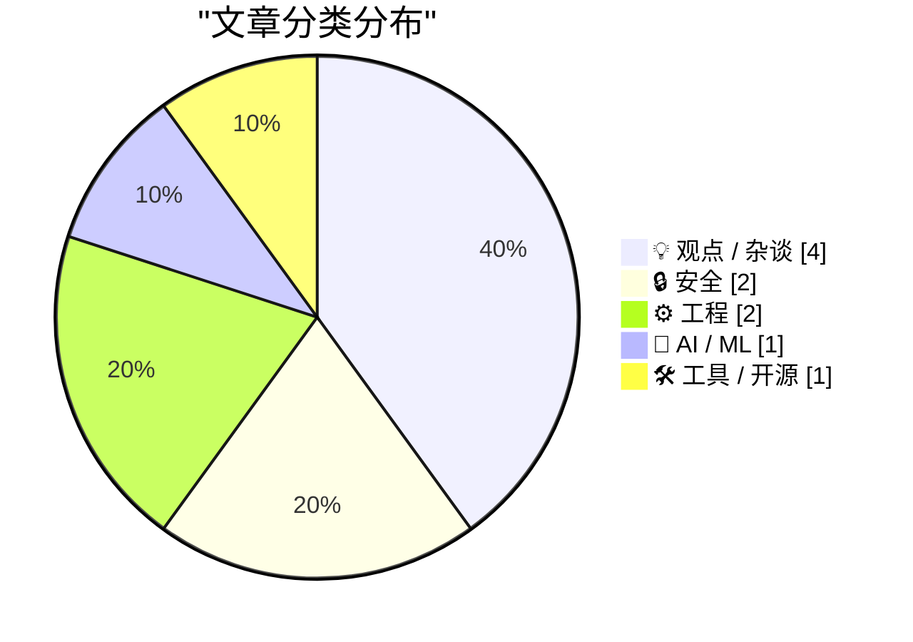
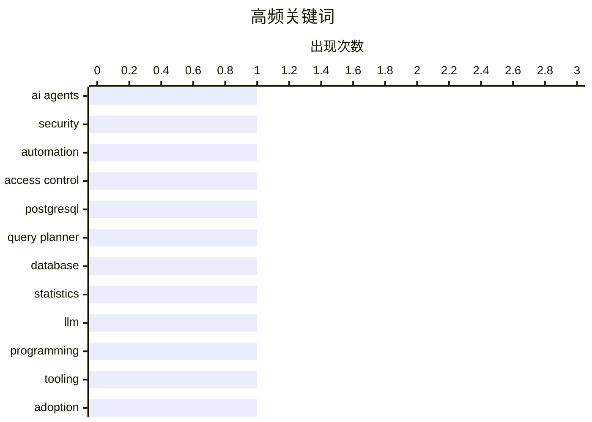

# 📰 AI 博客每日精选 — 2026-03-10

> 来自 Karpathy 推荐的 92 个顶级技术博客，AI 精选 Top 10

## 📝 今日看点

今天技术圈的焦点，正在从“AI 能做什么”迅速转向“AI 被允许做什么、谁来承担后果”。一边，AI 助手与 vibe coding 正把编程和执行门槛继续拉低，推动开发效率与主流技术栈进一步收敛；另一边，安全边界、隐私治理与政府监管的争议同步升级，AI 已不再只是工具问题，而是权限、责任与制度问题。与此同时，工程实践也在回归务实：无论是数据库统计信息复用，还是读懂编译器错误，行业都在强调用更扎实的基础能力来对冲 AI 时代的复杂性与不确定性。

---

## 🏆 今日必读

🥇 **AI 助手如何改变安全防线的基准**

[How AI Assistants are Moving the Security Goalposts](https://krebsonsecurity.com/2026/03/how-ai-assistants-are-moving-the-security-goalposts/) — krebsonsecurity.com · 23 小时前 · 🔒 安全

> AI 助手和自主代理正从“辅助工具”演变为可直接访问电脑、文件和在线服务的执行主体，企业安全模型因此被迫重写。文章指出，这类系统把数据与代码的边界进一步打散：提示词、文档、网页内容乃至外部服务返回结果，都可能成为驱动代理执行高风险操作的输入。近期一系列安全事件显示，组织已不能只防传统恶意软件或外部入侵者，还要防范“被诱导的代理”以合法身份完成越权、数据泄露和破坏性操作。安全重点正在从单纯保护账户与终端，转向最小权限、强隔离、审计追踪、可撤销授权以及对 AI 代理行为的细粒度约束。作者的核心观点是：AI 助手不是普通软件升级，而是在重新定义内部威胁、信任边界和攻击面的新平台风险。

💡 **为什么值得读**: 值得读，因为它帮助你把“AI 提效工具”重新看成一类会改变权限模型和威胁建模方式的新型基础设施风险。

🏷️ AI agents, security, automation, access control

🥈 **没有生产数据也能拿到生产环境查询计划**

[Production query plans without production data](https://simonwillison.net/2026/Mar/9/production-query-plans-without-production-data/#atom-everything) — simonwillison.net · 7 小时前 · ⚙️ 工程

> PostgreSQL 18 新增的 `pg_restore_relation_stats()` 和 `pg_restore_attribute_stats()`，让开发或测试环境可以在不导入生产数据的前提下复现接近生产环境的查询计划。关键在于恢复的是优化器依赖的统计信息，而不是实际表数据，因此既能保留执行计划质量，又能降低隐私与数据泄露风险。文章强调，很多慢查询问题本质上不是 SQL 文本本身，而是生产环境中的数据分布、基数估算和列统计导致的规划差异；新函数正好解决了“开发环境复现不了”的老问题。这为性能调优、回归测试和数据库问题排查提供了更安全且更可移植的工作流。结论是，生产统计信息的可移植性正在成为 PostgreSQL 性能工程中的一个重要新能力。

💡 **为什么值得读**: 值得读，因为它给出了一个兼顾隐私、安全与性能调优准确性的 PostgreSQL 18 新思路，实用价值很高。

🏷️ PostgreSQL, query planner, database, statistics

🥉 **也许“无聊技术”并没有那么无聊**

[Perhaps not Boring Technology after all](https://simonwillison.net/2026/Mar/9/not-so-boring/#atom-everything) — simonwillison.net · 9 小时前 · 💡 观点 / 杂谈

> 围绕 LLM 编程助手是否会把技术选型进一步推向 Python、JavaScript 等主流生态，文章给出了一个更乐观的判断。作者认为，早期模型确实更偏向训练语料更丰富的语言，但随着近两年模型能力提升，这种偏置正在减弱，冷门或小众技术栈得到的支持也明显改善。结果是，LLM 不一定只会强化“最常见技术”的网络效应，反而可能降低学习和使用小众工具的门槛，让新工具更容易被尝试。技术选型未必会因此变得更保守，反而可能让开发者更有能力跳出主流框架做判断。作者的核心观点是，LLM 可能在某种程度上削弱而不是加固“无聊技术优先”的惯性。

💡 **为什么值得读**: 值得读，因为它对“LLM 会让技术世界更同质化”这一流行担忧提出了有启发性的反论证。

🏷️ LLM, programming, tooling, adoption

---

## 📊 数据概览

| 扫描源 | 抓取文章 | 时间范围 | 精选 |
|:---:|:---:|:---:|:---:|
| 89/92 | 2515 篇 → 19 篇 | 24h | **10 篇** |

### 分类分布



### 高频关键词



<details>
<summary>📈 纯文本关键词图（终端友好）</summary>

```
ai agents      │ ████████████████████ 1
security       │ ████████████████████ 1
automation     │ ████████████████████ 1
access control │ ████████████████████ 1
postgresql     │ ████████████████████ 1
query planner  │ ████████████████████ 1
database       │ ████████████████████ 1
statistics     │ ████████████████████ 1
llm            │ ████████████████████ 1
programming    │ ████████████████████ 1
```

</details>

### 🏷️ 话题标签

**ai agents**(1) · **security**(1) · **automation**(1) · access control(1) · postgresql(1) · query planner(1) · database(1) · statistics(1) · llm(1) · programming(1) · tooling(1) · adoption(1) · meta(1) · smart glasses(1) · privacy(1) · content moderation(1) · anthropic(1) · lawsuit(1) · us government(1) · ai policy(1)

---

## 💡 观点 / 杂谈

### 1. 也许“无聊技术”并没有那么无聊

[Perhaps not Boring Technology after all](https://simonwillison.net/2026/Mar/9/not-so-boring/#atom-everything) — **simonwillison.net** · 9 小时前 · ⭐ 23/30

> 围绕 LLM 编程助手是否会把技术选型进一步推向 Python、JavaScript 等主流生态，文章给出了一个更乐观的判断。作者认为，早期模型确实更偏向训练语料更丰富的语言，但随着近两年模型能力提升，这种偏置正在减弱，冷门或小众技术栈得到的支持也明显改善。结果是，LLM 不一定只会强化“最常见技术”的网络效应，反而可能降低学习和使用小众工具的门槛，让新工具更容易被尝试。技术选型未必会因此变得更保守，反而可能让开发者更有能力跳出主流框架做判断。作者的核心观点是，LLM 可能在某种程度上削弱而不是加固“无聊技术优先”的惯性。

🏷️ LLM, programming, tooling, adoption

---

### 2. 高尚之路

[The Noble Path](https://www.joanwestenberg.com/the-noble-path/) — **joanwestenberg.com** · 23 小时前 · ⭐ 20/30

> 文章反思独立开发者和技术社区把一切工具都产品化、SaaS 化、商业模式化的冲动，质疑“做出东西就必须变现”是否真的合理。作者指出，一个周末写出来解决自用问题的小工具，如今往往会立刻被套进创业叙事、增长逻辑和可扩展商业模型，这种默认前提正在改变人们创造软件的动机。与其把所有作品都导向市场，不如承认很多工具的价值就在于个人表达、社区分享、有限范围内的实用性和不被资本逻辑绑架的自由。文章隐含地把“技术作为工艺”与“技术作为公司”做了区分。核心结论是，并非每个作品都需要成为企业，保留非商业创造空间本身就是一种更健康的路径。

🏷️ indie hacking, SaaS, business model, startup culture

---

### 3. 我不知道 Apple 对 Fn/Globe 键的最终意图是什么，而且我也不确定 Apple 自己是否知道

[I don’t know what is Apple’s endgame for the Fn/Globe key, and I’m not sure Apple knows either](https://aresluna.org/fn) — **aresluna.org** · 6 小时前 · ⭐ 18/30

> 文章梳理了 Apple 键盘上 Fn/Globe 键的起源与演变，试图解释为什么这个修饰键会成为现代苹果设备上最令人困惑的按键之一。作者追踪了它在不同硬件代际、输入法切换、Emoji 面板、系统功能触发和 Globe 语义之间的角色漂移，揭示出 Apple 在命名与交互设计上的不一致。问题不只是一个键功能太多，而是用户心智模型被不断重写：它究竟是传统 Fn 修饰键、语言切换键，还是系统级命令入口，并没有稳定答案。文章借这个小按键说明 Apple 人机交互中的渐进式复杂化和产品策略摇摆。结论是，Fn/Globe 键的混乱并非用户不理解，而是 Apple 自身长期未形成清晰一致的设计目标。

🏷️ Apple, keyboard, Fn key, UX

---

### 4. 复数主义：亿万富翁对他们自己以及尤其对我们都是一种危险（2026 年 3 月 9 日）

[Pluralistic: Billionaires are a danger to themselves and (especially) us (09 Mar 2026)](https://pluralistic.net/2026/03/09/autocrats-of-trade-2/) — **pluralistic.net** · 6 小时前 · ⭐ 17/30

> 文章的核心论点是，亿万富翁并不只是财富高度集中的结果，更是一种会系统性制造大规模政策失败的社会机制。作者认为，当个人财富和政治影响力集中到极端程度，决策会越来越脱离现实反馈，最终伤害公共利益，甚至连富豪自身也会被其扭曲的激励结构反噬。与把富豪视为高效配置资源的个体不同，文中把他们描述为“规模化生产坏政策的机器”，强调问题在制度而非个人品格。文章还通过链接与评论串联起版权、平台、图书 DRM、技术政治等议题，展示权力过度集中在多个领域的连锁后果。结论是，必须把亿万富翁当作结构性风险而不是成功神话来理解。

🏷️ billionaires, policy, society, power

---

## 🔒 安全

### 5. AI 助手如何改变安全防线的基准

[How AI Assistants are Moving the Security Goalposts](https://krebsonsecurity.com/2026/03/how-ai-assistants-are-moving-the-security-goalposts/) — **krebsonsecurity.com** · 23 小时前 · ⭐ 26/30

> AI 助手和自主代理正从“辅助工具”演变为可直接访问电脑、文件和在线服务的执行主体，企业安全模型因此被迫重写。文章指出，这类系统把数据与代码的边界进一步打散：提示词、文档、网页内容乃至外部服务返回结果，都可能成为驱动代理执行高风险操作的输入。近期一系列安全事件显示，组织已不能只防传统恶意软件或外部入侵者，还要防范“被诱导的代理”以合法身份完成越权、数据泄露和破坏性操作。安全重点正在从单纯保护账户与终端，转向最小权限、强隔离、审计追踪、可撤销授权以及对 AI 代理行为的细粒度约束。作者的核心观点是：AI 助手不是普通软件升级，而是在重新定义内部威胁、信任边界和攻击面的新平台风险。

🏷️ AI agents, security, automation, access control

---

### 6. 肯尼亚低薪外包工人在 Meta AI 智能眼镜使用过程中看到了用户所看到的一切

[Low-Wage Contractors in Kenya See What Users See While Using Meta’s AI Smart Glasses](https://www.svd.se/a/K8nrV4/metas-ai-smart-glasses-and-data-privacy-concerns-workers-say-we-see-everything) — **daringfireball.net** · 8 小时前 · ⭐ 23/30

> Meta 的 AI 智能眼镜被曝其部分数据审核与标注工作由肯尼亚低薪外包工承担，而这些工人能够接触到用户通过设备拍摄或识别的高度敏感内容。报道最具冲击力的点在于，用户可能以为自己面对的是自动化 AI 服务，但实际后台仍有人类审查链条，且可见范围覆盖私人空间、路人画面以及日常生活细节。问题不只是外包劳动条件，还包括隐私告知是否充分、数据访问权限是否过宽，以及 AI 产品对“人类在环”程度的真实披露。文章由此揭示，所谓智能硬件的便利性是建立在跨国数据劳工和模糊的隐私边界之上的。结论是，Meta 这类可穿戴 AI 设备的风险不止于采集数据，更在于谁能看到、处理和留存这些数据。

🏷️ Meta, smart glasses, privacy, content moderation

---

## ⚙️ 工程

### 7. 没有生产数据也能拿到生产环境查询计划

[Production query plans without production data](https://simonwillison.net/2026/Mar/9/production-query-plans-without-production-data/#atom-everything) — **simonwillison.net** · 7 小时前 · ⭐ 24/30

> PostgreSQL 18 新增的 `pg_restore_relation_stats()` 和 `pg_restore_attribute_stats()`，让开发或测试环境可以在不导入生产数据的前提下复现接近生产环境的查询计划。关键在于恢复的是优化器依赖的统计信息，而不是实际表数据，因此既能保留执行计划质量，又能降低隐私与数据泄露风险。文章强调，很多慢查询问题本质上不是 SQL 文本本身，而是生产环境中的数据分布、基数估算和列统计导致的规划差异；新函数正好解决了“开发环境复现不了”的老问题。这为性能调优、回归测试和数据库问题排查提供了更安全且更可移植的工作流。结论是，生产统计信息的可移植性正在成为 PostgreSQL 性能工程中的一个重要新能力。

🏷️ PostgreSQL, query planner, database, statistics

---

### 8. 学习阅读 C++ 编译器错误：重载运算符二义性

[Learning to read C++ compiler errors: Ambiguous overloaded operator](https://devblogs.microsoft.com/oldnewthing/20260309-00/?p=112118) — **devblogs.microsoft.com/oldnewthing** · 9 小时前 · ⭐ 21/30

> 文章聚焦 C++ 中“重载运算符二义性”编译错误，核心是教读者如何从报错信息里找出彼此冲突的候选定义。处理这类问题的关键不是死盯第一行错误，而是顺着编译器列出的重载候选、隐式转换路径和定义来源逐层回溯。作者强调，要特别注意运算符重载可能同时来自类成员、非成员函数、模板实例化或 ADL（参数依赖查找），这些机制叠加后很容易制造意外的匹配冲突。只要能定位每个候选函数是如何进入解析集合的，二义性问题通常就能被系统化拆解。结论是，阅读 C++ 编译错误的能力本质上是一种“追踪来源”的调试能力，而不只是记语法规则。

🏷️ C++, compiler errors, operator overloading, debugging

---

## 🤖 AI / ML

### 9. Anthropic 起诉美国政府，理由很充分

[Anthropic sues US government, with good reason](https://garymarcus.substack.com/p/anthropic-sues-us-government-with) — **garymarcus.substack.com** · 6 小时前 · ⭐ 23/30

> 文章支持 Anthropic 对美国政府提起诉讼，认为这起案件触及 AI 监管、政府权力边界和企业正当程序保障的核心问题。作者虽然并不把 Anthropic 及其领导层理想化，但强调即便对公司持保留态度，也应在制度层面支持其对政府行为提出司法挑战。核心论点是，若政府在涉及 AI 的监管、调查或行政措施中越界，不仅会伤害单个公司，也会为整个行业树立危险先例。案件意义因此超出 Anthropic 本身，关系到创新环境、法治原则和未来 AI 政策的合法性基础。作者的结论是，这场诉讼值得被支持，不是因为 Anthropic 完美，而是因为限制政府滥权本身重要。

🏷️ Anthropic, lawsuit, US government, AI policy

---

## 🛠 工具 / 开源

### 10. Vibe Coding 实战记录：制作一个赞助商面板

[Vibe Coding Trip Report: Making a sponsor panel](https://xeiaso.net/blog/2026/vibe-coding-sponsor-panel/) — **xeiaso.net** · 23 小时前 · ⭐ 19/30

> 作者为了在手术前尽快上线功能，采用“vibe coding”的方式快速做出了一个赞助商面板，并记录了这次实践的真实体验。文章的重点不在宏大方法论，而在一个具体交付场景中观察 AI 辅助编程的效率、可控性和踩坑点：在时间压力下，它确实能帮助快速生成可用结果，但质量仍依赖人工把关和迭代。这个案例说明，vibe coding 适合边做边修、追求速度优先的小功能开发，而不是完全放弃审查的自动生成。最终产物“够用且成功上线”，也暴露出这种方式对需求边界清晰度和开发者判断力的依赖。作者的态度是务实接受：它不是魔法，但在合适场景下非常有效。

🏷️ vibe coding, UI, sponsor panel, rapid prototyping

---

*生成于 2026-03-10 23:02 | 扫描 89 源 → 获取 2515 篇 → 精选 10 篇*
*基于 [Hacker News Popularity Contest 2025](https://refactoringenglish.com/tools/hn-popularity/) RSS 源列表*
