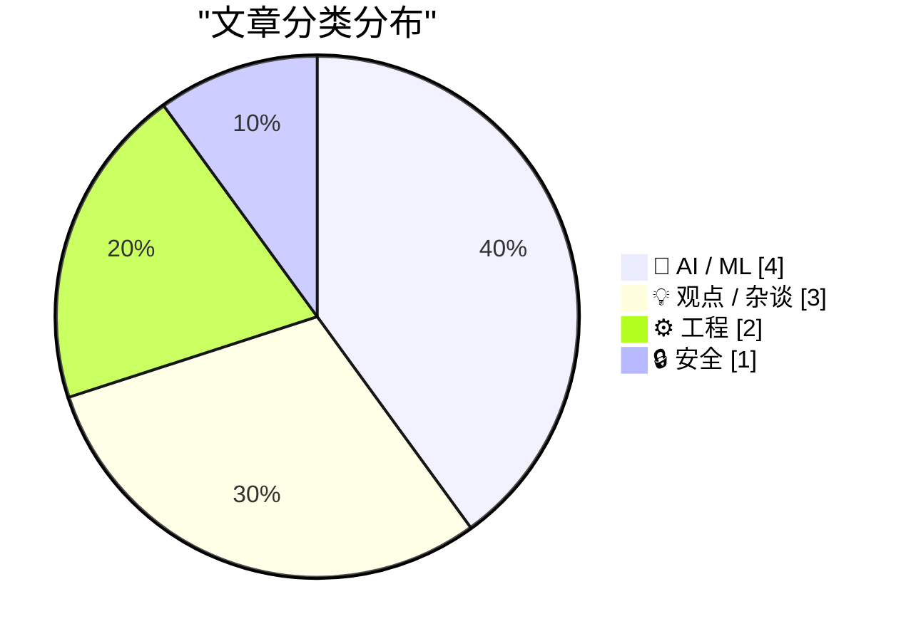
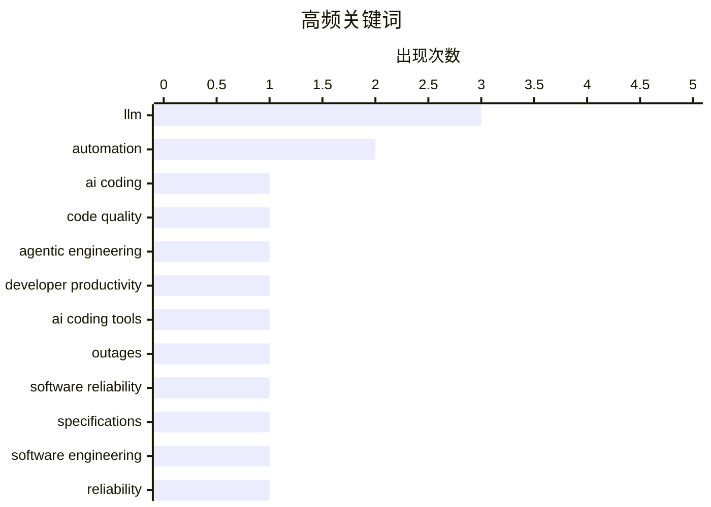

# 📰 AI 博客每日精选 — 2026-03-11

> 来自 Karpathy 推荐的 92 个顶级技术博客，AI 精选 Top 10

## 🏆 今日必读

🥇 **AI 应该帮助我们产出更好的代码**

[AI should help us produce better code](https://simonwillison.net/guides/agentic-engineering-patterns/better-code/#atom-everything) — simonwillison.net · 37 分钟前 · ⚙️ 工程

> 核心问题不是“要不要用 AI 写代码”，而是如何确保 coding agents 的引入不会拉低代码质量。作者主张把代码质量退化当作可测量、可治理的工程问题来处理，先找出具体失效模式，再用评审、测试、验收标准和工作流约束去修复，而不是笼统地否定 AI。文章强调应把 AI 用在能提升结果的环节，例如更快生成草稿、补测试、辅助重构和扩大实现选项空间，同时保留人类对架构、边界条件和质量门槛的判断。一个关键观点是“快速产出低质量代码”并不是 AI 的必然结果，真正决定结果的是团队是否建立了能让 AI 输出经过筛选、验证和迭代的工程机制。结论是，好的 AI 使用方式不是减少工程纪律，而是借助 AI 放大高质量工程实践，让最终交付的代码比不用 AI 时更好。

💡 **为什么值得读**: 值得读在于它没有停留在“AI 会不会毁掉代码质量”的口水战，而是给出把 AI 纳入现有工程质量体系的实用思路。

🏷️ AI coding, code quality, agentic engineering, developer productivity

🥈 **“一连串宕机事件，包括与 AI 编码工具相关的事故”，果然如期而至**

[“A spate of outages, including incidents tied to the use of AI coding tools”, right on schedule](https://garymarcus.substack.com/p/a-spate-of-outages-including-incidents) — garymarcus.substack.com · 7 小时前 · 🤖 AI / ML

> 文章聚焦近期多起线上故障与高影响范围事故，并把其中部分事件与 AI 编码工具的使用联系起来，质疑“AI 能安全加速软件开发”的乐观叙事。作者强调问题不只是模型会犯错，而是当组织在缺乏评审、测试、变更控制和责任归属的情况下扩大 AI 生成代码的使用，错误会以更快速度进入生产环境，并产生更大的 blast radius。文中延续 Gary Marcus 一贯观点：现有生成式 AI 缺乏可靠的推理、事实一致性与稳健性，不应被包装成可替代资深工程判断的系统。相关故障被当作行业预警，说明“先部署、后补治理”的策略在软件工程里代价极高。结论是，在 AI 编程工具具备可验证可靠性之前，企业应把它视为高风险辅助工具，而不是默认可信的生产力引擎。

💡 **为什么值得读**: 值得读在于它从真实事故切入，提醒读者关注 AI 编码从“效率问题”迅速升级为“生产稳定性与系统性风险问题”。

🏷️ AI coding tools, outages, software reliability, automation

🥉 **LLM 不擅长靠感觉编写规格说明**

[LLMs are bad at vibing specifications](https://buttondown.com/hillelwayne/archive/llms-are-bad-at-vibing-specifications/) — buttondown.com/hillelwayne · 5 小时前 · 🤖 AI / ML

> 文章讨论 LLM 在需求规格与形式化说明场景中的真正边界：它们能放大已有专家的能力，但不擅长凭模糊感觉补全正确规格。作者以 TLA+ 和规格工程经验为背景指出，LLM 可以帮助起草、改写和探索规范表达，但如果输入需求本身含糊、矛盾或遗漏关键约束，模型往往会生成看似合理却未经严格定义的“伪规格”。这种失败不是语法层面的，而是语义层面的——模型缺乏对系统边界、不变量、环境假设和反例空间的真实理解。文章因此反对把“vibe coding”式工作方式迁移到 specification 上，因为规格的价值恰恰来自精确定义与可验证性。结论是，LLM 在规格工作中最有价值的角色是协助专家澄清与表达，而不是代替人类完成需求建模和严谨推理。

💡 **为什么值得读**: 值得读在于它精准点出了 AI 在“写代码”和“写规格”之间的能力断层，对做需求、架构和形式化方法的人尤其有参考价值。

🏷️ LLM, specifications, software engineering, reliability

---

## 📊 数据概览

| 扫描源 | 抓取文章 | 时间范围 | 精选 |
|:---:|:---:|:---:|:---:|
| 89/92 | 2516 篇 → 17 篇 | 24h | **10 篇** |

### 分类分布



### 高频关键词



<details>
<summary>📈 纯文本关键词图（终端友好）</summary>

```
llm                    │ ████████████████████ 3
automation             │ █████████████░░░░░░░ 2
ai coding              │ ███████░░░░░░░░░░░░░ 1
code quality           │ ███████░░░░░░░░░░░░░ 1
agentic engineering    │ ███████░░░░░░░░░░░░░ 1
developer productivity │ ███████░░░░░░░░░░░░░ 1
ai coding tools        │ ███████░░░░░░░░░░░░░ 1
outages                │ ███████░░░░░░░░░░░░░ 1
software reliability   │ ███████░░░░░░░░░░░░░ 1
specifications         │ ███████░░░░░░░░░░░░░ 1
```

</details>

### 🏷️ 话题标签

**llm**(3) · **automation**(2) · **ai coding**(1) · code quality(1) · agentic engineering(1) · developer productivity(1) · ai coding tools(1) · outages(1) · software reliability(1) · specifications(1) · software engineering(1) · reliability(1) · data breach(1) · hibp(1) · cybersecurity(1) · incident(1) · hallucination(1) · vibe coding(1) · ai reliability(1) · ad-tech(1)

---

## 🤖 AI / ML

### 1. “一连串宕机事件，包括与 AI 编码工具相关的事故”，果然如期而至

[“A spate of outages, including incidents tied to the use of AI coding tools”, right on schedule](https://garymarcus.substack.com/p/a-spate-of-outages-including-incidents) — **garymarcus.substack.com** · 7 小时前 · ⭐ 24/30

> 文章聚焦近期多起线上故障与高影响范围事故，并把其中部分事件与 AI 编码工具的使用联系起来，质疑“AI 能安全加速软件开发”的乐观叙事。作者强调问题不只是模型会犯错，而是当组织在缺乏评审、测试、变更控制和责任归属的情况下扩大 AI 生成代码的使用，错误会以更快速度进入生产环境，并产生更大的 blast radius。文中延续 Gary Marcus 一贯观点：现有生成式 AI 缺乏可靠的推理、事实一致性与稳健性，不应被包装成可替代资深工程判断的系统。相关故障被当作行业预警，说明“先部署、后补治理”的策略在软件工程里代价极高。结论是，在 AI 编程工具具备可验证可靠性之前，企业应把它视为高风险辅助工具，而不是默认可信的生产力引擎。

🏷️ AI coding tools, outages, software reliability, automation

---

### 2. LLM 不擅长靠感觉编写规格说明

[LLMs are bad at vibing specifications](https://buttondown.com/hillelwayne/archive/llms-are-bad-at-vibing-specifications/) — **buttondown.com/hillelwayne** · 5 小时前 · ⭐ 24/30

> 文章讨论 LLM 在需求规格与形式化说明场景中的真正边界：它们能放大已有专家的能力，但不擅长凭模糊感觉补全正确规格。作者以 TLA+ 和规格工程经验为背景指出，LLM 可以帮助起草、改写和探索规范表达，但如果输入需求本身含糊、矛盾或遗漏关键约束，模型往往会生成看似合理却未经严格定义的“伪规格”。这种失败不是语法层面的，而是语义层面的——模型缺乏对系统边界、不变量、环境假设和反例空间的真实理解。文章因此反对把“vibe coding”式工作方式迁移到 specification 上，因为规格的价值恰恰来自精确定义与可验证性。结论是，LLM 在规格工作中最有价值的角色是协助专家澄清与表达，而不是代替人类完成需求建模和严谨推理。

🏷️ LLM, specifications, software engineering, reliability

---

### 3. 我不是在撒谎，我是在幻觉

[I'm Not Lying, I'm Hallucinating](https://idiallo.com/byte-size/im-not-lying-im-hallucinating?src=feed) — **idiallo.com** · 2 小时前 · ⭐ 23/30

> 文章借“vibe coding”和“hallucination”两个流行术语，讨论人们如何误解 AI 输出错误的性质。作者指出，把模型错误称为“幻觉”虽然形象，但也容易弱化问题严重性，因为 AI 并不是像人类那样主观撒谎，而是在概率生成机制下自信地编造内容。文中回顾了“hallucination”一词在自然语言处理领域的历史用法，说明这种现象并非新问题，只是在大模型时代因交互自然、语气笃定而更容易误导用户。文章进一步提醒，用户在“感觉上可用”时最容易放松核查，尤其是在编程、总结和问答等场景中。结论是，面对 LLM，关键不是给错误起什么名字，而是建立对其不可靠性的正确心理模型与验证习惯。

🏷️ hallucination, LLM, vibe coding, AI reliability

---

### 4. 从零开始编写 LLM，第 32e 部分——干预：学习率

[Writing an LLM from scratch, part 32e -- Interventions: the learning rate](https://www.gilesthomas.com/2026/03/llm-from-scratch-32e-interventions-learning-rate) — **gilesthomas.com** · -53 分钟前 · ⭐ 23/30

> 文章继续记录一个基于 Sebastian Raschka《Build a Large Language Model (From Scratch)》路线训练 GPT-2 small base 代码模型的实验过程，重点研究学习率对 test loss 的影响。作者从训练代码中的 optimizer 配置入手，尝试把“模型效果不佳”拆解为可控超参数问题，而不是盲目增加数据或模型规模。学习率被当作最关键的训练干预之一，因为它直接影响收敛速度、稳定性以及是否在局部最优附近震荡或发散。文章的价值在于展示真实实验中的调参与诊断思路：不是给出一个神奇默认值，而是通过观察 loss 曲线和训练行为来理解优化过程。结论是，哪怕是复现 GPT-2 small 这样的经典架构，训练质量也高度依赖细致的学习率设计与实证调试。

🏷️ LLM, GPT-2, learning rate, training

---

## 💡 观点 / 杂谈

### 5. 多元主义：广告技术就是法西斯技术（2026 年 3 月 10 日）

[Pluralistic: Ad-tech is fascist tech (10 Mar 2026)](https://pluralistic.net/2026/03/10/ice-tech/) — **pluralistic.net** · 7 小时前 · ⭐ 23/30

> 文章的核心论点是，广告技术并不只是商业定向投放基础设施，而是以大规模监视为前提、天然可被威权机构复用的控制技术。作者把 surveillance advertising 与国家暴力、移民执法和数据经纪生态联系起来，认为 ad-tech 的商业激励决定了它会持续收集、聚合并交易个人行为数据，而这些能力与法西斯式治理工具高度兼容。与“广告只是看广告更精准”这种温和叙事相反，文中强调问题本质在于监视本身，而不是广告创意、竞价模型或用户体验。作者延续一贯的技术政治批评框架，指出一旦这些数据流和追踪机制存在，就无法保证它们只服务于商业用途。结论是，反对 ad-tech 不是反对某种商业模式细节，而是反对将普遍监视常态化的社会基础设施。

🏷️ ad-tech, surveillance, privacy, politics

---

### 6. 非结构化数据，以及让别的东西替你思考的快乐

[Unstructured Data and the Joy of having Something Else think for you](https://shkspr.mobi/blog/2026/03/unstructured-data-and-the-joy-of-having-something-else-think-for-you/) — **shkspr.mobi** · 10 小时前 · ⭐ 19/30

> 文章围绕“默认把 AI 当成思考代理”的使用习惯展开，讨论人们为何会在明明有现成天气应用或网页时，仍优先向 ChatGPT 提问。作者把这种行为与处理非结构化信息的便利联系起来：AI 的优势不一定是提供更准确答案，而是把检索、筛选、整合和表达压缩成一次对话式交互。文章同时对这种便利提出警惕，认为它容易让人把判断与核实也一并外包，形成认知惰性。与传统工具相比，LLM 的吸引力在于“让系统替你组织世界”，但代价是用户可能越来越少直接接触原始信息来源。结论是，AI 在处理非结构化数据时确实提供了前所未有的轻松感，但这种轻松既是生产力红利，也可能成为思维外包的风险源。

🏷️ AI usage, unstructured data, automation, decision making

---

### 7. 历史的开端

[The Beginning Of History](https://www.wheresyoured.at/the-beginning-of-history/) — **wheresyoured.at** · 4 小时前 · ⭐ 18/30

> 从标题和作者一贯写作主题判断，这篇文章大概率在讨论 AI 产业叙事如何把当下包装成“历史新起点”，并借此重构技术、资本与权力关系。Ed Zitron 常批评科技行业通过宏大叙事掩盖商业模式脆弱、产品能力不足与组织层面的短视，因此“历史的开端”更像是在拆解一种宣传语言，而非单纯歌颂技术转折点。文章很可能会把生成式 AI、市场炒作、企业承诺与现实落地之间的落差放在一起看，质疑谁有资格定义“新时代”，以及这种定义服务于谁。相比把技术变革视作自然而然的历史进程，作者通常更强调人为制造的 hype cycle 和权力分配。结论上，这类分析通常指向同一个核心：所谓“新历史”往往首先是资本与平台为自己书写的历史。

🏷️ history, technology, society, analysis

---

## ⚙️ 工程

### 8. AI 应该帮助我们产出更好的代码

[AI should help us produce better code](https://simonwillison.net/guides/agentic-engineering-patterns/better-code/#atom-everything) — **simonwillison.net** · 37 分钟前 · ⭐ 25/30

> 核心问题不是“要不要用 AI 写代码”，而是如何确保 coding agents 的引入不会拉低代码质量。作者主张把代码质量退化当作可测量、可治理的工程问题来处理，先找出具体失效模式，再用评审、测试、验收标准和工作流约束去修复，而不是笼统地否定 AI。文章强调应把 AI 用在能提升结果的环节，例如更快生成草稿、补测试、辅助重构和扩大实现选项空间，同时保留人类对架构、边界条件和质量门槛的判断。一个关键观点是“快速产出低质量代码”并不是 AI 的必然结果，真正决定结果的是团队是否建立了能让 AI 输出经过筛选、验证和迭代的工程机制。结论是，好的 AI 使用方式不是减少工程纪律，而是借助 AI 放大高质量工程实践，让最终交付的代码比不用 AI 时更好。

🏷️ AI coding, code quality, agentic engineering, developer productivity

---

### 9. 就用 Postgres

[Just Use Postgres](https://nesbitt.io/2026/03/10/just-use-postgres.html) — **nesbitt.io** · 13 小时前 · ⭐ 22/30

> 文章把“Just use Postgres”这句工程界口头禅推到极致，探索是否能把部署、应用运行甚至代码交付都压缩进单个 Postgres 进程。作者显然不是在做传统数据库选型比较，而是在挑战“服务一定要拆成多层组件”的默认架构观，讨论 Postgres 作为数据层、执行层和发布目标的可能边界。标题中的“git push to deploy into a single Postgres process”暗示系统可能利用 SQL、存储过程、触发器或扩展机制，把应用逻辑直接部署到数据库内部运行。这样的方案潜在优势是极简运维、统一状态管理和更少基础设施移动部件，但也伴随耦合度、可移植性和调试复杂度问题。结论是，Postgres 不只是数据库，而是一种可以重新定义应用边界的运行时，但是否值得采用取决于系统复杂度与团队约束。

🏷️ Postgres, deployment, database, architecture

---

## 🔒 安全

### 10. 每周更新 494

[Weekly Update 494](https://www.troyhunt.com/weekly-update-494/) — **troyhunt.com** · 21 小时前 · ⭐ 24/30

> 这期周更围绕 Have I Been Pwned（HIBP）近期异常密集的数据泄露收录节奏展开。作者提到自己在过去十二年多里平均每 4.7 天收录 1 起 breach，总数已达 959 起，但上周却在 2 天内新增了 5 起，明显高于长期平均水平。这样的节奏意味着数据泄露事件不但没有放缓，反而在短时间内集中爆发，给身份安全、密码复用和通知机制带来更大压力。结合 HIBP 的长期运营经验，文章也反映了维护大规模泄露情报平台背后的持续工作量与现实威胁态势。结论是，泄露已不是偶发新闻，而是持续且高频的基础安全问题，个人和组织都应把监测与响应当作常规动作。

🏷️ data breach, HIBP, cybersecurity, incident

---

*生成于 2026-03-11 23:02 | 扫描 89 源 → 获取 2516 篇 → 精选 10 篇*
*基于 [Hacker News Popularity Contest 2025](https://refactoringenglish.com/tools/hn-popularity/) RSS 源列表*
