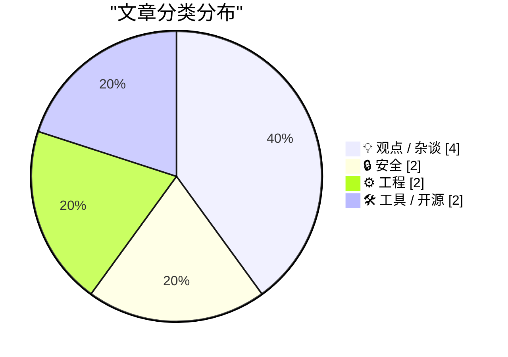
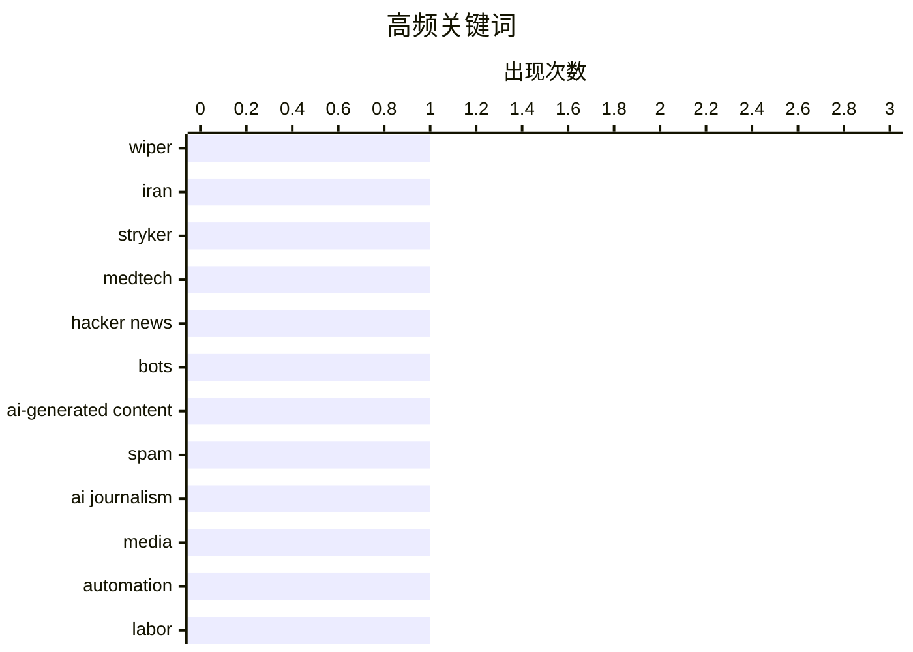

# 📰 AI 博客每日精选 — 2026-03-12

> 来自 Karpathy 推荐的 92 个顶级技术博客，AI 精选 Top 10

## 📝 今日看点

今天的技术圈主线围绕“AI 渗透与信任危机”：从社区讨论到媒体生产，AI 生成内容的比例与影响被重新审视，也推动“现实识读”成为迫切需求。安全面则更显紧张，破坏性网络攻击瞄准关键行业，同时围绕 AI 训练数据来源的合规与伦理争议升温，数据与供应链风险被拉到台前。工程侧出现“回归基本功”的信号，算法与编译器底层安全机制等话题再度受到关注，强调系统韧性与可验证性。开发流程上，Git 的正确用法与自动化工具也在继续进化，目标是更稳、更快地交付。

---

## 🏆 今日必读

🥇 **Iran-Backed Hackers Claim Wiper Attack on Medtech Firm Stryker**

[Iran-Backed Hackers Claim Wiper Attack on Medtech Firm Stryker](https://krebsonsecurity.com/2026/03/iran-backed-hackers-claim-wiper-attack-on-medtech-firm-stryker/) — krebsonsecurity.com · 11 小时前 · 🔒 安全

> Iran-Backed Hackers Claim Wiper Attack on Medtech Firm Stryker

🏷️ wiper, Iran, Stryker, medtech

🥈 **How much of HN is AI?**

[How much of HN is AI?](https://lcamtuf.substack.com/p/how-much-of-hn-is-ai) — lcamtuf.substack.com · 2 小时前 · 💡 观点 / 杂谈

> How much of HN is AI?

🏷️ Hacker News, bots, AI-generated content, spam

🥉 **Pluralistic: AI "journalists" prove that media bosses don't give a shit (11 Mar 2026)**

[Pluralistic: AI "journalists" prove that media bosses don't give a shit (11 Mar 2026)](https://pluralistic.net/2026/03/11/modal-dialog-a-palooza/) — pluralistic.net · 8 小时前 · 💡 观点 / 杂谈

> Pluralistic: AI "journalists" prove that media bosses don't give a shit (11 Mar 2026)

🏷️ AI journalism, media, automation, labor

---

## 📊 数据概览

| 扫描源 | 抓取文章 | 时间范围 | 精选 |
|:---:|:---:|:---:|:---:|
| 86/92 | 2405 篇 → 19 篇 | 24h | **10 篇** |

### 分类分布



### 高频关键词



<details>
<summary>📈 纯文本关键词图（终端友好）</summary>

```
wiper                │ ████████████████████ 1
iran                 │ ████████████████████ 1
stryker              │ ████████████████████ 1
medtech              │ ████████████████████ 1
hacker news          │ ████████████████████ 1
bots                 │ ████████████████████ 1
ai-generated content │ ████████████████████ 1
spam                 │ ████████████████████ 1
ai journalism        │ ████████████████████ 1
media                │ ████████████████████ 1
```

</details>

### 🏷️ 话题标签

**wiper**(1) · **iran**(1) · **stryker**(1) · medtech(1) · hacker news(1) · bots(1) · ai-generated content(1) · spam(1) · ai journalism(1) · media(1) · automation(1) · labor(1) · sorting(1) · algorithms(1) · visualization(1) · claude(1) · stack(1) · guard page(1) · stack probing(1) · compiler(1)

---

## 💡 观点 / 杂谈

### 1. How much of HN is AI?

[How much of HN is AI?](https://lcamtuf.substack.com/p/how-much-of-hn-is-ai) — **lcamtuf.substack.com** · 2 小时前 · ⭐ 25/30

> How much of HN is AI?

🏷️ Hacker News, bots, AI-generated content, spam

---

### 2. Pluralistic: AI "journalists" prove that media bosses don't give a shit (11 Mar 2026)

[Pluralistic: AI "journalists" prove that media bosses don't give a shit (11 Mar 2026)](https://pluralistic.net/2026/03/11/modal-dialog-a-palooza/) — **pluralistic.net** · 8 小时前 · ⭐ 24/30

> Pluralistic: AI "journalists" prove that media bosses don't give a shit (11 Mar 2026)

🏷️ AI journalism, media, automation, labor

---

### 3. Members Only: We desperately need a Reality Literacy

[Members Only: We desperately need a Reality Literacy](https://www.joanwestenberg.com/we-desperately-need-a-reality-literacy/) — **joanwestenberg.com** · 5 小时前 · ⭐ 20/30

> Members Only: We desperately need a Reality Literacy

🏷️ misinformation, media literacy, critical thinking, reality

---

### 4. The Department of War is making a huge mistake

[The Department of War is making a huge mistake](https://www.dwarkesh.com/p/dow-anthropic) — **dwarkesh.com** · 9 小时前 · ⭐ 18/30

> The Department of War is making a huge mistake

🏷️ geopolitics, defense, negotiation

---

## 🔒 安全

### 5. Iran-Backed Hackers Claim Wiper Attack on Medtech Firm Stryker

[Iran-Backed Hackers Claim Wiper Attack on Medtech Firm Stryker](https://krebsonsecurity.com/2026/03/iran-backed-hackers-claim-wiper-attack-on-medtech-firm-stryker/) — **krebsonsecurity.com** · 11 小时前 · ⭐ 26/30

> Iran-Backed Hackers Claim Wiper Attack on Medtech Firm Stryker

🏷️ wiper, Iran, Stryker, medtech

---

### 6. Where did you think the training data was coming from?

[Where did you think the training data was coming from?](https://idiallo.com/blog/where-did-the-training-data-come-from-meta-ai-rayban-glasses?src=feed) — **idiallo.com** · 15 小时前 · ⭐ 22/30

> Where did you think the training data was coming from?

🏷️ privacy, training-data, smart-glasses, Meta

---

## ⚙️ 工程

### 7. Sorting algorithms

[Sorting algorithms](https://simonwillison.net/2026/Mar/11/sorting-algorithms/#atom-everything) — **simonwillison.net** · 4 小时前 · ⭐ 23/30

> Sorting algorithms

🏷️ sorting, algorithms, visualization, Claude

---

### 8. How do compilers ensure that large stack allocations do not skip over the guard page?

[How do compilers ensure that large stack allocations do not skip over the guard page?](https://devblogs.microsoft.com/oldnewthing/20260311-00/?p=112134) — **devblogs.microsoft.com/oldnewthing** · 13 小时前 · ⭐ 23/30

> How do compilers ensure that large stack allocations do not skip over the guard page?

🏷️ stack, guard page, stack probing, compiler

---

## 🛠 工具 / 开源

### 9. Git Checkout, Reset and Restore

[Git Checkout, Reset and Restore](https://susam.net/git-checkout-reset-restore.html) — **susam.net** · 3 小时前 · ⭐ 20/30

> Git Checkout, Reset and Restore

🏷️ git, checkout, reset, restore

---

### 10. git-pkgs/actions

[git-pkgs/actions](https://nesbitt.io/2026/03/11/git-pkgs-actions.html) — **nesbitt.io** · 17 小时前 · ⭐ 19/30

> git-pkgs/actions

🏷️ GitHub Actions, CI, git-pkgs, workflow

---

*生成于 2026-03-12 03:56 | 扫描 86 源 → 获取 2405 篇 → 精选 10 篇*
*基于 [Hacker News Popularity Contest 2025](https://refactoringenglish.com/tools/hn-popularity/) RSS 源列表*
