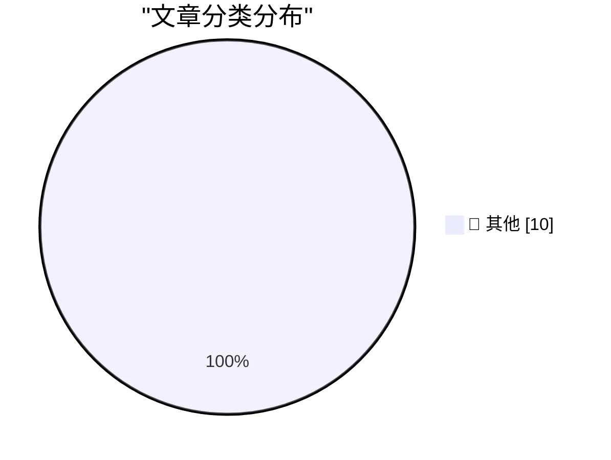

# 📰 AI 博客每日精选 — 2026-03-12

> 来自 Karpathy 推荐的 92 个顶级技术博客，AI 精选 Top 10

## 🏆 今日必读

🥇 **Sorting algorithms**

[Sorting algorithms](https://simonwillison.net/2026/Mar/11/sorting-algorithms/#atom-everything) — simonwillison.net · 4 小时前 · 📝 其他

> Sorting algorithms

🥈 **Quoting John Carmack**

[Quoting John Carmack](https://simonwillison.net/2026/Mar/11/john-carmack/#atom-everything) — simonwillison.net · 12 小时前 · 📝 其他

> Quoting John Carmack

🥉 **Iran-Backed Hackers Claim Wiper Attack on Medtech Firm Stryker**

[Iran-Backed Hackers Claim Wiper Attack on Medtech Firm Stryker](https://krebsonsecurity.com/2026/03/iran-backed-hackers-claim-wiper-attack-on-medtech-firm-stryker/) — krebsonsecurity.com · 11 小时前 · 📝 其他

> Iran-Backed Hackers Claim Wiper Attack on Medtech Firm Stryker

---

## 📊 数据概览

| 扫描源 | 抓取文章 | 时间范围 | 精选 |
|:---:|:---:|:---:|:---:|
| 89/92 | 2516 篇 → 19 篇 | 24h | **10 篇** |

### 分类分布

---

## 📝 其他

### 1. Sorting algorithms

[Sorting algorithms](https://simonwillison.net/2026/Mar/11/sorting-algorithms/#atom-everything) — **simonwillison.net** · 4 小时前 · ⭐ 15/30

> Sorting algorithms

---

### 2. Quoting John Carmack

[Quoting John Carmack](https://simonwillison.net/2026/Mar/11/john-carmack/#atom-everything) — **simonwillison.net** · 12 小时前 · ⭐ 15/30

> Quoting John Carmack

---

### 3. Iran-Backed Hackers Claim Wiper Attack on Medtech Firm Stryker

[Iran-Backed Hackers Claim Wiper Attack on Medtech Firm Stryker](https://krebsonsecurity.com/2026/03/iran-backed-hackers-claim-wiper-attack-on-medtech-firm-stryker/) — **krebsonsecurity.com** · 11 小时前 · ⭐ 15/30

> Iran-Backed Hackers Claim Wiper Attack on Medtech Firm Stryker

---

### 4. Jason Snell Is on Jeopardy Next Week

[Jason Snell Is on Jeopardy Next Week](https://sixcolors.com/post/2026/03/ill-take-beach-reading-for-1000-ken/) — **daringfireball.net** · 2 小时前 · ⭐ 15/30

> Jason Snell Is on Jeopardy Next Week

---

### 5. Another One From the Archive: ‘Web Kit’ vs. ‘WebKit’

[Another One From the Archive: ‘Web Kit’ vs. ‘WebKit’](https://daringfireball.net/2006/05/web_kit_vs_webkit) — **daringfireball.net** · 3 小时前 · ⭐ 15/30

> Another One From the Archive: ‘Web Kit’ vs. ‘WebKit’

---

### 6. ★ Modifier Key Order for Keyboard Shortcuts

[★ Modifier Key Order for Keyboard Shortcuts](https://daringfireball.net/2026/03/modifier_key_order_for_keyboard_shortcuts) — **daringfireball.net** · 3 小时前 · ⭐ 15/30

> ★ Modifier Key Order for Keyboard Shortcuts

---

### 7. Apple Has Changed Several Key Cap Labels From Words to Glyphs on Its Latest MacBook Keyboards

[Apple Has Changed Several Key Cap Labels From Words to Glyphs on Its Latest MacBook Keyboards](https://x.com/ClassicII_MrMac/status/2028869838870069447) — **daringfireball.net** · 4 小时前 · ⭐ 15/30

> Apple Has Changed Several Key Cap Labels From Words to Glyphs on Its Latest MacBook Keyboards

---

### 8. Halide Cofounder Sebastiaan de With Joined Apple’s Design Team in January

[Halide Cofounder Sebastiaan de With Joined Apple’s Design Team in January](https://9to5mac.com/2026/01/28/halide-cofounder-sebastiaan-de-with-joins-apples-design-team/) — **daringfireball.net** · 4 小时前 · ⭐ 15/30

> Halide Cofounder Sebastiaan de With Joined Apple’s Design Team in January

---

### 9. From the DF Archive: ‘And Oranges’

[From the DF Archive: ‘And Oranges’](https://daringfireball.net/2006/06/and_oranges) — **daringfireball.net** · 8 小时前 · ⭐ 15/30

> From the DF Archive: ‘And Oranges’

---

### 10. Where did you think the training data was coming from?

[Where did you think the training data was coming from?](https://idiallo.com/blog/where-did-the-training-data-come-from-meta-ai-rayban-glasses?src=feed) — **idiallo.com** · 15 小时前 · ⭐ 15/30

> Where did you think the training data was coming from?

---

*生成于 2026-03-12 03:36 | 扫描 89 源 → 获取 2516 篇 → 精选 10 篇*
*基于 [Hacker News Popularity Contest 2025](https://refactoringenglish.com/tools/hn-popularity/) RSS 源列表*
