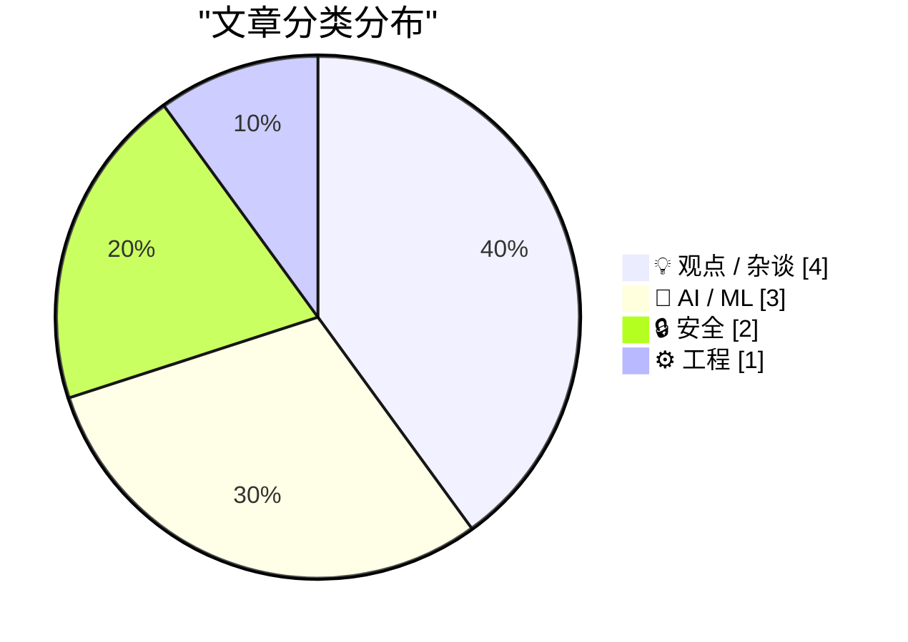
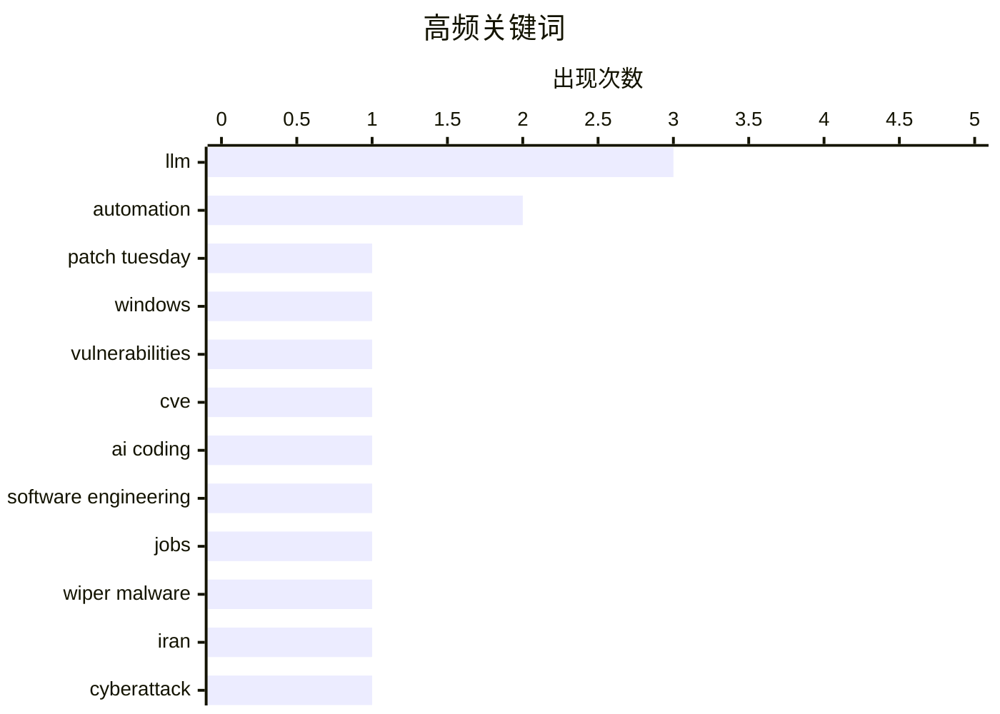

# 📰 AI 博客每日精选 — 2026-03-12

> 来自 Karpathy 推荐的 92 个顶级技术博客，AI 精选 Top 10

## 📝 今日看点

今天的技术圈一边在补“看似不紧急”的安全账：微软大规模修复漏洞、医疗科技行业遭遇擦除型攻击，提醒企业真正的难题是持续的补丁优先级与破坏性风险的运营韧性。另一边，AI 正把“写代码”改造成“组织软件生产”：分工、岗位与权力结构被重排，开发者被推向更高抽象层做意图表达与验收，同时也担忧对底层机制的失控。与能力展示相比，更尖锐的焦点转向 AI 的治理与博弈——从高风险谈判框架到供应链风险标签，规则由谁制定、如何约束正在变成核心战场。与此同时，工程实践仍在强调基本功：像模板引擎这类基础组件通过微优化继续挤出可观的性能红利。

---

## 🏆 今日必读

🥇 **微软补丁星期二：2026 年 3 月版**

[Microsoft Patch Tuesday, March 2026 Edition](https://krebsonsecurity.com/2026/03/microsoft-patch-tuesday-march-2026-edition/) — krebsonsecurity.com · 22 小时前 · 🔒 安全

> 微软本月一次性修复至少 77 个影响 Windows 及其他软件的安全漏洞，核心问题是企业该如何在“无零日”的月份仍然做好补丁优先级管理。与 2 月包含 5 个零日漏洞不同，3 月没有“紧急零日”，但仍存在需要更快关注的高风险修复项。文章按 Patch Tuesday 的惯例提炼出对组织最重要的更新亮点，提醒不要因为缺少零日就放松节奏。整体观点是：零日缺席不代表风险低，补丁分级、测试与快速部署依然是 Windows 环境的常态化工作。

💡 **为什么值得读**: 把“77 个漏洞的一堆公告”压缩成可执行的补丁优先级线索，适合安全团队快速决定本月先补什么、怎么排期。

🏷️ Patch Tuesday, Windows, vulnerabilities, CVE

🥈 **程序员之后的编码：我们所熟知的计算机编程的终结**

[Coding After Coders: The End of Computer Programming as We Know It](https://simonwillison.net/2026/Mar/12/coding-after-coders/#atom-everything) — simonwillison.net · -1224 分钟前 · 💡 观点 / 杂谈

> AI 辅助开发正在重塑“写代码”这件事的组织方式与职业边界，问题不再是工具好不好用，而是编程劳动如何被重新分工。Clive Thompson 为《纽约时报》杂志采访了 70 多位开发者，来自 Google、Amazon、Microsoft、Apple 等公司，以及 Anil Dash、Thomas Ptacek、Steve Yegge 等个人，从一线经验呈现 IDE/LLM 协作的真实变化。文章强调 LLM 让个人产出与团队协作模式发生结构性位移：从具体实现转向需求表达、约束设定、评审与集成，且对初级岗位与外包型工作冲击更大。最终观点是：编程不会消失，但“程序员”的定义与价值链位置将被 AI 重新洗牌。

💡 **为什么值得读**: 用大量一线访谈把“AI 会不会取代程序员”落到可观察的岗位变化与组织实践上，信息密度很高。

🏷️ AI coding, LLM, software engineering, jobs

🥉 **与伊朗有关的黑客声称对医疗科技公司 Stryker 发动擦除攻击**

[Iran-Backed Hackers Claim Wiper Attack on Medtech Firm Stryker](https://krebsonsecurity.com/2026/03/iran-backed-hackers-claim-wiper-attack-on-medtech-firm-stryker/) — krebsonsecurity.com · 6 小时前 · 🔒 安全

> 一次面向医疗科技巨头 Stryker 的“数据擦除（wiper）”攻击引发业务中断与人员撤离，核心风险是破坏型攻击对关键行业运营的冲击。与伊朗情报机构有关联的黑客行动组织宣称负责，事件不仅涉及数据破坏，还直接影响线下办公与应急响应。来自爱尔兰的报道指出 Stryker（其美国之外最大枢纽）当天让超过 5,000 名员工回家，同时美国总部电话语音提示出现“楼宇紧急情况”。作者通过这些迹象强调：擦除类攻击往往以“不可恢复的业务停摆”为目的，处置难度与代价显著高于单纯数据窃取。

💡 **为什么值得读**: 这是少见的公开“wiper”案例线索汇总，能帮助安全与IT运维理解破坏型攻击的真实影响半径与应急信号。

🏷️ wiper malware, Iran, cyberattack, healthcare

---

## 📊 数据概览

| 扫描源 | 抓取文章 | 时间范围 | 精选 |
|:---:|:---:|:---:|:---:|
| 88/92 | 2494 篇 → 59 篇 | 24h | **10 篇** |

### 分类分布



### 高频关键词



<details>
<summary>📈 纯文本关键词图（终端友好）</summary>

```
llm                  │ ████████████████████ 3
automation           │ █████████████░░░░░░░ 2
patch tuesday        │ ███████░░░░░░░░░░░░░ 1
windows              │ ███████░░░░░░░░░░░░░ 1
vulnerabilities      │ ███████░░░░░░░░░░░░░ 1
cve                  │ ███████░░░░░░░░░░░░░ 1
ai coding            │ ███████░░░░░░░░░░░░░ 1
software engineering │ ███████░░░░░░░░░░░░░ 1
jobs                 │ ███████░░░░░░░░░░░░░ 1
wiper malware        │ ███████░░░░░░░░░░░░░ 1
```

</details>

### 🏷️ 话题标签

**llm**(3) · **automation**(2) · **patch tuesday**(1) · windows(1) · vulnerabilities(1) · cve(1) · ai coding(1) · software engineering(1) · jobs(1) · wiper malware(1) · iran(1) · cyberattack(1) · healthcare(1) · ai governance(1) · agi(1) · geopolitics(1) · alignment(1) · ruby(1) · liquid(1) · performance(1)

---

## 💡 观点 / 杂谈

### 1. 程序员之后的编码：我们所熟知的计算机编程的终结

[Coding After Coders: The End of Computer Programming as We Know It](https://simonwillison.net/2026/Mar/12/coding-after-coders/#atom-everything) — **simonwillison.net** · -1224 分钟前 · ⭐ 26/30

> AI 辅助开发正在重塑“写代码”这件事的组织方式与职业边界，问题不再是工具好不好用，而是编程劳动如何被重新分工。Clive Thompson 为《纽约时报》杂志采访了 70 多位开发者，来自 Google、Amazon、Microsoft、Apple 等公司，以及 Anil Dash、Thomas Ptacek、Steve Yegge 等个人，从一线经验呈现 IDE/LLM 协作的真实变化。文章强调 LLM 让个人产出与团队协作模式发生结构性位移：从具体实现转向需求表达、约束设定、评审与集成，且对初级岗位与外包型工作冲击更大。最终观点是：编程不会消失，但“程序员”的定义与价值链位置将被 AI 重新洗牌。

🏷️ AI coding, LLM, software engineering, jobs

---

### 2. AI 之后，程序员做什么？

[What do coders do after AI?](https://anildash.com/2026/03/13/coders-after-ai/) — **anildash.com** · -1500 分钟前 · ⭐ 24/30

> 当 LLM 快速逼近“软件工厂”式能力时，程序员的价值将从写代码本身转向更广义的软件生产与权力结构问题。文章指出 AI 正在改变软件创造的经济学与权力动态，而目前更常见的结果是用自动化替代大量技术岗位。作者结合与 Clive Thompson 的对谈语境，强调接下来更关键的是：谁控制工具、谁获得收益、以及劳动者如何在新生产方式下获得话语权与保障。结论是：与其把未来简化成“更高效的编程”，不如正视就业、组织治理与公平分配将成为软件行业的主战场。

🏷️ LLM, software jobs, automation, coding

---

### 3. Pluralistic：AI“记者”证明媒体老板根本不在乎（2026-03-11）

[Pluralistic: AI "journalists" prove that media bosses don't give a shit (11 Mar 2026)](https://pluralistic.net/2026/03/11/modal-dialog-a-palooza/) — **pluralistic.net** · 3 小时前 · ⭐ 23/30

> 媒体机构推动 AI 生成内容的潮流暴露出一个核心问题：管理层更在乎规模与成本，而非新闻质量与责任。文章以“AI 记者”的表现为证据，指出这种做法在错误、幻觉与编辑把关缺位面前仍被推动，反映出对专业新闻生产的轻视。除主线观点外，文中还汇总了多条相关链接与话题（从行业乱象到文化与政策杂谈），形成对当下信息生态的拼贴式观察。核心结论是：当“自动化产出”被优先于可信度与公共利益时，受损的是媒体作为社会基础设施的功能。

🏷️ AI journalism, media, automation, incentives

---

### 4. 我不确定自己是否喜欢在更高层的抽象上工作

[I don't know if I like working at higher levels of abstraction](https://xeiaso.net/blog/2026/ai-abstraction/) — **xeiaso.net** · 23 小时前 · ⭐ 23/30

> AI 工具把开发者推向更高层抽象，但代价可能是对系统细节的掌控感与理解深度下降。文章围绕“抽象提升”的体验展开：当实现细节被模型与工具层层包裹，开发者更像在做意图表达与结果验收，而不是与机制本身搏斗。作者并不否认效率收益，但强调抽象会吞噬可解释性与可调试性，让排错、性能与可靠性问题更难定位。结论是：更高抽象不必然更好，选择 AI 辅助程度时应权衡学习、控制与长期技能退化的成本。

🏷️ abstraction, AI tools, software development, productivity

---

## 🤖 AI / ML

### 5. 关于 AI 最重要却无人发问的问题

[The most important question nobody's asking about AI](https://www.dwarkesh.com/p/dow-anthropic) — **dwarkesh.com** · 4 小时前 · ⭐ 26/30

> AI 的关键不确定性可能不在模型能力本身，而在即将到来的高风险博弈与谈判结构中“谁决定规则、如何承诺与约束”。文章用“史上最高赌注的谈判前言”来框定：当能力快速跃迁时，社会往往把注意力放在技术演示，却忽略谈判筹码、参与方激励、以及可执行机制的设计。核心论点指向治理层面的硬问题：在多方（公司/政府/公众）目标不一致的前提下，缺少可信的承诺与监督会让最优结果更难出现。结论是：与其只追逐下一代模型指标，不如尽快把公共讨论推进到可落地的谈判议题与约束框架上。

🏷️ AI governance, AGI, geopolitics, alignment

---

### 6. 美军真的害怕 Claude 吗？关于五角大楼将 Anthropic 标记为供应链风险的新解释

[Is the US military actually afraid of Claude? A new theory of why Anthropic was labeled a supply chain risk.](https://garymarcus.substack.com/p/is-the-us-military-actually-afraid) — **garymarcus.substack.com** · -1286 分钟前 · ⭐ 24/30

> 五角大楼将 Anthropic 贴上“供应链风险”标签引发争议，核心问题是这一判断背后的真实逻辑到底是什么。文章拆解官方/媒体叙事中看似矛盾之处，提出一种替代理论：与其把它理解为对单一模型能力的恐惧，不如视为对依赖关系、采购路径、合规与控制权等供应链要素的担忧。作者围绕“供应链风险”这一措辞，分析它可能涵盖的技术与制度层面含义，而不只是模型输出的安全性。结论倾向于认为：该事件更多反映国家安全体系对 AI 供应依赖的敏感度上升，而非简单的“怕某个聊天机器人”。

🏷️ Claude, Anthropic, US DoD, AI policy

---

### 7. 从零编写 LLM（第 32e 部分）：干预项——学习率

[Writing an LLM from scratch, part 32e -- Interventions: the learning rate](https://www.gilesthomas.com/2026/03/llm-from-scratch-32e-interventions-learning-rate) — **gilesthomas.com** · 23 小时前 · ⭐ 24/30

> 在从零训练一个 GPT-2 small 级别模型时，如何通过学习率相关的干预来降低 test loss 是本文的核心问题。作者基于 Sebastian Raschka 的《Build a Large Language Model (from Scratch)》路线实现训练代码，并持续迭代以改善指标表现。文章从训练脚本中的优化器创建与学习率设置切入，解释为什么学习率往往是影响收敛质量与稳定性的第一杠杆，以及如何用实验来验证调整是否有效。核心观点是：当模型结构与数据管线已相对固定时，学习率与其调度策略往往比“再加技巧”更能决定最终 loss 表现。

🏷️ LLM, GPT-2, learning rate, training

---

## 🔒 安全

### 8. 微软补丁星期二：2026 年 3 月版

[Microsoft Patch Tuesday, March 2026 Edition](https://krebsonsecurity.com/2026/03/microsoft-patch-tuesday-march-2026-edition/) — **krebsonsecurity.com** · 22 小时前 · ⭐ 27/30

> 微软本月一次性修复至少 77 个影响 Windows 及其他软件的安全漏洞，核心问题是企业该如何在“无零日”的月份仍然做好补丁优先级管理。与 2 月包含 5 个零日漏洞不同，3 月没有“紧急零日”，但仍存在需要更快关注的高风险修复项。文章按 Patch Tuesday 的惯例提炼出对组织最重要的更新亮点，提醒不要因为缺少零日就放松节奏。整体观点是：零日缺席不代表风险低，补丁分级、测试与快速部署依然是 Windows 环境的常态化工作。

🏷️ Patch Tuesday, Windows, vulnerabilities, CVE

---

### 9. 与伊朗有关的黑客声称对医疗科技公司 Stryker 发动擦除攻击

[Iran-Backed Hackers Claim Wiper Attack on Medtech Firm Stryker](https://krebsonsecurity.com/2026/03/iran-backed-hackers-claim-wiper-attack-on-medtech-firm-stryker/) — **krebsonsecurity.com** · 6 小时前 · ⭐ 26/30

> 一次面向医疗科技巨头 Stryker 的“数据擦除（wiper）”攻击引发业务中断与人员撤离，核心风险是破坏型攻击对关键行业运营的冲击。与伊朗情报机构有关联的黑客行动组织宣称负责，事件不仅涉及数据破坏，还直接影响线下办公与应急响应。来自爱尔兰的报道指出 Stryker（其美国之外最大枢纽）当天让超过 5,000 名员工回家，同时美国总部电话语音提示出现“楼宇紧急情况”。作者通过这些迹象强调：擦除类攻击往往以“不可恢复的业务停摆”为目的，处置难度与代价显著高于单纯数据窃取。

🏷️ wiper malware, Iran, cyberattack, healthcare

---

## ⚙️ 工程

### 10. Shopify/liquid 性能优化：解析+渲染快 53%，分配次数少 61%

[Shopify/liquid: Performance: 53% faster parse+render, 61% fewer allocations](https://simonwillison.net/2026/Mar/13/liquid/#atom-everything) — **simonwillison.net** · -1725 分钟前 · ⭐ 24/30

> Shopify 开源的 Ruby 模板引擎 Liquid 通过一组微优化显著降低了解析与渲染成本，核心问题是如何在不改动外部行为的前提下榨干解释型模板引擎性能。由 Shopify CEO Tobias Lütke 提交的 PR 报告称 parse+render 总耗时提升 53%，内存分配次数减少 61%，属于可量化、可回归验证的工程改进。改动思路以“成打的微优化”为主，强调用性能分析与针对性修补来累计收益，而不是一次性大重构。作者传递的观点是：成熟项目仍有可观的性能空间，系统化 profiling + 小步优化能带来接近“版本级”的收益。

🏷️ Ruby, Liquid, performance, allocations

---

*生成于 2026-03-12 23:00 | 扫描 88 源 → 获取 2494 篇 → 精选 10 篇*
*基于 [Hacker News Popularity Contest 2025](https://refactoringenglish.com/tools/hn-popularity/) RSS 源列表*
