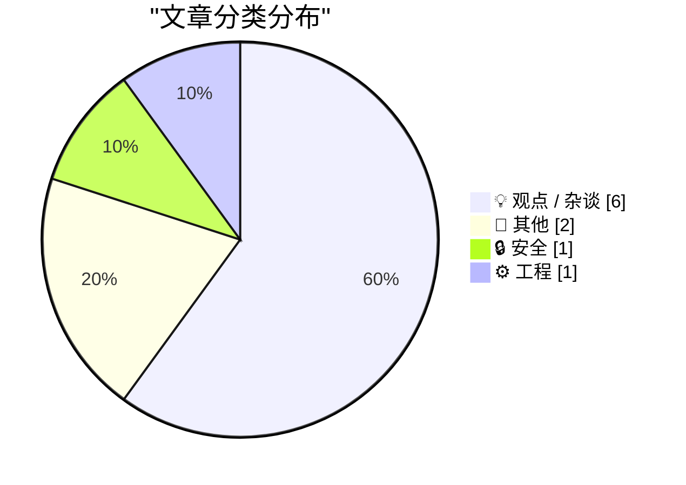
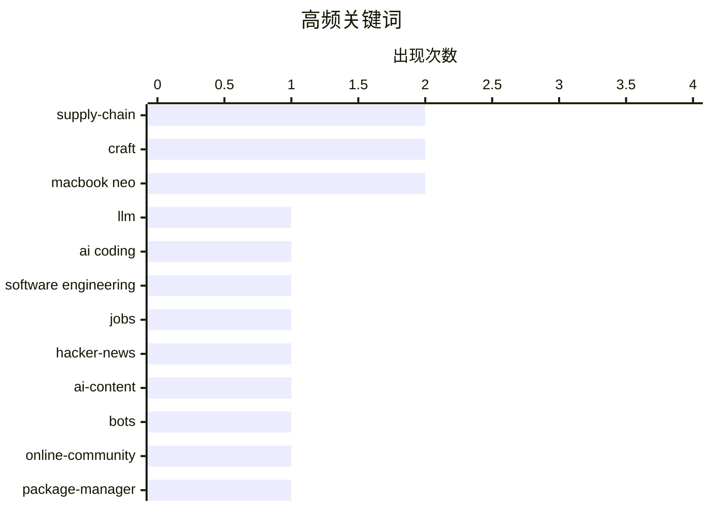

# 📰 AI 博客每日精选 — 2026-03-13

> 来自 Karpathy 推荐的 92 个顶级技术博客，AI 精选 Top 10

## 📝 今日看点

AI 正在重塑开发与内容生态：从“编程将终结”的激辩到社区里 AI 生成内容占比的追问，焦点落在创作权、生产力与真实信号的边界。与此同时，软件供应链与合规风险被进一步放大，包管理器安全、clean-room 服务化以及大模型厂商被纳入国家级审查，都指向“依赖与工具是否可信”的核心命题。硬件侧也在加速迭代，新机型的替代性与拆解热度上升，显示端侧算力正为下一波开发与 AI 负载做准备。

---

## 🏆 今日必读

🥇 **Coding After Coders: The End of Computer Programming as We Know It**

[Coding After Coders: The End of Computer Programming as We Know It](https://simonwillison.net/2026/Mar/12/coding-after-coders/#atom-everything) — simonwillison.net · 3 小时前 · 💡 观点 / 杂谈

> Coding After Coders: The End of Computer Programming as We Know It

🏷️ LLM, AI coding, software engineering, jobs

🥈 **How much of HN is AI?**

[How much of HN is AI?](https://lcamtuf.substack.com/p/how-much-of-hn-is-ai) — lcamtuf.substack.com · 21 小时前 · 💡 观点 / 杂谈

> How much of HN is AI?

🏷️ Hacker-News, AI-content, bots, online-community

🥉 **Reviewing ENISA’s Package Manager Advisory**

[Reviewing ENISA’s Package Manager Advisory](https://nesbitt.io/2026/03/12/reviewing-enisas-package-manager-advisory.html) — nesbitt.io · 13 小时前 · 🔒 安全

> Reviewing ENISA’s Package Manager Advisory

🏷️ package-manager, supply-chain, dependency-security, ENISA

---

## 📊 数据概览

| 扫描源 | 抓取文章 | 时间范围 | 精选 |
|:---:|:---:|:---:|:---:|
| 87/92 | 2473 篇 → 24 篇 | 24h | **10 篇** |

### 分类分布



### 高频关键词



<details>
<summary>📈 纯文本关键词图（终端友好）</summary>

```
supply-chain         │ ████████████████████ 2
craft                │ ████████████████████ 2
macbook neo          │ ████████████████████ 2
llm                  │ ██████████░░░░░░░░░░ 1
ai coding            │ ██████████░░░░░░░░░░ 1
software engineering │ ██████████░░░░░░░░░░ 1
jobs                 │ ██████████░░░░░░░░░░ 1
hacker-news          │ ██████████░░░░░░░░░░ 1
ai-content           │ ██████████░░░░░░░░░░ 1
bots                 │ ██████████░░░░░░░░░░ 1
```

</details>

### 🏷️ 话题标签

**supply-chain**(2) · **craft**(2) · **macbook neo**(2) · llm(1) · ai coding(1) · software engineering(1) · jobs(1) · hacker-news(1) · ai-content(1) · bots(1) · online-community(1) · package-manager(1) · dependency-security(1) · enisa(1) · ai(1) · creativity(1) · making(1) · open-source(1) · licensing(1) · clean-room(1)

---

## 💡 观点 / 杂谈

### 1. Coding After Coders: The End of Computer Programming as We Know It

[Coding After Coders: The End of Computer Programming as We Know It](https://simonwillison.net/2026/Mar/12/coding-after-coders/#atom-everything) — **simonwillison.net** · 3 小时前 · ⭐ 26/30

> Coding After Coders: The End of Computer Programming as We Know It

🏷️ LLM, AI coding, software engineering, jobs

---

### 2. How much of HN is AI?

[How much of HN is AI?](https://lcamtuf.substack.com/p/how-much-of-hn-is-ai) — **lcamtuf.substack.com** · 21 小时前 · ⭐ 23/30

> How much of HN is AI?

🏷️ Hacker-News, AI-content, bots, online-community

---

### 3. On Making

[On Making](http://beej.us/blog/data/ai-making/) — **beej.us** · 23 小时前 · ⭐ 23/30

> On Making

🏷️ AI, creativity, making, craft

---

### 4. MALUS - Clean Room as a Service

[MALUS - Clean Room as a Service](https://simonwillison.net/2026/Mar/12/malus/#atom-everything) — **simonwillison.net** · 2 小时前 · ⭐ 22/30

> MALUS - Clean Room as a Service

🏷️ open-source, licensing, clean-room, satire

---

### 5. Quoting Les Orchard

[Quoting Les Orchard](https://simonwillison.net/2026/Mar/12/les-orchard/#atom-everything) — **simonwillison.net** · 6 小时前 · ⭐ 22/30

> Quoting Les Orchard

🏷️ AI-assisted coding, developer culture, productivity, craft

---

### 6. Is the US military actually afraid of Claude? A new theory of why Anthropic was labeled a supply chain risk.

[Is the US military actually afraid of Claude? A new theory of why Anthropic was labeled a supply chain risk.](https://garymarcus.substack.com/p/is-the-us-military-actually-afraid) — **garymarcus.substack.com** · 2 小时前 · ⭐ 22/30

> Is the US military actually afraid of Claude? A new theory of why Anthropic was labeled a supply chain risk.

🏷️ Anthropic, Claude, supply-chain, AI-policy

---

## 📝 其他

### 7. Can the MacBook Neo replace my M4 Air?

[Can the MacBook Neo replace my M4 Air?](https://www.jeffgeerling.com/blog/2026/macbook-neo-replace-m4-air/) — **jeffgeerling.com** · 5 小时前 · ⭐ 21/30

> Can the MacBook Neo replace my M4 Air?

🏷️ MacBook Neo, Apple Silicon, benchmarks, laptop

---

### 8. MacBook Neo Teardown

[MacBook Neo Teardown](https://www.youtube.com/watch?v=5k7Lv7f-5CQ) — **daringfireball.net** · 4 小时前 · ⭐ 21/30

> MacBook Neo Teardown

🏷️ MacBook Neo, teardown, repairability, modularity

---

## 🔒 安全

### 9. Reviewing ENISA’s Package Manager Advisory

[Reviewing ENISA’s Package Manager Advisory](https://nesbitt.io/2026/03/12/reviewing-enisas-package-manager-advisory.html) — **nesbitt.io** · 13 小时前 · ⭐ 23/30

> Reviewing ENISA’s Package Manager Advisory

🏷️ package-manager, supply-chain, dependency-security, ENISA

---

## ⚙️ 工程

### 10. Software Proprioception

[Software Proprioception](https://unsung.aresluna.org/software-proprioception/) — **daringfireball.net** · 7 小时前 · ⭐ 22/30

> Software Proprioception

🏷️ UX, HCI, interaction design, hardware integration

---

*生成于 2026-03-13 23:05 | 扫描 87 源 → 获取 2473 篇 → 精选 10 篇*
*基于 [Hacker News Popularity Contest 2025](https://refactoringenglish.com/tools/hn-popularity/) RSS 源列表*
