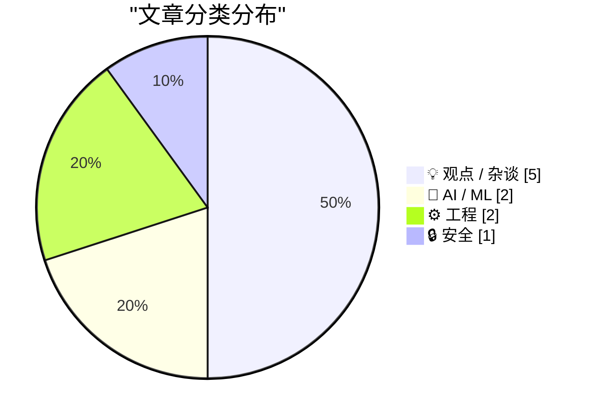
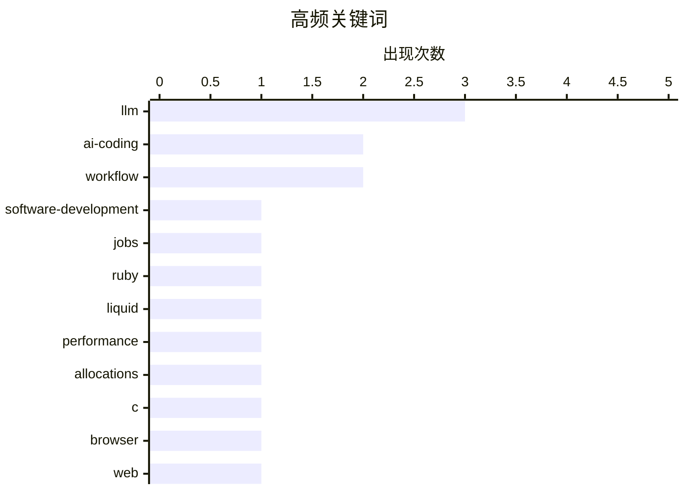

# 📰 AI 博客每日精选 — 2026-03-13

> 来自 Karpathy 推荐的 92 个顶级技术博客，AI 精选 Top 10

## 📝 今日看点

今天的主旋律是“AI 进场后的软件生产重构”：辅助编码正把写代码从个人手艺推向模型参与的流水线，连同岗位分工、权力结构与开发者身份焦虑一起被重排。与此同时，工程圈一边用微优化把性能榨到极致，一边又用极简实现反思现代软件的臃肿与复杂度，效率与可控性成为共同关键词。安全与信任也被推到台前——从供应链风险标签的解读，到硬件级隐私机制的细化，再到社区内容被 AI 批量生成的真实性疑云，技术进步正在倒逼更清晰的边界与治理规则。

---

## 🏆 今日必读

🥇 **编码之后的编码者：我们所熟知的计算机编程的终结**

[Coding After Coders: The End of Computer Programming as We Know It](https://simonwillison.net/2026/Mar/12/coding-after-coders/#atom-everything) — simonwillison.net · 3 小时前 · 🤖 AI / ML

> AI 辅助开发正在把“写代码”从手工技艺改造成由模型参与的生产流程，并由此改变软件工程岗位与组织形态。Clive Thompson 为《纽约时报杂志》撰写长文，采访了来自 Google、Amazon、Microsoft、Apple 等公司的 70+ 位开发者，以及 Anil Dash、Thomas Ptacek、Steve Yegge 等业界人士，收集一线使用与态度分歧。文章聚焦 LLM 在需求表达、代码生成、调试与重构等环节对工作流的重排，以及由此带来的效率、可靠性与责任边界问题。它也把讨论从“工具是否更强”推进到“谁拥有软件生产能力、谁被替代、团队如何重新分工”的权力与经济层面。核心观点是：编程不会消失，但“编程作为职业/工艺的默认形态”正在被快速改写。

💡 **为什么值得读**: 把“AI 写代码”从碎片化体验提升到产业级全景访谈与结构化结论，适合用来校准你对未来软件开发分工与职业路径的判断。

🏷️ AI-coding, LLM, software-development, jobs

🥈 **Shopify/liquid：性能提升——解析+渲染快 53%，分配次数减少 61%**

[Shopify/liquid: Performance: 53% faster parse+render, 61% fewer allocations](https://simonwillison.net/2026/Mar/13/liquid/#atom-everything) — simonwillison.net · -285 分钟前 · ⚙️ 工程

> Liquid（Shopify 的开源 Ruby 模板引擎）通过一系列微优化显著降低了解析与渲染开销。该 PR 由 Shopify CEO Tobias Lütke 提交，给出的基准结果是 parse+render 速度提升 53%，内存分配次数减少 61%。改动以“许多细小但可叠加的优化”为主，体现了围绕热点路径做系统性剖析与迭代的思路，而不是单点重写。文章还补充了 Liquid 的历史背景：其最初在 2005 年创建，并在设计上受 Django 启发。结论是：对模板引擎这类基础设施，持续的性能工程能带来可观、可量化的收益。

💡 **为什么值得读**: 给出清晰的性能指标（53%/61%）与可复用的优化思路，是学习 Ruby 运行时性能调优与基准驱动迭代的高性价比案例。

🏷️ Ruby, Liquid, performance, allocations

🥉 **用 1000 行 C 写一个 Web（迷你浏览器）**

[The web in 1000 lines of C](https://maurycyz.com/projects/tinyweb/) — maurycyz.com · 23 小时前 · ⚙️ 工程

> 现代浏览器的规模与复杂度（例如 Chromium 约 4900 万行代码）与“只想读网页/博客”的需求之间存在巨大落差。这个项目尝试用约 1000 行 C 实现一个能“真正渲染页面（而非仅打印 HTML）且链接可点击”的极简 Web 客户端，目标是覆盖作者的博客阅读清单。取舍方向是放弃多 GB 的 JavaScript 生态与复杂平台能力，优先保证基础渲染与导航闭环可用。它把浏览器拆解为最小必要能力集合，让人直观看到网络协议、解析与渲染的核心路径到底需要多少代码。结论是：在明确约束下，“可用的 Web”可以比主流浏览器轻量得多，但这依赖对功能范围的严格限定。

💡 **为什么值得读**: 用极端约束把浏览器问题“去神秘化”，非常适合想理解渲染/协议最小闭环、或想做嵌入式/低资源 Web 客户端的人快速建立直觉。

🏷️ C, browser, web, minimalism

---

## 📊 数据概览

| 扫描源 | 抓取文章 | 时间范围 | 精选 |
|:---:|:---:|:---:|:---:|
| 89/92 | 2519 篇 → 40 篇 | 24h | **10 篇** |

### 分类分布



### 高频关键词



<details>
<summary>📈 纯文本关键词图（终端友好）</summary>

```
llm                  │ ████████████████████ 3
ai-coding            │ █████████████░░░░░░░ 2
workflow             │ █████████████░░░░░░░ 2
software-development │ ███████░░░░░░░░░░░░░ 1
jobs                 │ ███████░░░░░░░░░░░░░ 1
ruby                 │ ███████░░░░░░░░░░░░░ 1
liquid               │ ███████░░░░░░░░░░░░░ 1
performance          │ ███████░░░░░░░░░░░░░ 1
allocations          │ ███████░░░░░░░░░░░░░ 1
c                    │ ███████░░░░░░░░░░░░░ 1
```

</details>

### 🏷️ 话题标签

**llm**(3) · **ai-coding**(2) · **workflow**(2) · software-development(1) · jobs(1) · ruby(1) · liquid(1) · performance(1) · allocations(1) · c(1) · browser(1) · web(1) · minimalism(1) · anthropic(1) · claude(1) · supply-chain(1) · ai-policy(1) · macos(1) · camera(1) · hardware-security(1)

---

## 💡 观点 / 杂谈

### 1. Pluralistic：再来三种 AI 精神病（2026 年 3 月 12 日）

[Pluralistic: Three more AI psychoses (12 Mar 2026)](https://pluralistic.net/2026/03/12/normal-technology/) — **pluralistic.net** · -198 分钟前 · ⭐ 23/30

> 围绕 AI 的集体恐慌、误判与情绪化叙事正在反复出现，且常常遮蔽真正需要解决的技术与社会问题。该期 Pluralistic 以“Three more AI psychoses”为主线，延续 Cory Doctorow 一贯的批判视角，呼吁在喧嚣中保持冷静并识别叙事陷阱。内容以链接集形式展开，同时穿插多类话题线索（例如法律/媒体事件、文化与创作相关的讨论、以及一些轻松的“delights”条目）来映射技术话语如何影响公共议程。整体强调的是：与其被 AI 话题牵着走，不如把注意力放回权力结构、监管与可执行的社会对策。结论是：AI 争议的关键往往不在模型本身，而在制度与商业激励如何塑造人们的集体认知。

🏷️ AI, LLM, misinformation, policy

---

### 2. AI 之后，程序员做什么？

[What do coders do after AI?](https://anildash.com/2026/03/13/coders-after-ai/) — **anildash.com** · -60 分钟前 · ⭐ 23/30

> LLM 正在逼近“几乎可以成为整座软件工厂”的能力边界，从而重塑软件生产的经济学与权力结构。作者结合与《纽约时报杂志》Clive Thompson 的对话指出，当下 AI 的落地更多被用来替代大量科技岗位，而不仅仅是提升个人效率。由此带来的变化不止是编码方式，而是团队组织、所有权与议价能力：谁能用 AI 低成本生产软件、谁在分配中失去话语权。文章把问题落到“编码者的下一步”：当生成与实现更易自动化，人的价值需要转向更难外包给模型的能力（例如目标定义、责任承担、对用户与社会影响的判断）。核心观点是：应对 AI 的关键不是崇拜工具，而是争夺软件生产与分配体系中的权力与规则。

🏷️ LLM, software-jobs, automation, future-of-work

---

### 3. 引用 Les Orchard：AI 辅助编码让开发者分裂更显性

[Quoting Les Orchard](https://simonwillison.net/2026/Mar/12/les-orchard/#atom-everything) — **simonwillison.net** · 6 小时前 · ⭐ 22/30

> AI 辅助编码正在暴露一个原本就存在但不易被看见的开发者分野。Les Orchard 将其概括为两类人：重视工艺与过程的“craft-lovers”，以及以结果为导向的“make-it-go people”。在 AI 出现之前，两类人表面上做着相同的日常：手写代码、用同样的编辑器/语言、走同样的 PR 流程，因此差异被协作结构掩盖。AI 把“怎么做”与“做成什么”重新拉开距离，让工作方式与价值观冲突变得更突出。核心观点是：工具变化并非只带来效率差异，更会放大团队内部关于质量、控制与身份认同的长期张力。

🏷️ AI-assistance, developer-culture, workflow, productivity

---

### 4. 悲伤与 AI 的分裂

[‘Grief and the AI Split’](https://blog.lmorchard.com/2026/03/11/grief-and-the-ai-split/) — **daringfireball.net** · -922 分钟前 · ⭐ 22/30

> AI 辅助编码在开发者群体中引发的，不只是生产力变化，还有一种接近“失去旧世界”的悲伤与不确定感。作者回顾自己从 1982 年开始编程的经历：过去每学一门语言都只是“达成目的的新工具”，AI 似乎也可以被视作这条梯子上的新一阶。可同时，梯子本身与它倚靠的建筑都在变化，让人无法确定下一步会通向哪里。文章把这种矛盾心态落到“AI split”：有人把 AI 当作自然演进，有人把它视作对编程身份与价值的断裂。核心观点是：承认迷惘与哀伤本身，是在剧烈变动中继续前行的一部分。

🏷️ AI-coding, developer-experience, grief, workflow

---

### 5. Hacker News 上有多少内容是 AI 生成的？

[How much of HN is AI?](https://lcamtuf.substack.com/p/how-much-of-hn-is-ai) — **lcamtuf.substack.com** · 21 小时前 · ⭐ 22/30

> Hacker News 作为极客新闻聚合地带来巨大流量，同时也伴随长期的评论区毒性与对作者的攻击，这使得“内容质量与真实性”问题更尖锐。作者提出一个具体但棘手的问题：HN 上到底有多少帖子或评论已经是 AI 生成的。文章从个人经验与平台生态切入，讨论要给出可信比例所面临的方法学困难：缺乏可靠标注、文本风格高度混杂、以及“疑似 AI”与“写作习惯”之间的模糊边界。它把问题指向可操作的检测与估算思路（而非仅靠直觉指控），并强调即便无法得到精确数字，趋势本身也会影响社区信任与讨论质量。核心观点是：在 AI 文本进入公共讨论场后，“我们在和谁对话”正在成为必须正视的新型社区治理问题。

🏷️ Hacker-News, AI-content, moderation, community

---

## 🤖 AI / ML

### 6. 编码之后的编码者：我们所熟知的计算机编程的终结

[Coding After Coders: The End of Computer Programming as We Know It](https://simonwillison.net/2026/Mar/12/coding-after-coders/#atom-everything) — **simonwillison.net** · 3 小时前 · ⭐ 26/30

> AI 辅助开发正在把“写代码”从手工技艺改造成由模型参与的生产流程，并由此改变软件工程岗位与组织形态。Clive Thompson 为《纽约时报杂志》撰写长文，采访了来自 Google、Amazon、Microsoft、Apple 等公司的 70+ 位开发者，以及 Anil Dash、Thomas Ptacek、Steve Yegge 等业界人士，收集一线使用与态度分歧。文章聚焦 LLM 在需求表达、代码生成、调试与重构等环节对工作流的重排，以及由此带来的效率、可靠性与责任边界问题。它也把讨论从“工具是否更强”推进到“谁拥有软件生产能力、谁被替代、团队如何重新分工”的权力与经济层面。核心观点是：编程不会消失，但“编程作为职业/工艺的默认形态”正在被快速改写。

🏷️ AI-coding, LLM, software-development, jobs

---

### 7. 美军真的在害怕 Claude 吗？关于 Anthropic 被标记为供应链风险的新解释

[Is the US military actually afraid of Claude? A new theory of why Anthropic was labeled a supply chain risk.](https://garymarcus.substack.com/p/is-the-us-military-actually-afraid) — **garymarcus.substack.com** · 2 小时前 · ⭐ 24/30

> Pentagon 将 Anthropic 标记为“供应链风险”的说法看似反常，引发了“军方是否在忌惮 Claude 能力”的猜测。文章拆解这一论点的逻辑链条，并提出可能存在的替代解释：风险标签未必指向模型智力本身，而可能与供应链审查口径、依赖路径、数据/基础设施控制权等更传统的安全框架相关。作者将争议点落在“供应链风险”这一概念如何被定义、如何被用于政策与采购决策上，从而解释为何会出现表面上不合直觉的结论。整体观点是：与其把事件解读为对某个模型的恐惧，不如把它放回国家安全体系的制度性风险管理语境中理解。

🏷️ Anthropic, Claude, supply-chain, AI-policy

---

## ⚙️ 工程

### 8. Shopify/liquid：性能提升——解析+渲染快 53%，分配次数减少 61%

[Shopify/liquid: Performance: 53% faster parse+render, 61% fewer allocations](https://simonwillison.net/2026/Mar/13/liquid/#atom-everything) — **simonwillison.net** · -285 分钟前 · ⭐ 24/30

> Liquid（Shopify 的开源 Ruby 模板引擎）通过一系列微优化显著降低了解析与渲染开销。该 PR 由 Shopify CEO Tobias Lütke 提交，给出的基准结果是 parse+render 速度提升 53%，内存分配次数减少 61%。改动以“许多细小但可叠加的优化”为主，体现了围绕热点路径做系统性剖析与迭代的思路，而不是单点重写。文章还补充了 Liquid 的历史背景：其最初在 2005 年创建，并在设计上受 Django 启发。结论是：对模板引擎这类基础设施，持续的性能工程能带来可观、可量化的收益。

🏷️ Ruby, Liquid, performance, allocations

---

### 9. 用 1000 行 C 写一个 Web（迷你浏览器）

[The web in 1000 lines of C](https://maurycyz.com/projects/tinyweb/) — **maurycyz.com** · 23 小时前 · ⭐ 24/30

> 现代浏览器的规模与复杂度（例如 Chromium 约 4900 万行代码）与“只想读网页/博客”的需求之间存在巨大落差。这个项目尝试用约 1000 行 C 实现一个能“真正渲染页面（而非仅打印 HTML）且链接可点击”的极简 Web 客户端，目标是覆盖作者的博客阅读清单。取舍方向是放弃多 GB 的 JavaScript 生态与复杂平台能力，优先保证基础渲染与导航闭环可用。它把浏览器拆解为最小必要能力集合，让人直观看到网络协议、解析与渲染的核心路径到底需要多少代码。结论是：在明确约束下，“可用的 Web”可以比主流浏览器轻量得多，但这依赖对功能范围的严格限定。

🏷️ C, browser, web, minimalism

---

## 🔒 安全

### 10. Apple《平台安全指南》新增说明：MacBook Neo 的屏幕相机指示灯

[Apple’s Platform Security Guide Adds a Brief Note on the MacBook Neo’s On-Screen Camera Indicator](https://support.apple.com/guide/security/mac-on-screen-camera-indicator-light-sec75a2d237d/1/web/1) — **daringfireball.net** · -49 分钟前 · ⭐ 23/30

> MacBook Neo 在 A18 Pro 内结合系统软件与专用硅组件，为摄像头视频流提供额外安全机制。Apple 在《Platform Security Guide》中明确声称：即使在 macOS 中拥有 root 或 kernel 权限的不受信任软件，也无法在不点亮“屏幕上的相机指示灯”的情况下启用摄像头。该说明强调了“指示灯与摄像头启用的强绑定”，把可见提示从软件策略提升到硬件/架构层面的保证。与此同时，文档只给出结论式描述，缺少实现细节与可供外部验证的技术说明。核心观点是：Apple 正在用更强的硬件隔离来收紧摄像头隐私边界，但外界仍需要更多透明度来评估其具体安全属性。

🏷️ macOS, camera, hardware-security, privacy

---

*生成于 2026-03-13 23:00 | 扫描 89 源 → 获取 2519 篇 → 精选 10 篇*
*基于 [Hacker News Popularity Contest 2025](https://refactoringenglish.com/tools/hn-popularity/) RSS 源列表*
