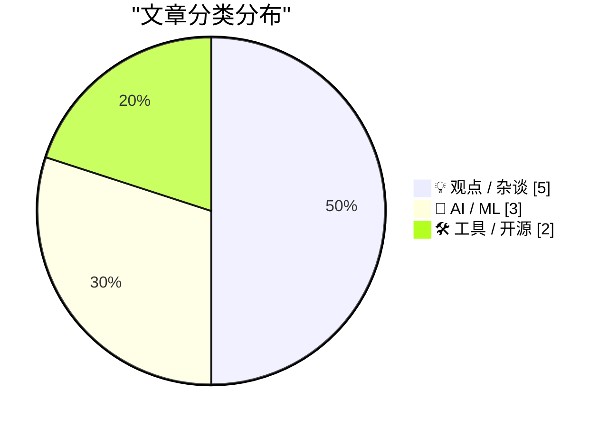
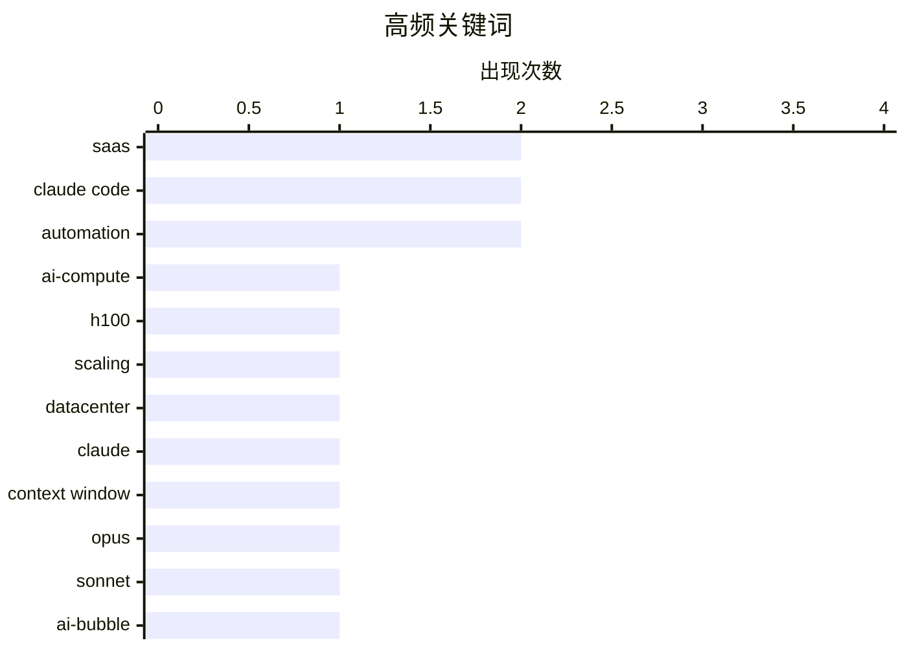

# 📰 AI 博客每日精选 — 2026-03-14

> 来自 Karpathy 推荐的 92 个顶级技术博客，AI 精选 Top 10

## 📝 今日看点

今天的焦点首先从“模型”转向“系统”：扩展 AI 算力的关键瓶颈正落在先进封装/HBM 供给、集群互连与网络能力等硬件与基础设施环节，算力竞争变成供应链与工程体系的比拼。与此同时，大模型一边用 1M 超长上下文把能力推向“吃下代码库与长文档”的新应用形态，一边在头部竞赛中拉开差距，连大厂也因性能压力选择推迟发布。生成式 AI 也在重塑软件生产与商业叙事：个人用 AI 辅助编程在数天内做出产品级工具成为现实，但 SaaS 增长神话降温、托管外包引发主权与控制权担忧，软件行业进入更务实、更分化的新阶段。

---

## 🏆 今日必读

🥇 **Dylan Patel：深挖扩展 AI 算力的三大瓶颈（以及为什么今天的 H100 比三年前更值钱）**

[Dylan Patel — Deep dive on the 3 big bottlenecks to scaling AI compute](https://www.dwarkesh.com/p/dylan-patel) — dwarkesh.com · 13 小时前 · 🤖 AI / ML

> 把 AI 训练/推理规模做大，限制因素早已不只是“买更多 GPU”。核心瓶颈被拆成三类：先进封装与 HBM 等关键供给（例如 CoWoS、HBM 产能与良率）、集群互连与网络/光模块能力（决定多机扩展效率与通信开销）、以及数据中心供电散热与建设周期（决定能否把算力真正上线并稳定跑满）。这些约束会直接推高单位算力成本，并让“可交付的算力”与“纸面 GPU 数量”出现巨大差距。H100 之所以在今天更值钱，逻辑来自供需与交付时间：当上下游瓶颈让新增算力更难落地时，现货可用的高端 GPU 的边际价值反而上升。整体观点是，算力扩张是供应链+基础设施+系统工程的组合问题，单点突破不足以解决规模化。 

💡 **为什么值得读**: 把“为什么算力越买越贵、越堆越难用”讲清楚到供应链与数据中心层面，适合做算力规划、采购和集群架构决策的人快速建立全局视角。

🏷️ AI-compute, H100, scaling, datacenter

🥈 **Claude Opus 4.6 与 Sonnet 4.6 的 1M 上下文正式可用（GA）**

[1M context is now generally available for Opus 4.6 and Sonnet 4.6](https://simonwillison.net/2026/Mar/13/1m-context/#atom-everything) — simonwillison.net · 10 小时前 · 🤖 AI / ML

> 1M context window 现在对 Claude Opus 4.6 和 Sonnet 4.6 普遍可用，意味着单次请求可容纳超长文档/代码库级别的输入。最关键的变化是全 1M 窗口适用“标准定价”，没有长上下文溢价（long-context premium）。这与 OpenAI、Gemini 在超长提示词上通常“越长越贵”的计价方式形成对比，使得长文档分析、全量代码审阅、长对话记忆等用例的成本更可预测。对使用者来说，产品设计可以更大胆地减少分块（chunking）与多轮拼接带来的工程复杂度，但也需要更关注提示词组织与检索策略以避免把无关内容塞满窗口。整体信号是，长上下文正在从“高价特殊能力”变成默认能力，成本曲线开始向应用层倾斜。

💡 **为什么值得读**: 如果你在做长文档/代码库级的 LLM 应用，这条信息直接影响成本模型与架构取舍（分块/RAG/多轮编排是否还值得）。

🏷️ Claude, context window, Opus, Sonnet

🥉 **付费：喷子视角的 SaaS 末日指南（SaaSpocalypse）**

[Premium: The Hater's Guide To The SaaSpocalypse](https://www.wheresyoured.at/hatersguide-saas/) — wheresyoured.at · 12 小时前 · 💡 观点 / 杂谈

> 生成式 AI 泡沫被放进更大的背景里解读：软件行业超高速增长时代结束，作者称之为 “Rot-Com Bubble”。当 SaaS 增长叙事失效、获客变贵、续费与扩张放缓时，GenAI 被包装成新的增长引擎来延续估值逻辑。文章从商业模式与市场结构出发，质疑大量 AI 产品是否只是把旧软件换皮、把成本从人力转移到算力账单，同时缺乏可持续的单位经济（unit economics）。在“软件末日化”的竞争中，价格战、同质化与平台挤压会让许多公司进入被并购/被淘汰的结局。作者的核心立场偏悲观：AI 不是自动续命药，行业需要回到利润、效率与真实需求，而不是靠叙事融资。

💡 **为什么值得读**: 想看清“AI 热潮”背后的 SaaS 结构性问题（而非模型参数党视角），这篇提供了尖锐但成体系的商业与周期分析。

🏷️ SaaS, AI-bubble, startups, market-cycle

---

## 📊 数据概览

| 扫描源 | 抓取文章 | 时间范围 | 精选 |
|:---:|:---:|:---:|:---:|
| 88/92 | 2510 篇 → 21 篇 | 24h | **10 篇** |

### 分类分布



### 高频关键词



<details>
<summary>📈 纯文本关键词图（终端友好）</summary>

```
saas           │ ████████████████████ 2
claude code    │ ████████████████████ 2
automation     │ ████████████████████ 2
ai-compute     │ ██████████░░░░░░░░░░ 1
h100           │ ██████████░░░░░░░░░░ 1
scaling        │ ██████████░░░░░░░░░░ 1
datacenter     │ ██████████░░░░░░░░░░ 1
claude         │ ██████████░░░░░░░░░░ 1
context window │ ██████████░░░░░░░░░░ 1
opus           │ ██████████░░░░░░░░░░ 1
```

</details>

### 🏷️ 话题标签

**saas**(2) · **claude code**(2) · **automation**(2) · ai-compute(1) · h100(1) · scaling(1) · datacenter(1) · claude(1) · context window(1) · opus(1) · sonnet(1) · ai-bubble(1) · startups(1) · market-cycle(1) · agentic coding(1) · custom software(1) · cli(1) · github(1) · gitlab(1) · forgejo(1)

---

## 💡 观点 / 杂谈

### 1. 付费：喷子视角的 SaaS 末日指南（SaaSpocalypse）

[Premium: The Hater's Guide To The SaaSpocalypse](https://www.wheresyoured.at/hatersguide-saas/) — **wheresyoured.at** · 12 小时前 · ⭐ 24/30

> 生成式 AI 泡沫被放进更大的背景里解读：软件行业超高速增长时代结束，作者称之为 “Rot-Com Bubble”。当 SaaS 增长叙事失效、获客变贵、续费与扩张放缓时，GenAI 被包装成新的增长引擎来延续估值逻辑。文章从商业模式与市场结构出发，质疑大量 AI 产品是否只是把旧软件换皮、把成本从人力转移到算力账单，同时缺乏可持续的单位经济（unit economics）。在“软件末日化”的竞争中，价格战、同质化与平台挤压会让许多公司进入被并购/被淘汰的结局。作者的核心立场偏悲观：AI 不是自动续命药，行业需要回到利润、效率与真实需求，而不是靠叙事融资。

🏷️ SaaS, AI-bubble, startups, market-cycle

---

### 2. 顺带一提：软件、交钥匙、托管、即服务

[Btw: Software, turnkey, beheerd, as a service](https://berthub.eu/articles/posts/software-turnkey-as-a-service/) — **berthub.eu** · 17 小时前 · ⭐ 23/30

> 荷兰税务部门计划把增值税（BTW）相关系统外包给一家美国公司，引发对国家关键数字基础设施的担忧。争议点不止是“使用美国软件”，还包括服务器与运维将由美国方面“完全托管管理”，让数据控制权与运行主导权外移。文章指出这种交钥匙式外包会带来主权风险、合规与审计难题、供应商锁定，以及在政治/法律变化下的连续性风险。作者提到 3 月 19 日将有议会委员会会议讨论此事，并呼吁决策者充分意识到“托管权”比“软件许可证”更关键。结论是，政府 IT 采购不应只看功能与成本，更要把控制权、透明度与可替代性作为硬指标。

🏷️ government IT, outsourcing, SaaS, data sovereignty

---

### 3. 悲伤与 AI 分裂

[‘Grief and the AI Split’](https://blog.lmorchard.com/2026/03/11/grief-and-the-ai-split/) — **daringfireball.net** · 15 小时前 · ⭐ 22/30

> 把 AI 辅助编程放进个人长期编程经历中，它更像是从 1982 年至今不断更换工具链的一次延续，而不是“编程的断裂”。但作者也强调需要“轻拿轻放”：梯子在变、靠着的建筑也在变，没人能确定软件开发会被改造成什么样子。所谓 “AI split” 指向社区与个人内部的分化——有人拥抱效率与新能力，有人对失控、失业或创作意义的变化感到悲伤。文章的重点不在选边站，而在承认情绪与不确定性真实存在，同时继续以务实的方式使用新工具。结论是，用 AI 可以，但要保持谦逊与警觉，不要把当下的工具形态误当成终局。

🏷️ AI-assisted coding, developer experience, tooling, culture

---

### 4. 大厂工程师需要“大 ego”

[Big tech engineers need big egos](https://seangoedecke.com/big-tech-needs-big-egos/) — **seangoedecke.com** · 5 小时前 · ⭐ 21/30

> “技术圈不该有 ego”是常见立场，但作者认为在大型科技公司里，完全没有 ego 的工程师很难生存。原因在于大厂的协作与决策充满评审、竞争与资源博弈，需要足够的自信与驱动力去推动方案、承担影响力与争取话语权。过度打压 ego 可能带来另一种问题：回避冲突、放弃所有权（ownership）、在关键时刻不敢下注。文章同时承认“自大”会伤害团队，因此强调把 ego 与同理心、谦逊结合，形成可合作的强主张（strong opinions, loosely held）。核心观点是，问题不在 ego 是否存在，而在能否把它转化为对结果负责的行动力。

🏷️ engineering culture, ego, big tech, career

---

### 5. 引用 Craig Mod：用 Claude Code 五天做出自己的会计软件

[Quoting Craig Mod](https://simonwillison.net/2026/Mar/13/craig-mod/#atom-everything) — **simonwillison.net** · 12 小时前 · ⭐ 20/30

> 这则内容摘录并强调了 Craig Mod 的一个具体经历：市面会计软件满足不了需求，于是用 Claude Code 在约 5 天内自建了一套。成品的关键特性包括：速度很快、完全本地运行、支持多币种、自动拉取每日（含历史）汇率、能导入任意 CSV 并进行结构化处理。被引用的重点不只是“AI 能写代码”，而是 AI 把个人定制工具的交付周期压到非常短，且功能已接近成熟产品。它也暗示了新的软件生产范式：从“买软件将就”转向“用 AI 做一套刚好合适的”。整体观点是，LLM 正在让“个人软件”重新变得经济且可行。

🏷️ AI coding, Claude Code, accounting software, automation

---

## 🤖 AI / ML

### 6. Dylan Patel：深挖扩展 AI 算力的三大瓶颈（以及为什么今天的 H100 比三年前更值钱）

[Dylan Patel — Deep dive on the 3 big bottlenecks to scaling AI compute](https://www.dwarkesh.com/p/dylan-patel) — **dwarkesh.com** · 13 小时前 · ⭐ 27/30

> 把 AI 训练/推理规模做大，限制因素早已不只是“买更多 GPU”。核心瓶颈被拆成三类：先进封装与 HBM 等关键供给（例如 CoWoS、HBM 产能与良率）、集群互连与网络/光模块能力（决定多机扩展效率与通信开销）、以及数据中心供电散热与建设周期（决定能否把算力真正上线并稳定跑满）。这些约束会直接推高单位算力成本，并让“可交付的算力”与“纸面 GPU 数量”出现巨大差距。H100 之所以在今天更值钱，逻辑来自供需与交付时间：当上下游瓶颈让新增算力更难落地时，现货可用的高端 GPU 的边际价值反而上升。整体观点是，算力扩张是供应链+基础设施+系统工程的组合问题，单点突破不足以解决规模化。 

🏷️ AI-compute, H100, scaling, datacenter

---

### 7. Claude Opus 4.6 与 Sonnet 4.6 的 1M 上下文正式可用（GA）

[1M context is now generally available for Opus 4.6 and Sonnet 4.6](https://simonwillison.net/2026/Mar/13/1m-context/#atom-everything) — **simonwillison.net** · 10 小时前 · ⭐ 25/30

> 1M context window 现在对 Claude Opus 4.6 和 Sonnet 4.6 普遍可用，意味着单次请求可容纳超长文档/代码库级别的输入。最关键的变化是全 1M 窗口适用“标准定价”，没有长上下文溢价（long-context premium）。这与 OpenAI、Gemini 在超长提示词上通常“越长越贵”的计价方式形成对比，使得长文档分析、全量代码审阅、长对话记忆等用例的成本更可预测。对使用者来说，产品设计可以更大胆地减少分块（chunking）与多轮拼接带来的工程复杂度，但也需要更关注提示词组织与检索策略以避免把无关内容塞满窗口。整体信号是，长上下文正在从“高价特殊能力”变成默认能力，成本曲线开始向应用层倾斜。

🏷️ Claude, context window, Opus, Sonnet

---

### 8. 纽约时报：因性能担忧，Meta 推迟发布新一代 AI 模型

[NYT: ‘Meta Delays Rollout of New AI Model After Performance Concerns’](https://www.nytimes.com/2026/03/12/technology/meta-avocado-ai-model-delayed.html?unlocked_article_code=1.S1A.vI_6.4j717gwtFem0) — **daringfireball.net** · 12 小时前 · ⭐ 22/30

> Meta 的新基础模型（代号 Avocado）在内部测试中被认为在推理、编程和写作等能力上落后于 Google、OpenAI、Anthropic 的头部模型，导致发布计划被推迟。消息称该模型相比 Meta 之前的模型有提升，并在部分对比中表现更好，但整体仍未达到公司预期的竞争位置。推迟发布反映了当下大模型竞争的门槛：不仅要“比上一代强”，还要在关键基准与用户体验上对标行业最强。报道也暗示了发布节奏与口碑风险之间的权衡——过早推出会放大短板，延后则可能错过叙事与市场窗口。核心观点是，领先模型的差距已经足以影响产品战略与发布时间表。

🏷️ Meta, foundation model, benchmarking, reasoning

---

## 🛠 工具 / 开源

### 9. 《软件发疯了》（Software Bonkers）

[‘Software Bonkers’](https://craigmod.com/essays/software_bonkers/) — **daringfireball.net** · 14 小时前 · ⭐ 23/30

> 现成会计软件无法满足个性化需求时，作者用 Claude Code 在大约 5 天内做出了一套自用会计系统。系统特性非常“产品级”：完全本地运行、速度很快、支持多币种、可拉取每日（含历史）汇率、能吞下各种 CSV 并结构化呈现。这个案例把 LLM 辅助编程的能力从“写小脚本”推进到“短周期交付可长期使用的专用工具”。同时也隐含新的工程现实：需求表达、测试与数据边界条件，会比“把代码写出来”更决定成败。最终观点是，软件的生产方式正在被重写——个人也能用 AI 快速获得过去需要团队才能做出的定制化软件。

🏷️ Claude Code, agentic coding, custom software, automation

---

### 10. Forge：统一管理 GitHub、GitLab、Gitea、Forgejo 与 Bitbucket 的 CLI

[Forge](https://nesbitt.io/2026/03/13/forge.html) — **nesbitt.io** · 19 小时前 · ⭐ 23/30

> 多代码托管平台并存时，开发者常被迫在不同 CLI/不同 API/不同认证方式之间来回切换。Forge 试图提供一个统一命令行入口，同时覆盖 GitHub、GitLab、Gitea、Forgejo 和 Bitbucket。它把各家平台的常见操作抽象为一致的命令与配置，从而降低脚本化/自动化时的适配成本。对需要在多组织、多客户或自建与云端混合环境工作的团队，统一 CLI 能减少工具碎片并提升可维护性。核心价值在于“同一套工作流跑遍多家 forge”，而不是再为每个平台单独学习与集成。

🏷️ CLI, GitHub, GitLab, Forgejo

---

*生成于 2026-03-14 05:27 | 扫描 88 源 → 获取 2510 篇 → 精选 10 篇*
*基于 [Hacker News Popularity Contest 2025](https://refactoringenglish.com/tools/hn-popularity/) RSS 源列表*
