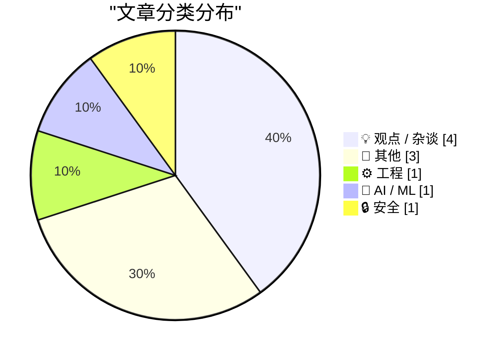
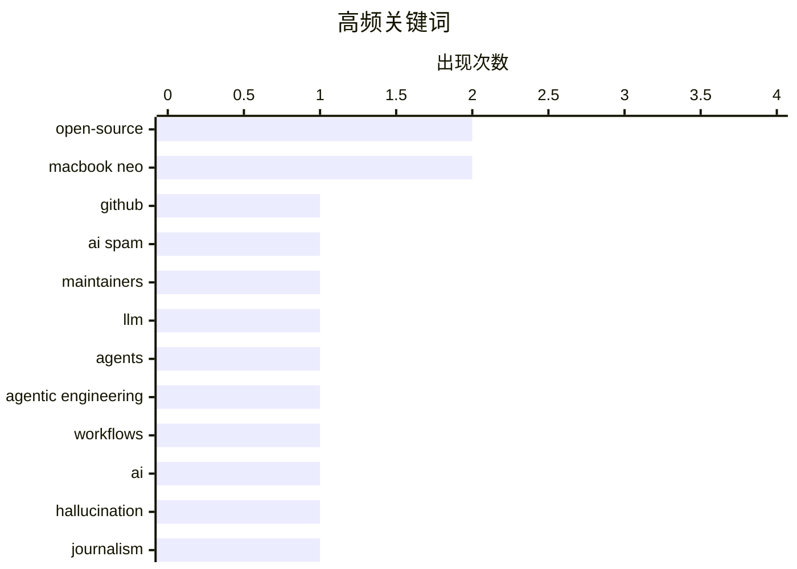

# 📰 AI 博客每日精选 — 2026-03-15

> 来自 Karpathy 推荐的 92 个顶级技术博客，AI 精选 Top 10

## 📝 今日看点

AI 开发正从“做模型”转向“做代理”，围绕 agentic engineering 的工程范式开始成型。与此同时，AI 生成虚假引语引发的信任危机叠加“仅靠扩规模不够”的新证据，迫使行业把重心拉回到可靠性、评测与治理。开源生态也在可持续性与基础设施稳定性上承压：维护者如何被合理资助、工具链与包管理的波动如何收敛，成为绕不开的公共议题。硬件端 MacBook Neo 既搅动 PC 阵营的竞争与产品路线，也带出可维修性讨论，而更狡猾的 Apple 账号钓鱼案例则提示安全对抗正在升级为精细化社会工程。

---

## 🏆 今日必读

🥇 **Quoting Jannis Leidel**

[Quoting Jannis Leidel](https://simonwillison.net/2026/Mar/14/jannis-leidel/#atom-everything) — simonwillison.net · 7 小时前 · ⚙️ 工程

> Quoting Jannis Leidel

🏷️ GitHub, AI spam, open-source, maintainers

🥈 **My fireside chat about agentic engineering at the Pragmatic Summit**

[My fireside chat about agentic engineering at the Pragmatic Summit](https://simonwillison.net/2026/Mar/14/pragmatic-summit/#atom-everything) — simonwillison.net · 7 小时前 · 🤖 AI / ML

> My fireside chat about agentic engineering at the Pragmatic Summit

🏷️ LLM, agents, agentic engineering, workflows

🥉 **Ars Technica Fires Reporter Benj Edwards After He Published Story With AI-Fabricated Quotes**

[Ars Technica Fires Reporter Benj Edwards After He Published Story With AI-Fabricated Quotes](https://futurism.com/artificial-intelligence/ars-technica-fires-reporter-ai-quotes) — daringfireball.net · 8 小时前 · 💡 观点 / 杂谈

> Ars Technica Fires Reporter Benj Edwards After He Published Story With AI-Fabricated Quotes

🏷️ AI, hallucination, journalism, ethics

---

## 📊 数据概览

| 扫描源 | 抓取文章 | 时间范围 | 精选 |
|:---:|:---:|:---:|:---:|
| 89/92 | 2520 篇 → 14 篇 | 24h | **10 篇** |

### 分类分布



### 高频关键词



<details>
<summary>📈 纯文本关键词图（终端友好）</summary>

```
open-source         │ ████████████████████ 2
macbook neo         │ ████████████████████ 2
github              │ ██████████░░░░░░░░░░ 1
ai spam             │ ██████████░░░░░░░░░░ 1
maintainers         │ ██████████░░░░░░░░░░ 1
llm                 │ ██████████░░░░░░░░░░ 1
agents              │ ██████████░░░░░░░░░░ 1
agentic engineering │ ██████████░░░░░░░░░░ 1
workflows           │ ██████████░░░░░░░░░░ 1
ai                  │ ██████████░░░░░░░░░░ 1
```

</details>

### 🏷️ 话题标签

**open-source**(2) · **macbook neo**(2) · **github**(1) · ai spam(1) · maintainers(1) · llm(1) · agents(1) · agentic engineering(1) · workflows(1) · ai(1) · hallucination(1) · journalism(1) · ethics(1) · funding(1) · government(1) · procurement(1) · phishing(1) · apple id(1) · mfa(1) · social engineering(1)

---

## 💡 观点 / 杂谈

### 1. Ars Technica Fires Reporter Benj Edwards After He Published Story With AI-Fabricated Quotes

[Ars Technica Fires Reporter Benj Edwards After He Published Story With AI-Fabricated Quotes](https://futurism.com/artificial-intelligence/ars-technica-fires-reporter-ai-quotes) — **daringfireball.net** · 8 小时前 · ⭐ 24/30

> Ars Technica Fires Reporter Benj Edwards After He Published Story With AI-Fabricated Quotes

🏷️ AI, hallucination, journalism, ethics

---

### 2. How Can Governments Pay Open Source Maintainers?

[How Can Governments Pay Open Source Maintainers?](https://shkspr.mobi/blog/2026/03/how-can-governments-pay-open-source-maintainers/) — **shkspr.mobi** · 13 小时前 · ⭐ 23/30

> How Can Governments Pay Open Source Maintainers?

🏷️ open-source, funding, government, procurement

---

### 3. Pluralistic: Corrupt anticorruption (14 Mar 2026)

[Pluralistic: Corrupt anticorruption (14 Mar 2026)](https://pluralistic.net/2026/03/14/ill-have-what-xis-having/) — **pluralistic.net** · 10 小时前 · ⭐ 20/30

> Pluralistic: Corrupt anticorruption (14 Mar 2026)

🏷️ tech policy, antitrust, cryptography, labor

---

### 4. PC Makers Are Not Ready for the MacBook Neo

[PC Makers Are Not Ready for the MacBook Neo](https://www.theverge.com/report/894090/macbook-neo-pc-windows-laptop-competition-asus-footinmouth) — **daringfireball.net** · 5 小时前 · ⭐ 18/30

> PC Makers Are Not Ready for the MacBook Neo

🏷️ PC OEMs, MacBook Neo, RAM, market competition

---

## 📝 其他

### 5. iFixit’s MacBook Neo Teardown

[iFixit’s MacBook Neo Teardown](https://www.ifixit.com/News/116152/macbook-neo-is-the-most-repairable-macbook-in-14-years) — **daringfireball.net** · 3 小时前 · ⭐ 20/30

> iFixit’s MacBook Neo Teardown

🏷️ MacBook Neo, iFixit, teardown, repairability

---

### 6. BREAKING: Expensive new evidence that scaling is not all you need

[BREAKING: Expensive new evidence that scaling is not all you need](https://garymarcus.substack.com/p/breaking-expensive-new-evidence-that) — **garymarcus.substack.com** · 7 小时前 · ⭐ 15/30

> BREAKING: Expensive new evidence that scaling is not all you need

---

### 7. What’s Going On with FAIR Package Manager

[What’s Going On with FAIR Package Manager](https://nesbitt.io/2026/03/14/whats-going-on-with-fair-package-manager.html) — **nesbitt.io** · 15 小时前 · ⭐ 15/30

> What’s Going On with FAIR Package Manager

---

## ⚙️ 工程

### 8. Quoting Jannis Leidel

[Quoting Jannis Leidel](https://simonwillison.net/2026/Mar/14/jannis-leidel/#atom-everything) — **simonwillison.net** · 7 小时前 · ⭐ 24/30

> Quoting Jannis Leidel

🏷️ GitHub, AI spam, open-source, maintainers

---

## 🤖 AI / ML

### 9. My fireside chat about agentic engineering at the Pragmatic Summit

[My fireside chat about agentic engineering at the Pragmatic Summit](https://simonwillison.net/2026/Mar/14/pragmatic-summit/#atom-everything) — **simonwillison.net** · 7 小时前 · ⭐ 24/30

> My fireside chat about agentic engineering at the Pragmatic Summit

🏷️ LLM, agents, agentic engineering, workflows

---

## 🔒 安全

### 10. Matt Mullenweg Documents a Dastardly Clever Apple Account Phishing Scam

[Matt Mullenweg Documents a Dastardly Clever Apple Account Phishing Scam](https://ma.tt/2026/03/gone-almost-phishin/) — **daringfireball.net** · 1 小时前 · ⭐ 22/30

> Matt Mullenweg Documents a Dastardly Clever Apple Account Phishing Scam

🏷️ phishing, Apple ID, MFA, social engineering

---

*生成于 2026-03-15 01:55 | 扫描 89 源 → 获取 2520 篇 → 精选 10 篇*
*基于 [Hacker News Popularity Contest 2025](https://refactoringenglish.com/tools/hn-popularity/) RSS 源列表*
