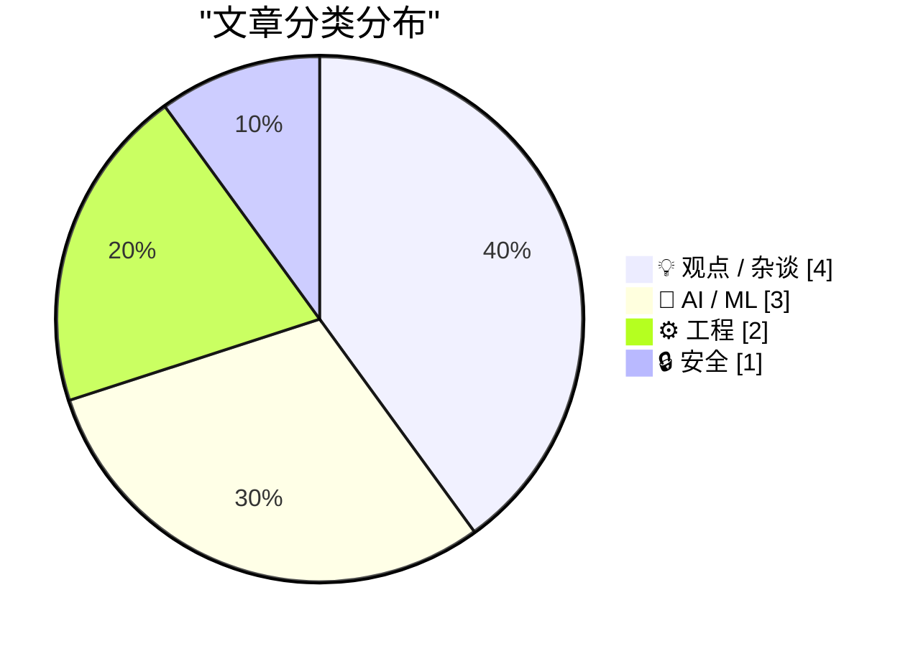
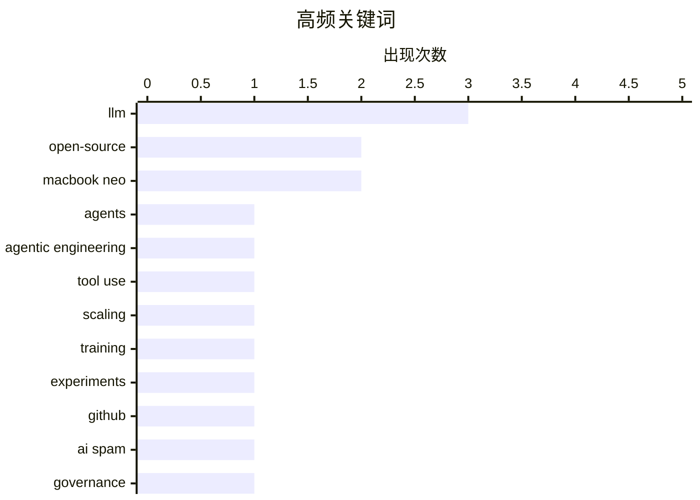

# 📰 AI 博客每日精选 — 2026-03-15

> 来自 Karpathy 推荐的 92 个顶级技术博客，AI 精选 Top 10

## 📝 今日看点

AI 话题今天明显从“堆算力”转向“做智能体”：agentic engineering 走热，同时新的证据提醒规模化并非万能，工程化方法与评测质量将决定上限。与之并行的是信任与治理焦虑上升——AI 生成内容掺假已能直接引爆媒体事故，人们对机器的拟人化迷思、以及谁来为开源基础设施买单，都在拷问规则与责任。安全线继续拉响，高度仿真的苹果账号钓鱼手法升级，身份与账号防护仍是当务之急。硬件端则被 MacBook Neo 搅动：拆解揭示新设计取舍，PC 厂商与维修生态面临重新洗牌。

---

## 🏆 今日必读

🥇 **My fireside chat about agentic engineering at the Pragmatic Summit**

[My fireside chat about agentic engineering at the Pragmatic Summit](https://simonwillison.net/2026/Mar/14/pragmatic-summit/#atom-everything) — simonwillison.net · 8 小时前 · 🤖 AI / ML

> My fireside chat about agentic engineering at the Pragmatic Summit

🏷️ LLM, agents, agentic engineering, tool use

🥈 **BREAKING: Expensive new evidence that scaling is not all you need**

[BREAKING: Expensive new evidence that scaling is not all you need](https://garymarcus.substack.com/p/breaking-expensive-new-evidence-that) — garymarcus.substack.com · 7 小时前 · 🤖 AI / ML

> BREAKING: Expensive new evidence that scaling is not all you need

🏷️ LLM, scaling, training, experiments

🥉 **Quoting Jannis Leidel**

[Quoting Jannis Leidel](https://simonwillison.net/2026/Mar/14/jannis-leidel/#atom-everything) — simonwillison.net · 7 小时前 · ⚙️ 工程

> Quoting Jannis Leidel

🏷️ GitHub, open-source, AI spam, governance

---

## 📊 数据概览

| 扫描源 | 抓取文章 | 时间范围 | 精选 |
|:---:|:---:|:---:|:---:|
| 89/92 | 2520 篇 → 14 篇 | 24h | **10 篇** |

### 分类分布



### 高频关键词



<details>
<summary>📈 纯文本关键词图（终端友好）</summary>

```
llm                 │ ████████████████████ 3
open-source         │ █████████████░░░░░░░ 2
macbook neo         │ █████████████░░░░░░░ 2
agents              │ ███████░░░░░░░░░░░░░ 1
agentic engineering │ ███████░░░░░░░░░░░░░ 1
tool use            │ ███████░░░░░░░░░░░░░ 1
scaling             │ ███████░░░░░░░░░░░░░ 1
training            │ ███████░░░░░░░░░░░░░ 1
experiments         │ ███████░░░░░░░░░░░░░ 1
github              │ ███████░░░░░░░░░░░░░ 1
```

</details>

### 🏷️ 话题标签

**llm**(3) · **open-source**(2) · **macbook neo**(2) · agents(1) · agentic engineering(1) · tool use(1) · scaling(1) · training(1) · experiments(1) · github(1) · ai spam(1) · governance(1) · ai(1) · fabricated quotes(1) · journalism(1) · hallucinations(1) · tech policy(1) · cryptography(1) · antitrust(1) · labor(1)

---

## 💡 观点 / 杂谈

### 1. Pluralistic: Corrupt anticorruption (14 Mar 2026)

[Pluralistic: Corrupt anticorruption (14 Mar 2026)](https://pluralistic.net/2026/03/14/ill-have-what-xis-having/) — **pluralistic.net** · 11 小时前 · ⭐ 23/30

> Pluralistic: Corrupt anticorruption (14 Mar 2026)

🏷️ tech policy, cryptography, antitrust, labor

---

### 2. How Can Governments Pay Open Source Maintainers?

[How Can Governments Pay Open Source Maintainers?](https://shkspr.mobi/blog/2026/03/how-can-governments-pay-open-source-maintainers/) — **shkspr.mobi** · 13 小时前 · ⭐ 21/30

> How Can Governments Pay Open Source Maintainers?

🏷️ open-source, government, funding, maintainers

---

### 3. The Collective Superstitions of People Who Talk to Machines

[The Collective Superstitions of People Who Talk to Machines](https://worksonmymachine.ai/p/the-collective-superstitions-of-people) — **worksonmymachine.substack.com** · 12 小时前 · ⭐ 21/30

> The Collective Superstitions of People Who Talk to Machines

🏷️ prompting, LLM, anthropomorphism, HCI

---

### 4. PC Makers Are Not Ready for the MacBook Neo

[PC Makers Are Not Ready for the MacBook Neo](https://www.theverge.com/report/894090/macbook-neo-pc-windows-laptop-competition-asus-footinmouth) — **daringfireball.net** · 6 小时前 · ⭐ 18/30

> PC Makers Are Not Ready for the MacBook Neo

🏷️ MacBook Neo, PC makers, product strategy, RAM

---

## 🤖 AI / ML

### 5. My fireside chat about agentic engineering at the Pragmatic Summit

[My fireside chat about agentic engineering at the Pragmatic Summit](https://simonwillison.net/2026/Mar/14/pragmatic-summit/#atom-everything) — **simonwillison.net** · 8 小时前 · ⭐ 25/30

> My fireside chat about agentic engineering at the Pragmatic Summit

🏷️ LLM, agents, agentic engineering, tool use

---

### 6. BREAKING: Expensive new evidence that scaling is not all you need

[BREAKING: Expensive new evidence that scaling is not all you need](https://garymarcus.substack.com/p/breaking-expensive-new-evidence-that) — **garymarcus.substack.com** · 7 小时前 · ⭐ 25/30

> BREAKING: Expensive new evidence that scaling is not all you need

🏷️ LLM, scaling, training, experiments

---

### 7. Ars Technica Fires Reporter Benj Edwards After He Published Story With AI-Fabricated Quotes

[Ars Technica Fires Reporter Benj Edwards After He Published Story With AI-Fabricated Quotes](https://futurism.com/artificial-intelligence/ars-technica-fires-reporter-ai-quotes) — **daringfireball.net** · 9 小时前 · ⭐ 23/30

> Ars Technica Fires Reporter Benj Edwards After He Published Story With AI-Fabricated Quotes

🏷️ AI, fabricated quotes, journalism, hallucinations

---

## ⚙️ 工程

### 8. Quoting Jannis Leidel

[Quoting Jannis Leidel](https://simonwillison.net/2026/Mar/14/jannis-leidel/#atom-everything) — **simonwillison.net** · 7 小时前 · ⭐ 23/30

> Quoting Jannis Leidel

🏷️ GitHub, open-source, AI spam, governance

---

### 9. iFixit’s MacBook Neo Teardown

[iFixit’s MacBook Neo Teardown](https://www.ifixit.com/News/116152/macbook-neo-is-the-most-repairable-macbook-in-14-years) — **daringfireball.net** · 4 小时前 · ⭐ 20/30

> iFixit’s MacBook Neo Teardown

🏷️ MacBook Neo, teardown, repairability, right-to-repair

---

## 🔒 安全

### 10. Matt Mullenweg Documents a Dastardly Clever Apple Account Phishing Scam

[Matt Mullenweg Documents a Dastardly Clever Apple Account Phishing Scam](https://ma.tt/2026/03/gone-almost-phishin/) — **daringfireball.net** · 1 小时前 · ⭐ 21/30

> Matt Mullenweg Documents a Dastardly Clever Apple Account Phishing Scam

🏷️ phishing, Apple ID, password reset, social engineering

---

*生成于 2026-03-15 02:22 | 扫描 89 源 → 获取 2520 篇 → 精选 10 篇*
*基于 [Hacker News Popularity Contest 2025](https://refactoringenglish.com/tools/hn-popularity/) RSS 源列表*
