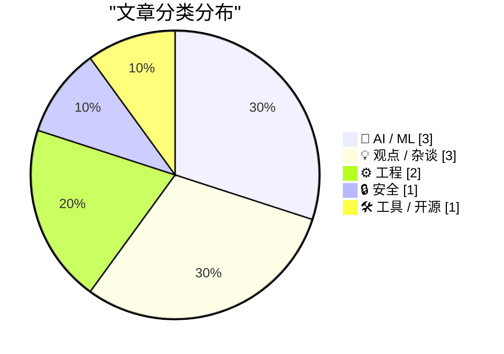
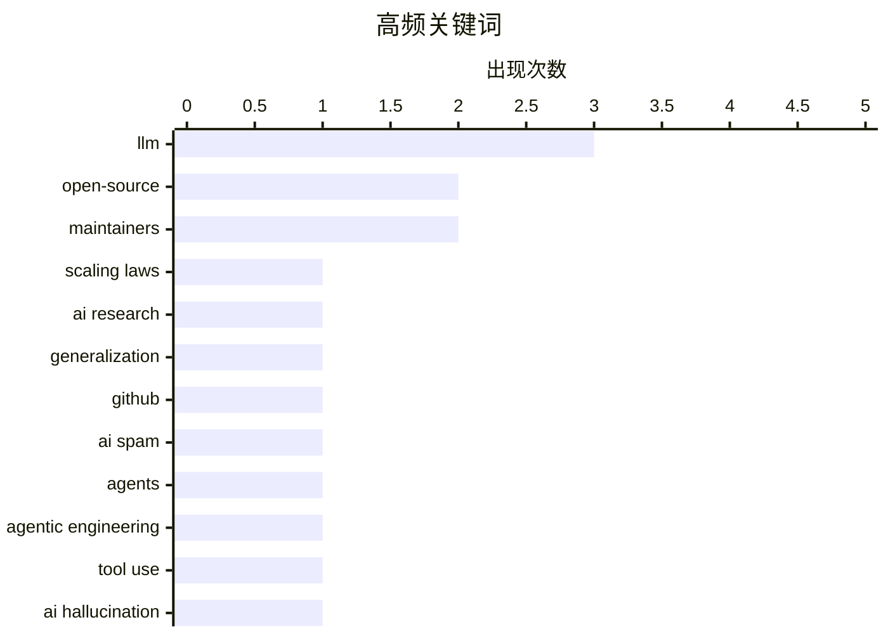

# 📰 AI 博客每日精选 — 2026-03-15

> 来自 Karpathy 推荐的 92 个顶级技术博客，AI 精选 Top 10

## 📝 今日看点

今天的焦点首先落在 AI 发展“冷静期”：扩规模不再万能的证据增多，Agentic Engineering 试图用工程化约束换稳定性，同时 AI 生成内容失控与“提示迷信”引发行业自省。  
开源生态也在承压，AI 垃圾 PR 侵蚀协作效率，政府付费机制缺位、包管理器转向等事件凸显可持续治理困境。  
安全与硬件层面，一方面高明钓鱼绕过官方流程敲响警钟，另一方面苹果新机可维修性提升带来正面信号。

---

## 🏆 今日必读

🥇 **突发：昂贵的新证据表明“只靠规模”并不够**

[BREAKING: Expensive new evidence that scaling is not all you need](https://garymarcus.substack.com/p/breaking-expensive-new-evidence-that) — garymarcus.substack.com · 8 小时前 · 🤖 AI / ML

> 核心争议是大模型是否只需继续扩大规模就能解决智能瓶颈。文章指出两项“烧钱”的最新实验再次失败，表明单纯增加参数、数据和算力并未带来关键能力突破。作者把这些结果作为“缩放定律并非万能”的新证据，认为现有路线在可靠推理、稳健泛化等方面仍有硬伤。结论是，想要进一步突破，需要算法、结构和训练方法层面的新思路，而不仅是继续堆算力。

💡 **为什么值得读**: 如果你关注“扩规模能否通往AGI”的争论，这篇文章提供了最新、最具争议性的反例。

🏷️ LLM, scaling laws, AI research, generalization

🥈 **引用 Jannis Leidel：AI 垃圾 PR 让 Jazzband 的开放协作模式走到尽头**

[Quoting Jannis Leidel](https://simonwillison.net/2026/Mar/14/jannis-leidel/#atom-everything) — simonwillison.net · 8 小时前 · ⚙️ 工程

> 核心问题是开源项目在“AI 生成垃圾 PR/Issue 泛滥”的环境下还能否维持开放协作。Jannis Leidel 指出，GitHub 的“slopocalypse”让 Jazzband 这种开放成员、共享推送权限的模式不可持续。过去最坏情况是有人误合并 PR，但现在是有组织的 AI 垃圾洪水冲击项目维护。结论是，开放式治理需要被迫收紧权限和流程，否则维护成本将被垃圾内容吞噬。

💡 **为什么值得读**: 对开源治理和 GitHub 生态的变化有现实冲击，这篇短文能快速理解“AI 垃圾化”带来的结构性风险。

🏷️ open-source, GitHub, AI spam, maintainers

🥉 **我在 Pragmatic Summit 关于“Agentic Engineering”的炉边对谈**

[My fireside chat about agentic engineering at the Pragmatic Summit](https://simonwillison.net/2026/Mar/14/pragmatic-summit/#atom-everything) — simonwillison.net · 8 小时前 · 🤖 AI / ML

> 主题聚焦于 Agentic Engineering：如何设计具备自主行动能力的 AI 系统。对谈强调把大模型当作可调用的“工具链”而非单一智能体，通过分解任务、设置约束、引入回退与人类在环来提升稳定性。讨论涵盖评估与监控、提示词与工具编排的实操经验，并提醒避免“幻觉驱动的自动化”。作者认为，工程化的模式与守护栏比单纯模型能力更关键。读者还可观看 YouTube 视频获取完整内容。

💡 **为什么值得读**: 想把 LLM 从“聊天”推进到“可落地的自动化流程”，这场对谈提供了实战视角和工程方法论。

🏷️ agents, LLM, agentic engineering, tool use

---

## 📊 数据概览

| 扫描源 | 抓取文章 | 时间范围 | 精选 |
|:---:|:---:|:---:|:---:|
| 89/92 | 2520 篇 → 14 篇 | 24h | **10 篇** |

### 分类分布



### 高频关键词



<details>
<summary>📈 纯文本关键词图（终端友好）</summary>

```
llm                 │ ████████████████████ 3
open-source         │ █████████████░░░░░░░ 2
maintainers         │ █████████████░░░░░░░ 2
scaling laws        │ ███████░░░░░░░░░░░░░ 1
ai research         │ ███████░░░░░░░░░░░░░ 1
generalization      │ ███████░░░░░░░░░░░░░ 1
github              │ ███████░░░░░░░░░░░░░ 1
ai spam             │ ███████░░░░░░░░░░░░░ 1
agents              │ ███████░░░░░░░░░░░░░ 1
agentic engineering │ ███████░░░░░░░░░░░░░ 1
```

</details>

### 🏷️ 话题标签

**llm**(3) · **open-source**(2) · **maintainers**(2) · scaling laws(1) · ai research(1) · generalization(1) · github(1) · ai spam(1) · agents(1) · agentic engineering(1) · tool use(1) · ai hallucination(1) · journalism(1) · fabricated quotes(1) · editorial policy(1) · phishing(1) · apple id(1) · social engineering(1) · 2fa(1) · antitrust(1)

---

## 🤖 AI / ML

### 1. 突发：昂贵的新证据表明“只靠规模”并不够

[BREAKING: Expensive new evidence that scaling is not all you need](https://garymarcus.substack.com/p/breaking-expensive-new-evidence-that) — **garymarcus.substack.com** · 8 小时前 · ⭐ 25/30

> 核心争议是大模型是否只需继续扩大规模就能解决智能瓶颈。文章指出两项“烧钱”的最新实验再次失败，表明单纯增加参数、数据和算力并未带来关键能力突破。作者把这些结果作为“缩放定律并非万能”的新证据，认为现有路线在可靠推理、稳健泛化等方面仍有硬伤。结论是，想要进一步突破，需要算法、结构和训练方法层面的新思路，而不仅是继续堆算力。

🏷️ LLM, scaling laws, AI research, generalization

---

### 2. 我在 Pragmatic Summit 关于“Agentic Engineering”的炉边对谈

[My fireside chat about agentic engineering at the Pragmatic Summit](https://simonwillison.net/2026/Mar/14/pragmatic-summit/#atom-everything) — **simonwillison.net** · 8 小时前 · ⭐ 24/30

> 主题聚焦于 Agentic Engineering：如何设计具备自主行动能力的 AI 系统。对谈强调把大模型当作可调用的“工具链”而非单一智能体，通过分解任务、设置约束、引入回退与人类在环来提升稳定性。讨论涵盖评估与监控、提示词与工具编排的实操经验，并提醒避免“幻觉驱动的自动化”。作者认为，工程化的模式与守护栏比单纯模型能力更关键。读者还可观看 YouTube 视频获取完整内容。

🏷️ agents, LLM, agentic engineering, tool use

---

### 3. Ars Technica 记者因使用 AI 编造引语被解雇

[Ars Technica Fires Reporter Benj Edwards After He Published Story With AI-Fabricated Quotes](https://futurism.com/artificial-intelligence/ars-technica-fires-reporter-ai-quotes) — **daringfireball.net** · 9 小时前 · ⭐ 24/30

> 事件焦点是新闻机构对 AI 生成内容的管控失误。Ars Technica 一篇关于 AI 代理发布“黑稿”的报道被撤回，因为文中引用的受访者引语被证实是伪造的。编辑部在更正说明中道歉，随后涉事记者 Benj Edwards 被解雇。事件暴露出在新闻生产中使用 AI 的伦理与审校风险。结论是，媒体必须建立更严格的事实核验与 AI 使用规范。

🏷️ AI hallucination, journalism, fabricated quotes, editorial policy

---

## 💡 观点 / 杂谈

### 4. Pluralistic：腐败的反腐败（2026-03-14）

[Pluralistic: Corrupt anticorruption (14 Mar 2026)](https://pluralistic.net/2026/03/14/ill-have-what-xis-having/) — **pluralistic.net** · 11 小时前 · ⭐ 22/30

> 核心主题是“反腐败运动本身可能被腐败利用”的政治与社会观察。作者用多个案例讨论权力如何借反腐进行清洗与控制，并串联到技术政策、劳工组织、加密争议等话题。文章还列出一系列相关链接与近期公共事件，形成“目标丰富的观察清单”。其中包括欧盟政策、美国抗议、企业税负等议题。结论是，制度性监督与透明度比口号式反腐更关键。

🏷️ antitrust, regulation, surveillance, labor

---

### 5. 与机器对话者的集体迷信

[The Collective Superstitions of People Who Talk to Machines](https://worksonmymachine.ai/p/the-collective-superstitions-of-people) — **worksonmymachine.substack.com** · 13 小时前 · ⭐ 22/30

> 文章探讨人们在使用 AI 对话系统时形成的“集体迷信”和仪式化操作。作者指出，许多用户把提示词技巧当作巫术，却忽视模型的不确定性与随机性。不断重复“有效提示”可能只是幸存者偏差，而非真实因果。真正可靠的方法应是可复现的实验、系统评估与透明的模型行为分析。结论是，走出迷信需要用工程与科学方法替代口耳相传的“神秘技巧”。

🏷️ prompting, LLM, prompt engineering, HCI

---

### 6. 政府如何为开源维护者付费？

[How Can Governments Pay Open Source Maintainers?](https://shkspr.mobi/blog/2026/03/how-can-governments-pay-open-source-maintainers/) — **shkspr.mobi** · 14 小时前 · ⭐ 21/30

> 文章提出一个现实难题：政府大量使用开源软件，但难以建立直接的付费机制。作者以英国政府经历为例，说明在采购流程、预算分配、法律合规和“该付给谁”上存在结构性障碍。即使政府公开发布大量开源代码，也无法等同于资助外部维护者。可能的路径包括设立基金、合同外包或通过第三方组织分发资助，但实施复杂。结论是，政府支持开源必须制度化，而非依赖个别倡议。

🏷️ open-source, funding, government procurement, maintainers

---

## ⚙️ 工程

### 7. 引用 Jannis Leidel：AI 垃圾 PR 让 Jazzband 的开放协作模式走到尽头

[Quoting Jannis Leidel](https://simonwillison.net/2026/Mar/14/jannis-leidel/#atom-everything) — **simonwillison.net** · 8 小时前 · ⭐ 24/30

> 核心问题是开源项目在“AI 生成垃圾 PR/Issue 泛滥”的环境下还能否维持开放协作。Jannis Leidel 指出，GitHub 的“slopocalypse”让 Jazzband 这种开放成员、共享推送权限的模式不可持续。过去最坏情况是有人误合并 PR，但现在是有组织的 AI 垃圾洪水冲击项目维护。结论是，开放式治理需要被迫收紧权限和流程，否则维护成本将被垃圾内容吞噬。

🏷️ open-source, GitHub, AI spam, maintainers

---

### 8. iFixit 拆解 MacBook Neo：14 年来最易维修的 MacBook？

[iFixit’s MacBook Neo Teardown](https://www.ifixit.com/News/116152/macbook-neo-is-the-most-repairable-macbook-in-14-years) — **daringfireball.net** · 4 小时前 · ⭐ 21/30

> 核心问题是新款 MacBook Neo 是否在可维修性上真正改变了苹果的传统。iFixit 表示 Neo 具备更完善的首日维修手册、较容易的键盘维修，以及可拆卸的螺丝固定电池托盘，显著减少胶水依赖。与过去多代 MacBook 相比，这是 14 年来最友好的维修设计。评论者则认为“更便宜所以更易修”或许是反向推论，苹果可能是主动调整策略。结论是，Neo 证明“价格更低”与“可维修”并不必然冲突。

🏷️ teardown, repairability, MacBook, hardware design

---

## 🔒 安全

### 9. Matt Mullenweg 记录的一场极其狡猾的 Apple 账户钓鱼攻击

[Matt Mullenweg Documents a Dastardly Clever Apple Account Phishing Scam](https://ma.tt/2026/03/gone-almost-phishin/) — **daringfireball.net** · 2 小时前 · ⭐ 22/30

> 问题核心是攻击者如何绕过用户警惕，利用合法流程实施钓鱼。Mullenweg 描述攻击者首先滥用 Apple 官方密码重置流程，不断触发多设备提示，即使开启 Lockdown Mode 也无效。随后攻击者通过“看似官方”的联系渠道推进钓鱼，制造紧迫感逼迫用户配合。整个流程借助真实的 Apple 机制增加可信度，属于“合法流程劫持”。结论是，账户安全不仅靠设备模式，还要识别流程型社会工程攻击。

🏷️ phishing, Apple ID, social engineering, 2FA

---

## 🛠 工具 / 开源

### 10. FAIR 包管理器的现状：从 WordPress 转向 TYPO3

[What’s Going On with FAIR Package Manager](https://nesbitt.io/2026/03/14/whats-going-on-with-fair-package-manager.html) — **nesbitt.io** · 16 小时前 · ⭐ 20/30

> 文章更新了 FAIR Package Manager 的发展方向与社区定位。项目此前与 WordPress 生态关联密切，但现在宣布转向 TYPO3 体系。这个调整意味着治理、技术栈与用户社区都将发生变化。作者梳理了转向原因及其对现有用户的影响，并暗示 WordPress 社区内存在的结构性摩擦。结论是，FAIR 正在重新寻找更稳定、协作更顺畅的落脚点。

🏷️ PHP, package manager, WordPress, TYPO3

---

*生成于 2026-03-15 02:50 | 扫描 89 源 → 获取 2520 篇 → 精选 10 篇*
*基于 [Hacker News Popularity Contest 2025](https://refactoringenglish.com/tools/hn-popularity/) RSS 源列表*
