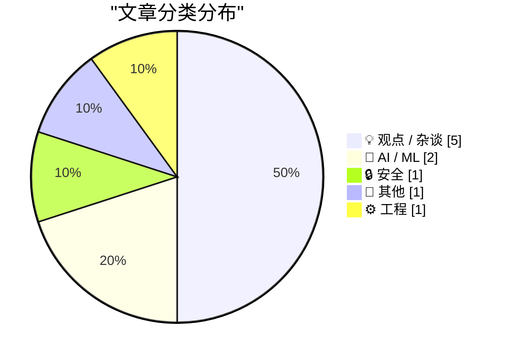
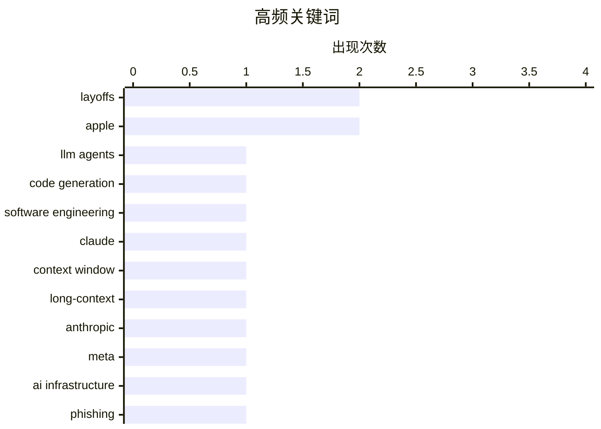

# 📰 AI 博客每日精选 — 2026-03-16

> 来自 Karpathy 推荐的 92 个顶级技术博客，AI 精选 Top 10

## 📝 今日看点

AI 开发正从“聊天式助手”升级为能写代码、跑代码、验证迭代的代理式工程，而百万级上下文窗口让模型直接处理大型代码库与长周期文档，自动化边界被迅速推远。与此同时，AI 资本开支竞赛把成本压力推到台前，裁员与“提效”叙事在大公司蔓延，甚至被用来更好地对外解释组织收缩。策略分化也在加剧：有人重金押注算力，有人则选择克制投入、走轻资产路线。安全层面同样拉响警报——攻击者开始借助官方流程与系统弹窗进行社会工程，“看起来正规”的提示也可能成为钓鱼入口。

---

## 🏆 今日必读

🥇 **什么是“代理式工程”**

[What is agentic engineering?](https://simonwillison.net/guides/agentic-engineering-patterns/what-is-agentic-engineering/#atom-everything) — simonwillison.net · 27 分钟前 · 🤖 AI / ML

> 代理式工程指在软件开发中使用能够写代码并执行代码的“编码代理”来完成工作。作者将这类代理与传统聊天式助手区分开来，强调它们具备执行、验证和迭代的能力。Claude Code、OpenAI Codex 等是典型例子，它们让开发者把任务分解给代理并自动化完成。这个概念将软件工程中的“人与工具协作”提升为“人与智能体协作”的新范式。核心观点是：理解并设计好这类协作模式，将成为未来开发效率的关键。

💡 **为什么值得读**: 想系统理解“编码代理”与传统 AI 辅助编程的区别及其工程意义，这篇文章能快速建立清晰框架。

🏷️ LLM agents, code generation, software engineering

🥈 **为什么 Claude 的 100 万上下文长度是一个大事件**

[Why Claude's new 1M context length is a big deal](https://martinalderson.com/posts/why-claudes-new-1m-context-length-is-a-big-deal/?utm_source=rss&amp;utm_medium=rss&amp;utm_campaign=feed) — martinalderson.com · 23 小时前 · 🤖 AI / ML

> Anthropic 在 Opus 4.6 和 Sonnet 4.6 上提供了 100 万 token 的上下文窗口，而且不额外收费。这个长度足以容纳大型代码库、完整书籍或长周期项目文档，显著减少切分与检索的复杂度。作者认为这将改变长文档分析、代码审查和复杂推理的工作方式，模型能够在单次对话中保持完整语境。相较传统 128K 或 200K 上下文，1M 让“全量输入”成为现实。结论是：这不仅是规模升级，而是解锁新工作流的门槛变化。

💡 **为什么值得读**: 如果你关心大模型在真实生产任务中的落地能力，1M 上下文的意义和影响是必须理解的一次拐点。

🏷️ Claude, context window, long-context, Anthropic

🥉 **路透：Meta 计划大规模裁员以应对 AI 成本上涨**

[Reuters: ‘Meta Planning Sweeping Layoffs as AI Costs Mount’](https://www.reuters.com/business/world-at-work/meta-planning-sweeping-layoffs-ai-costs-mount-2026-03-14/) — daringfireball.net · 7 小时前 · 💡 观点 / 杂谈

> 路透社报道称，Meta 正计划进行可能超过 20% 的大规模裁员，以抵消 AI 基础设施投资带来的成本压力。消息人士表示裁员时间与规模尚未最终确定，但公司高层已发出提升效率的信号。裁员被视为在 AI 资本支出上升背景下的成本控制手段，同时也与 AI 辅助员工带来的效率提升相关。此举反映出科技公司在高强度 AI 投入下的结构性调整趋势。核心观点是：AI 投资正在直接重塑大型科技公司的人员结构。

💡 **为什么值得读**: 这篇报道揭示 AI 巨额投入背后的组织代价，是理解科技行业裁员潮的关键线索。

🏷️ Meta, layoffs, AI infrastructure

---

## 📊 数据概览

| 扫描源 | 抓取文章 | 时间范围 | 精选 |
|:---:|:---:|:---:|:---:|
| 88/92 | 2502 篇 → 14 篇 | 24h | **10 篇** |

### 分类分布



### 高频关键词



<details>
<summary>📈 纯文本关键词图（终端友好）</summary>

```
layoffs              │ ████████████████████ 2
apple                │ ████████████████████ 2
llm agents           │ ██████████░░░░░░░░░░ 1
code generation      │ ██████████░░░░░░░░░░ 1
software engineering │ ██████████░░░░░░░░░░ 1
claude               │ ██████████░░░░░░░░░░ 1
context window       │ ██████████░░░░░░░░░░ 1
long-context         │ ██████████░░░░░░░░░░ 1
anthropic            │ ██████████░░░░░░░░░░ 1
meta                 │ ██████████░░░░░░░░░░ 1
```

</details>

### 🏷️ 话题标签

**layoffs**(2) · **apple**(2) · **llm agents**(1) · code generation(1) · software engineering(1) · claude(1) · context window(1) · long-context(1) · anthropic(1) · meta(1) · ai infrastructure(1) · phishing(1) · apple id(1) · social engineering(1) · lockdown mode(1) · ai spending(1) · capex(1) · ai(1) · hiring(1) · elections(1)

---

## 💡 观点 / 杂谈

### 1. 路透：Meta 计划大规模裁员以应对 AI 成本上涨

[Reuters: ‘Meta Planning Sweeping Layoffs as AI Costs Mount’](https://www.reuters.com/business/world-at-work/meta-planning-sweeping-layoffs-ai-costs-mount-2026-03-14/) — **daringfireball.net** · 7 小时前 · ⭐ 23/30

> 路透社报道称，Meta 正计划进行可能超过 20% 的大规模裁员，以抵消 AI 基础设施投资带来的成本压力。消息人士表示裁员时间与规模尚未最终确定，但公司高层已发出提升效率的信号。裁员被视为在 AI 资本支出上升背景下的成本控制手段，同时也与 AI 辅助员工带来的效率提升相关。此举反映出科技公司在高强度 AI 投入下的结构性调整趋势。核心观点是：AI 投资正在直接重塑大型科技公司的人员结构。

🏷️ Meta, layoffs, AI infrastructure

---

### 2. Horace Dediu：苹果缺席 AI 资本支出竞赛是高明之举

[Horace Dediu on Apple Sitting Out the AI Spending Race](https://asymco.com/2026/03/10/the-most-brilliant-move-in-corporate-history/) — **daringfireball.net** · 7 小时前 · ⭐ 22/30

> Horace Dediu 指出，苹果过去是最大资本开支者之一，因为其承担了制造设备和厂房成本。AI 时代形势逆转：亚马逊 2000 亿美元、谷歌 1850 亿、微软 1140 亿、Meta 1350 亿都在砸向 AI 数据中心，总额约 6500 亿美元。与之相比，苹果选择不参与这场 AI 基础设施竞赛。作者认为这种“坐在一旁”的策略可能是企业史上最聪明的资本配置之一。结论是：避开 AI 军备竞赛反而可能保持苹果的高回报与灵活性。

🏷️ Apple, AI spending, capex

---

### 3. 把裁员归咎于 AI：对外更好解释

[Blaming AI for Layoffs: ‘It Plays Better’](https://www.resume.org/the-great-turnover-9-in-10-companies-plan-to-hire-in-2026-yet-6-in-10-will-have-layoffs-2/) — **daringfireball.net** · 6 小时前 · ⭐ 20/30

> Resume.org 对 1000 名美国招聘经理的调查显示，59% 承认在解释招聘冻结或裁员时会刻意强调 AI，因为这比“财务压力”更容易被利益相关者接受。调查还指出，9/10 公司计划在 2026 年招聘，但 6/10 仍预计会裁员。AI 被用作外部叙事工具，而非唯一的真实原因。作者以此批评“AI 替罪羊”现象的普遍化。核心观点是：很多裁员并非 AI 直接导致，而是被包装成 AI 影响。

🏷️ AI, layoffs, hiring

---

### 4. CHM 直播：Apple 50 周年特别活动

[CHM Live: Apple at 50](https://www.youtube.com/live/eCSNJgI2LFI) — **daringfireball.net** · 8 分钟前 · ⭐ 17/30

> 计算机历史博物馆（CHM）举办了 Apple 50 周年直播活动，由 David Pogue 主持。嘉宾包括 Apple 早期工程师 Chris Espinosa、前 CEO John Sculley 和前 CTO Avie Tevanian。内容涵盖 Apple 创业史、关键技术转折和公司文化演变。作者称这场直播“相当精彩”，值得一看。结论是：这是了解 Apple 历史与人物故事的高质量公开视频。

🏷️ Apple, tech history, Computer History Museum

---

### 5. 被优化的自我与错过的人生

[The optimized self and the life that got away](https://www.joanwestenberg.com/the-optimized-self-and-the-life-that-got-away/) — **joanwestenberg.com** · 44 分钟前 · ⭐ 17/30

> 文章反思“自我优化”文化带来的副作用：不断追求效率与指标让生活变得单一。作者指出，日程表、习惯追踪和生产力工具虽然带来可控感，却可能抹杀偶然性与真正的满足。把人生当作可量化项目，会逐渐失去探索、停顿与无目的行动的空间。她强调“未被优化的人生”里往往藏着更深的意义。结论是：过度优化可能让你失去真正想要的生活。

🏷️ productivity, self-optimization, tech culture

---

## 🤖 AI / ML

### 6. 什么是“代理式工程”

[What is agentic engineering?](https://simonwillison.net/guides/agentic-engineering-patterns/what-is-agentic-engineering/#atom-everything) — **simonwillison.net** · 27 分钟前 · ⭐ 26/30

> 代理式工程指在软件开发中使用能够写代码并执行代码的“编码代理”来完成工作。作者将这类代理与传统聊天式助手区分开来，强调它们具备执行、验证和迭代的能力。Claude Code、OpenAI Codex 等是典型例子，它们让开发者把任务分解给代理并自动化完成。这个概念将软件工程中的“人与工具协作”提升为“人与智能体协作”的新范式。核心观点是：理解并设计好这类协作模式，将成为未来开发效率的关键。

🏷️ LLM agents, code generation, software engineering

---

### 7. 为什么 Claude 的 100 万上下文长度是一个大事件

[Why Claude's new 1M context length is a big deal](https://martinalderson.com/posts/why-claudes-new-1m-context-length-is-a-big-deal/?utm_source=rss&amp;utm_medium=rss&amp;utm_campaign=feed) — **martinalderson.com** · 23 小时前 · ⭐ 26/30

> Anthropic 在 Opus 4.6 和 Sonnet 4.6 上提供了 100 万 token 的上下文窗口，而且不额外收费。这个长度足以容纳大型代码库、完整书籍或长周期项目文档，显著减少切分与检索的复杂度。作者认为这将改变长文档分析、代码审查和复杂推理的工作方式，模型能够在单次对话中保持完整语境。相较传统 128K 或 200K 上下文，1M 让“全量输入”成为现实。结论是：这不仅是规模升级，而是解锁新工作流的门槛变化。

🏷️ Claude, context window, long-context, Anthropic

---

## 🔒 安全

### 8. Matt Mullenweg 记录了一起极其狡猾的 Apple 账户钓鱼骗局

[Matt Mullenweg Documents a Dastardly Clever Apple Account Phishing Scam](https://ma.tt/2026/03/gone-almost-phishin/) — **daringfireball.net** · 22 小时前 · ⭐ 23/30

> 攻击者先反复触发 Apple 官方的密码重置流程，导致用户设备不断弹出真实系统提示。即便开启了 Lockdown Mode，这类合法流程仍会生效，让用户处于被动防守状态。随后攻击者利用这些提示进行社会工程诈骗，诱导用户交出验证码或重置操作。整个骗局利用了“看似官方”的可信渠道作为入侵入口。结论是：即便系统安全机制完备，账号流程本身仍可能被滥用，需要更严格的验证与节流机制。

🏷️ phishing, Apple ID, social engineering, Lockdown Mode

---

## 📝 其他

### 9. BertVote：2026 年市议会选举推荐

[BertVote Gemeenteraadsverkiezingen 2026](https://berthub.eu/articles/posts/bert-vote-gemeenteraad-2026/) — **berthub.eu** · 11 小时前 · ⭐ 18/30

> 荷兰大多数市镇将在 3 月 18 日举行市议会选举，作者解释自己这次不能再做 NerdVote，因为他本人是 Progressief Pijnacker-Nootdorp（本地 GroenLinks-PvdA 组合）的候选人。尽管如此，他仍列出自己非常认可的候选人，均为他个人认识并信任的人。文章强调推荐的透明性，说明了个人身份与推荐行为的边界。总体上这是一次基于个人了解与价值认同的候选人清单。结论是：即便身处选举一方，也可以以公开透明方式提供有限的推荐。

🏷️ elections, Netherlands, NerdVote

---

## ⚙️ 工程

### 10. Langford 序列

[Langford series](https://www.johndcook.com/blog/2026/03/15/langford-series/) — **johndcook.com** · 3 小时前 · ⭐ 17/30

> 给出的序列中 1 到 12 每个数字出现两次，并且两个相同数字之间正好隔着该数字的个数。这样的排列被称为 Langford pairing（Langford 序列）。它是组合数学中的经典构造问题，涉及排列可行性与构造方法。该序列展示了满足约束的具体实例。结论是：Langford 序列体现了简单规则下的非平凡结构。

🏷️ combinatorics, Langford pairing, sequence

---

*生成于 2026-03-16 23:09 | 扫描 88 源 → 获取 2502 篇 → 精选 10 篇*
*基于 [Hacker News Popularity Contest 2025](https://refactoringenglish.com/tools/hn-popularity/) RSS 源列表*
