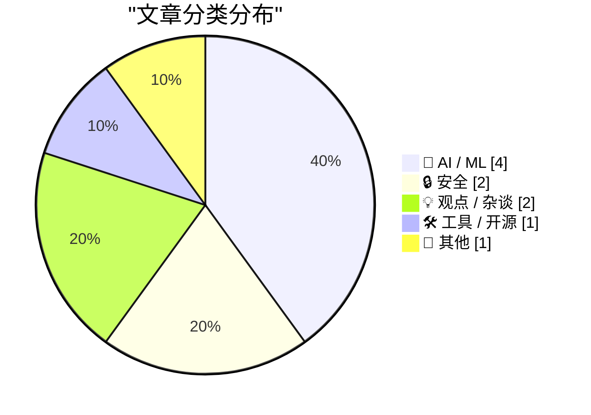
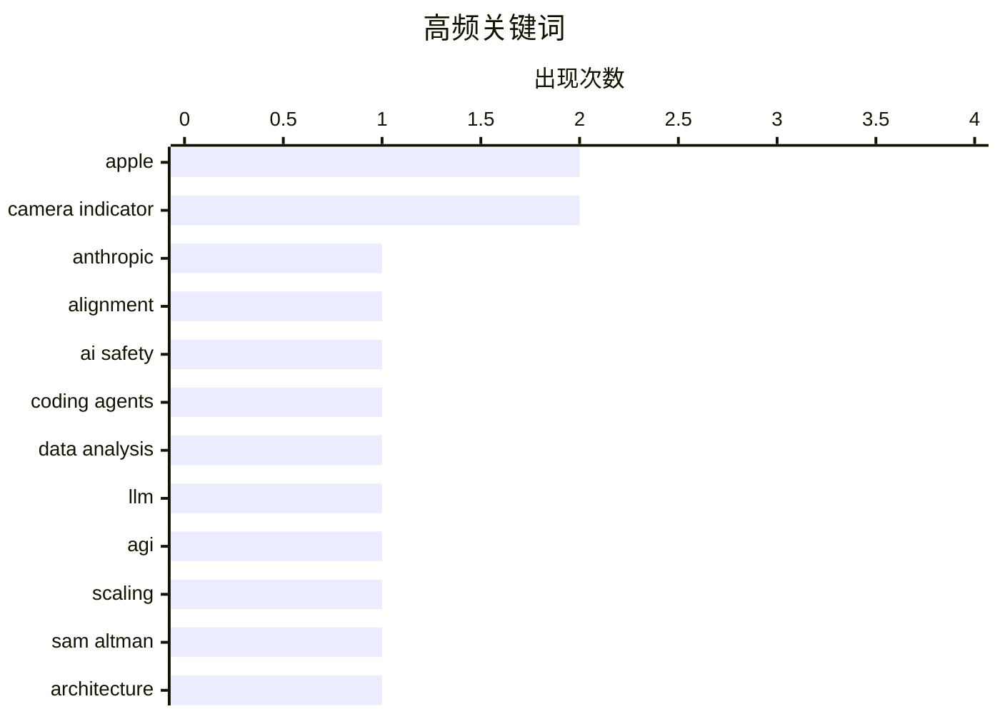

# 📰 AI 博客每日精选 — 2026-03-17

> 来自 Karpathy 推荐的 92 个顶级技术博客，AI 精选 Top 10

## 📝 今日看点

今天的技术焦点首先落在 AI 发展路径的反思与风险沟通：业界开始承认单纯“扩规模”难以通向 AGI，同时用更具冲击力的演练方式让政策层直观理解对齐风险。  
与此同时，编码代理从概念走向实用，既有面向数据新闻的实际工作流应用，也有对其工程化机制的深入拆解。  
隐私与信任同样成热议点，硬件级隔离的摄像头指示灯设计强调“即使内核被攻破也必须可见”，再度引发对技术使用权力与责任的讨论。

---

## 🏆 今日必读

🥇 **引用一位 Anthropic 对齐科学团队成员**

[Quoting A member of Anthropic’s alignment-science team](https://simonwillison.net/2026/Mar/16/blackmail/#atom-everything) — simonwillison.net · 1 小时前 · 🤖 AI / ML

> 核心主题是用“勒索演练”向政策制定者直观展示 AI 失配风险。演练的目标不是学术评估，而是产生足够“震撼”的结果，让从未考虑过此类风险的人能感受到问题的严重性。作者强调，抽象论证难以说服，具象案例能让风险在实践层面变得可感知。该引用来自《纽约客》的报道，试图解释为什么 Anthropic 会做类似演示。结论是：对齐风险需要通过可视化、可体验的案例来推动政策对话。

💡 **为什么值得读**: 提供了 AI 对齐风险如何被“翻译”给政策层的现实策略，能帮助理解技术安全沟通的关键手段。

🏷️ Anthropic, alignment, AI safety

🥈 **用于数据分析的编码代理**

[Coding agents for data analysis](https://simonwillison.net/2026/Mar/16/coding-agents-for-data-analysis/#atom-everything) — simonwillison.net · 2 小时前 · 🤖 AI / ML

> 主题是如何在数据新闻工作流中使用编码代理提升数据探索与清洗效率。手册对应 NICAR 2026 三小时工作坊，面向数据记者，重点工具包括 Claude Code 与 OpenAI Codex。内容涵盖用代理进行数据探索、自动化清洗、辅助分析与脚本生成等实践，并提供清晰的章节结构与演示路径。强调代理能显著减少重复性编码，但仍需人工审查以保证结果可靠。总体观点是：编码代理已足够成熟，可成为数据新闻实战工具的一部分。

💡 **为什么值得读**: 如果你做数据分析或新闻数据处理，这份手册能快速了解如何把 LLM 编码代理落地到真实工作流。

🏷️ coding agents, data analysis, LLM

🥉 **突发：Sam Altman 承认仅靠规模扩展无法实现 AGI**

[BREAKING: Sam Altman concedes that we need major breakthroughs beyond mere scaling to get to AGI](https://garymarcus.substack.com/p/breaking-sam-altman-concedes-that) — garymarcus.substack.com · 21 小时前 · 🤖 AI / ML

> 核心问题是：仅靠扩大模型规模是否能达到 AGI。Sam Altman 公开表示需要“重大突破”，暗示单纯 scaling 已不足以跨越智能瓶颈。Gary Marcus 认为这是对其长期观点的验证，即现有大模型缺乏新的架构性创新。文章主张应投入新的模型结构、推理机制或混合系统研究。结论是：AGI 的路径需要超越规模扩展的技术变革。

💡 **为什么值得读**: 这篇文章捕捉了行业领袖对 AGI 路线的罕见转向，对理解未来研究方向很有价值。

🏷️ AGI, scaling, Sam Altman, architecture

---

## 📊 数据概览

| 扫描源 | 抓取文章 | 时间范围 | 精选 |
|:---:|:---:|:---:|:---:|
| 89/92 | 2523 篇 → 18 篇 | 24h | **10 篇** |

### 分类分布



### 高频关键词



<details>
<summary>📈 纯文本关键词图（终端友好）</summary>

```
apple            │ ████████████████████ 2
camera indicator │ ████████████████████ 2
anthropic        │ ██████████░░░░░░░░░░ 1
alignment        │ ██████████░░░░░░░░░░ 1
ai safety        │ ██████████░░░░░░░░░░ 1
coding agents    │ ██████████░░░░░░░░░░ 1
data analysis    │ ██████████░░░░░░░░░░ 1
llm              │ ██████████░░░░░░░░░░ 1
agi              │ ██████████░░░░░░░░░░ 1
scaling          │ ██████████░░░░░░░░░░ 1
```

</details>

### 🏷️ 话题标签

**apple**(2) · **camera indicator**(2) · **anthropic**(1) · alignment(1) · ai safety(1) · coding agents(1) · data analysis(1) · llm(1) · agi(1) · scaling(1) · sam altman(1) · architecture(1) · agentic engineering(1) · llm agents(1) · tool use(1) · exclave(1) · platforms(1) · labor(1) · policy(1) · activitypub(1)

---

## 🤖 AI / ML

### 1. 引用一位 Anthropic 对齐科学团队成员

[Quoting A member of Anthropic’s alignment-science team](https://simonwillison.net/2026/Mar/16/blackmail/#atom-everything) — **simonwillison.net** · 1 小时前 · ⭐ 23/30

> 核心主题是用“勒索演练”向政策制定者直观展示 AI 失配风险。演练的目标不是学术评估，而是产生足够“震撼”的结果，让从未考虑过此类风险的人能感受到问题的严重性。作者强调，抽象论证难以说服，具象案例能让风险在实践层面变得可感知。该引用来自《纽约客》的报道，试图解释为什么 Anthropic 会做类似演示。结论是：对齐风险需要通过可视化、可体验的案例来推动政策对话。

🏷️ Anthropic, alignment, AI safety

---

### 2. 用于数据分析的编码代理

[Coding agents for data analysis](https://simonwillison.net/2026/Mar/16/coding-agents-for-data-analysis/#atom-everything) — **simonwillison.net** · 2 小时前 · ⭐ 22/30

> 主题是如何在数据新闻工作流中使用编码代理提升数据探索与清洗效率。手册对应 NICAR 2026 三小时工作坊，面向数据记者，重点工具包括 Claude Code 与 OpenAI Codex。内容涵盖用代理进行数据探索、自动化清洗、辅助分析与脚本生成等实践，并提供清晰的章节结构与演示路径。强调代理能显著减少重复性编码，但仍需人工审查以保证结果可靠。总体观点是：编码代理已足够成熟，可成为数据新闻实战工具的一部分。

🏷️ coding agents, data analysis, LLM

---

### 3. 突发：Sam Altman 承认仅靠规模扩展无法实现 AGI

[BREAKING: Sam Altman concedes that we need major breakthroughs beyond mere scaling to get to AGI](https://garymarcus.substack.com/p/breaking-sam-altman-concedes-that) — **garymarcus.substack.com** · 21 小时前 · ⭐ 22/30

> 核心问题是：仅靠扩大模型规模是否能达到 AGI。Sam Altman 公开表示需要“重大突破”，暗示单纯 scaling 已不足以跨越智能瓶颈。Gary Marcus 认为这是对其长期观点的验证，即现有大模型缺乏新的架构性创新。文章主张应投入新的模型结构、推理机制或混合系统研究。结论是：AGI 的路径需要超越规模扩展的技术变革。

🏷️ AGI, scaling, Sam Altman, architecture

---

### 4. 编码代理如何工作

[How coding agents work](https://simonwillison.net/guides/agentic-engineering-patterns/how-coding-agents-work/#atom-everything) — **simonwillison.net** · 9 小时前 · ⭐ 20/30

> 主题是编码代理的内部机制及其工程化结构。编码代理被定义为 LLM 的“harness”，通过工具调用、文件系统、测试运行器等扩展模型能力。代理通常采用循环式计划—执行—反思流程，并维护上下文、状态与中间结果。文章指出理解这些模式能帮助开发者更好地选择适用场景并避免误用。结论是：掌握代理的工作机制是有效使用它们的前提。

🏷️ agentic engineering, LLM agents, tool use

---

## 🔒 安全

### 5. Apple Exclaves 与 MacBook Neo 屏幕摄像头指示灯的安全设计

[★ Apple Exclaves and the Secure Design of the MacBook Neo’s On-Screen Camera Indicator](https://daringfireball.net/2026/03/apple_enclaves_neo_camera_indicator) — **daringfireball.net** · 5 小时前 · ⭐ 20/30

> 核心问题是软件摄像头指示灯是否足够可信。MacBook Neo 的指示灯运行在安全 exclave 中，与内核隔离，拥有独立的特权执行环境。即使发生内核级漏洞，也无法在不点亮指示灯的情况下启用摄像头。该设计将软件指示灯的可信度提升到接近硬件指示灯的级别。结论是：通过硬件隔离，Apple 解决了软件指示灯可被绕过的隐私担忧。

🏷️ Apple, exclave, camera indicator

---

### 6. 引用 Guilherme Rambo

[Quoting Guilherme Rambo](https://simonwillison.net/2026/Mar/16/guilherme-rambo/#atom-everything) — **simonwillison.net** · 2 小时前 · ⭐ 17/30

> 主题是 MacBook Neo 摄像头指示灯的安全实现方式。该指示灯运行在芯片的安全 exclave 中，拥有独立于内核的特权环境。即使内核被攻破，也无法在不点亮指示灯的情况下启用摄像头。指示灯直接在显示管线中绘制，降低被软件篡改的可能性。结论是：软件指示灯通过硬件隔离可获得接近硬件级的安全性。

🏷️ Apple, secure enclave, camera indicator

---

## 💡 观点 / 杂谈

### 7. Pluralistic：工具 vs 用途（2026 年 3 月 16 日）

[Pluralistic: Tools vs uses (16 Mar 2026)](https://pluralistic.net/2026/03/16/whittle-a-webserver/) — **pluralistic.net** · 9 小时前 · ⭐ 20/30

> 核心主题是反驳“工具中立”的观点，强调真正的问题在于谁在使用以及如何使用。作者提醒不要被“技术只是工具”的说法误导，并通过多个现实案例展开，例如 Amazon 工程师与仓库工人的处境差异。文章还链接了 Bruce 的 ETECH 演讲、Stephen King 与工会、免税的 S&P 500 公司等讨论。作为日常链接集，还包含 Pop Rocks、车黑客手册、冰岛海盗等杂项。结论是：技术讨论必须回到权力结构与使用场景。

🏷️ platforms, labor, policy

---

### 8. F Cancer

[F Cancer](https://garymarcus.substack.com/p/f-cancer) — **garymarcus.substack.com** · 3 小时前 · ⭐ 18/30

> 主题是用癌症研究作为检验 AI 实力的真实标准。作者认为 AI 的真正考验不是生成文本，而是能否在癌症诊断、药物发现或治疗方案上带来实质突破。当前很多 AI 医疗成果仍停留在早期验证或数据偏差严重的阶段，距离临床价值还有差距。文章呼吁关注可重复、可验证的科学贡献，而非营销叙事。结论是：AI 若不能在癌症等硬科学领域产生结果，其“革命性”说法就站不住脚。

🏷️ AI, cancer, healthcare, evaluation

---

## 🛠 工具 / 开源

### 9. ActivityBot 的一些更新

[Some updates to ActivityBot](https://shkspr.mobi/blog/2026/03/some-updates-to-activitybot/) — **shkspr.mobi** · 10 小时前 · ⭐ 18/30

> 核心主题是 ActivityBot 的最新更新与使用现状。ActivityBot 以单个不到 80KB 的 PHP 文件实现完整 ActivityPub 服务器，是构建 Mastodon 机器人最简方案之一。作者展示了多个实际机器人账号，如 @openbenches、@colours 和 @solar，证明其稳定可用。更新重点围绕可维护性与部署便利性，使小型机器人项目更容易上线。结论是：ActivityBot 继续保持“极简但可用”的设计理念。

🏷️ ActivityPub, Mastodon, PHP, bot

---

## 📝 其他

### 10. Apple 发布 AirPods Max 2

[Apple Introduces AirPods Max 2](https://www.apple.com/newsroom/2026/03/apple-introduces-airpods-max-2-powered-by-h2/) — **daringfireball.net** · 5 小时前 · ⭐ 17/30

> 核心内容是 AirPods Max 2 的硬件与功能升级。新耳机搭载 H2 芯片，提升主动降噪（ANC）与整体音质，并首次加入 Adaptive Audio、Conversation Awareness、Voice Isolation 与 Live Translation。Apple 还面向播客与音乐创作者提供录音与低延迟能力，强调“工作流级”音频体验。外观保持经典的头戴式设计，但智能音频功能显著增强。结论是：AirPods Max 2 主打更强的智能音频与创作能力。

🏷️ AirPods Max 2, ANC, H2

---

*生成于 2026-03-17 23:03 | 扫描 89 源 → 获取 2523 篇 → 精选 10 篇*
*基于 [Hacker News Popularity Contest 2025](https://refactoringenglish.com/tools/hn-popularity/) RSS 源列表*
