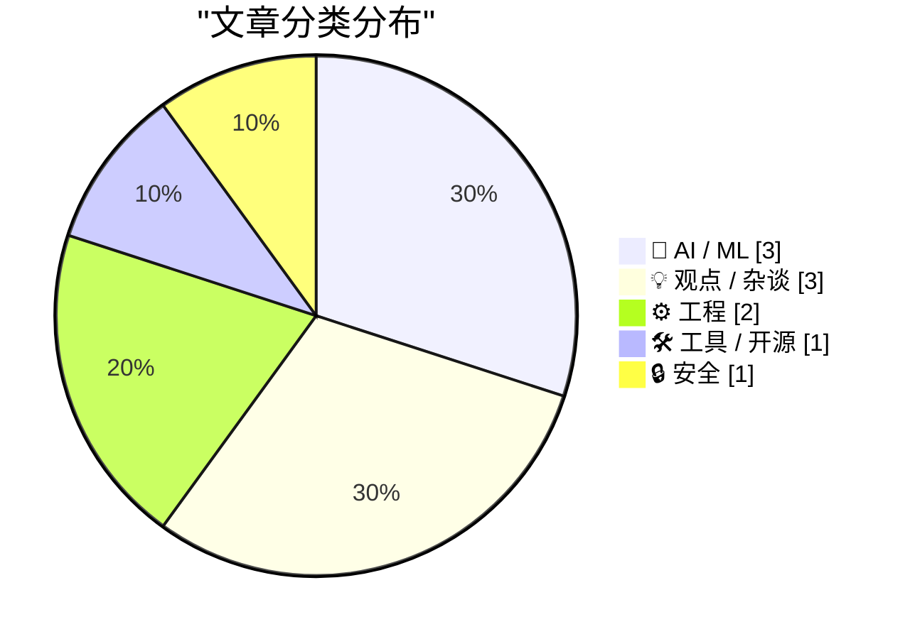
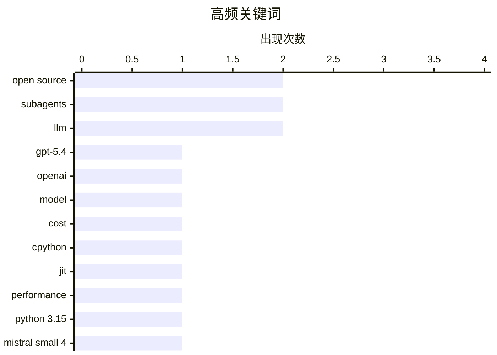

# 📰 AI 博客每日精选 — 2026-03-18

> 来自 Karpathy 推荐的 92 个顶级技术博客，AI 精选 Top 10

## 📝 今日看点

今天技术圈的主线仍是 AI 模型与代理化工作流：OpenAI 推出更轻量的 GPT‑5.4 mini/nano，Mistral Small 4 强调 MoE 与多能力融合，子代理机制在 Codex 等工具中进入 GA，暗示并行分工将成开发新范式。系统与运行时工程也在加速迭代，Python 3.15 JIT 提前达标、Windows 旧架构堆栈保护再被深挖，性能与兼容性仍是硬仗。与此同时，业内对盲目使用 LLM 的风险、创业方向失准的担忧，以及安全服务从简陋到复杂的演进，都在提醒技术扩张需要更冷静的治理与复盘。

---

## 🏆 今日必读

🥇 **GPT-5.4 mini 与 GPT-5.4 nano：52 美元可描述 7.6 万张照片**

[GPT-5.4 mini and GPT-5.4 nano, which can describe 76,000 photos for $52](https://simonwillison.net/2026/Mar/17/mini-and-nano/#atom-everything) — simonwillison.net · 3 小时前 · 🤖 AI / ML

> OpenAI 发布 GPT‑5.4 mini 和 GPT‑5.4 nano，作为两周前 GPT‑5.4 的轻量补充。官方基准显示 5.4‑nano 在最高推理强度下超过上一代 GPT‑5 mini，而新 mini 的速度提升到上一代的 2 倍。定价策略强调低成本高吞吐，示例称 52 美元可为 76,000 张照片生成描述。两款模型主打更好的成本/性能比，适合大规模推理与批量内容处理。

💡 **为什么值得读**: 如果你在评估“性能‑成本”最优的 OpenAI 模型，这篇文章能快速了解新一代 mini/nano 的实际提升与价格门槛。

🏷️ GPT-5.4, OpenAI, model, cost

🥈 **引述 Ken Jin**

[Quoting Ken Jin](https://simonwillison.net/2026/Mar/17/ken-jin/#atom-everything) — simonwillison.net · 1 小时前 · ⚙️ 工程

> CPython JIT 在 macOS AArch64 与 x86_64 Linux 上提前达成了既定性能目标。Python 3.15 alpha 版 JIT 在 macOS AArch64 上比 tail‑calling 解释器快约 11–12%，在 x86_64 Linux 上比标准解释器快 5–6%。这些结果比预期时间提前数月甚至一年。整体结论是 JIT 已进入稳定提速阶段，3.15 版本将带来可感知性能收益。

💡 **为什么值得读**: 想了解 Python JIT 实际收益与进度，这段性能数据能帮你判断是否值得期待 3.15。

🏷️ CPython, JIT, performance, Python 3.15

🥉 **推出 Mistral Small 4**

[Introducing Mistral Small 4](https://simonwillison.net/2026/Mar/16/mistral-small-4/#atom-everything) — simonwillison.net · 23 小时前 · 🤖 AI / ML

> Mistral 发布 Small 4，一个 Apache 2 许可的 119B 参数 MoE 模型，激活参数为 6B。该模型宣称首次将 Magistral（推理）、Pixtral（多模态）与 Devstral（代理式编码）能力统一到单一模型中。它定位为“Small”但规格接近旗舰，强调通用性与可部署性。Mistral 正在推动开源大模型在推理、多模态与编码三方面的融合。

💡 **为什么值得读**: 想找一款同时覆盖推理、多模态与编码的开源模型，这条信息能直接影响你的模型选型。

🏷️ Mistral Small 4, MoE, open source, 119B

---

## 📊 数据概览

| 扫描源 | 抓取文章 | 时间范围 | 精选 |
|:---:|:---:|:---:|:---:|
| 88/92 | 2499 篇 → 23 篇 | 24h | **10 篇** |

### 分类分布



### 高频关键词



<details>
<summary>📈 纯文本关键词图（终端友好）</summary>

```
open source │ ████████████████████ 2
subagents   │ ████████████████████ 2
llm         │ ████████████████████ 2
gpt-5.4     │ ██████████░░░░░░░░░░ 1
openai      │ ██████████░░░░░░░░░░ 1
model       │ ██████████░░░░░░░░░░ 1
cost        │ ██████████░░░░░░░░░░ 1
cpython     │ ██████████░░░░░░░░░░ 1
jit         │ ██████████░░░░░░░░░░ 1
performance │ ██████████░░░░░░░░░░ 1
```

</details>

### 🏷️ 话题标签

**open source**(2) · **subagents**(2) · **llm**(2) · gpt-5.4(1) · openai(1) · model(1) · cost(1) · cpython(1) · jit(1) · performance(1) · python 3.15(1) · mistral small 4(1) · moe(1) · 119b(1) · context window(1) · agentic(1) · openai codex(1) · custom agents(1) · developer tools(1) · windows(1)

---

## 🤖 AI / ML

### 1. GPT-5.4 mini 与 GPT-5.4 nano：52 美元可描述 7.6 万张照片

[GPT-5.4 mini and GPT-5.4 nano, which can describe 76,000 photos for $52](https://simonwillison.net/2026/Mar/17/mini-and-nano/#atom-everything) — **simonwillison.net** · 3 小时前 · ⭐ 26/30

> OpenAI 发布 GPT‑5.4 mini 和 GPT‑5.4 nano，作为两周前 GPT‑5.4 的轻量补充。官方基准显示 5.4‑nano 在最高推理强度下超过上一代 GPT‑5 mini，而新 mini 的速度提升到上一代的 2 倍。定价策略强调低成本高吞吐，示例称 52 美元可为 76,000 张照片生成描述。两款模型主打更好的成本/性能比，适合大规模推理与批量内容处理。

🏷️ GPT-5.4, OpenAI, model, cost

---

### 2. 推出 Mistral Small 4

[Introducing Mistral Small 4](https://simonwillison.net/2026/Mar/16/mistral-small-4/#atom-everything) — **simonwillison.net** · 23 小时前 · ⭐ 24/30

> Mistral 发布 Small 4，一个 Apache 2 许可的 119B 参数 MoE 模型，激活参数为 6B。该模型宣称首次将 Magistral（推理）、Pixtral（多模态）与 Devstral（代理式编码）能力统一到单一模型中。它定位为“Small”但规格接近旗舰，强调通用性与可部署性。Mistral 正在推动开源大模型在推理、多模态与编码三方面的融合。

🏷️ Mistral Small 4, MoE, open source, 119B

---

### 3. 子代理（Subagents）

[Subagents](https://simonwillison.net/guides/agentic-engineering-patterns/subagents/#atom-everything) — **simonwillison.net** · 10 小时前 · ⭐ 23/30

> 大型语言模型长期受限于上下文窗口，通常上限约 1,000,000 tokens，且窗口越大质量越依赖控制。子代理模式通过为不同子任务分配独立上下文与指令，让主代理把问题切分、并行处理再汇总。每个子代理可携带不同工具或数据源，从而避免单一上下文爆炸。该模式被用来扩展任务规模与质量，在保持上下文限制的同时提升整体效率。

🏷️ subagents, LLM, context window, agentic

---

## 💡 观点 / 杂谈

### 4. 引用 Tim Schilling 的话

[Quoting Tim Schilling](https://simonwillison.net/2026/Mar/17/tim-schilling/#atom-everything) — **simonwillison.net** · 6 小时前 · ⭐ 20/30

> 在 Django 开源贡献中，盲目使用 LLM 会削弱项目质量与社区协作。作者强调，如果贡献者不理解 issue、解决方案或 PR 反馈，LLM 的介入只会伤害项目。评审者与“人类外壳”对话会感到沮丧，因为开源贡献依赖真实的交流与责任感。结论是 LLM 应作为辅助而非替代理解与沟通的工具。

🏷️ LLM, Django, open source, code review

---

### 5. 我们为什么还在做这件事？

[Why Are We Still Doing This?](https://www.wheresyoured.at/why-are-we-still-doing-this/) — **wheresyoured.at** · 6 小时前 · ⭐ 20/30

> 文章以“Why Are We Still Doing This?”为题，呈现对某种持续性行为或行业惯性的反思语气。开头强调作者的付费通讯支持方式，订阅可获得 5,000 到 185,000 字的长篇内容。整体定位为深度评论或调查类长文。核心结论是作者希望通过订阅获得持续写作支持。

🏷️ tech industry, business model, critique

---

### 6. 你的创业公司可能一开始就已夭折

[Your Startup Is Probably Dead On Arrival](https://steveblank.com/2026/03/17/your-startup-is-probably-dead-on-arrival/) — **steveblank.com** · 10 小时前 · ⭐ 20/30

> 两年前创建的创业公司，其关键假设很可能已不再成立。作者建议立刻暂停编码、招聘、融资等动作，先重新审视市场、技术与客户变化。若不校准方向，企业会在错误路径上继续投入直至失败。结论是创业必须定期做“现实检验”，否则公司会在出发点就被淘汰。

🏷️ startup, market assumptions, product strategy

---

## ⚙️ 工程

### 7. 引述 Ken Jin

[Quoting Ken Jin](https://simonwillison.net/2026/Mar/17/ken-jin/#atom-everything) — **simonwillison.net** · 1 小时前 · ⭐ 24/30

> CPython JIT 在 macOS AArch64 与 x86_64 Linux 上提前达成了既定性能目标。Python 3.15 alpha 版 JIT 在 macOS AArch64 上比 tail‑calling 解释器快约 11–12%，在 x86_64 Linux 上比标准解释器快 5–6%。这些结果比预期时间提前数月甚至一年。整体结论是 JIT 已进入稳定提速阶段，3.15 版本将带来可感知性能收益。

🏷️ CPython, JIT, performance, Python 3.15

---

### 8. Windows 堆栈限制检查回顾：x86-32（i386）第二次尝试

[Windows stack limit checking retrospective: x86-32 also known as i386, second try](https://devblogs.microsoft.com/oldnewthing/20260317-00/?p=112144) — **devblogs.microsoft.com/oldnewthing** · 9 小时前 · ⭐ 21/30

> 文章回顾 Windows 在 x86‑32 架构上的堆栈限制检查实现，并解释为何需要“第二次尝试”。核心问题是堆栈探测与溢出保护必须兼顾 CPU 的返回地址预测器行为。作者讨论了编译器生成的堆栈探测代码如何与硬件预测机制互动，以及此前实现的隐患。结论是栈安全机制不仅取决于 OS 设计，也受微架构细节牵制。

🏷️ Windows, stack limit, x86

---

## 🛠 工具 / 开源

### 9. 在 Codex 中使用子代理和自定义代理

[Use subagents and custom agents in Codex](https://simonwillison.net/2026/Mar/16/codex-subagents/#atom-everything) — **simonwillison.net** · 23 小时前 · ⭐ 22/30

> OpenAI Codex 正式上线子代理（Subagents）与自定义代理功能，结束预览阶段进入 GA。机制与 Claude Code 类似，内置 “explorer”“worker”“default” 等默认子代理角色。用户可为子代理定义系统提示、工具与行为，从而形成分工明确的多代理协作。该功能使 Codex 能更好地拆解复杂编码任务并并行推进。

🏷️ OpenAI Codex, subagents, custom agents, developer tools

---

## 🔒 安全

### 10. 每周更新 495

[Weekly Update 495](https://www.troyhunt.com/weekly-update-495/) — **troyhunt.com** · 20 小时前 · ⭐ 19/30

> 作者回顾了 Have I Been Pwned 从最初的简单架构演变到复杂系统的过程。最初只是网站、数据库和 1.5 亿条邮箱数据，现在已加入无服务器函数、边缘计算代码、新的数据存储与全新的查询机制。架构复杂化源于规模、性能与可用性需求的持续增长。结论是即便是“简单查询服务”，长期演进也会形成高度复杂的技术栈。

🏷️ HaveIBeenPwned, serverless, data-breach

---

*生成于 2026-03-18 23:03 | 扫描 88 源 → 获取 2499 篇 → 精选 10 篇*
*基于 [Hacker News Popularity Contest 2025](https://refactoringenglish.com/tools/hn-popularity/) RSS 源列表*
