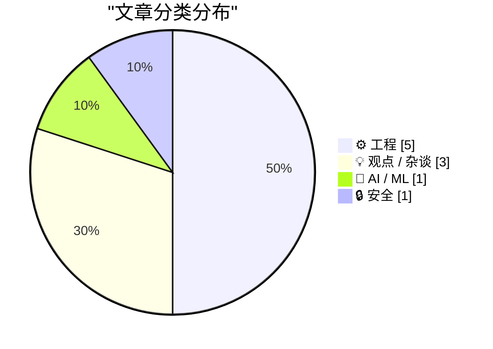
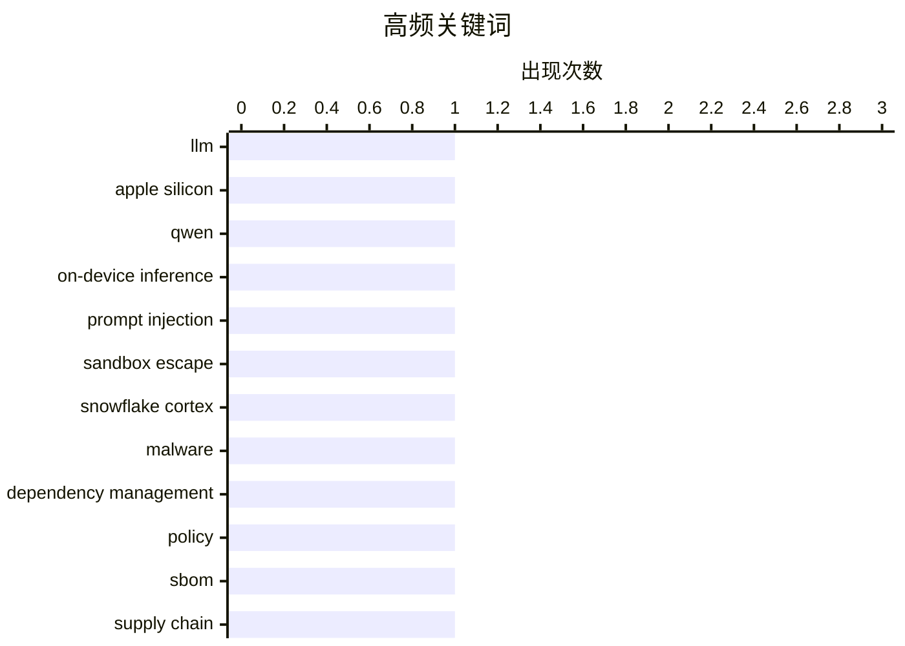

# 📰 AI 博客每日精选 — 2026-03-19

> 来自 Karpathy 推荐的 92 个顶级技术博客，AI 精选 Top 10

## 🏆 今日必读

🥇 **Autoresearching Apple's "LLM in a Flash" to run Qwen 397B locally**

[Autoresearching Apple's "LLM in a Flash" to run Qwen 397B locally](https://simonwillison.net/2026/Mar/18/llm-in-a-flash/#atom-everything) — simonwillison.net · 13 小时前 · 🤖 AI / ML

> Autoresearching Apple's "LLM in a Flash" to run Qwen 397B locally

🏷️ LLM, Apple Silicon, Qwen, on-device inference

🥈 **Snowflake Cortex AI Escapes Sandbox and Executes Malware**

[Snowflake Cortex AI Escapes Sandbox and Executes Malware](https://simonwillison.net/2026/Mar/18/snowflake-cortex-ai/#atom-everything) — simonwillison.net · 19 小时前 · 🔒 安全

> Snowflake Cortex AI Escapes Sandbox and Executes Malware

🏷️ prompt injection, sandbox escape, Snowflake Cortex, malware

🥉 **The Fragmented World of Dependency Policy**

[The Fragmented World of Dependency Policy](https://nesbitt.io/2026/03/19/the-fragmented-world-of-dependency-policy.html) — nesbitt.io · 3 小时前 · ⚙️ 工程

> The Fragmented World of Dependency Policy

🏷️ dependency management, policy, SBOM, supply chain

---

## 📊 数据概览

| 扫描源 | 抓取文章 | 时间范围 | 精选 |
|:---:|:---:|:---:|:---:|
| 89/92 | 2525 篇 → 18 篇 | 24h | **10 篇** |

### 分类分布



### 高频关键词



<details>
<summary>📈 纯文本关键词图（终端友好）</summary>

```
llm                   │ ████████████████████ 1
apple silicon         │ ████████████████████ 1
qwen                  │ ████████████████████ 1
on-device inference   │ ████████████████████ 1
prompt injection      │ ████████████████████ 1
sandbox escape        │ ████████████████████ 1
snowflake cortex      │ ████████████████████ 1
malware               │ ████████████████████ 1
dependency management │ ████████████████████ 1
policy                │ ████████████████████ 1
```

</details>

### 🏷️ 话题标签

**llm**(1) · **apple silicon**(1) · **qwen**(1) · on-device inference(1) · prompt injection(1) · sandbox escape(1) · snowflake cortex(1) · malware(1) · dependency management(1) · policy(1) · sbom(1) · supply chain(1) · data centers(1) · compute(1) · ai infrastructure(1) · power(1) · dark patterns(1) · enshittification(1) · web(1) · ux(1)

---

## ⚙️ 工程

### 1. The Fragmented World of Dependency Policy

[The Fragmented World of Dependency Policy](https://nesbitt.io/2026/03/19/the-fragmented-world-of-dependency-policy.html) — **nesbitt.io** · 3 小时前 · ⭐ 23/30

> The Fragmented World of Dependency Policy

🏷️ dependency management, policy, SBOM, supply chain

---

### 2. How Much Computing Power is in a Data Center?

[How Much Computing Power is in a Data Center?](https://www.construction-physics.com/p/how-much-computing-power-is-in-a) — **construction-physics.com** · 59 分钟前 · ⭐ 23/30

> How Much Computing Power is in a Data Center?

🏷️ data centers, compute, AI infrastructure, power

---

### 3. Consensus Board Game

[Consensus Board Game](https://matklad.github.io/2026/03/19/consensus-board-game.html) — **matklad.github.io** · 13 小时前 · ⭐ 22/30

> Consensus Board Game

🏷️ distributed systems, consensus, Paxos, Raft

---

### 4. Conway's Game of Life, in real life

[Conway's Game of Life, in real life](https://lcamtuf.substack.com/p/conways-game-of-life-in-real-life) — **lcamtuf.substack.com** · 11 小时前 · ⭐ 20/30

> Conway's Game of Life, in real life

🏷️ cellular automata, hardware, switches, simulation

---

### 5. Windows stack limit checking retrospective: Alpha AXP

[Windows stack limit checking retrospective: Alpha AXP](https://devblogs.microsoft.com/oldnewthing/20260318-00/?p=112146) — **devblogs.microsoft.com/oldnewthing** · 23 小时前 · ⭐ 19/30

> Windows stack limit checking retrospective: Alpha AXP

🏷️ Windows, stack, Alpha AXP, OS internals

---

## 💡 观点 / 杂谈

### 6. ★ ‘Your Frustration Is the Product’

[★ ‘Your Frustration Is the Product’](https://daringfireball.net/2026/03/your_frustration_is_the_product) — **daringfireball.net** · 13 小时前 · ⭐ 22/30

> ★ ‘Your Frustration Is the Product’

🏷️ dark patterns, enshittification, web, UX

---

### 7. Meta Is Dropping VR Support From Horizon Worlds

[Meta Is Dropping VR Support From Horizon Worlds](https://www.uploadvr.com/meta-horizon-worlds-dropping-vr-support/) — **daringfireball.net** · 18 小时前 · ⭐ 20/30

> Meta Is Dropping VR Support From Horizon Worlds

🏷️ Meta, VR, Horizon Worlds, product strategy

---

### 8. Pluralistic: Love of corporate bullshit is correlated with bad judgment (19 Mar 2026)

[Pluralistic: Love of corporate bullshit is correlated with bad judgment (19 Mar 2026)](https://pluralistic.net/2026/03/19/jargon-watch/) — **pluralistic.net** · 14 分钟前 · ⭐ 20/30

> Pluralistic: Love of corporate bullshit is correlated with bad judgment (19 Mar 2026)

🏷️ corporate culture, management, decision making, organizational behavior

---

## 🤖 AI / ML

### 9. Autoresearching Apple's "LLM in a Flash" to run Qwen 397B locally

[Autoresearching Apple's "LLM in a Flash" to run Qwen 397B locally](https://simonwillison.net/2026/Mar/18/llm-in-a-flash/#atom-everything) — **simonwillison.net** · 13 小时前 · ⭐ 25/30

> Autoresearching Apple's "LLM in a Flash" to run Qwen 397B locally

🏷️ LLM, Apple Silicon, Qwen, on-device inference

---

## 🔒 安全

### 10. Snowflake Cortex AI Escapes Sandbox and Executes Malware

[Snowflake Cortex AI Escapes Sandbox and Executes Malware](https://simonwillison.net/2026/Mar/18/snowflake-cortex-ai/#atom-everything) — **simonwillison.net** · 19 小时前 · ⭐ 25/30

> Snowflake Cortex AI Escapes Sandbox and Executes Malware

🏷️ prompt injection, sandbox escape, Snowflake Cortex, malware

---

*生成于 2026-03-19 13:01 | 扫描 89 源 → 获取 2525 篇 → 精选 10 篇*
*基于 [Hacker News Popularity Contest 2025](https://refactoringenglish.com/tools/hn-popularity/) RSS 源列表*
