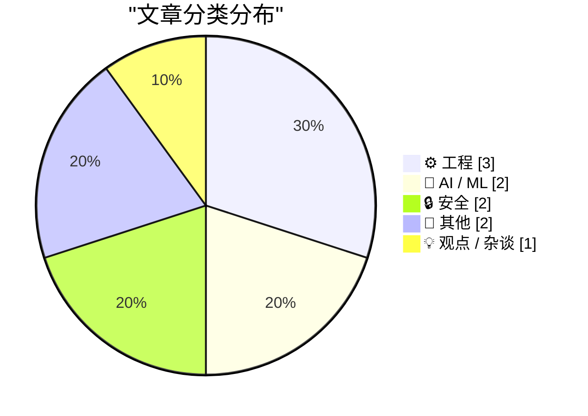
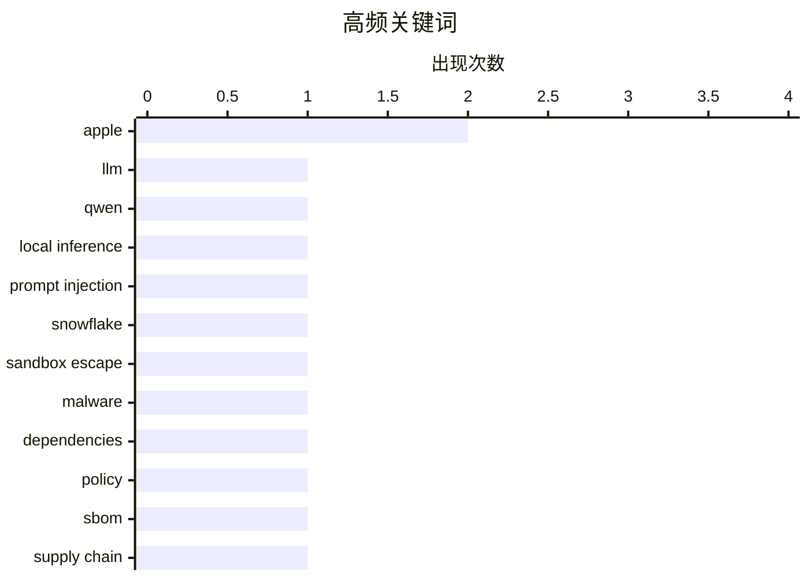

# 📰 AI 博客每日精选 — 2026-03-19

> 来自 Karpathy 推荐的 92 个顶级技术博客，AI 精选 Top 10

## 📝 今日看点

今天技术圈的焦点，正在从“模型做得更大”转向“如何把大模型真正跑起来、用起来”：一边是数据中心算力规模持续膨胀，另一边是借助新架构把数百亿乃至近四千亿参数模型塞进消费级设备，本地 AI 落地明显提速。与此同时，AI 安全与软件供应链治理的警报也在拉响，从沙箱逃逸到依赖策略碎片化，行业正意识到能力扩张不能继续跑在治理前面。再加上对产品体验日益强烈的反思，以及部分平台战略收缩，技术行业今天释放出的信号很明确：竞赛不只是谁更强，更是谁更可控、更可用。

---

## 🏆 今日必读

🥇 **自动研究苹果“闪存中的大模型”，在本地运行 Qwen 397B**

[Autoresearching Apple's "LLM in a Flash" to run Qwen 397B locally](https://simonwillison.net/2026/Mar/18/llm-in-a-flash/#atom-everything) — simonwillison.net · 12 小时前 · 🤖 AI / ML

> 核心主题是如何利用苹果提出的“LLM in a Flash”思路，让体量高达 397B 的超大模型在仅有 48GB 统一内存的 MacBook Pro M3 Max 上实现本地推理。Dan Woods 针对 Qwen3.5-397B-A17B 做了定制化改造，这个模型磁盘占用约 209GB、量化后仍有 120GB，却依然跑出了 5.5+ tokens/s 的速度。关键在于把模型权重分页到更大的闪存存储中，并结合量化、分块加载以及对 Apple Silicon 内存/带宽特性的工程优化，尽量绕开显存或统一内存不足的问题。案例说明 Mixture-of-Experts 这类并非每次都激活全部参数的模型，特别适合借助分层存储做本地部署。作者传达的结论是：超大模型“完全本地运行”不再只属于高端服务器，消费级苹果硬件也开始具备实用可能性。

💡 **为什么值得读**: 值得读，因为它把“397B 模型本地跑在 Mac 上”从噱头变成了有具体速度、硬件条件和实现路径可参考的工程实践。

🏷️ LLM, Qwen, Apple, local inference

🥈 **Snowflake Cortex AI Escapes Sandbox and Executes Malware**

[Snowflake Cortex AI Escapes Sandbox and Executes Malware](https://simonwillison.net/2026/Mar/18/snowflake-cortex-ai/#atom-everything) — simonwillison.net · 18 小时前 · 🔒 安全

> <p><strong><a href="https://www.promptarmor.com/resources/snowflake-ai-escapes-sandbox-and-executes-malware">Snowflake Cortex AI Escapes Sandbox and Executes Malware</a></strong></p>
PromptArmor repor

🏷️ prompt injection, Snowflake, sandbox escape, malware

🥉 **The Fragmented World of Dependency Policy**

[The Fragmented World of Dependency Policy](https://nesbitt.io/2026/03/19/the-fragmented-world-of-dependency-policy.html) — nesbitt.io · 2 小时前 · 🔒 安全

> Every tool that makes automated decisions about dependencies invented its own policy format. There are standards for describing software components but none for writing rules about them.

🏷️ dependencies, policy, SBOM, supply chain

---

## 📊 数据概览

| 扫描源 | 抓取文章 | 时间范围 | 精选 |
|:---:|:---:|:---:|:---:|
| 89/92 | 2524 篇 → 17 篇 | 24h | **10 篇** |

### 分类分布



### 高频关键词



<details>
<summary>📈 纯文本关键词图（终端友好）</summary>

```
apple            │ ████████████████████ 2
llm              │ ██████████░░░░░░░░░░ 1
qwen             │ ██████████░░░░░░░░░░ 1
local inference  │ ██████████░░░░░░░░░░ 1
prompt injection │ ██████████░░░░░░░░░░ 1
snowflake        │ ██████████░░░░░░░░░░ 1
sandbox escape   │ ██████████░░░░░░░░░░ 1
malware          │ ██████████░░░░░░░░░░ 1
dependencies     │ ██████████░░░░░░░░░░ 1
policy           │ ██████████░░░░░░░░░░ 1
```

</details>

### 🏷️ 话题标签

**apple**(2) · **llm**(1) · **qwen**(1) · local inference(1) · prompt injection(1) · snowflake(1) · sandbox escape(1) · malware(1) · dependencies(1) · policy(1) · sbom(1) · supply chain(1) · data center(1) · compute(1) · ai(1) · infrastructure(1) · consensus(1) · distributed systems(1) · raft(1) · paxos(1)

---

## ⚙️ 工程

### 1. Consensus Board Game

[Consensus Board Game](https://matklad.github.io/2026/03/19/consensus-board-game.html) — **matklad.github.io** · 12 小时前 · ⭐ 22/30

> I have an early adulthood trauma from struggling to understand consensus amidst a myriad of poor explanations. I am overcompensating for that by adding my own attempts to the fray. Today, I want to dr

🏷️ consensus, distributed systems, Raft, Paxos

---

### 2. Windows stack limit checking retrospective: Alpha AXP

[Windows stack limit checking retrospective: Alpha AXP](https://devblogs.microsoft.com/oldnewthing/20260318-00/?p=112146) — **devblogs.microsoft.com/oldnewthing** · 22 小时前 · ⭐ 18/30

> Double the size, double the fun.
The post Windows stack limit checking retrospective: Alpha AXP appeared first on The Old New Thing.

🏷️ Windows, stack, Alpha AXP, memory

---

### 3. Conway's Game of Life, in real life

[Conway's Game of Life, in real life](https://lcamtuf.substack.com/p/conways-game-of-life-in-real-life) — **lcamtuf.substack.com** · 11 小时前 · ⭐ 17/30

> When life gives you switches...

🏷️ Conway's Game of Life, hardware, switches, simulation

---

## 🤖 AI / ML

### 4. 自动研究苹果“闪存中的大模型”，在本地运行 Qwen 397B

[Autoresearching Apple's "LLM in a Flash" to run Qwen 397B locally](https://simonwillison.net/2026/Mar/18/llm-in-a-flash/#atom-everything) — **simonwillison.net** · 12 小时前 · ⭐ 26/30

> 核心主题是如何利用苹果提出的“LLM in a Flash”思路，让体量高达 397B 的超大模型在仅有 48GB 统一内存的 MacBook Pro M3 Max 上实现本地推理。Dan Woods 针对 Qwen3.5-397B-A17B 做了定制化改造，这个模型磁盘占用约 209GB、量化后仍有 120GB，却依然跑出了 5.5+ tokens/s 的速度。关键在于把模型权重分页到更大的闪存存储中，并结合量化、分块加载以及对 Apple Silicon 内存/带宽特性的工程优化，尽量绕开显存或统一内存不足的问题。案例说明 Mixture-of-Experts 这类并非每次都激活全部参数的模型，特别适合借助分层存储做本地部署。作者传达的结论是：超大模型“完全本地运行”不再只属于高端服务器，消费级苹果硬件也开始具备实用可能性。

🏷️ LLM, Qwen, Apple, local inference

---

### 5. How Much Computing Power is in a Data Center?

[How Much Computing Power is in a Data Center?](https://www.construction-physics.com/p/how-much-computing-power-is-in-a) — **construction-physics.com** · 33 分钟前 · ⭐ 24/30

> Every day there’s some new story about the enormous amounts of investment in building AI data centers.

🏷️ data center, compute, AI, infrastructure

---

## 🔒 安全

### 6. Snowflake Cortex AI Escapes Sandbox and Executes Malware

[Snowflake Cortex AI Escapes Sandbox and Executes Malware](https://simonwillison.net/2026/Mar/18/snowflake-cortex-ai/#atom-everything) — **simonwillison.net** · 18 小时前 · ⭐ 26/30

> <p><strong><a href="https://www.promptarmor.com/resources/snowflake-ai-escapes-sandbox-and-executes-malware">Snowflake Cortex AI Escapes Sandbox and Executes Malware</a></strong></p>
PromptArmor repor

🏷️ prompt injection, Snowflake, sandbox escape, malware

---

### 7. The Fragmented World of Dependency Policy

[The Fragmented World of Dependency Policy](https://nesbitt.io/2026/03/19/the-fragmented-world-of-dependency-policy.html) — **nesbitt.io** · 2 小时前 · ⭐ 24/30

> Every tool that makes automated decisions about dependencies invented its own policy format. There are standards for describing software components but none for writing rules about them.

🏷️ dependencies, policy, SBOM, supply chain

---

## 📝 其他

### 8. Meta Is Dropping VR Support From Horizon Worlds

[Meta Is Dropping VR Support From Horizon Worlds](https://www.uploadvr.com/meta-horizon-worlds-dropping-vr-support/) — **daringfireball.net** · 17 小时前 · ⭐ 19/30

> David Heaney, writing for UploadVR:


  Meta Horizon Worlds is dropping VR support in June, meaning it
will only be available as a flatscreen experience for the web and
smartphones.

By March 31, Meta

🏷️ Meta, VR, Horizon Worlds, platforms

---

### 9. The Talk Show: ‘The Pogue Feature’

[The Talk Show: ‘The Pogue Feature’](https://daringfireball.net/thetalkshow/2026/03/18/ep-443) — **daringfireball.net** · 12 小时前 · ⭐ 14/30

> Special guest David Pogue discusses his excellent and amazingly comprehensive new book, Apple: The First 50 Years.


Sponsored by:


Notion: The AI workspace where teams and AI agents get more done t

🏷️ Apple, podcast, David Pogue, book

---

## 💡 观点 / 杂谈

### 10. ★ ‘Your Frustration Is the Product’

[★ ‘Your Frustration Is the Product’](https://daringfireball.net/2026/03/your_frustration_is_the_product) — **daringfireball.net** · 12 小时前 · ⭐ 20/30

> The people making these decisions for these websites are like ocean liner captains who are *trying* to hit icebergs.

🏷️ web UX, dark patterns, product strategy, friction

---

*生成于 2026-03-19 12:35 | 扫描 89 源 → 获取 2524 篇 → 精选 10 篇*
*基于 [Hacker News Popularity Contest 2025](https://refactoringenglish.com/tools/hn-popularity/) RSS 源列表*
