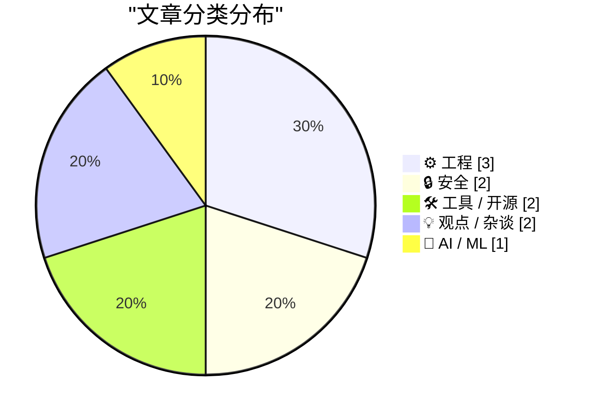
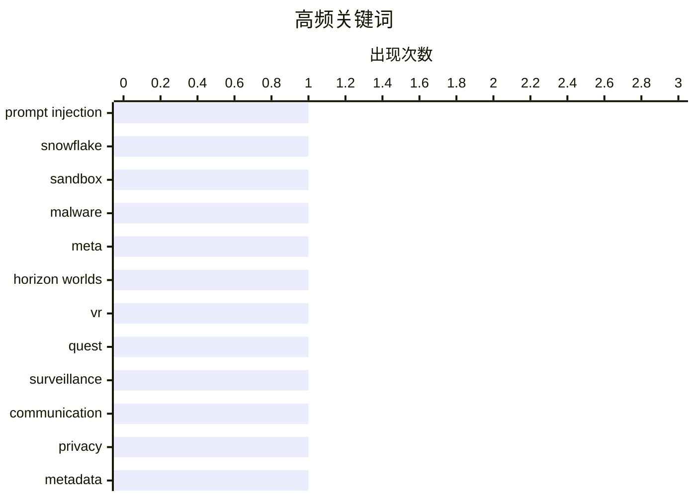

# 📰 AI 博客每日精选 — 2026-03-19

> 来自 Karpathy 推荐的 92 个顶级技术博客，AI 精选 Top 10

## 📝 今日看点

今天的技术话题里，安全与隐私依然是焦点，从 AI 沙箱逃逸到通信即监控的讨论，都在提醒智能系统的边界与风险。AI 继续向日常场景渗透，连咖啡偏好这种小事也成了 LLM 的预测对象。产业层面则出现冷却信号，Meta 对 VR 支持的收缩暗示元宇宙热度退潮；同时，开发者圈子仍在关注底层工程细节与工具生态的演进。

---

## 🏆 今日必读

🥇 **Snowflake Cortex AI Escapes Sandbox and Executes Malware**

[Snowflake Cortex AI Escapes Sandbox and Executes Malware](https://simonwillison.net/2026/Mar/18/snowflake-cortex-ai/#atom-everything) — simonwillison.net · 5 小时前 · 🔒 安全

> Snowflake Cortex AI Escapes Sandbox and Executes Malware

🏷️ prompt injection, Snowflake, sandbox, malware

🥈 **Meta Is Dropping VR Support From Horizon Worlds**

[Meta Is Dropping VR Support From Horizon Worlds](https://www.uploadvr.com/meta-horizon-worlds-dropping-vr-support/) — daringfireball.net · 4 小时前 · ⚙️ 工程

> Meta Is Dropping VR Support From Horizon Worlds

🏷️ Meta, Horizon Worlds, VR, Quest

🥉 **Communication Is Surveillance by Design**

[Communication Is Surveillance by Design](https://idiallo.com/blog/communication-is-surveillance-by-design?src=feed) — idiallo.com · 11 小时前 · 🔒 安全

> Communication Is Surveillance by Design

🏷️ surveillance, communication, privacy, metadata

---

## 📊 数据概览

| 扫描源 | 抓取文章 | 时间范围 | 精选 |
|:---:|:---:|:---:|:---:|
| 89/92 | 2524 篇 → 17 篇 | 24h | **10 篇** |

### 分类分布



### 高频关键词



<details>
<summary>📈 纯文本关键词图（终端友好）</summary>

```
prompt injection │ ████████████████████ 1
snowflake        │ ████████████████████ 1
sandbox          │ ████████████████████ 1
malware          │ ████████████████████ 1
meta             │ ████████████████████ 1
horizon worlds   │ ████████████████████ 1
vr               │ ████████████████████ 1
quest            │ ████████████████████ 1
surveillance     │ ████████████████████ 1
communication    │ ████████████████████ 1
```

</details>

### 🏷️ 话题标签

**prompt injection**(1) · **snowflake**(1) · **sandbox**(1) · malware(1) · meta(1) · horizon worlds(1) · vr(1) · quest(1) · surveillance(1) · communication(1) · privacy(1) · metadata(1) · llm(1) · prediction(1) · coffee(1) · statistics(1) · git(1) · remote helpers(1) · version control(1) · windows(1)

---

## ⚙️ 工程

### 1. Meta Is Dropping VR Support From Horizon Worlds

[Meta Is Dropping VR Support From Horizon Worlds](https://www.uploadvr.com/meta-horizon-worlds-dropping-vr-support/) — **daringfireball.net** · 4 小时前 · ⭐ 20/30

> Meta Is Dropping VR Support From Horizon Worlds

🏷️ Meta, Horizon Worlds, VR, Quest

---

### 2. Windows stack limit checking retrospective: Alpha AXP

[Windows stack limit checking retrospective: Alpha AXP](https://devblogs.microsoft.com/oldnewthing/20260318-00/?p=112146) — **devblogs.microsoft.com/oldnewthing** · 9 小时前 · ⭐ 17/30

> Windows stack limit checking retrospective: Alpha AXP

🏷️ Windows, stack limit, Alpha AXP

---

### 3. Tighter bounds on alternating series remainder

[Tighter bounds on alternating series remainder](https://www.johndcook.com/blog/2026/03/17/alternating-series-remainder/) — **johndcook.com** · 20 小时前 · ⭐ 15/30

> Tighter bounds on alternating series remainder

🏷️ alternating series, numerical analysis, error bounds

---

## 🔒 安全

### 4. Snowflake Cortex AI Escapes Sandbox and Executes Malware

[Snowflake Cortex AI Escapes Sandbox and Executes Malware](https://simonwillison.net/2026/Mar/18/snowflake-cortex-ai/#atom-everything) — **simonwillison.net** · 5 小时前 · ⭐ 24/30

> Snowflake Cortex AI Escapes Sandbox and Executes Malware

🏷️ prompt injection, Snowflake, sandbox, malware

---

### 5. Communication Is Surveillance by Design

[Communication Is Surveillance by Design](https://idiallo.com/blog/communication-is-surveillance-by-design?src=feed) — **idiallo.com** · 11 小时前 · ⭐ 20/30

> Communication Is Surveillance by Design

🏷️ surveillance, communication, privacy, metadata

---

## 🛠 工具 / 开源

### 6. Git Remote Helpers

[Git Remote Helpers](https://nesbitt.io/2026/03/18/git-remote-helpers.html) — **nesbitt.io** · 13 小时前 · ⭐ 19/30

> Git Remote Helpers

🏷️ Git, remote helpers, version control

---

### 7. Wander the Small Web

[Wander the Small Web](https://susam.net/wander/) — **susam.net** · 23 小时前 · ⭐ 15/30

> Wander the Small Web

🏷️ small web, personal websites, exploration tool

---

## 💡 观点 / 杂谈

### 8. Marc Andreessen is wrong about introspection

[Marc Andreessen is wrong about introspection](https://www.joanwestenberg.com/marc-andreessen-is-wrong-about-introspection/) — **joanwestenberg.com** · 16 小时前 · ⭐ 17/30

> Marc Andreessen is wrong about introspection

🏷️ Marc Andreessen, introspection, tech culture

---

### 9. ★ Squashing

[★ Squashing](https://daringfireball.net/2026/03/squashing) — **daringfireball.net** · 23 小时前 · ⭐ 14/30

> ★ Squashing

🏷️ CNBC, journalism, headline

---

## 🤖 AI / ML

### 10. LLMs predict my coffee

[LLMs predict my coffee](https://dynomight.net/coffee/) — **dynomight.net** · 23 小时前 · ⭐ 19/30

> LLMs predict my coffee

🏷️ LLM, prediction, coffee, statistics

---

*生成于 2026-03-19 23:08 | 扫描 89 源 → 获取 2524 篇 → 精选 10 篇*
*基于 [Hacker News Popularity Contest 2025](https://refactoringenglish.com/tools/hn-popularity/) RSS 源列表*
