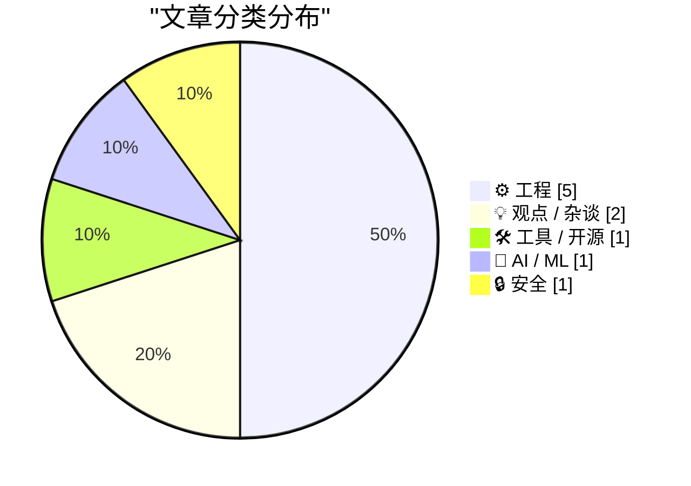
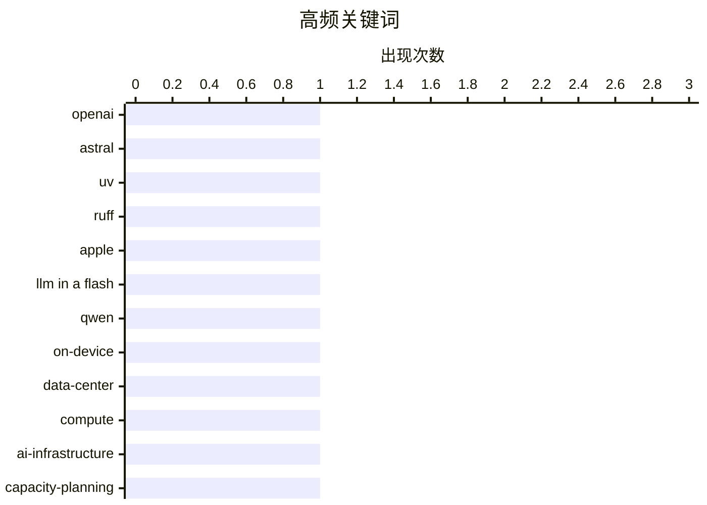

# 📰 AI 博客每日精选 — 2026-03-20

> 来自 Karpathy 推荐的 92 个顶级技术博客，AI 精选 Top 10

## 📝 今日看点

今天的技术焦点集中在三条主线：一是开源与开发者工具链进入“被资本重塑”的阶段，围绕 Python 基础设施与依赖治理的讨论升温，大家更在意可持续性、控制权与标准化。二是 AI 规模化落地的两极分化愈发明显：一边是数据中心算力与投资继续狂飙，另一边是把超大模型压到本地设备运行的工程探索加速。三是平台与用户权利的拉扯加剧，从 Android 侧载限制到对“以摩擦驱动商业”的产品策略反思，技术演进正在更直接地触碰治理与体验边界。

---

## 🏆 今日必读

🥇 **关于 OpenAI 收购 Astral 以及 uv/ruff/ty 的一些想法**

[Thoughts on OpenAI acquiring Astral and uv/ruff/ty](https://simonwillison.net/2026/Mar/19/openai-acquiring-astral/#atom-everything) — simonwillison.net · 6 小时前 · 🛠 工具 / 开源

> OpenAI 宣布将收购 Astral，引发了 Python 生态对关键开源基础设施未来走向的关注。Astral 背后的 uv（Python 包安装/环境工具）、ruff（高性能 Python linter/formatter）和 ty（类型相关工具）正在成为越来越“不可或缺”的构建链组件，影响开发者的日常工作流与 CI。作者关心的重点不在并购本身，而在这些工具的治理结构、长期维护激励、路线图是否会被 OpenAI 的商业目标牵引，以及社区对“单一大厂控制关键工具链”的系统性风险。与此同时，并购也可能带来更稳定的资金与工程投入，推动 uv/ruff/ty 的性能、平台支持和生态整合加速。核心观点是：这类收购既可能让工具更强、更快，也可能改变开源项目的权力结构与信任边界，社区需要用治理与透明度来对冲集中化风险。

💡 **为什么值得读**: 如果你依赖 uv/ruff/类型检查工具做开发与 CI，这篇能帮你快速看清“工具变强”和“生态被单点控制”之间的权衡，以及接下来应关注哪些治理与路线图信号。

🏷️ OpenAI, Astral, uv, ruff

🥈 **Autoresearching Apple's "LLM in a Flash" to run Qwen 397B locally**

[Autoresearching Apple's "LLM in a Flash" to run Qwen 397B locally](https://simonwillison.net/2026/Mar/18/llm-in-a-flash/#atom-everything) — simonwillison.net · 23 小时前 · 🤖 AI / ML

> <p><strong><a href="https://twitter.com/danveloper/status/2034353876753592372">Autoresearching Apple&#x27;s "LLM in a Flash" to run Qwen 397B locally</a></strong></p>
Here's a fascinating piece of res

🏷️ Apple, LLM in a Flash, Qwen, on-device

🥉 **How Much Computing Power is in a Data Center?**

[How Much Computing Power is in a Data Center?](https://www.construction-physics.com/p/how-much-computing-power-is-in-a) — construction-physics.com · 11 小时前 · ⚙️ 工程

> Every day there’s some new story about the enormous amounts of investment in building AI data centers.

🏷️ data-center, compute, AI-infrastructure, capacity-planning

---

## 📊 数据概览

| 扫描源 | 抓取文章 | 时间范围 | 精选 |
|:---:|:---:|:---:|:---:|
| 89/92 | 2525 篇 → 21 篇 | 24h | **10 篇** |

### 分类分布



### 高频关键词



<details>
<summary>📈 纯文本关键词图（终端友好）</summary>

```
openai         │ ████████████████████ 1
astral         │ ████████████████████ 1
uv             │ ████████████████████ 1
ruff           │ ████████████████████ 1
apple          │ ████████████████████ 1
llm in a flash │ ████████████████████ 1
qwen           │ ████████████████████ 1
on-device      │ ████████████████████ 1
data-center    │ ████████████████████ 1
compute        │ ████████████████████ 1
```

</details>

### 🏷️ 话题标签

**openai**(1) · **astral**(1) · **uv**(1) · ruff(1) · apple(1) · llm in a flash(1) · qwen(1) · on-device(1) · data-center(1) · compute(1) · ai-infrastructure(1) · capacity-planning(1) · android(1) · sideloading(1) · malware(1) · app security(1) · dependencies(1) · policy(1) · sbom(1) · supply-chain(1)

---

## ⚙️ 工程

### 1. How Much Computing Power is in a Data Center?

[How Much Computing Power is in a Data Center?](https://www.construction-physics.com/p/how-much-computing-power-is-in-a) — **construction-physics.com** · 11 小时前 · ⭐ 24/30

> Every day there’s some new story about the enormous amounts of investment in building AI data centers.

🏷️ data-center, compute, AI-infrastructure, capacity-planning

---

### 2. The Fragmented World of Dependency Policy

[The Fragmented World of Dependency Policy](https://nesbitt.io/2026/03/19/the-fragmented-world-of-dependency-policy.html) — **nesbitt.io** · 13 小时前 · ⭐ 23/30

> Every tool that makes automated decisions about dependencies invented its own policy format. There are standards for describing software components but none for writing rules about them.

🏷️ dependencies, policy, SBOM, supply-chain

---

### 3. Consensus Board Game

[Consensus Board Game](https://matklad.github.io/2026/03/19/consensus-board-game.html) — **matklad.github.io** · 23 小时前 · ⭐ 22/30

> I have an early adulthood trauma from struggling to understand consensus amidst a myriad of poor explanations. I am overcompensating for that by adding my own attempts to the fray. Today, I want to dr

🏷️ consensus, distributed-systems, Raft, fault-tolerance

---

### 4. Hacker News Discussion on Shubham Bose’s ‘The 49MB Web Page’

[Hacker News Discussion on Shubham Bose’s ‘The 49MB Web Page’](https://news.ycombinator.com/item?id=47390945) — **daringfireball.net** · 5 小时前 · ⭐ 20/30

> One of the most controversial opinions I’ve long espoused, and believe today more than ever, is that it was a terrible mistake for web browsers to support JavaScript. Not that they should have picked 

🏷️ web performance, JavaScript, page bloat, HN

---

### 5. Windows stack limit checking retrospective: amd64, also known as x86-64

[Windows stack limit checking retrospective: amd64, also known as x86-64](https://devblogs.microsoft.com/oldnewthing/20260319-00/?p=112152) — **devblogs.microsoft.com/oldnewthing** · 9 小时前 · ⭐ 20/30

> Reaching the modern day.
The post Windows stack limit checking retrospective: amd64, also known as x86-64 appeared first on The Old New Thing.

🏷️ Windows, x86-64, stack, OS-internals

---

## 💡 观点 / 杂谈

### 6. ★ ‘Your Frustration Is the Product’

[★ ‘Your Frustration Is the Product’](https://daringfireball.net/2026/03/your_frustration_is_the_product) — **daringfireball.net** · 23 小时前 · ⭐ 21/30

> The people making these decisions for these websites are like ocean liner captains who are *trying* to hit icebergs.

🏷️ UX, dark-patterns, product-strategy, ads

---

### 7. Pluralistic: Love of corporate bullshit is correlated with bad judgment (19 Mar 2026)

[Pluralistic: Love of corporate bullshit is correlated with bad judgment (19 Mar 2026)](https://pluralistic.net/2026/03/19/jargon-watch/) — **pluralistic.net** · 10 小时前 · ⭐ 21/30

> Today's links Love of corporate bullshit is correlated with bad judgment: Synergizing the strategic inflection points on the global data network. Hey look at this: Delights to delectate. Object perman

🏷️ corporate-culture, management, tech-industry, critique

---

## 🛠 工具 / 开源

### 8. 关于 OpenAI 收购 Astral 以及 uv/ruff/ty 的一些想法

[Thoughts on OpenAI acquiring Astral and uv/ruff/ty](https://simonwillison.net/2026/Mar/19/openai-acquiring-astral/#atom-everything) — **simonwillison.net** · 6 小时前 · ⭐ 27/30

> OpenAI 宣布将收购 Astral，引发了 Python 生态对关键开源基础设施未来走向的关注。Astral 背后的 uv（Python 包安装/环境工具）、ruff（高性能 Python linter/formatter）和 ty（类型相关工具）正在成为越来越“不可或缺”的构建链组件，影响开发者的日常工作流与 CI。作者关心的重点不在并购本身，而在这些工具的治理结构、长期维护激励、路线图是否会被 OpenAI 的商业目标牵引，以及社区对“单一大厂控制关键工具链”的系统性风险。与此同时，并购也可能带来更稳定的资金与工程投入，推动 uv/ruff/ty 的性能、平台支持和生态整合加速。核心观点是：这类收购既可能让工具更强、更快，也可能改变开源项目的权力结构与信任边界，社区需要用治理与透明度来对冲集中化风险。

🏷️ OpenAI, Astral, uv, ruff

---

## 🤖 AI / ML

### 9. Autoresearching Apple's "LLM in a Flash" to run Qwen 397B locally

[Autoresearching Apple's "LLM in a Flash" to run Qwen 397B locally](https://simonwillison.net/2026/Mar/18/llm-in-a-flash/#atom-everything) — **simonwillison.net** · 23 小时前 · ⭐ 25/30

> <p><strong><a href="https://twitter.com/danveloper/status/2034353876753592372">Autoresearching Apple&#x27;s "LLM in a Flash" to run Qwen 397B locally</a></strong></p>
Here's a fascinating piece of res

🏷️ Apple, LLM in a Flash, Qwen, on-device

---

## 🔒 安全

### 10. Google’s New Sideloading Restrictions for Android Include a 24-Hour Waiting Period

[Google’s New Sideloading Restrictions for Android Include a 24-Hour Waiting Period](https://www.androidauthority.com/google-android-sideloading-unverified-apps-new-rules-3650343/) — **daringfireball.net** · 3 小时前 · ⭐ 23/30

> Adamya Sharma, reporting for Android Authority:


  When Google execs previously said sideloading would become a
high-friction process on Android, they really weren’t kidding. The
company is finally s

🏷️ Android, sideloading, malware, app security

---

*生成于 2026-03-20 23:01 | 扫描 89 源 → 获取 2525 篇 → 精选 10 篇*
*基于 [Hacker News Popularity Contest 2025](https://refactoringenglish.com/tools/hn-popularity/) RSS 源列表*
