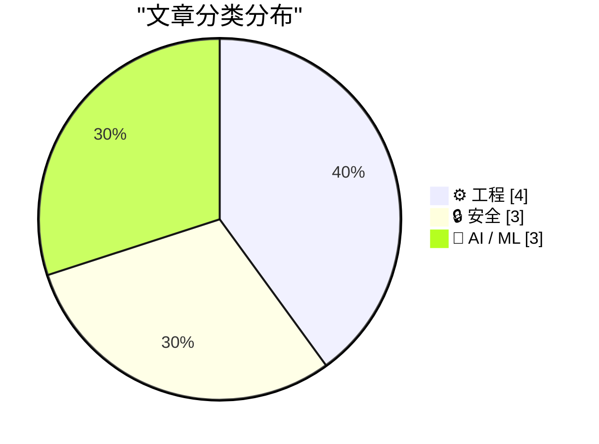
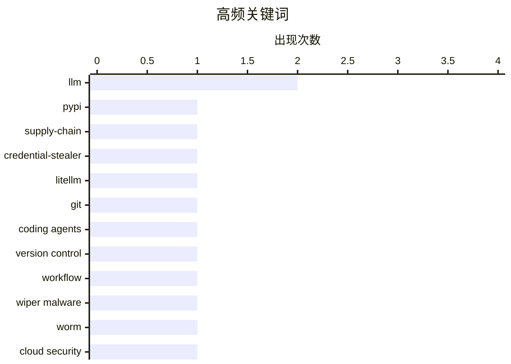

# 📰 AI 博客每日精选 — 2026-03-22

> 来自 Karpathy 推荐的 92 个顶级技术博客，AI 精选 Top 10

## 📝 今日看点

今天技术圈的主线很清晰：安全风险正在从“代码漏洞”转向“生态与供应链信任危机”，从 PyPI 投毒到针对关键基础设施的破坏性攻击，都在提醒开发者把防护前置到依赖与运行时层面。与此同时，AI 工程进入“落地深水区”，焦点不再只是模型能力本身，而是与 Git、框架升级、流式推理等工程化模式的协同效率与可控性。另一条并行趋势是对 AI 叙事和数据使用边界的反思升温，行业宣传、用户画像与隐私伦理之间的张力正在变成公开议题。最后，性能与体验问题再次被放大：臃肿网页与广告负载显示，基础 Web 工程质量仍是影响用户体验的硬指标。

---

## 🏆 今日必读

🥇 **LiteLLM 1.82.8 中的恶意 litellm_init.pth：凭证窃取器**

[Malicious litellm_init.pth in litellm 1.82.8 — credential stealer](https://simonwillison.net/2026/Mar/24/malicious-litellm/#atom-everything) — simonwillison.net · 2026-03-24 · 🔒 安全

> LiteLLM 在 PyPI 发布的 v1.82.8 被植入了供应链后门，核心风险是一个以 Base64 隐藏在 `litellm_init.pth` 文件中的凭证窃取载荷。由于 `.pth` 会在安装/解释器启动阶段被自动处理，攻击在“仅安装包”时即可触发，不需要执行 `import litellm`，危险级别显著高于普通运行时后门。对比来看，v1.82.7 也存在恶意代码，但藏在 `proxy/proxy_server.py`，需要导入后才会生效，触发条件更窄。该事件强调了 Python 打包机制（尤其 `.pth` 自动执行能力）可被滥用于隐蔽持久化与凭证外传。作者的核心观点是这属于非常恶劣且隐蔽的供应链攻击，使用 LiteLLM 的团队应立即排查受影响版本并按事件细节进行溯源与清理。

💡 **为什么值得读**: 它揭示了一个很多开发者忽视的高危攻击面——`.pth` 文件可在安装后自动执行——对 Python 依赖安全和 CI/CD 防护具有直接警示价值。

🏷️ PyPI, supply-chain, credential-stealer, LiteLLM

🥈 **Using Git with coding agents**

[Using Git with coding agents](https://simonwillison.net/guides/agentic-engineering-patterns/using-git-with-coding-agents/#atom-everything) — simonwillison.net · 51 分钟前 · ⚙️ 工程

> Agentic Engineering Patterns > Git is a key tool for working with coding agents. Keeping code in version control lets us record how that code changes over time and investigate and reverse any mistakes

🏷️ Git, coding agents, version control, workflow

🥉 **‘CanisterWorm’ Springs Wiper Attack Targeting Iran**

[‘CanisterWorm’ Springs Wiper Attack Targeting Iran](https://krebsonsecurity.com/2026/03/canisterworm-springs-wiper-attack-targeting-iran/) — krebsonsecurity.com · 2026-03-23 · 🔒 安全

> A financially motivated data theft and extortion group is attempting to inject itself into the Iran war, unleashing a worm that spreads through poorly secured cloud services and wipes data on infected

🏷️ wiper malware, worm, cloud security, Iran

---

## 📊 数据概览

| 扫描源 | 抓取文章 | 时间范围 | 精选 |
|:---:|:---:|:---:|:---:|
| 88/92 | 2517 篇 → 59 篇 | 24h | **10 篇** |

### 分类分布



### 高频关键词



<details>
<summary>📈 纯文本关键词图（终端友好）</summary>

```
llm                │ ████████████████████ 2
pypi               │ ██████████░░░░░░░░░░ 1
supply-chain       │ ██████████░░░░░░░░░░ 1
credential-stealer │ ██████████░░░░░░░░░░ 1
litellm            │ ██████████░░░░░░░░░░ 1
git                │ ██████████░░░░░░░░░░ 1
coding agents      │ ██████████░░░░░░░░░░ 1
version control    │ ██████████░░░░░░░░░░ 1
workflow           │ ██████████░░░░░░░░░░ 1
wiper malware      │ ██████████░░░░░░░░░░ 1
```

</details>

### 🏷️ 话题标签

**llm**(2) · **pypi**(1) · **supply-chain**(1) · credential-stealer(1) · litellm(1) · git(1) · coding agents(1) · version control(1) · workflow(1) · wiper malware(1) · worm(1) · cloud security(1) · iran(1) · ai industry(1) · critical analysis(1) · hype(1) · business models(1) · starlette(1) · fastapi(1) · python(1)

---

## ⚙️ 工程

### 1. Using Git with coding agents

[Using Git with coding agents](https://simonwillison.net/guides/agentic-engineering-patterns/using-git-with-coding-agents/#atom-everything) — **simonwillison.net** · 51 分钟前 · ⭐ 26/30

> Agentic Engineering Patterns > Git is a key tool for working with coding agents. Keeping code in version control lets us record how that code changes over time and investigate and reverse any mistakes

🏷️ Git, coding agents, version control, workflow

---

### 2. Experimenting with Starlette 1.0 with Claude skills

[Experimenting with Starlette 1.0 with Claude skills](https://simonwillison.net/2026/Mar/22/starlette/#atom-everything) — **simonwillison.net** · 2026-03-23 · ⭐ 25/30

> Starlette 1.0 is out ! This is a really big deal. I think Starlette may be the Python framework with the most usage compared to its relatively low brand recognition because Starlette is the foundation

🏷️ Starlette, FastAPI, Python, web-framework

---

### 3. PCGamer Article Performance Audit

[PCGamer Article Performance Audit](https://simonwillison.net/2026/Mar/22/pcgamer-audit/#atom-everything) — **simonwillison.net** · 2026-03-23 · ⭐ 23/30

> Research: PCGamer Article Performance Audit Stuart Breckenridge pointed out that PC Gamer Recommends RSS Readers in a 37MB Article That Just Keeps Downloading , highlighting a truly horrifying example

🏷️ web-performance, page-bloat, ads, audit

---

### 4. Half a Gigabyte of Ads

[Half a Gigabyte of Ads](https://stuartbreckenridge.net/2026-03-19-pc-gamer-recommends-rss-readers-in-a-37mb-article/) — **daringfireball.net** · 2026-03-23 · ⭐ 23/30

> Stuart Breckenridge, examining a web page at PC Gamer: Third, this is a whopping 37MB webpage on initial load. But that’s not the worst part. In the five minutes since I started writing this post the 

🏷️ web performance, ad bloat, page weight, user experience

---

## 🔒 安全

### 5. LiteLLM 1.82.8 中的恶意 litellm_init.pth：凭证窃取器

[Malicious litellm_init.pth in litellm 1.82.8 — credential stealer](https://simonwillison.net/2026/Mar/24/malicious-litellm/#atom-everything) — **simonwillison.net** · 2026-03-24 · ⭐ 28/30

> LiteLLM 在 PyPI 发布的 v1.82.8 被植入了供应链后门，核心风险是一个以 Base64 隐藏在 `litellm_init.pth` 文件中的凭证窃取载荷。由于 `.pth` 会在安装/解释器启动阶段被自动处理，攻击在“仅安装包”时即可触发，不需要执行 `import litellm`，危险级别显著高于普通运行时后门。对比来看，v1.82.7 也存在恶意代码，但藏在 `proxy/proxy_server.py`，需要导入后才会生效，触发条件更窄。该事件强调了 Python 打包机制（尤其 `.pth` 自动执行能力）可被滥用于隐蔽持久化与凭证外传。作者的核心观点是这属于非常恶劣且隐蔽的供应链攻击，使用 LiteLLM 的团队应立即排查受影响版本并按事件细节进行溯源与清理。

🏷️ PyPI, supply-chain, credential-stealer, LiteLLM

---

### 6. ‘CanisterWorm’ Springs Wiper Attack Targeting Iran

[‘CanisterWorm’ Springs Wiper Attack Targeting Iran](https://krebsonsecurity.com/2026/03/canisterworm-springs-wiper-attack-targeting-iran/) — **krebsonsecurity.com** · 2026-03-23 · ⭐ 26/30

> A financially motivated data theft and extortion group is attempting to inject itself into the Iran war, unleashing a worm that spreads through poorly secured cloud services and wipes data on infected

🏷️ wiper malware, worm, cloud security, Iran

---

### 7. JavaScript Sandboxing Research

[JavaScript Sandboxing Research](https://simonwillison.net/2026/Mar/22/javascript-sandboxing-research/#atom-everything) — **simonwillison.net** · 2026-03-23 · ⭐ 24/30

> Research: JavaScript Sandboxing Research Aaron Harper wrote about Node.js worker threads , which inspired me to run a research task to see if they might help with running JavaScript in a sandbox. Clau

🏷️ JavaScript-sandbox, Node.js, worker-threads, isolation

---

## 🤖 AI / ML

### 8. The AI Industry Is Lying To You

[The AI Industry Is Lying To You](https://www.wheresyoured.at/the-ai-industry-is-lying-to-you/) — **wheresyoured.at** · 2026-03-25 · ⭐ 26/30

> Hi! If you like this piece and want to support my independent reporting and analysis, why not subscribe to my premium newsletter? It’s $70 a year, or $7 a month, and in return you get a weekly newslet

🏷️ AI industry, critical analysis, hype, business models

---

### 9. Streaming experts

[Streaming experts](https://simonwillison.net/2026/Mar/24/streaming-experts/#atom-everything) — **simonwillison.net** · 2026-03-24 · ⭐ 24/30

> I wrote about Dan Woods' experiments with streaming experts the other day , the trick where you run larger Mixture-of-Experts models on hardware that doesn't have enough RAM to fit the entire model by

🏷️ Mixture-of-Experts, SSD-offloading, inference, LLM

---

### 10. Profiling Hacker News users based on their comments

[Profiling Hacker News users based on their comments](https://simonwillison.net/2026/Mar/21/profiling-hacker-news-users/#atom-everything) — **simonwillison.net** · 刚刚 · ⭐ 23/30

> Here's a mildly dystopian prompt I've been experimenting with recently: "Profile this user", accompanied by a copy of their last 1,000 comments on Hacker News. Obtaining those comments is easy. The Al

🏷️ LLM, user profiling, Hacker News, prompting

---

*生成于 2026-03-22 07:00 | 扫描 88 源 → 获取 2517 篇 → 精选 10 篇*
*基于 [Hacker News Popularity Contest 2025](https://refactoringenglish.com/tools/hn-popularity/) RSS 源列表*
