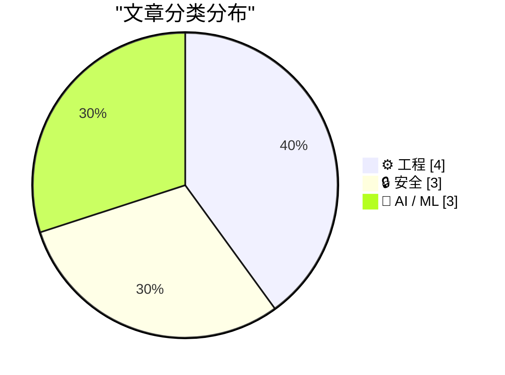
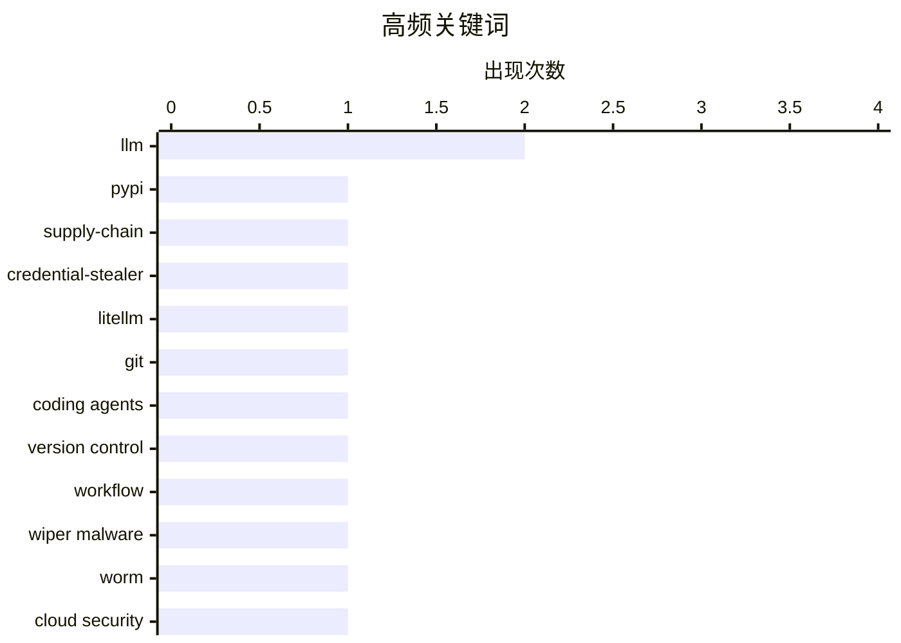

# 📰 AI 博客每日精选 — 2026-03-22

> 来自 Karpathy 推荐的 92 个顶级技术博客，AI 精选 Top 10

## 📝 今日看点

今天的主线之一是**AI/编程效率正在“工程化落地”**：从把 Git 作为与编程代理协作的安全网，到用定制 Skills 让模型跟上 Starlette 1.0 新范式，再到通过流式专家让超大 MoE 在消费级设备上可运行，重点都在“把复杂能力变成可日常使用的工作流”。   第二条主线是**安全与信任成本上升**：LiteLLM 投毒与 TeamPCP 相关攻击说明供应链和运行环境风险仍在扩大，连安装阶段都可能被利用；同时，JavaScript 沙箱调研也提醒“能隔离执行”不等于“真正安全”。   第三条主线是**数字基础设施的现实约束与外部性**：一边是媒体网页被广告与追踪脚本拖到严重臃肿，另一边是 AI 数据中心扩张叙事遭遇电力与工程落地瓶颈；再加上公开评论可被低门槛画像，技术能力增长也在放大隐私与体验代价。

---

## 🏆 今日必读

🥇 **LiteLLM 1.82.8 被植入恶意 .pth 凭证窃取器**

[Malicious litellm_init.pth in litellm 1.82.8 — credential stealer](https://simonwillison.net/2026/Mar/24/malicious-litellm/#atom-everything) — simonwillison.net · 2026-03-24 · 🔒 安全

> LiteLLM 在 PyPI 发布的 1.82.8 版本被投毒，恶意载荷以 Base64 形式藏在 `litellm_init.pth` 中。由于 `.pth` 会在安装/解释器启动阶段触发，攻击不需要 `import litellm` 就可能执行，危险性高于普通运行时后门。1.82.7 也有恶意代码，但位于 `proxy/proxy_server.py`，需导入后才生效。已知窃取范围非常广，涵盖 SSH、Git、云平台、容器、数据库、Shell 历史及多种加密货币钱包相关文件。PyPI 已隔离该包且暴露窗口仅数小时，但作者认为这次事件是一次隐蔽且严重的供应链攻击，可能与此前 Trivy 事件导致凭证泄露有关。

💡 **为什么值得读**: 这篇内容直接说明“仅安装即中招”的高危供应链攻击模式，对所有使用 Python 包管理和 CI/CD 的团队都有现实警示意义。

🏷️ PyPI, supply-chain, credential-stealer, LiteLLM

🥈 **如何与编程代理配合使用 Git**

[Using Git with coding agents](https://simonwillison.net/guides/agentic-engineering-patterns/using-git-with-coding-agents/#atom-everything) — simonwillison.net · 51 分钟前 · ⚙️ 工程

> 这篇文章把 Git 定位为与编程代理协作时的核心安全网：所有改动都可追踪、回溯和撤销。作者先梳理了仓库、提交、分支、克隆、远程仓库等基础概念，强调代理普遍熟悉 Git 术语和高级功能。文中给出一组可直接复用的提示词，例如初始化仓库、提交改动、查看最近提交、接入 GitHub 远程仓库、同步 main 分支等。它还展示了代理在复杂场景中的价值：解释 merge/rebase 策略、处理冲突、收拾“git mess”、通过 reflog/stash 找回丢失代码。对于调试，作者特别推荐让代理驱动 git bisect，把原本门槛较高的历史定位流程变成日常可用能力。

💡 **为什么值得读**: 它提供了可直接套用的人机协作 Git 工作流，能显著降低用 AI 写码时的风险和返工成本。

🏷️ Git, coding agents, version control, workflow

🥉 **CanisterWorm 发动定向伊朗的擦除攻击，TeamPCP 再掀供应链风波**

[‘CanisterWorm’ Springs Wiper Attack Targeting Iran](https://krebsonsecurity.com/2026/03/canisterworm-springs-wiper-attack-targeting-iran/) — krebsonsecurity.com · 2026-03-23 · 🔒 安全

> Krebs 报道称，网络犯罪团伙 TeamPCP 发起名为“CanisterWorm”的活动，会在识别到系统使用伊朗时区或波斯语环境时触发数据擦除。该团伙此前就通过暴露的 Docker API、Kubernetes、Redis 和 React2Shell 漏洞进行自动化入侵，并结合横向移动与勒索。研究人员指出，这次擦除载荷与 TeamPCP 在 Trivy 供应链攻击中使用的基础设施有关，后者曾窃取大量 SSH 密钥和云凭证。若目标具备 Kubernetes 集群访问权限，恶意程序可能尝试清空整个集群节点数据，否则擦除本机。攻击基础设施依托 ICP canister，具备较强抗下线能力；但专家也表示本轮有效载荷在线时间较短，实际破坏范围尚不明确。

💡 **为什么值得读**: 它把云原生入侵、供应链污染和定向破坏三条线索串在一起，能帮助安全团队判断当前威胁已从“偷凭证”升级到“可擦除业务数据”。

🏷️ wiper malware, worm, cloud security, Iran

---

## 📊 数据概览

| 扫描源 | 抓取文章 | 时间范围 | 精选 |
|:---:|:---:|:---:|:---:|
| 88/92 | 2517 篇 → 59 篇 | 24h | **10 篇** |

### 分类分布



### 高频关键词



<details>
<summary>📈 纯文本关键词图（终端友好）</summary>

```
llm                │ ████████████████████ 2
pypi               │ ██████████░░░░░░░░░░ 1
supply-chain       │ ██████████░░░░░░░░░░ 1
credential-stealer │ ██████████░░░░░░░░░░ 1
litellm            │ ██████████░░░░░░░░░░ 1
git                │ ██████████░░░░░░░░░░ 1
coding agents      │ ██████████░░░░░░░░░░ 1
version control    │ ██████████░░░░░░░░░░ 1
workflow           │ ██████████░░░░░░░░░░ 1
wiper malware      │ ██████████░░░░░░░░░░ 1
```

</details>

### 🏷️ 话题标签

**llm**(2) · **pypi**(1) · **supply-chain**(1) · credential-stealer(1) · litellm(1) · git(1) · coding agents(1) · version control(1) · workflow(1) · wiper malware(1) · worm(1) · cloud security(1) · iran(1) · ai industry(1) · critical analysis(1) · hype(1) · business models(1) · starlette(1) · fastapi(1) · python(1)

---

## ⚙️ 工程

### 1. 如何与编程代理配合使用 Git

[Using Git with coding agents](https://simonwillison.net/guides/agentic-engineering-patterns/using-git-with-coding-agents/#atom-everything) — **simonwillison.net** · 51 分钟前 · ⭐ 26/30

> 这篇文章把 Git 定位为与编程代理协作时的核心安全网：所有改动都可追踪、回溯和撤销。作者先梳理了仓库、提交、分支、克隆、远程仓库等基础概念，强调代理普遍熟悉 Git 术语和高级功能。文中给出一组可直接复用的提示词，例如初始化仓库、提交改动、查看最近提交、接入 GitHub 远程仓库、同步 main 分支等。它还展示了代理在复杂场景中的价值：解释 merge/rebase 策略、处理冲突、收拾“git mess”、通过 reflog/stash 找回丢失代码。对于调试，作者特别推荐让代理驱动 git bisect，把原本门槛较高的历史定位流程变成日常可用能力。

🏷️ Git, coding agents, version control, workflow

---

### 2. 用 Claude Skills 试验 Starlette 1.0

[Experimenting with Starlette 1.0 with Claude skills](https://simonwillison.net/2026/Mar/22/starlette/#atom-everything) — **simonwillison.net** · 2026-03-23 · ⭐ 25/30

> 作者认为 Starlette 1.0 的发布是 Python Web 生态的重要节点，因为它虽低调却是 FastAPI 的底层基础。文章回顾了 1.0 的关键变化，尤其是启动/关闭机制从 on_startup/on_shutdown 转向基于 async context manager 的 lifespan。作者提出一个现实问题：模型训练语料多是旧版 Starlette，如何让 LLM 产出符合 1.0 的代码。为此他让 Claude 使用 skill-creator 克隆 Starlette 仓库并生成面向 1.0 的技能文档，再一键加入自己的 Skills。随后 Claude 按提示生成了一个包含项目、任务、评论、标签的任务管理应用（Starlette+aiosqlite+Jinja2），并通过脚本化请求做了端到端自测。

🏷️ Starlette, FastAPI, Python, web-framework

---

### 3. PC Gamer 文章性能审计

[PCGamer Article Performance Audit](https://simonwillison.net/2026/Mar/22/pcgamer-audit/#atom-everything) — **simonwillison.net** · 2026-03-23 · ⭐ 23/30

> 这份审计针对 2026 年 3 月一篇 PC Gamer 的 RSS 阅读器文章，结论是页面存在严重性能膨胀。报告称，虽然正文内容仅约 10–15KB 文本加少量图片（约 150KB），页面在 60 秒内却触发了 431 次请求。同期传输量达到 5.5MB（解码后约 18.8MB），其中超过 82% 来自广告技术、追踪与程序化广告脚本。在 Firefox 中，自动播放视频轮播等机制还会让下载量继续攀升到 200MB 以上。整体上它把该页面作为“内容很轻、基础设施很重”的网页臃肿典型案例。

🏷️ web-performance, page-bloat, ads, audit

---

### 4. 半GB广告：一篇推荐 RSS 阅读器的文章却臃肿到离谱

[Half a Gigabyte of Ads](https://stuartbreckenridge.net/2026-03-19-pc-gamer-recommends-rss-readers-in-a-37mb-article/) — **daringfireball.net** · 2026-03-23 · ⭐ 23/30

> 作者吐槽 PC Gamer 一篇介绍 RSS 阅读器的网页体验极差：刚打开就有通知弹窗、遮挡正文的订阅弹窗和多块广告。即使进入正文后，页面仍被大量广告占据，内容信息密度很低。更夸张的是该页面初始加载体积约 37MB，远超普通文章页面。作者还观察到在短短五分钟内，页面又额外下载了接近 0.5GB 的广告资源。文章借此强调，使用 RSS 阅读器可以有效避开广告和弹窗污染，获得更清爽的阅读体验。

🏷️ web performance, ad bloat, page weight, user experience

---

## 🔒 安全

### 5. LiteLLM 1.82.8 被植入恶意 .pth 凭证窃取器

[Malicious litellm_init.pth in litellm 1.82.8 — credential stealer](https://simonwillison.net/2026/Mar/24/malicious-litellm/#atom-everything) — **simonwillison.net** · 2026-03-24 · ⭐ 28/30

> LiteLLM 在 PyPI 发布的 1.82.8 版本被投毒，恶意载荷以 Base64 形式藏在 `litellm_init.pth` 中。由于 `.pth` 会在安装/解释器启动阶段触发，攻击不需要 `import litellm` 就可能执行，危险性高于普通运行时后门。1.82.7 也有恶意代码，但位于 `proxy/proxy_server.py`，需导入后才生效。已知窃取范围非常广，涵盖 SSH、Git、云平台、容器、数据库、Shell 历史及多种加密货币钱包相关文件。PyPI 已隔离该包且暴露窗口仅数小时，但作者认为这次事件是一次隐蔽且严重的供应链攻击，可能与此前 Trivy 事件导致凭证泄露有关。

🏷️ PyPI, supply-chain, credential-stealer, LiteLLM

---

### 6. CanisterWorm 发动定向伊朗的擦除攻击，TeamPCP 再掀供应链风波

[‘CanisterWorm’ Springs Wiper Attack Targeting Iran](https://krebsonsecurity.com/2026/03/canisterworm-springs-wiper-attack-targeting-iran/) — **krebsonsecurity.com** · 2026-03-23 · ⭐ 26/30

> Krebs 报道称，网络犯罪团伙 TeamPCP 发起名为“CanisterWorm”的活动，会在识别到系统使用伊朗时区或波斯语环境时触发数据擦除。该团伙此前就通过暴露的 Docker API、Kubernetes、Redis 和 React2Shell 漏洞进行自动化入侵，并结合横向移动与勒索。研究人员指出，这次擦除载荷与 TeamPCP 在 Trivy 供应链攻击中使用的基础设施有关，后者曾窃取大量 SSH 密钥和云凭证。若目标具备 Kubernetes 集群访问权限，恶意程序可能尝试清空整个集群节点数据，否则擦除本机。攻击基础设施依托 ICP canister，具备较强抗下线能力；但专家也表示本轮有效载荷在线时间较短，实际破坏范围尚不明确。

🏷️ wiper malware, worm, cloud security, Iran

---

### 7. JavaScript 沙箱技术调研

[JavaScript Sandboxing Research](https://simonwillison.net/2026/Mar/22/javascript-sandboxing-research/#atom-everything) — **simonwillison.net** · 2026-03-23 · ⭐ 24/30

> 这篇调研围绕“如何安全运行不受信任的 JavaScript 代码”展开，系统比较了 Node.js 生态中的多种方案。作者关注了 Node.js 原生能力，包括 worker_threads、node:vm 和 Permission Model，并评估它们在隔离与安全边界上的实际意义。文中还横向对比了常见第三方方案，如 isolated-vm 与 vm2，以及 quickjs-emscripten、QuickJS-NG、ShadowRealm、Deno Workers 等替代路径。文章起因是对 worker_threads 是否可用于沙箱的疑问，但最终扩展成一份覆盖面更广的方案地图。整体价值在于帮助开发者理解不同实现的取舍，而不是把任意“隔离执行”都等同于真正安全沙箱。

🏷️ JavaScript-sandbox, Node.js, worker-threads, isolation

---

## 🤖 AI / ML

### 8. AI 行业在对你撒谎

[The AI Industry Is Lying To You](https://www.wheresyoured.at/the-ai-industry-is-lying-to-you/) — **wheresyoured.at** · 2026-03-25 · ⭐ 26/30

> 文章核心观点是：AI 产业叙事夸大了数据中心建设与算力落地的确定性，现实受制于电力、融资与工程进度。作者引用 Wood Mackenzie 数据指出，2025 年 Q4 美国新增数据中心“管线容量”较 Q3 减半，而且已披露项目中仅约 33% 处于实际开发阶段。大量项目依赖“wires-only”供电安排或尚未落实的电源方案，尤其在 PJM 区域，负荷承诺远超可落地发电能力。文中进一步质疑宣布容量与真实上线容量之间的巨大落差，认为许多项目仍停留在规划、许可或投机阶段。整体结论是，AI 基础设施扩张并非线性必然，行业宣传与可执行现实之间存在显著鸿沟。

🏷️ AI industry, critical analysis, hype, business models

---

### 9. 流式专家（Streaming Experts）

[Streaming experts](https://simonwillison.net/2026/Mar/24/streaming-experts/#atom-everything) — **simonwillison.net** · 2026-03-24 · ⭐ 24/30

> 这篇文章介绍了一种让超大 MoE 模型在小内存设备上运行的技巧：按 token 从 SSD 流式加载所需专家权重，而不是把整个模型常驻内存。作者回顾了近期进展：几天前有人已在 48GB 内存上跑 Qwen3.5-397B-A17B，随后又有人在 96GB 内存的 M2 Max 上运行 1T 参数的 Kimi K2.5（同时激活约 32B 权重）。更激进的实验甚至把 Qwen3.5-397B-A17B 跑到了 iPhone 上，尽管速度只有约 0.6 tokens/s。更新还提到在 128GB M4 Max 上，Kimi K2.5 达到约 1.7 tokens/s。作者判断这条技术路线潜力很大，社区也在持续通过自动化研究循环挖掘优化空间。

🏷️ Mixture-of-Experts, SSD-offloading, inference, LLM

---

### 10. 根据 Hacker News 评论为用户画像

[Profiling Hacker News users based on their comments](https://simonwillison.net/2026/Mar/21/profiling-hacker-news-users/#atom-everything) — **simonwillison.net** · 刚刚 · ⭐ 23/30

> 作者展示了一个“略显反乌托邦”的实验：抓取某个 Hacker News 用户最近 1000 条评论，然后让大模型执行“给这个用户做画像”。他指出数据获取门槛很低，直接可用 Algolia 的 HN API 按作者和时间拉取评论，而且接口支持开放 CORS，网页端脚本即可调用。作者还做了一个小工具来一键抓取并复制评论，再粘贴到 Claude 等模型中生成分析结果。以自己账号为例，模型给出了包含职业背景、技术兴趣、工作习惯、观点倾向与个性风格的长篇画像，整体准确度让他感到“惊人”。文章核心结论是：仅凭公开评论就能重建一个人的高维个人画像，这既展示了 LLM 的强大信息归纳能力，也带来明显的隐私与被过度推断风险。

🏷️ LLM, user profiling, Hacker News, prompting

---

*生成于 2026-03-22 07:00 | 扫描 88 源 → 获取 2517 篇 → 精选 10 篇*
*基于 [Hacker News Popularity Contest 2025](https://refactoringenglish.com/tools/hn-popularity/) RSS 源列表*
