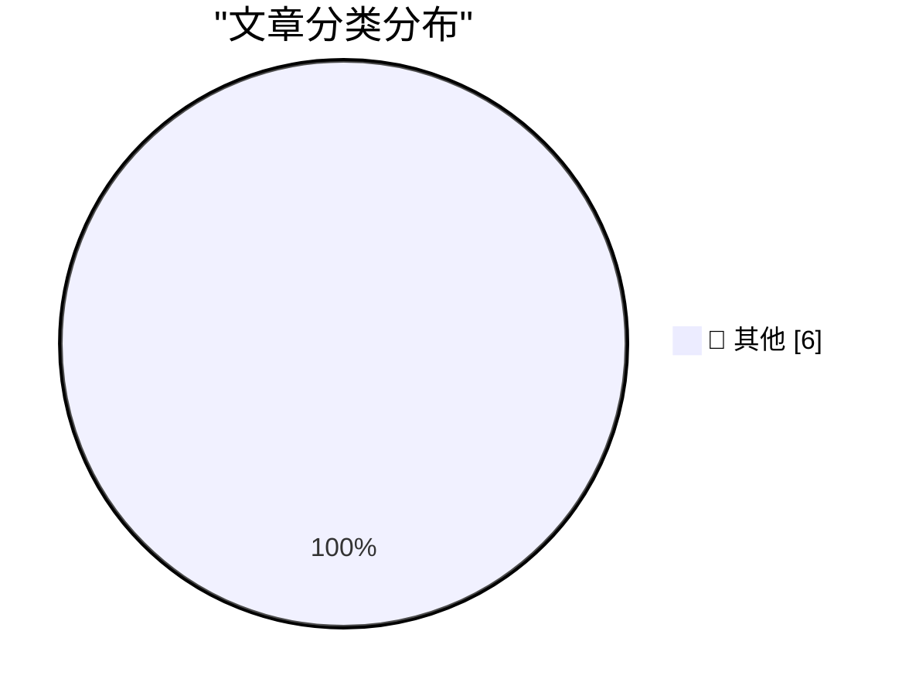

# 📰 AI 博客每日精选 — 2026-03-22

> 来自 Karpathy 推荐的 92 个顶级技术博客，AI 精选 Top 6

## 🏆 今日必读

🥇 **Profiling Hacker News users based on their comments**

[Profiling Hacker News users based on their comments](https://simonwillison.net/2026/Mar/21/profiling-hacker-news-users/#atom-everything) — simonwillison.net · 6 小时前 · 📝 其他

> Profiling Hacker News users based on their comments

🥈 **Using Git with coding agents**

[Using Git with coding agents](https://simonwillison.net/guides/agentic-engineering-patterns/using-git-with-coding-agents/#atom-everything) — simonwillison.net · 8 小时前 · 📝 其他

> Using Git with coding agents

🥉 **Reuters: ‘Amazon Plans Smartphone Comeback More Than a Decade After Fire Phone Flop’**

[Reuters: ‘Amazon Plans Smartphone Comeback More Than a Decade After Fire Phone Flop’](https://www.reuters.com/technology/amazon-plans-smartphone-comeback-more-than-decade-after-fire-phone-flop-2026-03-20/) — daringfireball.net · 5 小时前 · 📝 其他

> Reuters: ‘Amazon Plans Smartphone Comeback More Than a Decade After Fire Phone Flop’

---

## 📊 数据概览

| 扫描源 | 抓取文章 | 时间范围 | 精选 |
|:---:|:---:|:---:|:---:|
| 89/92 | 2525 篇 → 6 篇 | 24h | **6 篇** |

### 分类分布

---

## 📝 其他

### 1. Profiling Hacker News users based on their comments

[Profiling Hacker News users based on their comments](https://simonwillison.net/2026/Mar/21/profiling-hacker-news-users/#atom-everything) — **simonwillison.net** · 6 小时前 · ⭐ 15/30

> Profiling Hacker News users based on their comments

---

### 2. Using Git with coding agents

[Using Git with coding agents](https://simonwillison.net/guides/agentic-engineering-patterns/using-git-with-coding-agents/#atom-everything) — **simonwillison.net** · 8 小时前 · ⭐ 15/30

> Using Git with coding agents

---

### 3. Reuters: ‘Amazon Plans Smartphone Comeback More Than a Decade After Fire Phone Flop’

[Reuters: ‘Amazon Plans Smartphone Comeback More Than a Decade After Fire Phone Flop’](https://www.reuters.com/technology/amazon-plans-smartphone-comeback-more-than-decade-after-fire-phone-flop-2026-03-20/) — **daringfireball.net** · 5 小时前 · ⭐ 15/30

> Reuters: ‘Amazon Plans Smartphone Comeback More Than a Decade After Fire Phone Flop’

---

### 4. How to Attract AI Bots to Your Open Source Project

[How to Attract AI Bots to Your Open Source Project](https://nesbitt.io/2026/03/21/how-to-attract-ai-bots-to-your-open-source-project.html) — **nesbitt.io** · 20 小时前 · ⭐ 15/30

> How to Attract AI Bots to Your Open Source Project

---

### 5. Reading List 03/21/26

[Reading List 03/21/26](https://www.construction-physics.com/p/reading-list-032126) — **construction-physics.com** · 18 小时前 · ⭐ 15/30

> Reading List 03/21/26

---

### 6. Refurb weekend double header: Alpha Micro AM-1000E and AM-1200

[Refurb weekend double header: Alpha Micro AM-1000E and AM-1200](https://oldvcr.blogspot.com/feeds/7375694156480962258/comments/default) — **oldvcr.blogspot.com** · 3 小时前 · ⭐ 15/30

> Refurb weekend double header: Alpha Micro AM-1000E and AM-1200

---

*生成于 2026-03-22 06:22 | 扫描 89 源 → 获取 2525 篇 → 精选 6 篇*
*基于 [Hacker News Popularity Contest 2025](https://refactoringenglish.com/tools/hn-popularity/) RSS 源列表*
