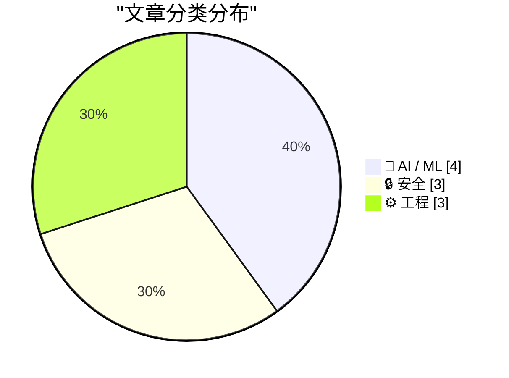
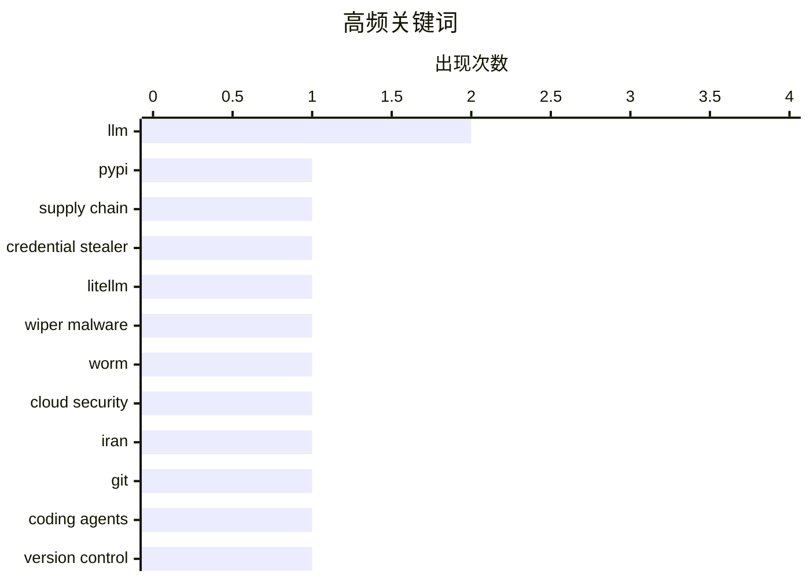

# 📰 AI 博客每日精选 — 2026-03-22

> 来自 Karpathy 推荐的 92 个顶级技术博客，AI 精选 Top 10

## 📝 今日看点

今天技术圈最突出的信号是“安全前置”：从供应链投毒到针对关键基础设施的破坏与勒索，攻击面正从单点漏洞转向生态级渗透，开发与运维的默认假设必须从“可信”改为“持续验证”。与此同时，AI 工程进入务实深化阶段，一边是对行业叙事与泡沫的反思升温，另一边是从模型训练细节、推理架构到与编码代理协作流程的系统化打磨。第三个趋势是工程基础能力回归核心——无论是框架升级、沙箱隔离还是性能审计，大家都在用更严格的可观测性与治理手段，为 AI 原生应用的规模化落地补课。

---

## 🏆 今日必读

🥇 **LiteLLM 1.82.8 中恶意 litellm_init.pth：凭证窃取器**

[Malicious litellm_init.pth in litellm 1.82.8 — credential stealer](https://simonwillison.net/2026/Mar/24/malicious-litellm/#atom-everything) — simonwillison.net · -3848 分钟前 · 🔒 安全

> LiteLLM 在 PyPI 发布的 v1.82.8 被投毒，核心风险是一个经过 Base64 隐藏的凭证窃取器被放进了 `litellm_init.pth`。由于 `.pth` 文件会在 Python 启动/安装链路中被处理，受害者即使没有执行 `import litellm`，仅安装该包也可能触发恶意代码。文章还指出 v1.82.7 也包含利用代码，只是位置在 `proxy` 相关路径，说明这不是单点失误而是连续供应链污染。该事件再次暴露了 Python 生态对安装阶段执行面的高风险特性，影响面可能覆盖 CI、开发机与生产镜像构建流程。结论是这是一起严重的软件供应链安全事件，使用 LiteLLM 的团队应立即排查 1.82.7/1.82.8、轮换凭证并回滚到安全版本。      

💡 **为什么值得读**: 它揭示了“仅安装即中招”的真实攻击路径与版本范围，能帮助你快速判断自身是否暴露在高危供应链攻击中并立即采取补救措施。

🏷️ PyPI, supply chain, credential stealer, LiteLLM

🥈 **‘CanisterWorm’ Springs Wiper Attack Targeting Iran**

[‘CanisterWorm’ Springs Wiper Attack Targeting Iran](https://krebsonsecurity.com/2026/03/canisterworm-springs-wiper-attack-targeting-iran/) — krebsonsecurity.com · -2444 分钟前 · 🔒 安全

> A financially motivated data theft and extortion group is attempting to inject itself into the Iran war, unleashing a worm that spreads through poorly secured cloud services and wipes data on infected

🏷️ wiper malware, worm, cloud security, Iran

🥉 **Using Git with coding agents**

[Using Git with coding agents](https://simonwillison.net/guides/agentic-engineering-patterns/using-git-with-coding-agents/#atom-everything) — simonwillison.net · 51 分钟前 · ⚙️ 工程

> <p><em><a href="https://simonwillison.net/guides/agentic-engineering-patterns/">Agentic Engineering Patterns</a> ></em></p>
    <p>Git is a key tool for working with coding agents. Keeping code in ver

🏷️ Git, coding agents, version control, agentic engineering

---

## 📊 数据概览

| 扫描源 | 抓取文章 | 时间范围 | 精选 |
|:---:|:---:|:---:|:---:|
| 89/92 | 2527 篇 → 60 篇 | 24h | **10 篇** |

### 分类分布



### 高频关键词



<details>
<summary>📈 纯文本关键词图（终端友好）</summary>

```
llm                │ ████████████████████ 2
pypi               │ ██████████░░░░░░░░░░ 1
supply chain       │ ██████████░░░░░░░░░░ 1
credential stealer │ ██████████░░░░░░░░░░ 1
litellm            │ ██████████░░░░░░░░░░ 1
wiper malware      │ ██████████░░░░░░░░░░ 1
worm               │ ██████████░░░░░░░░░░ 1
cloud security     │ ██████████░░░░░░░░░░ 1
iran               │ ██████████░░░░░░░░░░ 1
git                │ ██████████░░░░░░░░░░ 1
```

</details>

### 🏷️ 话题标签

**llm**(2) · **pypi**(1) · **supply chain**(1) · credential stealer(1) · litellm(1) · wiper malware(1) · worm(1) · cloud security(1) · iran(1) · git(1) · coding agents(1) · version control(1) · agentic engineering(1) · ai hype(1) · industry critique(1) · tech economics(1) · starlette 1.0(1) · python web framework(1) · asgi(1) · claude(1)

---

## 🤖 AI / ML

### 1. The AI Industry Is Lying To You

[The AI Industry Is Lying To You](https://www.wheresyoured.at/the-ai-industry-is-lying-to-you/) — **wheresyoured.at** · -3986 分钟前 · ⭐ 26/30

> Hi! If you like this piece and want to support my independent reporting and analysis, why not subscribe to my premium newsletter? It&#x2019;s $70 a year, or $7 a month, and in return you get a weekly 

🏷️ AI hype, industry critique, LLM, tech economics

---

### 2. Writing an LLM from scratch, part 32f -- Interventions: weight decay

[Writing an LLM from scratch, part 32f -- Interventions: weight decay](https://www.gilesthomas.com/2026/03/llm-from-scratch-32f-interventions-weight-decay) — **gilesthomas.com** · -2935 分钟前 · ⭐ 25/30

> <p>I'm still working on improving the test loss for a from-scratch GPT-2 small base model, trained on code based on
<a href="https://sebastianraschka.com/">Sebastian Raschka</a>'s book
"<a href="https

🏷️ LLM, weight decay, GPT-2, training

---

### 3. Weekly Update 496

[Weekly Update 496](https://www.troyhunt.com/weekly-update-496/) — **troyhunt.com** · -3198 分钟前 · ⭐ 24/30

> Watching OpenClaw do its thing must be like watching the first plane take flight. It&apos;s a bit rickety and stuck together with a lot of sticky tape, but squint and you can see the potential for age

🏷️ agentic AI, OpenClaw, weekly update, security community

---

### 4. Streaming experts

[Streaming experts](https://simonwillison.net/2026/Mar/24/streaming-experts/#atom-everything) — **simonwillison.net** · -3250 分钟前 · ⭐ 23/30

> <p>I wrote about Dan Woods' experiments with <strong>streaming experts</strong> <a href="https://simonwillison.net/2026/Mar/18/llm-in-a-flash/">the other day</a>, the trick where you run larger Mixtur

🏷️ Mixture-of-Experts, LLM inference, streaming, memory optimization

---

## 🔒 安全

### 5. LiteLLM 1.82.8 中恶意 litellm_init.pth：凭证窃取器

[Malicious litellm_init.pth in litellm 1.82.8 — credential stealer](https://simonwillison.net/2026/Mar/24/malicious-litellm/#atom-everything) — **simonwillison.net** · -3848 分钟前 · ⭐ 28/30

> LiteLLM 在 PyPI 发布的 v1.82.8 被投毒，核心风险是一个经过 Base64 隐藏的凭证窃取器被放进了 `litellm_init.pth`。由于 `.pth` 文件会在 Python 启动/安装链路中被处理，受害者即使没有执行 `import litellm`，仅安装该包也可能触发恶意代码。文章还指出 v1.82.7 也包含利用代码，只是位置在 `proxy` 相关路径，说明这不是单点失误而是连续供应链污染。该事件再次暴露了 Python 生态对安装阶段执行面的高风险特性，影响面可能覆盖 CI、开发机与生产镜像构建流程。结论是这是一起严重的软件供应链安全事件，使用 LiteLLM 的团队应立即排查 1.82.7/1.82.8、轮换凭证并回滚到安全版本。      

🏷️ PyPI, supply chain, credential stealer, LiteLLM

---

### 6. ‘CanisterWorm’ Springs Wiper Attack Targeting Iran

[‘CanisterWorm’ Springs Wiper Attack Targeting Iran](https://krebsonsecurity.com/2026/03/canisterworm-springs-wiper-attack-targeting-iran/) — **krebsonsecurity.com** · -2444 分钟前 · ⭐ 27/30

> A financially motivated data theft and extortion group is attempting to inject itself into the Iran war, unleashing a worm that spreads through poorly secured cloud services and wipes data on infected

🏷️ wiper malware, worm, cloud security, Iran

---

### 7. JavaScript Sandboxing Research

[JavaScript Sandboxing Research](https://simonwillison.net/2026/Mar/22/javascript-sandboxing-research/#atom-everything) — **simonwillison.net** · -1253 分钟前 · ⭐ 24/30

> <p><strong>Research:</strong> <a href="https://github.com/simonw/research/tree/main/javascript-sandboxing-research#readme">JavaScript Sandboxing Research</a></p>
    <p>Aaron Harper <a href="https://w

🏷️ JavaScript sandboxing, Node.js, worker threads, isolation

---

## ⚙️ 工程

### 8. Using Git with coding agents

[Using Git with coding agents](https://simonwillison.net/guides/agentic-engineering-patterns/using-git-with-coding-agents/#atom-everything) — **simonwillison.net** · 51 分钟前 · ⭐ 26/30

> <p><em><a href="https://simonwillison.net/guides/agentic-engineering-patterns/">Agentic Engineering Patterns</a> ></em></p>
    <p>Git is a key tool for working with coding agents. Keeping code in ver

🏷️ Git, coding agents, version control, agentic engineering

---

### 9. Experimenting with Starlette 1.0 with Claude skills

[Experimenting with Starlette 1.0 with Claude skills](https://simonwillison.net/2026/Mar/22/starlette/#atom-everything) — **simonwillison.net** · -1498 分钟前 · ⭐ 25/30

> <p><a href="https://marcelotryle.com/blog/2026/03/22/starlette-10-is-here/">Starlette 1.0 is out</a>! This is a really big deal. I think Starlette may be the Python framework with the most usage compa

🏷️ Starlette 1.0, Python web framework, ASGI, Claude

---

### 10. PCGamer Article Performance Audit

[PCGamer Article Performance Audit](https://simonwillison.net/2026/Mar/22/pcgamer-audit/#atom-everything) — **simonwillison.net** · -1429 分钟前 · ⭐ 23/30

> <p><strong>Research:</strong> <a href="https://github.com/simonw/research/tree/main/pcgamer-audit#readme">PCGamer Article Performance Audit</a></p>
    <p>Stuart Breckenridge pointed out that <a href=

🏷️ web performance, page weight, audit, RSS

---

*生成于 2026-03-22 23:00 | 扫描 89 源 → 获取 2527 篇 → 精选 10 篇*
*基于 [Hacker News Popularity Contest 2025](https://refactoringenglish.com/tools/hn-popularity/) RSS 源列表*
