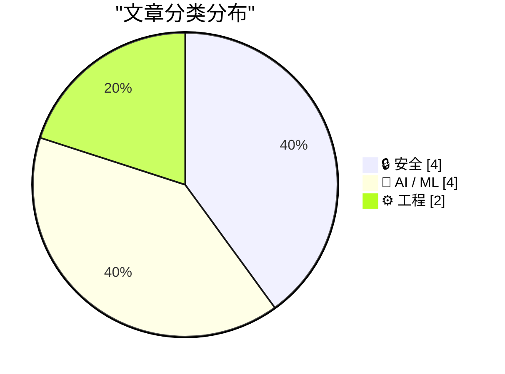
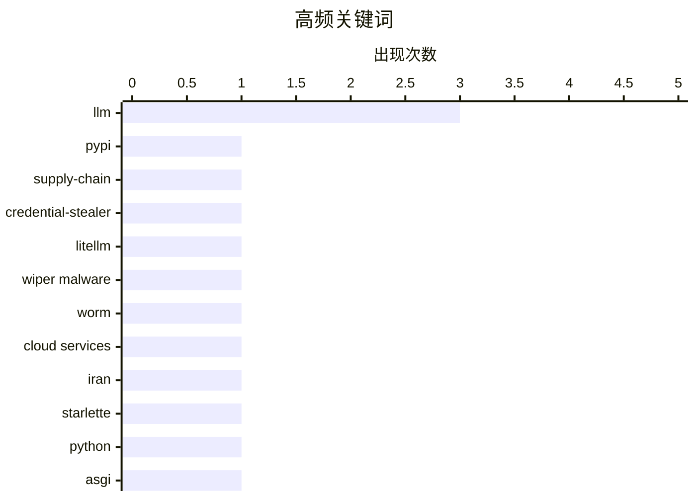

# 📰 AI 博客每日精选 — 2026-03-23

> 来自 Karpathy 推荐的 92 个顶级技术博客，AI 精选 Top 10

## 📝 今日看点

今天技术圈最突出的信号是：安全威胁正从“漏洞利用”转向“生态投毒+基础设施对抗”，从 PyPI 供应链植入凭证窃取，到针对关键行业的破坏与勒索，再到沙箱与代理等防御研究升温，攻防都在向系统层升级。与此同时，AI 话题明显进入“去泡沫、重底层”阶段，一边是从零训练与推理架构（如 streaming experts）等硬核优化，另一边是对行业叙事真实性和能力边界的集中质疑。工程实践层面则强调“成熟化与可观测性”，框架迭代与性能审计并进，反映出开发者从追新转向可靠、可测、可持续的交付导向。

---

## 🏆 今日必读

🥇 **LiteLLM 1.82.8 中恶意 litellm_init.pth：凭证窃取器**

[Malicious litellm_init.pth in litellm 1.82.8 — credential stealer](https://simonwillison.net/2026/Mar/24/malicious-litellm/#atom-everything) — simonwillison.net · -2408 分钟前 · 🔒 安全

> 核心问题是 PyPI 上发布的 LiteLLM v1.82.8 供应链被投毒，包内包含可自动执行的凭证窃取载荷。恶意代码被 base64 隐藏在 `litellm_init.pth` 中，而 `.pth` 文件会在 Python 启动/安装环境处理中触发，因此即使不执行 `import litellm` 也可能中招。作者还指出 v1.82.7 也携带了利用代码，只是位置不同（在 `proxy/...` 路径中），说明影响并非单一版本瞬时事故。该事件凸显了 Python 包生态里“安装即执行”攻击面的现实风险，尤其是对 CI/CD、生产镜像构建和开发者本地环境中的密钥安全构成直接威胁。结论是这属于高危供应链安全事件，应立即回滚/升级到安全版本、轮换所有可能暴露的凭证，并对依赖引入与构建流程增加包完整性与行为审计。

💡 **为什么值得读**: 它用一个真实且隐蔽的 `.pth` 投毒案例说明“仅安装依赖就能被盗密钥”的严重性，对任何使用 Python/LLM 依赖链的团队都有直接安全警示价值。

🏷️ PyPI, supply-chain, credential-stealer, LiteLLM

🥈 **‘CanisterWorm’ Springs Wiper Attack Targeting Iran**

[‘CanisterWorm’ Springs Wiper Attack Targeting Iran](https://krebsonsecurity.com/2026/03/canisterworm-springs-wiper-attack-targeting-iran/) — krebsonsecurity.com · -1004 分钟前 · 🔒 安全

> A financially motivated data theft and extortion group is attempting to inject itself into the Iran war, unleashing a worm that spreads through poorly secured cloud services and wipes data on infected

🏷️ wiper malware, worm, cloud services, Iran

🥉 **Experimenting with Starlette 1.0 with Claude skills**

[Experimenting with Starlette 1.0 with Claude skills](https://simonwillison.net/2026/Mar/22/starlette/#atom-everything) — simonwillison.net · -58 分钟前 · ⚙️ 工程

> <p><a href="https://marcelotryle.com/blog/2026/03/22/starlette-10-is-here/">Starlette 1.0 is out</a>! This is a really big deal. I think Starlette may be the Python framework with the most usage compa

🏷️ Starlette, Python, ASGI, web-framework

---

## 📊 数据概览

| 扫描源 | 抓取文章 | 时间范围 | 精选 |
|:---:|:---:|:---:|:---:|
| 89/92 | 2527 篇 → 56 篇 | 24h | **10 篇** |

### 分类分布



### 高频关键词



<details>
<summary>📈 纯文本关键词图（终端友好）</summary>

```
llm                │ ████████████████████ 3
pypi               │ ███████░░░░░░░░░░░░░ 1
supply-chain       │ ███████░░░░░░░░░░░░░ 1
credential-stealer │ ███████░░░░░░░░░░░░░ 1
litellm            │ ███████░░░░░░░░░░░░░ 1
wiper malware      │ ███████░░░░░░░░░░░░░ 1
worm               │ ███████░░░░░░░░░░░░░ 1
cloud services     │ ███████░░░░░░░░░░░░░ 1
iran               │ ███████░░░░░░░░░░░░░ 1
starlette          │ ███████░░░░░░░░░░░░░ 1
```

</details>

### 🏷️ 话题标签

**llm**(3) · **pypi**(1) · **supply-chain**(1) · credential-stealer(1) · litellm(1) · wiper malware(1) · worm(1) · cloud services(1) · iran(1) · starlette(1) · python(1) · asgi(1) · web-framework(1) · gpt-2(1) · weight decay(1) · training loss(1) · ai industry(1) · hype(1) · tech critique(1) · javascript(1)

---

## 🔒 安全

### 1. LiteLLM 1.82.8 中恶意 litellm_init.pth：凭证窃取器

[Malicious litellm_init.pth in litellm 1.82.8 — credential stealer](https://simonwillison.net/2026/Mar/24/malicious-litellm/#atom-everything) — **simonwillison.net** · -2408 分钟前 · ⭐ 28/30

> 核心问题是 PyPI 上发布的 LiteLLM v1.82.8 供应链被投毒，包内包含可自动执行的凭证窃取载荷。恶意代码被 base64 隐藏在 `litellm_init.pth` 中，而 `.pth` 文件会在 Python 启动/安装环境处理中触发，因此即使不执行 `import litellm` 也可能中招。作者还指出 v1.82.7 也携带了利用代码，只是位置不同（在 `proxy/...` 路径中），说明影响并非单一版本瞬时事故。该事件凸显了 Python 包生态里“安装即执行”攻击面的现实风险，尤其是对 CI/CD、生产镜像构建和开发者本地环境中的密钥安全构成直接威胁。结论是这属于高危供应链安全事件，应立即回滚/升级到安全版本、轮换所有可能暴露的凭证，并对依赖引入与构建流程增加包完整性与行为审计。

🏷️ PyPI, supply-chain, credential-stealer, LiteLLM

---

### 2. ‘CanisterWorm’ Springs Wiper Attack Targeting Iran

[‘CanisterWorm’ Springs Wiper Attack Targeting Iran](https://krebsonsecurity.com/2026/03/canisterworm-springs-wiper-attack-targeting-iran/) — **krebsonsecurity.com** · -1004 分钟前 · ⭐ 27/30

> A financially motivated data theft and extortion group is attempting to inject itself into the Iran war, unleashing a worm that spreads through poorly secured cloud services and wipes data on infected

🏷️ wiper malware, worm, cloud services, Iran

---

### 3. JavaScript Sandboxing Research

[JavaScript Sandboxing Research](https://simonwillison.net/2026/Mar/22/javascript-sandboxing-research/#atom-everything) — **simonwillison.net** · 3 小时前 · ⭐ 24/30

> <p><strong>Research:</strong> <a href="https://github.com/simonw/research/tree/main/javascript-sandboxing-research#readme">JavaScript Sandboxing Research</a></p>
    <p>Aaron Harper <a href="https://w

🏷️ JavaScript, sandboxing, Node.js, worker-threads

---

### 4. Hosting a Snowflake Proxy

[Hosting a Snowflake Proxy](https://matduggan.com/hosting-a-snowflake-proxy/) — **matduggan.com** · -2164 分钟前 · ⭐ 24/30

> In the nightmarish world of 2026 it can be difficult to know how to help at all. There are too many horrors happening to quickly to know where one can inject even a small amount of assistance. However

🏷️ Snowflake, proxy, censorship-circumvention, Tor

---

## 🤖 AI / ML

### 5. Writing an LLM from scratch, part 32f -- Interventions: weight decay

[Writing an LLM from scratch, part 32f -- Interventions: weight decay](https://www.gilesthomas.com/2026/03/llm-from-scratch-32f-interventions-weight-decay) — **gilesthomas.com** · -1495 分钟前 · ⭐ 25/30

> <p>I'm still working on improving the test loss for a from-scratch GPT-2 small base model, trained on code based on
<a href="https://sebastianraschka.com/">Sebastian Raschka</a>'s book
"<a href="https

🏷️ LLM, GPT-2, weight decay, training loss

---

### 6. The AI Industry Is Lying To You

[The AI Industry Is Lying To You](https://www.wheresyoured.at/the-ai-industry-is-lying-to-you/) — **wheresyoured.at** · -2546 分钟前 · ⭐ 25/30

> Hi! If you like this piece and want to support my independent reporting and analysis, why not subscribe to my premium newsletter? It&#x2019;s $70 a year, or $7 a month, and in return you get a weekly 

🏷️ AI industry, hype, LLM, tech critique

---

### 7. Streaming experts

[Streaming experts](https://simonwillison.net/2026/Mar/24/streaming-experts/#atom-everything) — **simonwillison.net** · -1810 分钟前 · ⭐ 23/30

> <p>I wrote about Dan Woods' experiments with <strong>streaming experts</strong> <a href="https://simonwillison.net/2026/Mar/18/llm-in-a-flash/">the other day</a>, the trick where you run larger Mixtur

🏷️ Mixture-of-Experts, inference, streaming, memory-optimization

---

### 8. Profiling Hacker News users based on their comments

[Profiling Hacker News users based on their comments](https://simonwillison.net/2026/Mar/21/profiling-hacker-news-users/#atom-everything) — **simonwillison.net** · 23 小时前 · ⭐ 23/30

> <p>Here's a mildly dystopian prompt I've been experimenting with recently: "Profile this user", accompanied by a copy of their last 1,000 comments on Hacker News.</p>
<p>Obtaining those comments is e

🏷️ LLM, Hacker News, user profiling, prompt engineering

---

## ⚙️ 工程

### 9. Experimenting with Starlette 1.0 with Claude skills

[Experimenting with Starlette 1.0 with Claude skills](https://simonwillison.net/2026/Mar/22/starlette/#atom-everything) — **simonwillison.net** · -58 分钟前 · ⭐ 25/30

> <p><a href="https://marcelotryle.com/blog/2026/03/22/starlette-10-is-here/">Starlette 1.0 is out</a>! This is a really big deal. I think Starlette may be the Python framework with the most usage compa

🏷️ Starlette, Python, ASGI, web-framework

---

### 10. PCGamer Article Performance Audit

[PCGamer Article Performance Audit](https://simonwillison.net/2026/Mar/22/pcgamer-audit/#atom-everything) — **simonwillison.net** · 11 分钟前 · ⭐ 23/30

> <p><strong>Research:</strong> <a href="https://github.com/simonw/research/tree/main/pcgamer-audit#readme">PCGamer Article Performance Audit</a></p>
    <p>Stuart Breckenridge pointed out that <a href=

🏷️ web-performance, page-weight, audit, optimization

---

*生成于 2026-03-23 23:00 | 扫描 89 源 → 获取 2527 篇 → 精选 10 篇*
*基于 [Hacker News Popularity Contest 2025](https://refactoringenglish.com/tools/hn-popularity/) RSS 源列表*
