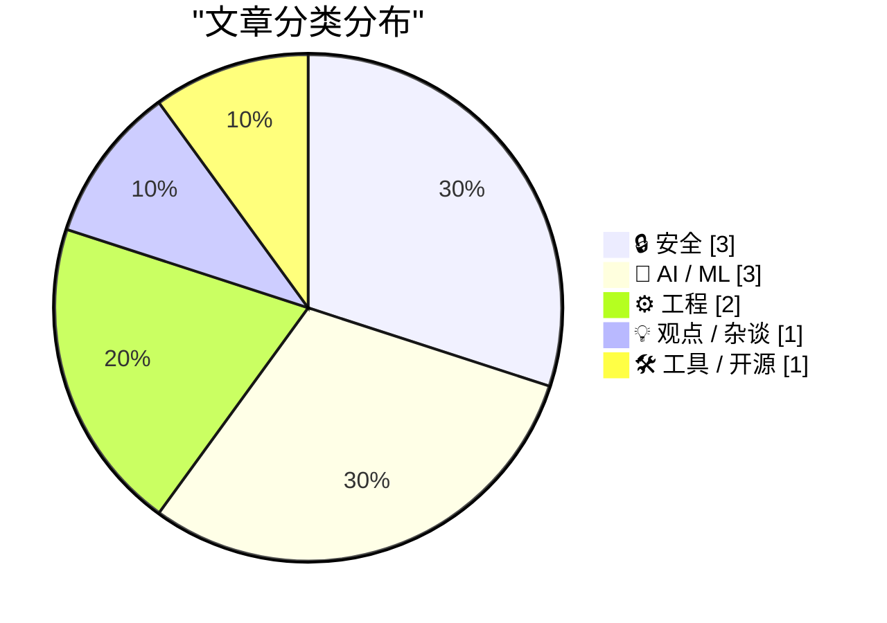
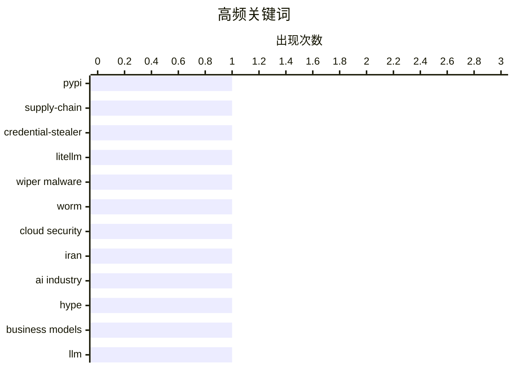

# 📰 AI 博客每日精选 — 2026-03-23

> 来自 Karpathy 推荐的 92 个顶级技术博客，AI 精选 Top 10

## 📝 今日看点

今天技术圈的主线很清晰：软件供应链安全再次拉响警报，从 PyPI 投毒到针对关键基础设施的破坏性攻击，都在提醒“安装即信任”的时代已经结束。与此同时，AI 话题进入理性重估期，一边是对行业叙事的质疑升温，一边是流式专家等新方法继续推进落地，热度与反思并行。工程实践层面则呈现“稳中求进”——从 Starlette 1.0、WWDC 平台信号到“选择成熟技术+创新流程”的共识，团队正把创新重点从炫技转向可维护、可交付的系统能力。

---

## 🏆 今日必读

🥇 **LiteLLM 1.82.8 中的恶意 litellm_init.pth——凭证窃取器**

[Malicious litellm_init.pth in litellm 1.82.8 — credential stealer](https://simonwillison.net/2026/Mar/24/malicious-litellm/#atom-everything) — simonwillison.net · 2026-03-24 · 🔒 安全

> LiteLLM 在 PyPI 发布的 v1.82.8 被投毒，核心风险是一个以 base64 隐藏在 `litellm_init.pth` 中的凭证窃取恶意代码。由于 `.pth` 文件会在安装阶段被 Python 机制自动处理，攻击在“安装即触发”，即使用户没有执行 `import litellm` 也会中招。相比之下，v1.82.7 虽然也含有利用代码，但位于 `proxy/proxy_server.py`，需要导入相关模块后才会生效，危害触发门槛更高。该事件凸显了供应链攻击从“运行时植入”升级到“安装时执行”的趋势，尤其对 CI/CD、镜像构建和自动化依赖升级流程威胁更大。结论是：这是一次高危 Python 包供应链事件，受影响用户应立即排查安装记录、轮换凭证并锁定可信版本来源。

💡 **为什么值得读**: 它清楚展示了“仅安装依赖就会被窃密”的真实攻击路径，对任何使用 PyPI 和自动化构建流程的团队都有直接安全警示价值。

🏷️ PyPI, supply-chain, credential-stealer, LiteLLM

🥈 **‘CanisterWorm’ Springs Wiper Attack Targeting Iran**

[‘CanisterWorm’ Springs Wiper Attack Targeting Iran](https://krebsonsecurity.com/2026/03/canisterworm-springs-wiper-attack-targeting-iran/) — krebsonsecurity.com · 2026-03-23 · 🔒 安全

> A financially motivated data theft and extortion group is attempting to inject itself into the Iran war, unleashing a worm that spreads through poorly secured cloud services and wipes data on infected

🏷️ wiper malware, worm, cloud security, Iran

🥉 **The AI Industry Is Lying To You**

[The AI Industry Is Lying To You](https://www.wheresyoured.at/the-ai-industry-is-lying-to-you/) — wheresyoured.at · 2026-03-25 · 🤖 AI / ML

> Hi! If you like this piece and want to support my independent reporting and analysis, why not subscribe to my premium newsletter? It’s $70 a year, or $7 a month, and in return you get a weekly newslet

🏷️ AI industry, hype, business models, LLM

---

## 📊 数据概览

| 扫描源 | 抓取文章 | 时间范围 | 精选 |
|:---:|:---:|:---:|:---:|
| 88/92 | 2517 篇 → 55 篇 | 24h | **10 篇** |

### 分类分布



### 高频关键词



<details>
<summary>📈 纯文本关键词图（终端友好）</summary>

```
pypi               │ ████████████████████ 1
supply-chain       │ ████████████████████ 1
credential-stealer │ ████████████████████ 1
litellm            │ ████████████████████ 1
wiper malware      │ ████████████████████ 1
worm               │ ████████████████████ 1
cloud security     │ ████████████████████ 1
iran               │ ████████████████████ 1
ai industry        │ ████████████████████ 1
hype               │ ████████████████████ 1
```

</details>

### 🏷️ 话题标签

**pypi**(1) · **supply-chain**(1) · **credential-stealer**(1) · litellm(1) · wiper malware(1) · worm(1) · cloud security(1) · iran(1) · ai industry(1) · hype(1) · business models(1) · llm(1) · starlette(1) · fastapi(1) · python-web(1) · frameworks(1) · javascript-sandboxing(1) · node.js(1) · worker-threads(1) · isolated-vm(1)

---

## 🔒 安全

### 1. LiteLLM 1.82.8 中的恶意 litellm_init.pth——凭证窃取器

[Malicious litellm_init.pth in litellm 1.82.8 — credential stealer](https://simonwillison.net/2026/Mar/24/malicious-litellm/#atom-everything) — **simonwillison.net** · 2026-03-24 · ⭐ 28/30

> LiteLLM 在 PyPI 发布的 v1.82.8 被投毒，核心风险是一个以 base64 隐藏在 `litellm_init.pth` 中的凭证窃取恶意代码。由于 `.pth` 文件会在安装阶段被 Python 机制自动处理，攻击在“安装即触发”，即使用户没有执行 `import litellm` 也会中招。相比之下，v1.82.7 虽然也含有利用代码，但位于 `proxy/proxy_server.py`，需要导入相关模块后才会生效，危害触发门槛更高。该事件凸显了供应链攻击从“运行时植入”升级到“安装时执行”的趋势，尤其对 CI/CD、镜像构建和自动化依赖升级流程威胁更大。结论是：这是一次高危 Python 包供应链事件，受影响用户应立即排查安装记录、轮换凭证并锁定可信版本来源。

🏷️ PyPI, supply-chain, credential-stealer, LiteLLM

---

### 2. ‘CanisterWorm’ Springs Wiper Attack Targeting Iran

[‘CanisterWorm’ Springs Wiper Attack Targeting Iran](https://krebsonsecurity.com/2026/03/canisterworm-springs-wiper-attack-targeting-iran/) — **krebsonsecurity.com** · 2026-03-23 · ⭐ 27/30

> A financially motivated data theft and extortion group is attempting to inject itself into the Iran war, unleashing a worm that spreads through poorly secured cloud services and wipes data on infected

🏷️ wiper malware, worm, cloud security, Iran

---

### 3. JavaScript Sandboxing Research

[JavaScript Sandboxing Research](https://simonwillison.net/2026/Mar/22/javascript-sandboxing-research/#atom-everything) — **simonwillison.net** · 3 小时前 · ⭐ 25/30

> Research: JavaScript Sandboxing Research Aaron Harper wrote about Node.js worker threads , which inspired me to run a research task to see if they might help with running JavaScript in a sandbox. Clau

🏷️ JavaScript-sandboxing, Node.js, worker-threads, isolated-vm

---

## 🤖 AI / ML

### 4. The AI Industry Is Lying To You

[The AI Industry Is Lying To You](https://www.wheresyoured.at/the-ai-industry-is-lying-to-you/) — **wheresyoured.at** · 2026-03-25 · ⭐ 26/30

> Hi! If you like this piece and want to support my independent reporting and analysis, why not subscribe to my premium newsletter? It’s $70 a year, or $7 a month, and in return you get a weekly newslet

🏷️ AI industry, hype, business models, LLM

---

### 5. Streaming experts

[Streaming experts](https://simonwillison.net/2026/Mar/24/streaming-experts/#atom-everything) — **simonwillison.net** · 2026-03-24 · ⭐ 24/30

> I wrote about Dan Woods' experiments with streaming experts the other day , the trick where you run larger Mixture-of-Experts models on hardware that doesn't have enough RAM to fit the entire model by

🏷️ Mixture-of-Experts, model-serving, SSD-streaming, inference

---

### 6. Weekly Update 496

[Weekly Update 496](https://www.troyhunt.com/weekly-update-496/) — **troyhunt.com** · 2026-03-24 · ⭐ 24/30

> Watching OpenClaw do its thing must be like watching the first plane take flight. It's a bit rickety and stuck together with a lot of sticky tape, but squint and you can see the potential for agentic 

🏷️ agentic AI, OpenClaw, security, weekly update

---

## ⚙️ 工程

### 7. Experimenting with Starlette 1.0 with Claude skills

[Experimenting with Starlette 1.0 with Claude skills](https://simonwillison.net/2026/Mar/22/starlette/#atom-everything) — **simonwillison.net** · 刚刚 · ⭐ 25/30

> Starlette 1.0 is out ! This is a really big deal. I think Starlette may be the Python framework with the most usage compared to its relatively low brand recognition because Starlette is the foundation

🏷️ Starlette, FastAPI, Python-web, frameworks

---

### 8. WWDC 2026: June 8–12

[WWDC 2026: June 8–12](https://www.apple.com/newsroom/2026/03/apples-worldwide-developers-conference-returns-the-week-of-june-8/) — **daringfireball.net** · 2026-03-24 · ⭐ 23/30

> Apple Newsroom: WWDC kicks off with the Keynote and Platforms State of the Union on Monday, June 8. The conference continues online all week with over 100 video sessions and interactive group labs and

🏷️ WWDC, Apple, developer conference, platform updates

---

## 💡 观点 / 杂谈

### 9. Choose Boring Technology and Innovative Practices

[Choose Boring Technology and Innovative Practices](https://buttondown.com/hillelwayne/archive/choose-boring-technology-and-innovative-practices/) — **buttondown.com/hillelwayne** · 2026-03-24 · ⭐ 23/30

> The famous article Choose Boring Technology lists two problems with using innovative technology: There are too many "unknown unknowns" in a new technology, whereas in boring technology the pitfalls ar

🏷️ boring technology, innovation, risk management, engineering culture

---

## 🛠 工具 / 开源

### 10. datasette-files 0.1a2

[datasette-files 0.1a2](https://simonwillison.net/2026/Mar/23/datasette-files/#atom-everything) — **simonwillison.net** · 2026-03-24 · ⭐ 22/30

> Release: datasette-files 0.1a2 The most interesting alpha of datasette-files yet, a new plugin which adds the ability to upload files directly into a Datasette instance. Here are the release notes in 

🏷️ Datasette, plugin, file-upload, Python

---

*生成于 2026-03-23 07:00 | 扫描 88 源 → 获取 2517 篇 → 精选 10 篇*
*基于 [Hacker News Popularity Contest 2025](https://refactoringenglish.com/tools/hn-popularity/) RSS 源列表*
