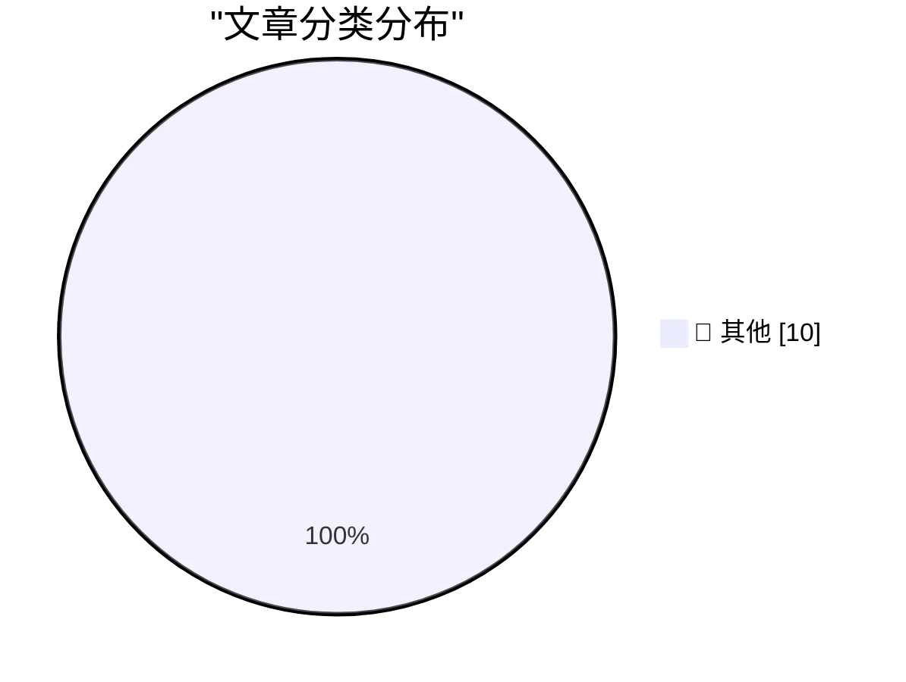

# 📰 AI 博客每日精选 — 2026-03-23

> 来自 Karpathy 推荐的 92 个顶级技术博客，AI 精选 Top 10

## 🏆 今日必读

🥇 **Profiling Hacker News users based on their comments**

[Profiling Hacker News users based on their comments](https://simonwillison.net/2026/Mar/21/profiling-hacker-news-users/#atom-everything) — simonwillison.net · 23 小时前 · 📝 其他

> Profiling Hacker News users based on their comments

🥈 **Mux — Video API for Developers**

[Mux — Video API for Developers](https://www.mux.com/?utm_campaign=fireball&amp;utm_source=DF) — daringfireball.net · 5 小时前 · 📝 其他

> Mux — Video API for Developers

🥉 **‘Good, I’m Glad He’s Dead.’**

[‘Good, I’m Glad He’s Dead.’](https://truthsocial.com/@realDonaldTrump/116268334535345382) — daringfireball.net · 5 小时前 · 📝 其他

> ‘Good, I’m Glad He’s Dead.’

---

## 📊 数据概览

| 扫描源 | 抓取文章 | 时间范围 | 精选 |
|:---:|:---:|:---:|:---:|
| 89/92 | 2526 篇 → 10 篇 | 24h | **10 篇** |

### 分类分布

---

## 📝 其他

### 1. Profiling Hacker News users based on their comments

[Profiling Hacker News users based on their comments](https://simonwillison.net/2026/Mar/21/profiling-hacker-news-users/#atom-everything) — **simonwillison.net** · 23 小时前 · ⭐ 15/30

> Profiling Hacker News users based on their comments

---

### 2. Mux — Video API for Developers

[Mux — Video API for Developers](https://www.mux.com/?utm_campaign=fireball&amp;utm_source=DF) — **daringfireball.net** · 5 小时前 · ⭐ 15/30

> Mux — Video API for Developers

---

### 3. ‘Good, I’m Glad He’s Dead.’

[‘Good, I’m Glad He’s Dead.’](https://truthsocial.com/@realDonaldTrump/116268334535345382) — **daringfireball.net** · 5 小时前 · ⭐ 15/30

> ‘Good, I’m Glad He’s Dead.’

---

### 4. Half a Gigabyte of Ads

[Half a Gigabyte of Ads](https://stuartbreckenridge.net/2026-03-19-pc-gamer-recommends-rss-readers-in-a-37mb-article/) — **daringfireball.net** · 6 小时前 · ⭐ 15/30

> Half a Gigabyte of Ads

---

### 5. Reuters: ‘Amazon Plans Smartphone Comeback More Than a Decade After Fire Phone Flop’

[Reuters: ‘Amazon Plans Smartphone Comeback More Than a Decade After Fire Phone Flop’](https://www.reuters.com/technology/amazon-plans-smartphone-comeback-more-than-decade-after-fire-phone-flop-2026-03-20/) — **daringfireball.net** · 22 小时前 · ⭐ 15/30

> Reuters: ‘Amazon Plans Smartphone Comeback More Than a Decade After Fire Phone Flop’

---

### 6. Bored of eating your own dogfood? Try smelling your own farts!

[Bored of eating your own dogfood? Try smelling your own farts!](https://shkspr.mobi/blog/2026/03/bored-of-eating-your-own-dogfood-try-smelling-your-own-farts/) — **shkspr.mobi** · 10 小时前 · ⭐ 15/30

> Bored of eating your own dogfood? Try smelling your own farts!

---

### 7. All tests pass: a short story

[All tests pass: a short story](https://evanhahn.com/all-tests-pass-a-short-story/) — **evanhahn.com** · 23 小时前 · ⭐ 15/30

> All tests pass: a short story

---

### 8. Little web app to pick a random programming language

[Little web app to pick a random programming language](https://evanhahn.com/random-programming-language/) — **evanhahn.com** · 23 小时前 · ⭐ 15/30

> Little web app to pick a random programming language

---

### 9. Refurb weekend double header: Alpha Micro AM-1000E and AM-1200

[Refurb weekend double header: Alpha Micro AM-1000E and AM-1200](https://oldvcr.blogspot.com/feeds/7375694156480962258/comments/default) — **oldvcr.blogspot.com** · 19 小时前 · ⭐ 15/30

> Refurb weekend double header: Alpha Micro AM-1000E and AM-1200

---

### 10. Waarom we nu WEL zuinig moeten doen, en door moeten met groene energie

[Waarom we nu WEL zuinig moeten doen, en door moeten met groene energie](https://berthub.eu/articles/posts/waarom-we-nu-wel-zuinig-moeten-doen-en-meer-groene-energie/) — **berthub.eu** · 13 小时前 · ⭐ 15/30

> Waarom we nu WEL zuinig moeten doen, en door moeten met groene energie

---

*生成于 2026-03-23 23:01 | 扫描 89 源 → 获取 2526 篇 → 精选 10 篇*
*基于 [Hacker News Popularity Contest 2025](https://refactoringenglish.com/tools/hn-popularity/) RSS 源列表*
