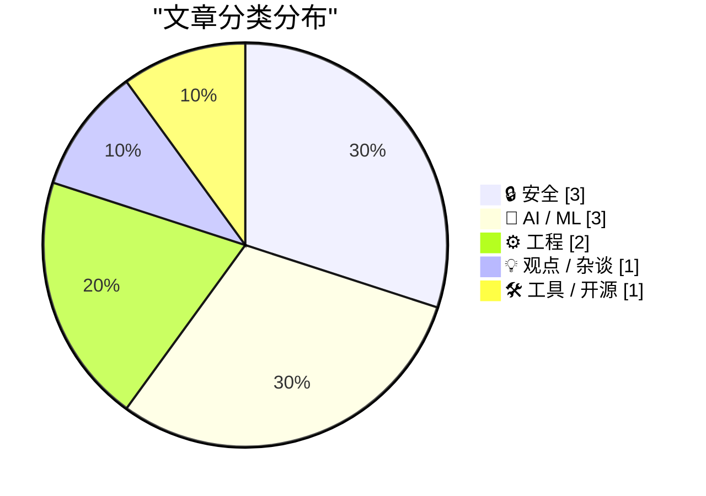
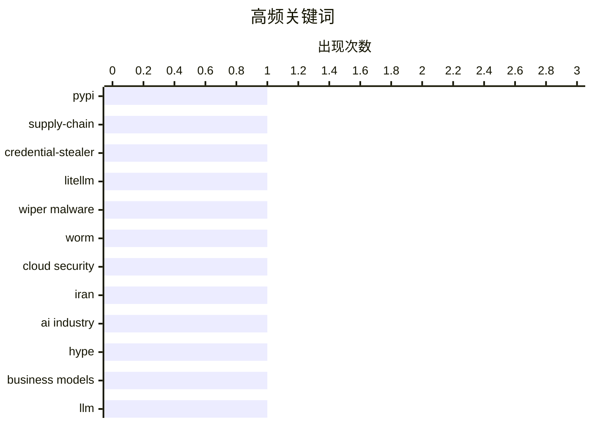

# 📰 AI 博客每日精选 — 2026-03-23

> 来自 Karpathy 推荐的 92 个顶级技术博客，AI 精选 Top 10

## 📝 今日看点

今日看点可归纳为三条主线：**供应链与云安全风险上行**、**AI 基建与能力叙事回归现实**、以及**工程实践走向“稳栈+快方法”**。   一方面，LiteLLM 投毒与 CanisterWorm 的升级都提醒我们，攻击已从“运行时入侵”前移到“安装/配置即触发”，且云原生环境中的凭证与控制面仍是高价值目标。   另一方面，AI 领域同时出现“硬件约束下的工程突破”和“产业预期降温”：社区在小内存设备上推进超大 MoE 流式推理，但数据中心落地节奏受电力与建设约束，短期产能未必匹配市场想象。   在开发侧，Starlette 1.0、JavaScript 沙箱选型、Datasette 插件演进与“保守技术观”共同指向一个共识：核心技术栈更重可维护性，把创新重点放在流程、工具链和落地方法上。

---

## 🏆 今日必读

🥇 **LiteLLM 1.82.8 被植入恶意 litellm_init.pth：安装即触发凭证窃取**

[Malicious litellm_init.pth in litellm 1.82.8 — credential stealer](https://simonwillison.net/2026/Mar/24/malicious-litellm/#atom-everything) — simonwillison.net · 2026-03-24 · 🔒 安全

> LiteLLM 发布到 PyPI 的 1.82.8 版本被投毒，恶意代码以 base64 形式藏在 `litellm_init.pth` 文件中。由于 Python 会在安装阶段处理 `.pth` 文件，攻击可在“仅安装、不导入”的情况下触发，风险显著高于常见运行时植入。文中还指出 1.82.7 也含有利用代码，但位于 `proxy/proxy_server.py`，需要实际导入后才会生效。该窃密载荷会搜集大量敏感信息，包括 SSH、Git、云平台凭证（AWS/Azure/Kubernetes）、Docker、npm 以及多类历史命令和加密货币钱包相关文件。事件窗口虽仅数小时且 PyPI 已隔离包，但在此期间安装过该版本的用户应视为高危并立即进行凭证轮换与环境排查。

💡 **为什么值得读**: 这篇文章揭示了供应链攻击已从“运行触发”升级到“安装触发”，对 CI/CD 和自动化构建链路具有直接警示意义。

🏷️ PyPI, supply-chain, credential-stealer, LiteLLM

🥈 **“CanisterWorm” 发起定向伊朗的擦除攻击，TeamPCP 将云端蠕虫升级为破坏载荷**

[‘CanisterWorm’ Springs Wiper Attack Targeting Iran](https://krebsonsecurity.com/2026/03/canisterworm-springs-wiper-attack-targeting-iran/) — krebsonsecurity.com · 2026-03-23 · 🔒 安全

> Krebs 报道称，网络犯罪团伙 TeamPCP 在原有数据窃取与勒索活动基础上，新增了一个会针对伊朗环境触发的数据擦除组件。该蠕虫此前主要通过暴露的 Docker API、Kubernetes、Redis 以及 React2Shell 漏洞传播，并在云环境内横向移动窃取凭证。研究人员发现，若受害主机时区为伊朗或默认语言为波斯语，载荷会执行 wiper：有集群权限时尝试清空 Kubernetes 各节点数据，否则擦除本地机器。攻击基础设施与近期 Trivy 供应链投毒事件相关，后者曾导致 SSH 密钥、云凭证和钱包信息被窃取。分析还指出该组织使用基于 ICP canister 的基础设施以提升抗下线能力，但当前尚无确凿证据证明本次擦除已造成大规模实际破坏。

💡 **为什么值得读**: 它把近期多起云与供应链攻击串成一条完整链路，帮助安全团队理解“凭证窃取→横向传播→定向破坏”的升级路径。

🏷️ wiper malware, worm, cloud security, Iran

🥉 **AI 行业正在对你撒谎**

[The AI Industry Is Lying To You](https://www.wheresyoured.at/the-ai-industry-is-lying-to-you/) — wheresyoured.at · 2026-03-25 · 🤖 AI / ML

> 这篇文章认为，当前 AI 基建叙事建立在“规模必然落地”的乐观假设上，但现实受制于电力、建设和融资等硬约束。作者援引 Wood Mackenzie 数据指出，美国 2025 年 Q4 新增数据中心规划容量较上一季度腰斩，且已披露的 241GW 管线中仅约 33%处于实际开发或建设阶段。更关键的是，约 58% 的项目属于“wires-only”供电模式，意味着电力公司只负责把电接到园区，发电能力本身并未落实，像 PJM 这样的区域电网还存在负荷承诺远超可用新增发电的问题。文章进一步质疑“宣布容量”与“真正上线容量”之间的巨大落差，估算 2025 年实际上线 IT 负载可能只有约 3GW，远低于市场想象。结论是：AI 数据中心与 GPU 销售的宏大预期，正在被电力基础设施和项目执行现实显著拖慢。

💡 **为什么值得读**: 它用电网与建设数据拆解了 AI 泡沫叙事里最关键的盲点：宣布不等于落地、算力不等于可用电力。

🏷️ AI industry, hype, business models, LLM

---

## 📊 数据概览

| 扫描源 | 抓取文章 | 时间范围 | 精选 |
|:---:|:---:|:---:|:---:|
| 88/92 | 2517 篇 → 55 篇 | 24h | **10 篇** |

### 分类分布



### 高频关键词



<details>
<summary>📈 纯文本关键词图（终端友好）</summary>

```
pypi               │ ████████████████████ 1
supply-chain       │ ████████████████████ 1
credential-stealer │ ████████████████████ 1
litellm            │ ████████████████████ 1
wiper malware      │ ████████████████████ 1
worm               │ ████████████████████ 1
cloud security     │ ████████████████████ 1
iran               │ ████████████████████ 1
ai industry        │ ████████████████████ 1
hype               │ ████████████████████ 1
```

</details>

### 🏷️ 话题标签

**pypi**(1) · **supply-chain**(1) · **credential-stealer**(1) · litellm(1) · wiper malware(1) · worm(1) · cloud security(1) · iran(1) · ai industry(1) · hype(1) · business models(1) · llm(1) · starlette(1) · fastapi(1) · python-web(1) · frameworks(1) · javascript-sandboxing(1) · node.js(1) · worker-threads(1) · isolated-vm(1)

---

## 🔒 安全

### 1. LiteLLM 1.82.8 被植入恶意 litellm_init.pth：安装即触发凭证窃取

[Malicious litellm_init.pth in litellm 1.82.8 — credential stealer](https://simonwillison.net/2026/Mar/24/malicious-litellm/#atom-everything) — **simonwillison.net** · 2026-03-24 · ⭐ 28/30

> LiteLLM 发布到 PyPI 的 1.82.8 版本被投毒，恶意代码以 base64 形式藏在 `litellm_init.pth` 文件中。由于 Python 会在安装阶段处理 `.pth` 文件，攻击可在“仅安装、不导入”的情况下触发，风险显著高于常见运行时植入。文中还指出 1.82.7 也含有利用代码，但位于 `proxy/proxy_server.py`，需要实际导入后才会生效。该窃密载荷会搜集大量敏感信息，包括 SSH、Git、云平台凭证（AWS/Azure/Kubernetes）、Docker、npm 以及多类历史命令和加密货币钱包相关文件。事件窗口虽仅数小时且 PyPI 已隔离包，但在此期间安装过该版本的用户应视为高危并立即进行凭证轮换与环境排查。

🏷️ PyPI, supply-chain, credential-stealer, LiteLLM

---

### 2. “CanisterWorm” 发起定向伊朗的擦除攻击，TeamPCP 将云端蠕虫升级为破坏载荷

[‘CanisterWorm’ Springs Wiper Attack Targeting Iran](https://krebsonsecurity.com/2026/03/canisterworm-springs-wiper-attack-targeting-iran/) — **krebsonsecurity.com** · 2026-03-23 · ⭐ 27/30

> Krebs 报道称，网络犯罪团伙 TeamPCP 在原有数据窃取与勒索活动基础上，新增了一个会针对伊朗环境触发的数据擦除组件。该蠕虫此前主要通过暴露的 Docker API、Kubernetes、Redis 以及 React2Shell 漏洞传播，并在云环境内横向移动窃取凭证。研究人员发现，若受害主机时区为伊朗或默认语言为波斯语，载荷会执行 wiper：有集群权限时尝试清空 Kubernetes 各节点数据，否则擦除本地机器。攻击基础设施与近期 Trivy 供应链投毒事件相关，后者曾导致 SSH 密钥、云凭证和钱包信息被窃取。分析还指出该组织使用基于 ICP canister 的基础设施以提升抗下线能力，但当前尚无确凿证据证明本次擦除已造成大规模实际破坏。

🏷️ wiper malware, worm, cloud security, Iran

---

### 3. JavaScript 沙箱研究：Node.js 方案、npm 工具与替代引擎对比

[JavaScript Sandboxing Research](https://simonwillison.net/2026/Mar/22/javascript-sandboxing-research/#atom-everything) — **simonwillison.net** · 3 小时前 · ⭐ 25/30

> 这篇研究梳理了在“执行不可信 JavaScript”场景下的主流沙箱技术路线。内容比较了 Node.js 内建能力，如 `worker_threads`、`node:vm` 与 Permission Model，也覆盖了常见第三方方案 `isolated-vm`、`vm2`。此外还纳入了 `quickjs-emscripten` 等替代引擎，并延伸到 QuickJS-NG、ShadowRealm、Deno Workers 等选项。文章起因是对 worker threads 是否适合沙箱化的探索，最终形成了更全面的横向评估框架。整体价值在于为工程实践提供技术选型地图，而非只讨论单一库的优缺点。

🏷️ JavaScript-sandboxing, Node.js, worker-threads, isolated-vm

---

## 🤖 AI / ML

### 4. AI 行业正在对你撒谎

[The AI Industry Is Lying To You](https://www.wheresyoured.at/the-ai-industry-is-lying-to-you/) — **wheresyoured.at** · 2026-03-25 · ⭐ 26/30

> 这篇文章认为，当前 AI 基建叙事建立在“规模必然落地”的乐观假设上，但现实受制于电力、建设和融资等硬约束。作者援引 Wood Mackenzie 数据指出，美国 2025 年 Q4 新增数据中心规划容量较上一季度腰斩，且已披露的 241GW 管线中仅约 33%处于实际开发或建设阶段。更关键的是，约 58% 的项目属于“wires-only”供电模式，意味着电力公司只负责把电接到园区，发电能力本身并未落实，像 PJM 这样的区域电网还存在负荷承诺远超可用新增发电的问题。文章进一步质疑“宣布容量”与“真正上线容量”之间的巨大落差，估算 2025 年实际上线 IT 负载可能只有约 3GW，远低于市场想象。结论是：AI 数据中心与 GPU 销售的宏大预期，正在被电力基础设施和项目执行现实显著拖慢。

🏷️ AI industry, hype, business models, LLM

---

### 5. 流式专家（Streaming Experts）

[Streaming experts](https://simonwillison.net/2026/Mar/24/streaming-experts/#atom-everything) — **simonwillison.net** · 2026-03-24 · ⭐ 24/30

> 这篇短文跟进了“streaming experts”技术进展：通过把 MoE 模型所需专家权重按 token 从 SSD 流式读取，可在内存不足的设备上运行超大模型。作者提到，几天前有人已在 48GB 内存上跑 Qwen3.5-397B-A17B，如今又有人在 96GB 内存的 M2 Max 上跑起 1 万亿参数的 Kimi K2.5（单次激活约 32B 权重）。社区还展示了在 iPhone 上运行同一 Qwen 模型，速度约 0.6 tokens/s，虽然慢但证明了可行性。文末更新称，Kimi K2.5 也已在 128GB M4 Max 上达到约 1.7 tokens/s。作者判断这条路线很有潜力，且社区正在通过自动化研究循环持续优化性能。

🏷️ Mixture-of-Experts, model-serving, SSD-streaming, inference

---

### 6. 每周更新 496：关于 OpenClaw 与代理式 AI 的早期观察

[Weekly Update 496](https://www.troyhunt.com/weekly-update-496/) — **troyhunt.com** · 2026-03-24 · ⭐ 24/30

> 作者将 OpenClaw 的当前状态比作早期飞机试飞：系统仍显粗糙、拼凑感强，但已能看见代理式 AI 的长期潜力。文章强调，围绕这类新技术存在大量夸大宣传，真正困难在于从噪声中识别可落地价值。作者认为“将改变世界”的判断并非夸张，但前提是务实评估其真实能力边界。基于自己的尝试，他已发现一些能提升日常工作的实用场景，并计划在下一期周更视频中专门展开。整体语气是谨慎乐观：承认不成熟，也肯定方向。

🏷️ agentic AI, OpenClaw, security, weekly update

---

## ⚙️ 工程

### 7. 用 Claude Skills 试跑 Starlette 1.0 的一次实践

[Experimenting with Starlette 1.0 with Claude skills](https://simonwillison.net/2026/Mar/22/starlette/#atom-everything) — **simonwillison.net** · 刚刚 · ⭐ 25/30

> 作者认为 Starlette 1.0 发布意义很大：它虽然品牌声量不如 FastAPI，但实际上是 FastAPI 的底层基础。文章回顾了 Starlette 从 0.x 到 1.0 的关键变化，尤其是启动/关闭流程从 on_startup、on_shutdown 迁移到基于 async context manager 的 lifespan 机制。作者提出一个现实问题：大模型训练语料多为旧版本代码，如何让它稳定生成符合 1.0 的新写法。为此他让 Claude 使用 skill-creator 从 Starlette 仓库生成一份覆盖特性的技能文档，并一键加入自己的技能库。随后他让 Claude 生成了一个包含项目、任务、评论和标签的示例应用（Starlette + SQLite + Jinja2），并通过测试客户端实际验证接口可用。

🏷️ Starlette, FastAPI, Python-web, frameworks

---

### 8. WWDC 2026 将于 6 月 8 日至 12 日举行

[WWDC 2026: June 8–12](https://www.apple.com/newsroom/2026/03/apples-worldwide-developers-conference-returns-the-week-of-june-8/) — **daringfireball.net** · 2026-03-24 · ⭐ 23/30

> 苹果宣布 WWDC26 将于 6 月 8 日至 12 日以线上形式举行，并在 6 月 8 日于 Apple Park 举办线下特别活动。大会将聚焦 Apple 各平台的软件更新，明确提到 AI 进展以及新的开发工具与框架。6 月 8 日当天会先后举行 Keynote 和 Platforms State of the Union，随后一周提供 100 多场视频课程、互动实验室和预约交流。开发者可通过 Apple Developer App、官网、YouTube（中国还有 bilibili 渠道）参与并获取内容。学生方面，Swift Student Challenge 获奖者将于 3 月 26 日收到通知，其中 50 名 Distinguished Winners 还将受邀前往 Cupertino 参加三天活动。

🏷️ WWDC, Apple, developer conference, platform updates

---

## 💡 观点 / 杂谈

### 9. 选择“保守技术”，在“实践方法”上大胆创新

[Choose Boring Technology and Innovative Practices](https://buttondown.com/hillelwayne/archive/choose-boring-technology-and-innovative-practices/) — **buttondown.com/hillelwayne** · 2026-03-24 · ⭐ 23/30

> 这篇短文延续了“选择成熟技术”的观点，核心理由是软件的主要成本在长期维护而非初次开发。作者指出，新技术常有未知风险且一旦用于关键系统就很难撤回，迁移或继续维护都很昂贵。相比之下，工程实践（如某种协作流程）可以更低成本地试错和放弃，不会形成同等强度的“历史包袱”。因此他建议把创新额度更多投入到实践层面：技术栈偏保守，流程与方法可以更激进。文末进一步区分了“材料”（代码、架构、数据等业务依赖物）与“工具”（编辑器、脚本等可替换物），认为后者更适合快速迭代。

🏷️ boring technology, innovation, risk management, engineering culture

---

## 🛠 工具 / 开源

### 10. datasette-files 0.1a2 发布：支持向 Datasette 直接上传文件

[datasette-files 0.1a2](https://simonwillison.net/2026/Mar/23/datasette-files/#atom-everything) — **simonwillison.net** · 2026-03-24 · ⭐ 22/30

> datasette-files 0.1a2 是该插件一次关键的 alpha 更新，核心能力是把文件直接上传到 Datasette 实例中。该版本已改用 Datasette 1.0a26 的 column_types 机制来配置列类型。更新还新增了 file_actions 插件钩子，并支持将上传的 CSV/TSV 文件直接导入为数据表。在上传体验上，提供了基于已文档化 JSON 上传 API 的界面，可一次上传多个文件。此外，图片文件会自动生成缩略图，并存储到内部的 datasette_files_thumbnails 表中。

🏷️ Datasette, plugin, file-upload, Python

---

*生成于 2026-03-23 07:00 | 扫描 88 源 → 获取 2517 篇 → 精选 10 篇*
*基于 [Hacker News Popularity Contest 2025](https://refactoringenglish.com/tools/hn-popularity/) RSS 源列表*
