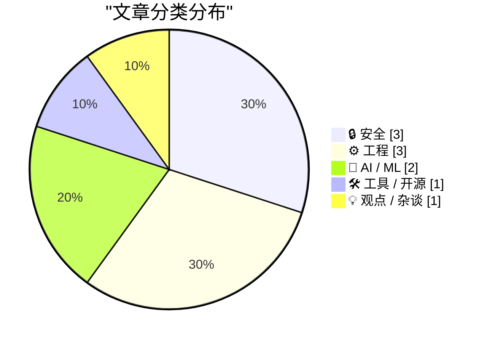
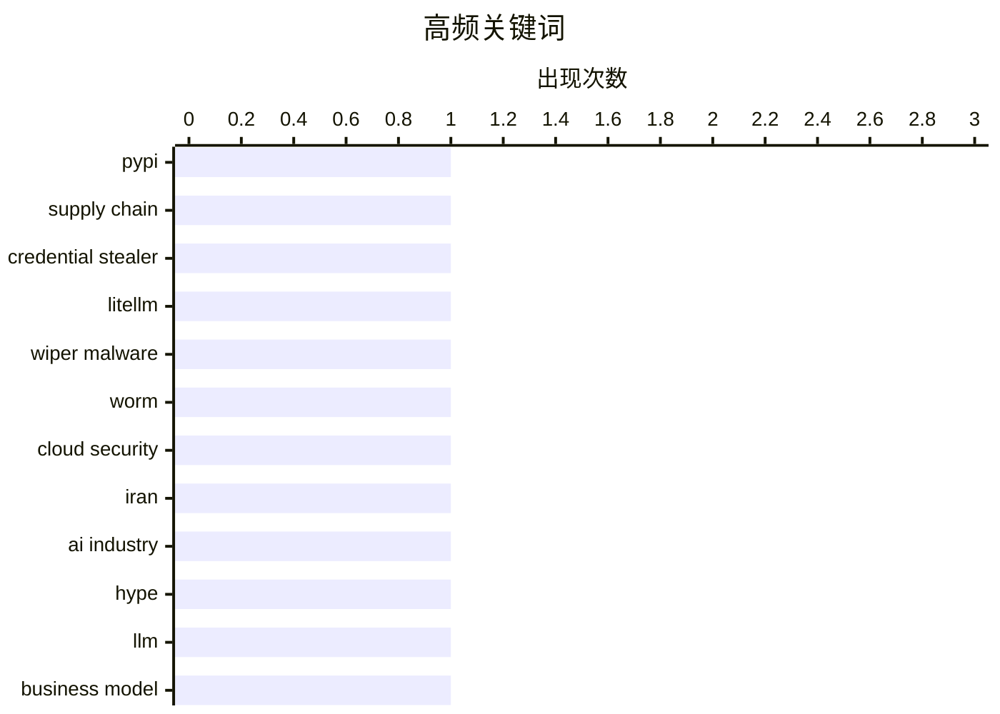

# 📰 AI 博客每日精选 — 2026-03-24

> 来自 Karpathy 推荐的 92 个顶级技术博客，AI 精选 Top 10

## 📝 今日看点

今天技术圈最突出的信号是：安全风险正从“漏洞利用”转向“供应链与基础设施渗透”，从PyPI投毒到破坏性攻击与代理网络部署，攻击面更隐蔽、后果更系统化。与此同时，AI赛道一边在加速工程化落地（如流式专家、开发工具代理化），一边遭遇信任危机，行业叙事与实际能力之间的落差正在被集中审视。工程实践层面也出现清晰共识：在平台升级与新能力涌现的周期里，团队更强调“稳健技术栈+创新流程”的组合，以降低复杂性并提升交付韧性。

---

## 🏆 今日必读

🥇 **litellm 1.82.8 中的恶意 litellm_init.pth：凭证窃取器**

[Malicious litellm_init.pth in litellm 1.82.8 — credential stealer](https://simonwillison.net/2026/Mar/24/malicious-litellm/#atom-everything) — simonwillison.net · -968 分钟前 · 🔒 安全

> LiteLLM 在 PyPI 发布的 v1.82.8 被供应链投毒，核心风险是一个隐藏在 `litellm_init.pth` 中、经 base64 混淆的凭证窃取代码。由于 `.pth` 文件会在 Python 启动/安装环境阶段被处理，用户即使没有执行 `import litellm`，仅安装该包也可能触发恶意逻辑。文中还指出 v1.82.7 也包含利用代码，只是位置不同，说明问题并非单点失误而是连续版本受影响。该事件凸显了 Python 包生态中“安装即执行”路径的高危性，以及对依赖锁定、版本回滚和包完整性审计的必要性。作者核心观点是：这是一次尤其危险的凭证窃取型供应链攻击，使用 LiteLLM 的团队应立即排查受影响版本并采取应急响应。

💡 **为什么值得读**: 它用一个真实案例清楚展示了“仅安装依赖就会中招”的供应链攻击面，能直接帮助开发团队改进 Python 依赖安全策略。

🏷️ PyPI, supply chain, credential stealer, LiteLLM

🥈 **‘CanisterWorm’ Springs Wiper Attack Targeting Iran**

[‘CanisterWorm’ Springs Wiper Attack Targeting Iran](https://krebsonsecurity.com/2026/03/canisterworm-springs-wiper-attack-targeting-iran/) — krebsonsecurity.com · 7 小时前 · 🔒 安全

> A financially motivated data theft and extortion group is attempting to inject itself into the Iran war, unleashing a worm that spreads through poorly secured cloud services and wipes data on infected

🏷️ wiper malware, worm, cloud security, Iran

🥉 **The AI Industry Is Lying To You**

[The AI Industry Is Lying To You](https://www.wheresyoured.at/the-ai-industry-is-lying-to-you/) — wheresyoured.at · -1106 分钟前 · 🤖 AI / ML

> Hi! If you like this piece and want to support my independent reporting and analysis, why not subscribe to my premium newsletter? It&#x2019;s $70 a year, or $7 a month, and in return you get a weekly 

🏷️ AI industry, hype, LLM, business model

---

## 📊 数据概览

| 扫描源 | 抓取文章 | 时间范围 | 精选 |
|:---:|:---:|:---:|:---:|
| 86/92 | 2472 篇 → 39 篇 | 24h | **10 篇** |

### 分类分布



### 高频关键词



<details>
<summary>📈 纯文本关键词图（终端友好）</summary>

```
pypi               │ ████████████████████ 1
supply chain       │ ████████████████████ 1
credential stealer │ ████████████████████ 1
litellm            │ ████████████████████ 1
wiper malware      │ ████████████████████ 1
worm               │ ████████████████████ 1
cloud security     │ ████████████████████ 1
iran               │ ████████████████████ 1
ai industry        │ ████████████████████ 1
hype               │ ████████████████████ 1
```

</details>

### 🏷️ 话题标签

**pypi**(1) · **supply chain**(1) · **credential stealer**(1) · litellm(1) · wiper malware(1) · worm(1) · cloud security(1) · iran(1) · ai industry(1) · hype(1) · llm(1) · business model(1) · starlette 1.0(1) · python web framework(1) · asgi(1) · fastapi(1) · mixture of experts(1) · inference(1) · streaming(1) · memory optimization(1)

---

## 🔒 安全

### 1. litellm 1.82.8 中的恶意 litellm_init.pth：凭证窃取器

[Malicious litellm_init.pth in litellm 1.82.8 — credential stealer](https://simonwillison.net/2026/Mar/24/malicious-litellm/#atom-everything) — **simonwillison.net** · -968 分钟前 · ⭐ 28/30

> LiteLLM 在 PyPI 发布的 v1.82.8 被供应链投毒，核心风险是一个隐藏在 `litellm_init.pth` 中、经 base64 混淆的凭证窃取代码。由于 `.pth` 文件会在 Python 启动/安装环境阶段被处理，用户即使没有执行 `import litellm`，仅安装该包也可能触发恶意逻辑。文中还指出 v1.82.7 也包含利用代码，只是位置不同，说明问题并非单点失误而是连续版本受影响。该事件凸显了 Python 包生态中“安装即执行”路径的高危性，以及对依赖锁定、版本回滚和包完整性审计的必要性。作者核心观点是：这是一次尤其危险的凭证窃取型供应链攻击，使用 LiteLLM 的团队应立即排查受影响版本并采取应急响应。

🏷️ PyPI, supply chain, credential stealer, LiteLLM

---

### 2. ‘CanisterWorm’ Springs Wiper Attack Targeting Iran

[‘CanisterWorm’ Springs Wiper Attack Targeting Iran](https://krebsonsecurity.com/2026/03/canisterworm-springs-wiper-attack-targeting-iran/) — **krebsonsecurity.com** · 7 小时前 · ⭐ 27/30

> A financially motivated data theft and extortion group is attempting to inject itself into the Iran war, unleashing a worm that spreads through poorly secured cloud services and wipes data on infected

🏷️ wiper malware, worm, cloud security, Iran

---

### 3. Hosting a Snowflake Proxy

[Hosting a Snowflake Proxy](https://matduggan.com/hosting-a-snowflake-proxy/) — **matduggan.com** · -724 分钟前 · ⭐ 23/30

> In the nightmarish world of 2026 it can be difficult to know how to help at all. There are too many horrors happening to quickly to know where one can inject even a small amount of assistance. However

🏷️ Snowflake, proxy, censorship resistance, Tor

---

## ⚙️ 工程

### 4. Experimenting with Starlette 1.0 with Claude skills

[Experimenting with Starlette 1.0 with Claude skills](https://simonwillison.net/2026/Mar/22/starlette/#atom-everything) — **simonwillison.net** · 23 小时前 · ⭐ 25/30

> <p><a href="https://marcelotryle.com/blog/2026/03/22/starlette-10-is-here/">Starlette 1.0 is out</a>! This is a really big deal. I think Starlette may be the Python framework with the most usage compa

🏷️ Starlette 1.0, Python web framework, ASGI, FastAPI

---

### 5. WWDC 2026: June 8–12

[WWDC 2026: June 8–12](https://www.apple.com/newsroom/2026/03/apples-worldwide-developers-conference-returns-the-week-of-june-8/) — **daringfireball.net** · 4 小时前 · ⭐ 23/30

> Apple Newsroom:


  WWDC kicks off with the Keynote and Platforms State of the Union
on Monday, June 8. The conference continues online all week with
over 100 video sessions and interactive group labs

🏷️ WWDC, Apple, developer conference, platform updates

---

### 6. Choose Boring Technology and Innovative Practices

[Choose Boring Technology and Innovative Practices](https://buttondown.com/hillelwayne/archive/choose-boring-technology-and-innovative-practices/) — **buttondown.com/hillelwayne** · -939 分钟前 · ⭐ 23/30

> <p class="empty-line" style="height:16px; margin:0px !important;"></p>
<p>The famous article <a href="https://mcfunley.com/choose-boring-technology" target="_blank">Choose Boring Technology</a> lists 

🏷️ boring technology, innovation, software practices, risk management

---

## 🤖 AI / ML

### 7. The AI Industry Is Lying To You

[The AI Industry Is Lying To You](https://www.wheresyoured.at/the-ai-industry-is-lying-to-you/) — **wheresyoured.at** · -1106 分钟前 · ⭐ 26/30

> Hi! If you like this piece and want to support my independent reporting and analysis, why not subscribe to my premium newsletter? It&#x2019;s $70 a year, or $7 a month, and in return you get a weekly 

🏷️ AI industry, hype, LLM, business model

---

### 8. Streaming experts

[Streaming experts](https://simonwillison.net/2026/Mar/24/streaming-experts/#atom-everything) — **simonwillison.net** · -370 分钟前 · ⭐ 23/30

> <p>I wrote about Dan Woods' experiments with <strong>streaming experts</strong> <a href="https://simonwillison.net/2026/Mar/18/llm-in-a-flash/">the other day</a>, the trick where you run larger Mixtur

🏷️ Mixture of Experts, inference, streaming, memory optimization

---

## 🛠 工具 / 开源

### 9. [Sponsor] npx workos: From Auth Integration to Environment Management, Zero ClickOps

[[Sponsor] npx workos: From Auth Integration to Environment Management, Zero ClickOps](https://workos.com/docs/authkit/cli-installer?utm_source=daringfireball&amp;utm_medium=newsletter&amp;utm_campaign=q12026) — **daringfireball.net** · -66 分钟前 · ⭐ 23/30

> npx workos@latest launches an AI agent, powered by Claude, that reads your project, detects your framework, and writes a complete auth integration into your codebase. No signup required. It creates an

🏷️ authentication, CLI, Claude, developer tooling

---

## 💡 观点 / 杂谈

### 10. Pluralistic: Understaffing as a form of enshittification (23 Mar 2026)

[Pluralistic: Understaffing as a form of enshittification (23 Mar 2026)](https://pluralistic.net/2026/03/22/nobodys-home/) — **pluralistic.net** · 17 小时前 · ⭐ 23/30

> Today's links Understaffing as a form of enshittification: A way to shift value from workers, patients and shoppers to investors. Hey look at this: Delights to delectate. Object permanence: Marvel v "

🏷️ understaffing, enshittification, labor economics, platforms

---

*生成于 2026-03-24 23:00 | 扫描 86 源 → 获取 2472 篇 → 精选 10 篇*
*基于 [Hacker News Popularity Contest 2025](https://refactoringenglish.com/tools/hn-popularity/) RSS 源列表*
