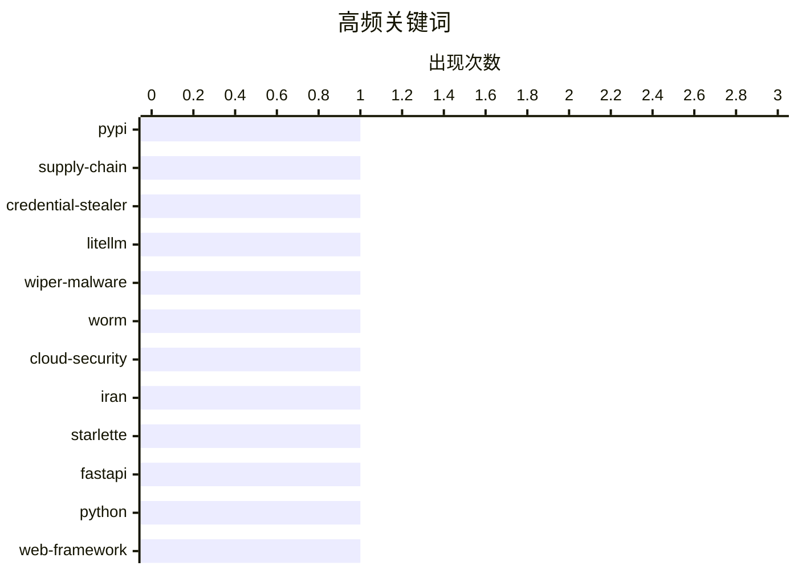

# 📰 AI 博客每日精选 — 2026-03-24

> 来自 Karpathy 推荐的 92 个顶级技术博客，AI 精选 Top 10

## 📝 今日看点

今天的主线之一是**供应链与云端攻击风险再升级**：从 LiteLLM 投毒到 TeamPCP 的定向擦除行动，都说明“安装即触发”和自动化入侵链条正在压缩防守反应时间，凭证治理与最小暴露面仍是基本盘。   第二条主线是**工程策略趋于务实**：一边是 Starlette 1.0 迁移、认证集成与 Datasette 文件能力这类“把新能力产品化/工具化”的实践，另一边是“核心技术栈保守、在流程与工具上高频创新”的方法论，强调可回滚性与长期维护成本。   第三条主线是**AI 叙事与落地现实并行拉扯**：上游有对数据中心与电力约束的冷思考，下游有流式专家让超大 MoE 在消费级设备上跑起来的实证进展，显示行业正在“宏观瓶颈”与“微观优化”两端同时推进。

---

## 🏆 今日必读

🥇 **LiteLLM 1.82.8 被投毒：恶意 litellm_init.pth 可窃取大量凭证**

[Malicious litellm_init.pth in litellm 1.82.8 — credential stealer](https://simonwillison.net/2026/Mar/24/malicious-litellm/#atom-everything) — simonwillison.net · 2026-03-24 · 🔒 安全

> LiteLLM 在 PyPI 发布的 1.82.8 版本被植入了凭证窃取代码，恶意负载以 Base64 混淆后藏在 `litellm_init.pth` 文件中。由于 `.pth` 机制会在安装/启动阶段被自动处理，攻击代码在未显式 `import litellm` 时也可能触发，危险性明显高于常见后门方式。对比之下，1.82.7 虽也受影响，但恶意逻辑位于 `proxy/proxy_server.py`，需要导入模块后才会生效。该窃密器会收集范围极广的敏感信息，包括 SSH、Git、云平台凭证、Kubernetes 配置、Docker 与 npm 配置、数据库口令文件、shell 历史以及多种加密货币钱包目录。PyPI 已在数小时内隔离该包，但在暴露窗口内安装过相关版本的环境应视为已泄露并立即轮换密钥。

💡 **为什么值得读**: 这篇内容清楚展示了一次从 CI 凭证失窃到 PyPI 投毒再到大规模秘密窃取的完整供应链攻击路径，实战警示价值很高。

🏷️ PyPI, supply-chain, credential-stealer, LiteLLM

🥈 **“CanisterWorm” 发起定向伊朗的擦除攻击，TeamPCP 再次滥用供应链入口**

[‘CanisterWorm’ Springs Wiper Attack Targeting Iran](https://krebsonsecurity.com/2026/03/canisterworm-springs-wiper-attack-targeting-iran/) — krebsonsecurity.com · 7 小时前 · 🔒 安全

> 报道指出，网络犯罪团伙 TeamPCP 在近期行动中投放了名为“CanisterWorm”的恶意载荷，会在检测到系统位于伊朗时区或默认语言为波斯语时触发擦除。该团伙此前主要通过暴露的 Docker API、Kubernetes、Redis 和 React2Shell 等入口入侵云环境，并结合横向移动、凭证窃取与 Telegram 勒索获利。研究人员称，此次攻击基础设施与其先前针对 Trivy 的供应链投毒活动有关，后者曾窃取 SSH 密钥、云凭证和 Kubernetes 令牌。Aikido 将其称为 CanisterWorm，是因为攻击编排依赖 ICP canister，这种分布式托管方式更抗下线。当前尚无确凿证据证明本轮擦除造成了大规模实际破坏，且恶意载荷仅短时间活跃并频繁变种。整体上，这更像是将成熟云端自动化攻击能力与地缘政治叙事结合的高噪声行动。

💡 **为什么值得读**: 文章把“云配置失误利用—供应链投毒—定向破坏”串成一条线，有助于安全团队理解新型混合威胁的演化方式。

🏷️ wiper-malware, worm, cloud-security, Iran

🥉 **用 Claude Skills 试验 Starlette 1.0：从新生命周期到可用脚手架**

[Experimenting with Starlette 1.0 with Claude skills](https://simonwillison.net/2026/Mar/22/starlette/#atom-everything) — simonwillison.net · 23 小时前 · ⚙️ 工程

> 作者围绕 Starlette 1.0 发布做了一次实战试验，强调这个版本意义重大，因为 Starlette 虽然“存在感”不如 FastAPI，却是后者的重要底层基础。文章回顾了 Starlette 社区近年的维护演进，并指出 1.0 相比 0.x 有破坏性变更，最关键的是启动与关闭流程从 on_startup/on_shutdown 转向基于 async context manager 的 lifespan 机制。作者认为 Starlette 的单文件、Flask 风格开发体验很适合让大模型直接生成可运行应用，但版本升级会导致模型沿用旧 API 的风险。为解决这个问题，他让 Claude 自动从仓库生成针对 Starlette 1.0 的技能文档，再把该技能注入普通对话。随后 Claude 生成了一个包含项目、任务、评论和标签的任务管理示例（含 SQLite、Jinja2），并通过测试客户端脚本验证关键接口，展示了“文档技能化 + 代码生成”在新版本迁移中的可行性。

💡 **为什么值得读**: 它把“框架 1.0 破坏性升级”与“如何让 LLM 产出新版本可用代码”这两个现实问题连在一起，给出了可复用的实践路径。

🏷️ Starlette, FastAPI, Python, web-framework

---

## 📊 数据概览

| 扫描源 | 抓取文章 | 时间范围 | 精选 |
|:---:|:---:|:---:|:---:|
| 87/92 | 2492 篇 → 39 篇 | 24h | **10 篇** |

### 分类分布


### 高频关键词



<details>
<summary>📈 纯文本关键词图（终端友好）</summary>

```
pypi               │ ████████████████████ 1
supply-chain       │ ████████████████████ 1
credential-stealer │ ████████████████████ 1
litellm            │ ████████████████████ 1
wiper-malware      │ ████████████████████ 1
worm               │ ████████████████████ 1
cloud-security     │ ████████████████████ 1
iran               │ ████████████████████ 1
starlette          │ ████████████████████ 1
fastapi            │ ████████████████████ 1
```

</details>

### 🏷️ 话题标签

**pypi**(1) · **supply-chain**(1) · **credential-stealer**(1) · litellm(1) · wiper-malware(1) · worm(1) · cloud-security(1) · iran(1) · starlette(1) · fastapi(1) · python(1) · web-framework(1) · ai industry(1) · hype(1) · business model(1) · critical analysis(1) · boring technology(1) · innovation(1) · software architecture(1) · engineering practices(1)

---

## 🔒 安全

### 1. LiteLLM 1.82.8 被投毒：恶意 litellm_init.pth 可窃取大量凭证

[Malicious litellm_init.pth in litellm 1.82.8 — credential stealer](https://simonwillison.net/2026/Mar/24/malicious-litellm/#atom-everything) — **simonwillison.net** · 2026-03-24 · ⭐ 28/30

> LiteLLM 在 PyPI 发布的 1.82.8 版本被植入了凭证窃取代码，恶意负载以 Base64 混淆后藏在 `litellm_init.pth` 文件中。由于 `.pth` 机制会在安装/启动阶段被自动处理，攻击代码在未显式 `import litellm` 时也可能触发，危险性明显高于常见后门方式。对比之下，1.82.7 虽也受影响，但恶意逻辑位于 `proxy/proxy_server.py`，需要导入模块后才会生效。该窃密器会收集范围极广的敏感信息，包括 SSH、Git、云平台凭证、Kubernetes 配置、Docker 与 npm 配置、数据库口令文件、shell 历史以及多种加密货币钱包目录。PyPI 已在数小时内隔离该包，但在暴露窗口内安装过相关版本的环境应视为已泄露并立即轮换密钥。

🏷️ PyPI, supply-chain, credential-stealer, LiteLLM

---

### 2. “CanisterWorm” 发起定向伊朗的擦除攻击，TeamPCP 再次滥用供应链入口

[‘CanisterWorm’ Springs Wiper Attack Targeting Iran](https://krebsonsecurity.com/2026/03/canisterworm-springs-wiper-attack-targeting-iran/) — **krebsonsecurity.com** · 7 小时前 · ⭐ 27/30

> 报道指出，网络犯罪团伙 TeamPCP 在近期行动中投放了名为“CanisterWorm”的恶意载荷，会在检测到系统位于伊朗时区或默认语言为波斯语时触发擦除。该团伙此前主要通过暴露的 Docker API、Kubernetes、Redis 和 React2Shell 等入口入侵云环境，并结合横向移动、凭证窃取与 Telegram 勒索获利。研究人员称，此次攻击基础设施与其先前针对 Trivy 的供应链投毒活动有关，后者曾窃取 SSH 密钥、云凭证和 Kubernetes 令牌。Aikido 将其称为 CanisterWorm，是因为攻击编排依赖 ICP canister，这种分布式托管方式更抗下线。当前尚无确凿证据证明本轮擦除造成了大规模实际破坏，且恶意载荷仅短时间活跃并频繁变种。整体上，这更像是将成熟云端自动化攻击能力与地缘政治叙事结合的高噪声行动。

🏷️ wiper-malware, worm, cloud-security, Iran

---

### 3. 如何自建 Snowflake 代理：低门槛参与反审查网络的实测记录

[Hosting a Snowflake Proxy](https://matduggan.com/hosting-a-snowflake-proxy/) — **matduggan.com** · 2026-03-24 · ⭐ 23/30

> 这篇文章以亲测方式介绍了如何在 Debian 机器上部署 Tor 的 Snowflake 代理，帮助受审查地区用户绕过网络封锁。Snowflake 的核心思路是使用大量短时、可随时上下线的 WebRTC 代理节点，以对抗基于地址和内容的封锁。作者强调其部署门槛很低，安装 `snowflake-proxy` 并启用 systemd 服务即可，整体过程约几分钟完成。其节点连续运行两周后，累计中转流量约 99.68GB（上行约 91.81GB、下行约 7.87GB），CPU 开销较低，内存占用偏高但可通过 `MemoryMax` 限制。作者结论是：对有闲置带宽和服务器的人来说，这是一个几乎无感、但可实际提升反审查网络容量的贡献方式。

🏷️ Snowflake, proxy, censorship circumvention, Tor

---

## ⚙️ 工程

### 4. 用 Claude Skills 试验 Starlette 1.0：从新生命周期到可用脚手架

[Experimenting with Starlette 1.0 with Claude skills](https://simonwillison.net/2026/Mar/22/starlette/#atom-everything) — **simonwillison.net** · 23 小时前 · ⭐ 25/30

> 作者围绕 Starlette 1.0 发布做了一次实战试验，强调这个版本意义重大，因为 Starlette 虽然“存在感”不如 FastAPI，却是后者的重要底层基础。文章回顾了 Starlette 社区近年的维护演进，并指出 1.0 相比 0.x 有破坏性变更，最关键的是启动与关闭流程从 on_startup/on_shutdown 转向基于 async context manager 的 lifespan 机制。作者认为 Starlette 的单文件、Flask 风格开发体验很适合让大模型直接生成可运行应用，但版本升级会导致模型沿用旧 API 的风险。为解决这个问题，他让 Claude 自动从仓库生成针对 Starlette 1.0 的技能文档，再把该技能注入普通对话。随后 Claude 生成了一个包含项目、任务、评论和标签的任务管理示例（含 SQLite、Jinja2），并通过测试客户端脚本验证关键接口，展示了“文档技能化 + 代码生成”在新版本迁移中的可行性。

🏷️ Starlette, FastAPI, Python, web-framework

---

### 5. 选择保守技术，创新实践：把变更成本放在可撤销的地方

[Choose Boring Technology and Innovative Practices](https://buttondown.com/hillelwayne/archive/choose-boring-technology-and-innovative-practices/) — **buttondown.com/hillelwayne** · 2026-03-24 · ⭐ 24/30

> 这篇文章延续“选择成熟技术”的思路，核心论点是技术的主要成本在长期维护而非初次开发。新技术常有未知风险，而且一旦进入关键业务，很难低成本撤出：要么迁移系统与数据，要么长期承担人才与运维负担。相比之下，工程实践（如 TCR）更容易试错与停止，几乎没有“遗留实践”需要长期兼容。作者因此建议把创新额度更多投向流程和做法，而不是底层技术栈本身。进一步地，他把“技术”拆成材料与工具：代码、架构、数据库属于难替换的材料，应偏保守；编辑器、脚本等工具更可替换，可以更激进尝新。结论是，在稳住核心材料的前提下，通过高频迭代工具和实践来获取创新收益。

🏷️ boring technology, innovation, software architecture, engineering practices

---

### 6. 苹果宣布 WWDC26 将于 6 月 8 日至 12 日举行

[WWDC 2026: June 8–12](https://www.apple.com/newsroom/2026/03/apples-worldwide-developers-conference-returns-the-week-of-june-8/) — **daringfireball.net** · 4 小时前 · ⭐ 23/30

> 苹果宣布 2026 年全球开发者大会（WWDC26）将于 6 月 8 日至 12 日以线上形式举办，并在 6 月 8 日于 Apple Park 设有线下特别活动。大会将发布苹果各平台的软件更新，官方特别提到 AI 相关进展以及新的开发工具与框架。活动日程包括 6 月 8 日的 Keynote 和 Platforms State of the Union，随后一周提供 100 多场视频内容及互动实验室/预约交流。开发者可通过 Apple Developer App、官网、YouTube（以及中国区 bilibili 渠道）参与并获取会议信息。线下名额有限，需要在开发者网站申请。学生方面，Swift Student Challenge 获奖者将于 3 月 26 日获通知，其中 50 名 Distinguished Winners 还将受邀前往库比蒂诺参加三天特别体验。

🏷️ WWDC, Apple, developer conference, iOS

---

## 🛠 工具 / 开源

### 7. 【赞助】npx workos：从认证集成到环境管理，零 ClickOps

[[Sponsor] npx workos: From Auth Integration to Environment Management, Zero ClickOps](https://workos.com/docs/authkit/cli-installer?utm_source=daringfireball&amp;utm_medium=newsletter&amp;utm_campaign=q12026) — **daringfireball.net** · 2026-03-24 · ⭐ 23/30

> 这是一篇 WorkOS AuthKit 文档页，核心介绍 AI Installer 与 CLI 的快速上手能力。根据现有信息，`npx workos@latest` 可读取项目并识别框架，自动生成认证集成代码，强调无需繁琐的手动控制台配置。页面导航显示其覆盖范围很广，包括 SSO、邮箱密码、Passkeys、社交登录、多因素认证、组织与角色权限等企业认证常见能力。文档还包含 API Keys、域名/邮箱验证、目录同步、JWT 模板、On-prem 部署等配套功能，定位于完整的身份与组织管理方案。由于正文片段主要是目录结构，具体安装步骤与限制条件在当前材料中未完整展示。

🏷️ auth, CLI, AI agent, Claude

---

### 8. datasette-files 0.1a2 发布：支持向 Datasette 直接上传文件

[datasette-files 0.1a2](https://simonwillison.net/2026/Mar/23/datasette-files/#atom-everything) — **simonwillison.net** · 刚刚 · ⭐ 22/30

> Simon Willison 发布了 datasette-files 0.1a2，并称其为目前最有看点的一个 alpha 版本。该插件的关键能力是允许用户把文件直接上传到 Datasette 实例。新版本改用 Datasette 1.0a26 的 `column_types` 机制配置列类型，并新增 `file_actions` 插件钩子。它还支持将上传的 CSV/TSV 文件直接导入到数据表，同时提供可一次上传多个文件的 UI（基于新的 JSON 上传 API）。此外，图片文件会自动生成缩略图，并保存到内部 `datasette_files_thumbnails` 表中。

🏷️ Datasette, plugin, file-upload, release-notes

---

## 💡 观点 / 杂谈

### 9. AI 行业在对你撒谎

[The AI Industry Is Lying To You](https://www.wheresyoured.at/the-ai-industry-is-lying-to-you/) — **wheresyoured.at** · 2026-03-25 · ⭐ 25/30

> 文章认为当前 AI 产业叙事建立在“规模会自然落地”的假设上，但现实受到电力、建设进度和融资能力的硬约束。作者引用 Wood Mackenzie 数据称，2025 年 Q4 美国新增数据中心“管线项目”较 Q3 减半，且已披露容量中只有约 33% 处于实际开发阶段。大量项目仍停留在许可、拿地或投机规划层面，并假设未来可获得尚未建成的电力来源。文中还指出约 58% 的承诺供电属于“wires-only”模式，意味着电送得到但发电侧并未落实，尤其在 PJM 区域供电承诺与新增发电能力严重错配。作者据此质疑 AI 基建扩张速度与 GPU 销售叙事之间的可实现性，认为真实可上线容量远低于市场想象。

🏷️ AI industry, hype, business model, critical analysis

---

## 🤖 AI / ML

### 10. 流式专家：用有限内存在本地跑超大 MoE 模型

[Streaming experts](https://simonwillison.net/2026/Mar/24/streaming-experts/#atom-everything) — **simonwillison.net** · 2026-03-24 · ⭐ 23/30

> 这篇文章跟进了 Dan Woods 等人对“streaming experts”的实验进展：通过按 token 从 SSD 动态加载所需专家权重，让内存不足的设备也能运行超大 MoE 模型。作者提到，几天前还只能在 48GB 内存上跑 Qwen3.5-397B-A17B，如今已有开发者在 96GB 内存的 M2 Max MacBook Pro 上跑通 Kimi K2.5（总参数 1 万亿、活跃权重约 320 亿）。更激进的是，有人把 Qwen3.5-397B-A17B 跑到了 iPhone 上，速度约 0.6 tokens/second。更新信息还显示，Kimi K2.5 在 128GB M4 Max 上可达到约 1.7 tokens/second。作者判断这条技术路线很有前景，社区也在持续通过自动化研究循环挖掘更多优化空间。

🏷️ Mixture-of-Experts, inference, SSD-streaming, memory-optimization

---

*生成于 2026-03-24 07:00 | 扫描 87 源 → 获取 2492 篇 → 精选 10 篇*
*基于 [Hacker News Popularity Contest 2025](https://refactoringenglish.com/tools/hn-popularity/) RSS 源列表*
