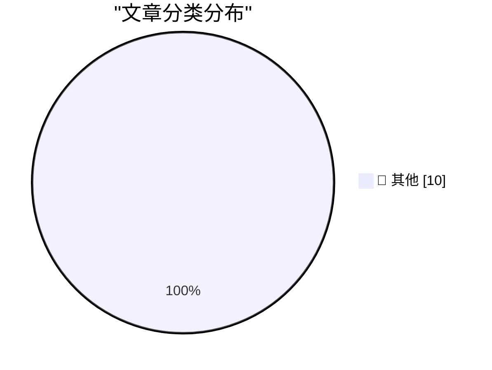

# 📰 AI 博客每日精选 — 2026-03-24

> 来自 Karpathy 推荐的 92 个顶级技术博客，AI 精选 Top 10

## 🏆 今日必读

🥇 **Quoting David Abram**

[Quoting David Abram](https://simonwillison.net/2026/Mar/23/david-abram/#atom-everything) — simonwillison.net · 4 小时前 · 📝 其他

> Quoting David Abram

🥈 **Beats now have notes**

[Beats now have notes](https://simonwillison.net/2026/Mar/23/beats-now-have-notes/#atom-everything) — simonwillison.net · 20 小时前 · 📝 其他

> Beats now have notes

🥉 **Starlette 1.0 skill**

[Starlette 1.0 skill](https://simonwillison.net/2026/Mar/23/starlette-1-skill/#atom-everything) — simonwillison.net · 22 小时前 · 📝 其他

> Starlette 1.0 skill

---

## 📊 数据概览

| 扫描源 | 抓取文章 | 时间范围 | 精选 |
|:---:|:---:|:---:|:---:|
| 89/92 | 2526 篇 → 17 篇 | 24h | **10 篇** |

### 分类分布

---

## 📝 其他

### 1. Quoting David Abram

[Quoting David Abram](https://simonwillison.net/2026/Mar/23/david-abram/#atom-everything) — **simonwillison.net** · 4 小时前 · ⭐ 15/30

> Quoting David Abram

---

### 2. Beats now have notes

[Beats now have notes](https://simonwillison.net/2026/Mar/23/beats-now-have-notes/#atom-everything) — **simonwillison.net** · 20 小时前 · ⭐ 15/30

> Beats now have notes

---

### 3. Starlette 1.0 skill

[Starlette 1.0 skill](https://simonwillison.net/2026/Mar/23/starlette-1-skill/#atom-everything) — **simonwillison.net** · 22 小时前 · ⭐ 15/30

> Starlette 1.0 skill

---

### 4. Experimenting with Starlette 1.0 with Claude skills

[Experimenting with Starlette 1.0 with Claude skills](https://simonwillison.net/2026/Mar/22/starlette/#atom-everything) — **simonwillison.net** · 23 小时前 · ⭐ 15/30

> Experimenting with Starlette 1.0 with Claude skills

---

### 5. ‘CanisterWorm’ Springs Wiper Attack Targeting Iran

[‘CanisterWorm’ Springs Wiper Attack Targeting Iran](https://krebsonsecurity.com/2026/03/canisterworm-springs-wiper-attack-targeting-iran/) — **krebsonsecurity.com** · 7 小时前 · ⭐ 15/30

> ‘CanisterWorm’ Springs Wiper Attack Targeting Iran

---

### 6. Gasoline Prices Around the World

[Gasoline Prices Around the World](https://www.globalpetrolprices.com/gasoline_prices/) — **daringfireball.net** · 2 小时前 · ⭐ 15/30

> Gasoline Prices Around the World

---

### 7. WWDC 2026: June 8–12

[WWDC 2026: June 8–12](https://www.apple.com/newsroom/2026/03/apples-worldwide-developers-conference-returns-the-week-of-june-8/) — **daringfireball.net** · 4 小时前 · ⭐ 15/30

> WWDC 2026: June 8–12

---

### 8. From the DF Archive, a Decade Ago: ‘The Industry Is Fucked Up’

[From the DF Archive, a Decade Ago: ‘The Industry Is Fucked Up’](https://daringfireball.net/linked/2015/07/09/ritchie-bad-ads) — **daringfireball.net** · 4 小时前 · ⭐ 15/30

> From the DF Archive, a Decade Ago: ‘The Industry Is Fucked Up’

---

### 9. The HTML Review: Issue 05

[The HTML Review: Issue 05](https://thehtml.review/05/) — **daringfireball.net** · 5 小时前 · ⭐ 15/30

> The HTML Review: Issue 05

---

### 10. Pluralistic: Understaffing as a form of enshittification (23 Mar 2026)

[Pluralistic: Understaffing as a form of enshittification (23 Mar 2026)](https://pluralistic.net/2026/03/22/nobodys-home/) — **pluralistic.net** · 17 小时前 · ⭐ 15/30

> Pluralistic: Understaffing as a form of enshittification (23 Mar 2026)

---

*生成于 2026-03-24 23:02 | 扫描 89 源 → 获取 2526 篇 → 精选 10 篇*
*基于 [Hacker News Popularity Contest 2025](https://refactoringenglish.com/tools/hn-popularity/) RSS 源列表*
