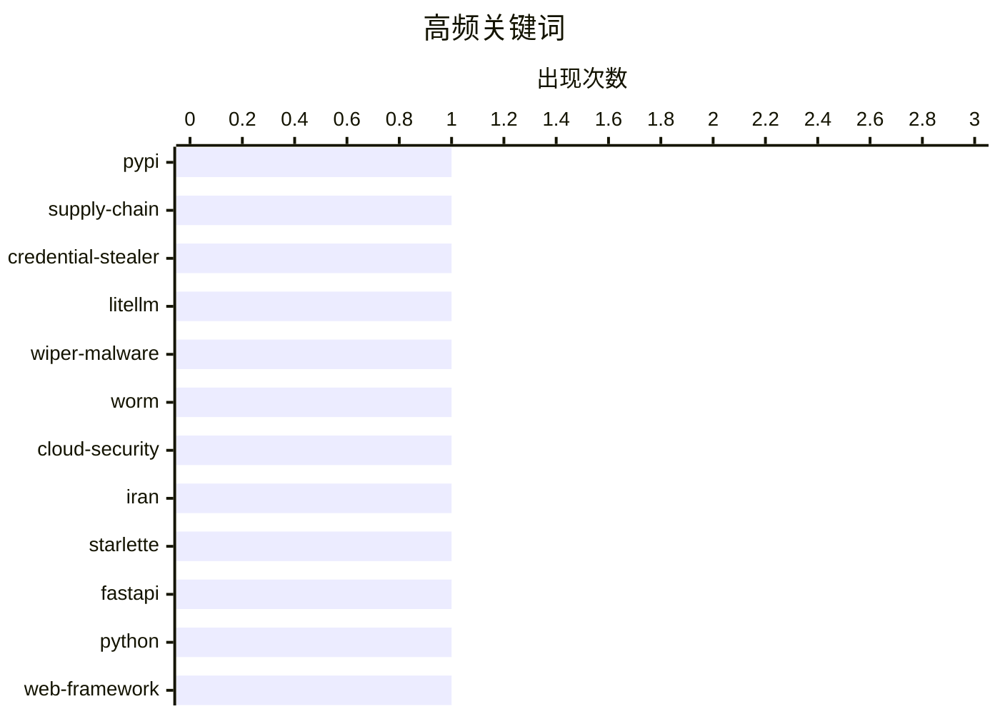

# 📰 AI 博客每日精选 — 2026-03-24

> 来自 Karpathy 推荐的 92 个顶级技术博客，AI 精选 Top 10

## 📝 今日看点

今天技术圈的主线很清晰：供应链投毒与破坏性攻击正在抬高安全基线，从 PyPI 包凭证窃取到针对关键区域的擦除与渗透，软件信任链再度成为核心战场。与此同时，工程实践出现“稳中求新”的分化，一边是 Starlette 1.0、Datasette 插件等基础设施迭代提速，另一边是“选择成熟技术+创新方法”的务实路线持续升温。AI 话题则进入理性重估期：从流式专家等能力探索到对行业叙事真实性的公开质疑，关注点正从“能不能做”转向“值不值得信、能否落地”。

---

## 🏆 今日必读

🥇 **LiteLLM 1.82.8 中恶意 litellm_init.pth：凭证窃取器**

[Malicious litellm_init.pth in litellm 1.82.8 — credential stealer](https://simonwillison.net/2026/Mar/24/malicious-litellm/#atom-everything) — simonwillison.net · 2026-03-24 · 🔒 安全

> LiteLLM 在 PyPI 发布的 v1.82.8 版本被供应链投毒，核心风险是一个隐藏在 `litellm_init.pth` 中、经 Base64 混淆的凭证窃取器。由于 `.pth` 文件会在 Python 启动/安装相关流程中被自动处理，攻击代码可在“仅安装包、尚未 `import litellm`”的情况下触发，显著扩大受害面。对比来看，v1.82.7 也含恶意逻辑，但位置在 `proxy/proxy_server.py`，需要导入模块后才会生效，攻击门槛与隐蔽性都低于 1.82.8。该事件展示了攻击者从应用层注入转向 Python 包加载机制的手法升级，属于高危凭证外泄风险。结论是：凡安装过受影响版本的环境都应按“已失陷”处理，立即轮换密钥并开展全面溯源与清理。

💡 **为什么值得读**: 它揭示了一次非常典型且“安装即中招”的 PyPI 供应链攻击案例，能直接帮助你修正对 Python 包安全边界的认知并改进应急处置流程。

🏷️ PyPI, supply-chain, credential-stealer, LiteLLM

🥈 **‘CanisterWorm’ Springs Wiper Attack Targeting Iran**

[‘CanisterWorm’ Springs Wiper Attack Targeting Iran](https://krebsonsecurity.com/2026/03/canisterworm-springs-wiper-attack-targeting-iran/) — krebsonsecurity.com · 7 小时前 · 🔒 安全

> A financially motivated data theft and extortion group is attempting to inject itself into the Iran war, unleashing a worm that spreads through poorly secured cloud services and wipes data on infected

🏷️ wiper-malware, worm, cloud-security, Iran

🥉 **Experimenting with Starlette 1.0 with Claude skills**

[Experimenting with Starlette 1.0 with Claude skills](https://simonwillison.net/2026/Mar/22/starlette/#atom-everything) — simonwillison.net · 23 小时前 · ⚙️ 工程

> Starlette 1.0 is out ! This is a really big deal. I think Starlette may be the Python framework with the most usage compared to its relatively low brand recognition because Starlette is the foundation

🏷️ Starlette, FastAPI, Python, web-framework

---

## 📊 数据概览

| 扫描源 | 抓取文章 | 时间范围 | 精选 |
|:---:|:---:|:---:|:---:|
| 87/92 | 2492 篇 → 39 篇 | 24h | **10 篇** |

### 分类分布


### 高频关键词



<details>
<summary>📈 纯文本关键词图（终端友好）</summary>

```
pypi               │ ████████████████████ 1
supply-chain       │ ████████████████████ 1
credential-stealer │ ████████████████████ 1
litellm            │ ████████████████████ 1
wiper-malware      │ ████████████████████ 1
worm               │ ████████████████████ 1
cloud-security     │ ████████████████████ 1
iran               │ ████████████████████ 1
starlette          │ ████████████████████ 1
fastapi            │ ████████████████████ 1
```

</details>

### 🏷️ 话题标签

**pypi**(1) · **supply-chain**(1) · **credential-stealer**(1) · litellm(1) · wiper-malware(1) · worm(1) · cloud-security(1) · iran(1) · starlette(1) · fastapi(1) · python(1) · web-framework(1) · ai industry(1) · hype(1) · business model(1) · critical analysis(1) · boring technology(1) · innovation(1) · software architecture(1) · engineering practices(1)

---

## 🔒 安全

### 1. LiteLLM 1.82.8 中恶意 litellm_init.pth：凭证窃取器

[Malicious litellm_init.pth in litellm 1.82.8 — credential stealer](https://simonwillison.net/2026/Mar/24/malicious-litellm/#atom-everything) — **simonwillison.net** · 2026-03-24 · ⭐ 28/30

> LiteLLM 在 PyPI 发布的 v1.82.8 版本被供应链投毒，核心风险是一个隐藏在 `litellm_init.pth` 中、经 Base64 混淆的凭证窃取器。由于 `.pth` 文件会在 Python 启动/安装相关流程中被自动处理，攻击代码可在“仅安装包、尚未 `import litellm`”的情况下触发，显著扩大受害面。对比来看，v1.82.7 也含恶意逻辑，但位置在 `proxy/proxy_server.py`，需要导入模块后才会生效，攻击门槛与隐蔽性都低于 1.82.8。该事件展示了攻击者从应用层注入转向 Python 包加载机制的手法升级，属于高危凭证外泄风险。结论是：凡安装过受影响版本的环境都应按“已失陷”处理，立即轮换密钥并开展全面溯源与清理。

🏷️ PyPI, supply-chain, credential-stealer, LiteLLM

---

### 2. ‘CanisterWorm’ Springs Wiper Attack Targeting Iran

[‘CanisterWorm’ Springs Wiper Attack Targeting Iran](https://krebsonsecurity.com/2026/03/canisterworm-springs-wiper-attack-targeting-iran/) — **krebsonsecurity.com** · 7 小时前 · ⭐ 27/30

> A financially motivated data theft and extortion group is attempting to inject itself into the Iran war, unleashing a worm that spreads through poorly secured cloud services and wipes data on infected

🏷️ wiper-malware, worm, cloud-security, Iran

---

### 3. Hosting a Snowflake Proxy

[Hosting a Snowflake Proxy](https://matduggan.com/hosting-a-snowflake-proxy/) — **matduggan.com** · 2026-03-24 · ⭐ 23/30

> In the nightmarish world of 2026 it can be difficult to know how to help at all. There are too many horrors happening to quickly to know where one can inject even a small amount of assistance. However

🏷️ Snowflake, proxy, censorship circumvention, Tor

---

## ⚙️ 工程

### 4. Experimenting with Starlette 1.0 with Claude skills

[Experimenting with Starlette 1.0 with Claude skills](https://simonwillison.net/2026/Mar/22/starlette/#atom-everything) — **simonwillison.net** · 23 小时前 · ⭐ 25/30

> Starlette 1.0 is out ! This is a really big deal. I think Starlette may be the Python framework with the most usage compared to its relatively low brand recognition because Starlette is the foundation

🏷️ Starlette, FastAPI, Python, web-framework

---

### 5. Choose Boring Technology and Innovative Practices

[Choose Boring Technology and Innovative Practices](https://buttondown.com/hillelwayne/archive/choose-boring-technology-and-innovative-practices/) — **buttondown.com/hillelwayne** · 2026-03-24 · ⭐ 24/30

> The famous article Choose Boring Technology lists two problems with using innovative technology: There are too many "unknown unknowns" in a new technology, whereas in boring technology the pitfalls ar

🏷️ boring technology, innovation, software architecture, engineering practices

---

### 6. WWDC 2026: June 8–12

[WWDC 2026: June 8–12](https://www.apple.com/newsroom/2026/03/apples-worldwide-developers-conference-returns-the-week-of-june-8/) — **daringfireball.net** · 4 小时前 · ⭐ 23/30

> Apple Newsroom: WWDC kicks off with the Keynote and Platforms State of the Union on Monday, June 8. The conference continues online all week with over 100 video sessions and interactive group labs and

🏷️ WWDC, Apple, developer conference, iOS

---

## 🛠 工具 / 开源

### 7. [Sponsor] npx workos: From Auth Integration to Environment Management, Zero ClickOps

[[Sponsor] npx workos: From Auth Integration to Environment Management, Zero ClickOps](https://workos.com/docs/authkit/cli-installer?utm_source=daringfireball&amp;utm_medium=newsletter&amp;utm_campaign=q12026) — **daringfireball.net** · 2026-03-24 · ⭐ 23/30

> npx workos@latest launches an AI agent, powered by Claude , that reads your project, detects your framework, and writes a complete auth integration into your codebase. No signup required. It creates a

🏷️ auth, CLI, AI agent, Claude

---

### 8. datasette-files 0.1a2

[datasette-files 0.1a2](https://simonwillison.net/2026/Mar/23/datasette-files/#atom-everything) — **simonwillison.net** · 刚刚 · ⭐ 22/30

> Release: datasette-files 0.1a2 The most interesting alpha of datasette-files yet, a new plugin which adds the ability to upload files directly into a Datasette instance. Here are the release notes in 

🏷️ Datasette, plugin, file-upload, release-notes

---

## 💡 观点 / 杂谈

### 9. The AI Industry Is Lying To You

[The AI Industry Is Lying To You](https://www.wheresyoured.at/the-ai-industry-is-lying-to-you/) — **wheresyoured.at** · 2026-03-25 · ⭐ 25/30

> Hi! If you like this piece and want to support my independent reporting and analysis, why not subscribe to my premium newsletter? It’s $70 a year, or $7 a month, and in return you get a weekly newslet

🏷️ AI industry, hype, business model, critical analysis

---

## 🤖 AI / ML

### 10. Streaming experts

[Streaming experts](https://simonwillison.net/2026/Mar/24/streaming-experts/#atom-everything) — **simonwillison.net** · 2026-03-24 · ⭐ 23/30

> I wrote about Dan Woods' experiments with streaming experts the other day , the trick where you run larger Mixture-of-Experts models on hardware that doesn't have enough RAM to fit the entire model by

🏷️ Mixture-of-Experts, inference, SSD-streaming, memory-optimization

---

*生成于 2026-03-24 07:00 | 扫描 87 源 → 获取 2492 篇 → 精选 10 篇*
*基于 [Hacker News Popularity Contest 2025](https://refactoringenglish.com/tools/hn-popularity/) RSS 源列表*
