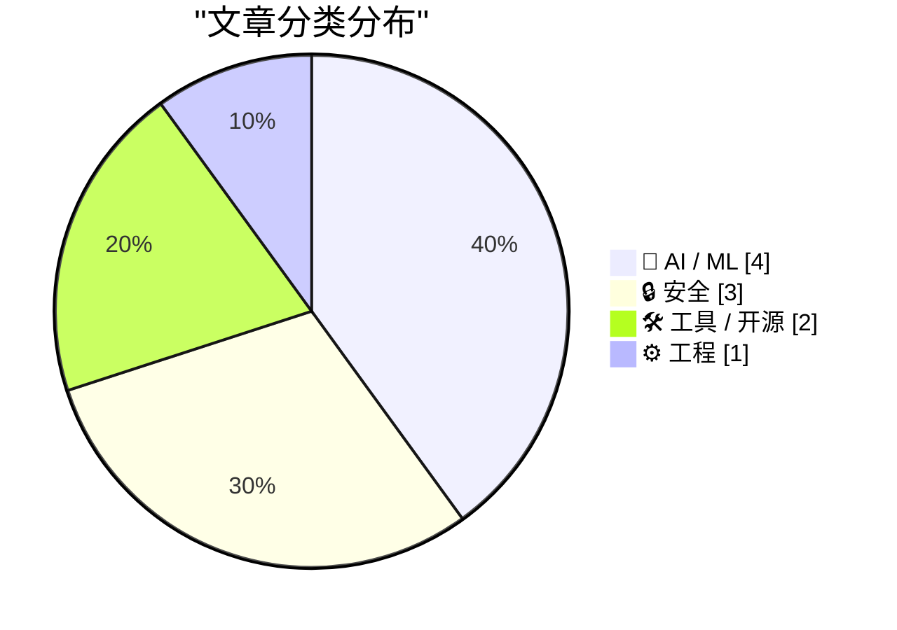
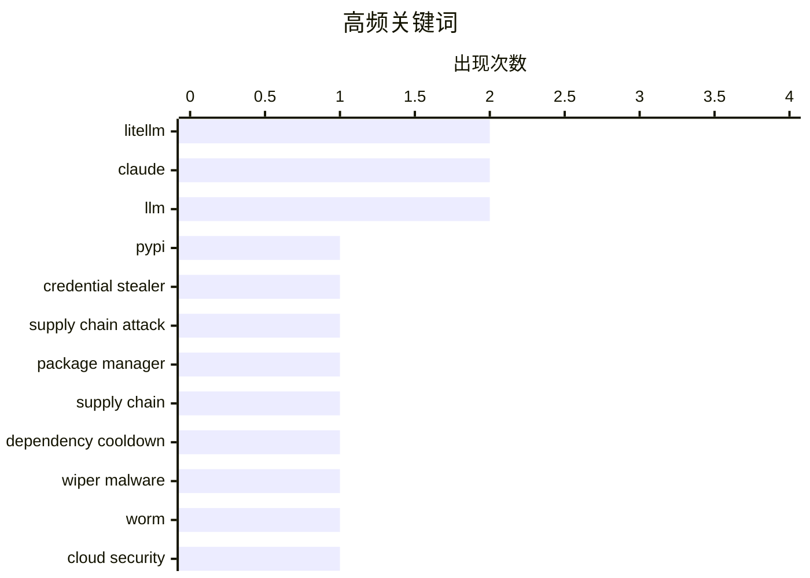

# 📰 AI 博客每日精选 — 2026-03-24

> 来自 Karpathy 推荐的 92 个顶级技术博客，AI 精选 Top 10

## 📝 今日看点

今天的主线可以归为三点：**AI 代理能力前进、超大模型本地化探索、以及供应链安全收紧**。一方面，Claude 在 Mac 端继续“下沉到操作层”，既有可直接操控桌面的 Computer Use，也有用分类模型代管审批的 Auto Mode，说明代理正从“会回答”走向“可执行”，但仍强调授权边界与早期风险。另一方面，社区在训练与推理两端都在做务实实验：从 weight decay / weight tying 这类基础超参数验证，到“流式专家”把超大 MoE 以 SSD 流加载方式带到消费级设备。与此同时，LiteLLM 恶意包与 CanisterWorm 事件再次提醒，依赖冷静期、密钥轮换和云面最小暴露应成为默认操作。补充看，WWDC 2026 与 Starlette 1.0 实践都指向同一趋势：开发生态正在为 AI 原生工作流和新一代应用形态加速重构。

---

## 🏆 今日必读

🥇 **LiteLLM 1.82.8 出现恶意 litellm_init.pth：安装即触发的凭证窃取**

[Malicious litellm_init.pth in litellm 1.82.8 — credential stealer](https://simonwillison.net/2026/Mar/24/malicious-litellm/#atom-everything) — simonwillison.net · 2026-03-24 · 🔒 安全

> LiteLLM 在 PyPI 发布的 1.82.8 版本被植入了凭证窃取代码，恶意载荷以 base64 形式隐藏在 litellm_init.pth 中。由于 .pth 文件可在安装/解释器启动阶段生效，攻击不需要 import litellm 就可能触发，风险面显著扩大。相比之下，1.82.7 虽也受影响，但恶意代码位于 proxy/proxy_server.py，需要导入后才会执行。文中指出该窃密器会搜集大量敏感文件与配置（如 SSH、云凭证、Docker、npm、数据库与 shell 历史等）。PyPI 已隔离该包且暴露窗口仅数小时，但在此期间安装过的人应视为高危并立即轮换密钥。

💡 **为什么值得读**: 这是一次教科书级的 Python 供应链攻击案例，直接提醒团队必须把“安装阶段即执行”纳入威胁模型。

🏷️ LiteLLM, PyPI, credential stealer, supply chain attack

🥈 **包管理器需要“冷静期”：依赖更新应延迟安装**

[Package Managers Need to Cool Down](https://simonwillison.net/2026/Mar/24/package-managers-need-to-cool-down/#atom-everything) — simonwillison.net · 2026-03-25 · 🔒 安全

> 作者受 LiteLLM 供应链事件影响，再次强调依赖“冷静期”（dependency cooldown）：新版本先在社区暴露几天，再进入生产安装。文章汇总了这一机制在主流工具中的落地进展，显示支持度已明显提升。pnpm、Yarn、Bun、Deno、uv、pip、npm 都已提供最小发布时间门槛或等效能力，并通常支持白名单豁免。pip 目前主要基于绝对时间戳，不如相对时长直观，但已有通过定时任务自动更新配置的实践方案。核心观点是，冷静期是低成本、可操作且对抗投毒有效的默认防线。

💡 **为什么值得读**: 它把“如何降低依赖投毒风险”从理念变成可立即配置的工具清单，适合直接落地到团队流程。

🏷️ package manager, supply chain, dependency cooldown, LiteLLM

🥉 **“CanisterWorm”擦除蠕虫瞄准伊朗：TeamPCP借供应链与云弱配置扩散攻击**

[‘CanisterWorm’ Springs Wiper Attack Targeting Iran](https://krebsonsecurity.com/2026/03/canisterworm-springs-wiper-attack-targeting-iran/) — krebsonsecurity.com · 7 小时前 · 🔒 安全

> Krebs 报道称，网络犯罪团伙 TeamPCP 将其原本以窃密和勒索为主的行动升级为带有定向破坏性质的“擦除”攻击，恶意载荷会在检测到系统使用伊朗时区或波斯语环境时触发。该团伙此前自 2025 年底起就利用暴露的 Docker API、Kubernetes、Redis 及 React2Shell 等入口，在云控制面横向扩散并窃取凭据，受害云平台以 Azure 和 AWS 为主。研究人员指出，攻击者近期还利用对 Trivy 供应链的入侵投放新载荷，可窃取 SSH 密钥、云凭据、K8s 令牌和加密钱包信息，并在满足条件时对集群节点执行数据擦除。其基础设施采用 ICP canister（区块链智能合约式托管）来分发内容，具备较强抗下线能力，也增加了追踪和处置难度。尽管目前尚无确凿证据证明大规模擦除已成功发生，但这起事件显示“云误配置+供应链投毒+自动化扩散”正在被组合成高效率攻击链。

💡 **为什么值得读**: 这篇文章把一次地缘定向擦除事件背后的技术链路讲清楚了，能帮助安全团队优先补齐云控制面暴露与供应链防护短板。

🏷️ wiper malware, worm, cloud security, Iran

---

## 📊 数据概览

| 扫描源 | 抓取文章 | 时间范围 | 精选 |
|:---:|:---:|:---:|:---:|
| 89/92 | 2527 篇 → 52 篇 | 24h | **10 篇** |

### 分类分布



### 高频关键词



<details>
<summary>📈 纯文本关键词图（终端友好）</summary>

```
litellm             │ ████████████████████ 2
claude              │ ████████████████████ 2
llm                 │ ████████████████████ 2
pypi                │ ██████████░░░░░░░░░░ 1
credential stealer  │ ██████████░░░░░░░░░░ 1
supply chain attack │ ██████████░░░░░░░░░░ 1
package manager     │ ██████████░░░░░░░░░░ 1
supply chain        │ ██████████░░░░░░░░░░ 1
dependency cooldown │ ██████████░░░░░░░░░░ 1
wiper malware       │ ██████████░░░░░░░░░░ 1
```

</details>

### 🏷️ 话题标签

**litellm**(2) · **claude**(2) · **llm**(2) · pypi(1) · credential stealer(1) · supply chain attack(1) · package manager(1) · supply chain(1) · dependency cooldown(1) · wiper malware(1) · worm(1) · cloud security(1) · iran(1) · claude code(1) · permissions(1) · agent safety(1) · developer workflow(1) · computer use(1) · mac automation(1) · ai agents(1)

---

## 🤖 AI / ML

### 1. Claude 现在可以直接操作你的 Mac

[Claude Can Now Take Control of Your Mac](https://claude.com/blog/dispatch-and-computer-use) — **daringfireball.net** · 2026-03-25 · ⭐ 25/30

> Anthropic 宣布在 Claude Cowork 和 Claude Code 中上线“计算机操作”能力，Claude 在缺少现成连接器时可以直接通过屏幕执行点击、输入和导航等操作。它可自动打开文件、使用浏览器、运行开发工具，且无需额外配置，目前以 research preview 形式向 Pro 和 Max 订阅用户开放。该能力会优先调用如 Slack、Google Calendar 等连接器，只有在无连接器可用时才接管鼠标键盘，并在访问新应用前请求明确授权。官方强调已加入安全防护（包括对提示注入风险的检测）并允许用户随时中止任务，但也提醒该功能仍处早期阶段，可能出错且不建议处理敏感数据。与 Dispatch 联动后，用户可在手机上派发任务、在电脑上查看结果，支持如晨间简报、定期拉取指标、改代码并跑测试提 PR 等跨设备工作流。当前仅支持 macOS，需在桌面端开启功能并保持应用运行。

🏷️ Claude, computer use, Mac automation, AI agents

---

### 2. 从零写 LLM（32f）：干预实验之权重衰减

[Writing an LLM from scratch, part 32f -- Interventions: weight decay](https://www.gilesthomas.com/2026/03/llm-from-scratch-32f-interventions-weight-decay) — **gilesthomas.com** · 刚刚 · ⭐ 24/30

> 这篇博文属于作者“从零训练 GPT-2 small（代码语料）”系列的第 32f 篇，主题是测试 weight decay 对训练效果的影响。根据标题与元描述，文章核心问题是：权重衰减是什么，以及在该实验设置下应取什么值才能获得更好的训练结果。现有正文抓取内容基本只有站点归档列表，缺少具体实验过程、参数区间、曲线和结论细节。可确认的是，这是一篇延续前序“干预（interventions）”路线、聚焦可调超参数的实证记录。若你在复现小型 LLM 训练并调参，这篇应提供针对 weight decay 的经验性取值讨论，但具体结果需以原文为准。

🏷️ LLM, GPT-2, weight decay, AdamW

---

### 3. 从零写 LLM（32g）：干预实验之权重绑定

[Writing an LLM from scratch, part 32g -- Interventions: weight tying](https://www.gilesthomas.com/2026/03/llm-from-scratch-32g-interventions-weight-tying) — **gilesthomas.com** · 2026-03-25 · ⭐ 24/30

> 这篇是同一系列的第 32g 篇，讨论 weight tying（输入嵌入与输出投影共享权重）在模型训练中的实际效果。元描述指出作者关注一个常见争议：权重绑定虽能减少参数量，但在现代 LLM 中并不常用，且可能直觉上损害性能。由于正文抓取失败，仅能确认文章意图是用实验而非直觉来验证“是否真的变差”。结合已有摘要线索，作者也在对比教材/实践中的说法与自己复现实验之间的一致性。文章应对“参数效率 vs. 性能”取舍提供具体观察，但目前缺乏可提取的定量结论。

🏷️ LLM, weight tying, parameter efficiency, training

---

### 4. “流式专家”让超大 MoE 模型在小内存设备上跑起来

[Streaming experts](https://simonwillison.net/2026/Mar/24/streaming-experts/#atom-everything) — **simonwillison.net** · 2026-03-24 · ⭐ 23/30

> 这篇文章跟进了 Dan Woods 对“streaming experts（流式专家）”的实验：把 MoE 模型所需专家权重按 token 从 SSD 流式加载，而不是一次性放进内存。这样可以在 RAM 不足的设备上运行远超硬件容量的大模型。文中给出多个最新进展，包括在 96GB 内存的 M2 Max MacBook Pro 上运行 1 万亿参数的 Kimi K2.5（同时激活 320 亿权重），以及在 iPhone 上运行 Qwen3.5-397B-A17B（约 0.6 tokens/s）。更新还提到有人在 128GB M4 Max 上把 Kimi K2.5 跑到约 1.7 tokens/s。作者认为这条路线前景很强，社区还在通过自动化研究循环持续挖掘优化空间。

🏷️ Mixture of Experts, model streaming, SSD offloading, inference

---

## 🔒 安全

### 5. LiteLLM 1.82.8 出现恶意 litellm_init.pth：安装即触发的凭证窃取

[Malicious litellm_init.pth in litellm 1.82.8 — credential stealer](https://simonwillison.net/2026/Mar/24/malicious-litellm/#atom-everything) — **simonwillison.net** · 2026-03-24 · ⭐ 29/30

> LiteLLM 在 PyPI 发布的 1.82.8 版本被植入了凭证窃取代码，恶意载荷以 base64 形式隐藏在 litellm_init.pth 中。由于 .pth 文件可在安装/解释器启动阶段生效，攻击不需要 import litellm 就可能触发，风险面显著扩大。相比之下，1.82.7 虽也受影响，但恶意代码位于 proxy/proxy_server.py，需要导入后才会执行。文中指出该窃密器会搜集大量敏感文件与配置（如 SSH、云凭证、Docker、npm、数据库与 shell 历史等）。PyPI 已隔离该包且暴露窗口仅数小时，但在此期间安装过的人应视为高危并立即轮换密钥。

🏷️ LiteLLM, PyPI, credential stealer, supply chain attack

---

### 6. 包管理器需要“冷静期”：依赖更新应延迟安装

[Package Managers Need to Cool Down](https://simonwillison.net/2026/Mar/24/package-managers-need-to-cool-down/#atom-everything) — **simonwillison.net** · 2026-03-25 · ⭐ 27/30

> 作者受 LiteLLM 供应链事件影响，再次强调依赖“冷静期”（dependency cooldown）：新版本先在社区暴露几天，再进入生产安装。文章汇总了这一机制在主流工具中的落地进展，显示支持度已明显提升。pnpm、Yarn、Bun、Deno、uv、pip、npm 都已提供最小发布时间门槛或等效能力，并通常支持白名单豁免。pip 目前主要基于绝对时间戳，不如相对时长直观，但已有通过定时任务自动更新配置的实践方案。核心观点是，冷静期是低成本、可操作且对抗投毒有效的默认防线。

🏷️ package manager, supply chain, dependency cooldown, LiteLLM

---

### 7. “CanisterWorm”擦除蠕虫瞄准伊朗：TeamPCP借供应链与云弱配置扩散攻击

[‘CanisterWorm’ Springs Wiper Attack Targeting Iran](https://krebsonsecurity.com/2026/03/canisterworm-springs-wiper-attack-targeting-iran/) — **krebsonsecurity.com** · 7 小时前 · ⭐ 27/30

> Krebs 报道称，网络犯罪团伙 TeamPCP 将其原本以窃密和勒索为主的行动升级为带有定向破坏性质的“擦除”攻击，恶意载荷会在检测到系统使用伊朗时区或波斯语环境时触发。该团伙此前自 2025 年底起就利用暴露的 Docker API、Kubernetes、Redis 及 React2Shell 等入口，在云控制面横向扩散并窃取凭据，受害云平台以 Azure 和 AWS 为主。研究人员指出，攻击者近期还利用对 Trivy 供应链的入侵投放新载荷，可窃取 SSH 密钥、云凭据、K8s 令牌和加密钱包信息，并在满足条件时对集群节点执行数据擦除。其基础设施采用 ICP canister（区块链智能合约式托管）来分发内容，具备较强抗下线能力，也增加了追踪和处置难度。尽管目前尚无确凿证据证明大规模擦除已成功发生，但这起事件显示“云误配置+供应链投毒+自动化扩散”正在被组合成高效率攻击链。

🏷️ wiper malware, worm, cloud security, Iran

---

## 🛠 工具 / 开源

### 8. Claude Code 推出 Auto Mode：用分类模型代管权限审批

[Auto mode for Claude Code](https://simonwillison.net/2026/Mar/24/auto-mode-for-claude-code/#atom-everything) — **simonwillison.net** · 2026-03-25 · ⭐ 26/30

> Claude Code 新增“auto mode”，作为 `--dangerously-skip-permissions` 的替代方案，由模型在每次执行前自动判断是否放行操作。其机制是用独立分类器（文档称基于 Claude Sonnet 4.6）审查上下文，拦截超出任务范围、访问不受信任基础设施或疑似受提示注入影响的行为。默认策略包含较细粒度规则：例如允许项目范围内本地操作、只读请求、按清单安装依赖；同时对强推主分支、执行外部代码、云存储批量删除等行为给出软拒绝或阻断。作者通过 `claude auto-mode defaults` 查看了完整策略 JSON，认为这套规则透明度较高且可自定义。

🏷️ Claude Code, permissions, agent safety, developer workflow

---

### 9. 苹果宣布 WWDC 2026 将于 6 月 8 日至 12 日举行

[WWDC 2026: June 8–12](https://www.apple.com/newsroom/2026/03/apples-worldwide-developers-conference-returns-the-week-of-june-8/) — **daringfireball.net** · 4 小时前 · ⭐ 23/30

> 苹果宣布 WWDC 2026 将于 6 月 8 日至 12 日举行，主体仍为全球线上形式，并在 6 月 8 日于 Apple Park 举办线下特别活动。大会将以 Keynote 和 Platforms State of the Union 开场，后续一周提供超过 100 场视频会议、互动小组实验室及一对一交流。苹果表示今年将重点展示各平台软件更新，包括 AI 相关进展，以及新的开发工具、框架和特性。开发者可通过 Apple Developer App、官网、YouTube（中国区含 bilibili 渠道）参与内容。学生方面，Swift Student Challenge 获奖者将获得线下活动申请资格，另有 50 位 Distinguished Winners 受邀前往库比蒂诺进行三天活动。

🏷️ WWDC, Apple, developer conference, platform updates

---

## ⚙️ 工程

### 10. 用 Claude 技能实践 Starlette 1.0：从新生命周期到可用示例应用

[Experimenting with Starlette 1.0 with Claude skills](https://simonwillison.net/2026/Mar/22/starlette/#atom-everything) — **simonwillison.net** · 23 小时前 · ⭐ 24/30

> 作者认为 Starlette 1.0 的发布意义重大，因为它虽然品牌声量不如 FastAPI，却是 FastAPI 的底层基础框架。文章回顾了 Starlette 的发展与维护权变更，并指出 1.0 相比 0.x 存在破坏性更新，尤其是启动/关闭流程从 on_startup/on_shutdown 改为基于 async context manager 的 lifespan 机制。作者将 Starlette 形容为 asyncio 原生、介于 Flask 与 Django 之间的框架，单文件开发体验对快速原型和 LLM 代码生成都很友好。针对“模型训练语料仍偏旧版本”这一问题，他让 Claude 先从 Starlette 仓库生成一份面向 1.0 的技能文档，再把该技能注入日常对话。随后 Claude 基于该技能生成了一个包含项目、任务、评论与标签的任务管理应用（含 Starlette 1.0、aiosqlite、Jinja2），并通过脚本化测试验证主要 API 与页面可正常工作。

🏷️ Starlette, FastAPI, Python, Claude

---

*生成于 2026-03-24 07:00 | 扫描 89 源 → 获取 2527 篇 → 精选 10 篇*
*基于 [Hacker News Popularity Contest 2025](https://refactoringenglish.com/tools/hn-popularity/) RSS 源列表*
