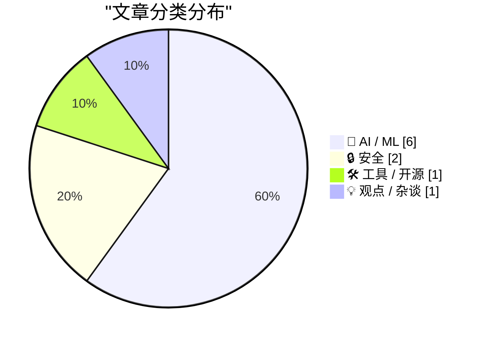
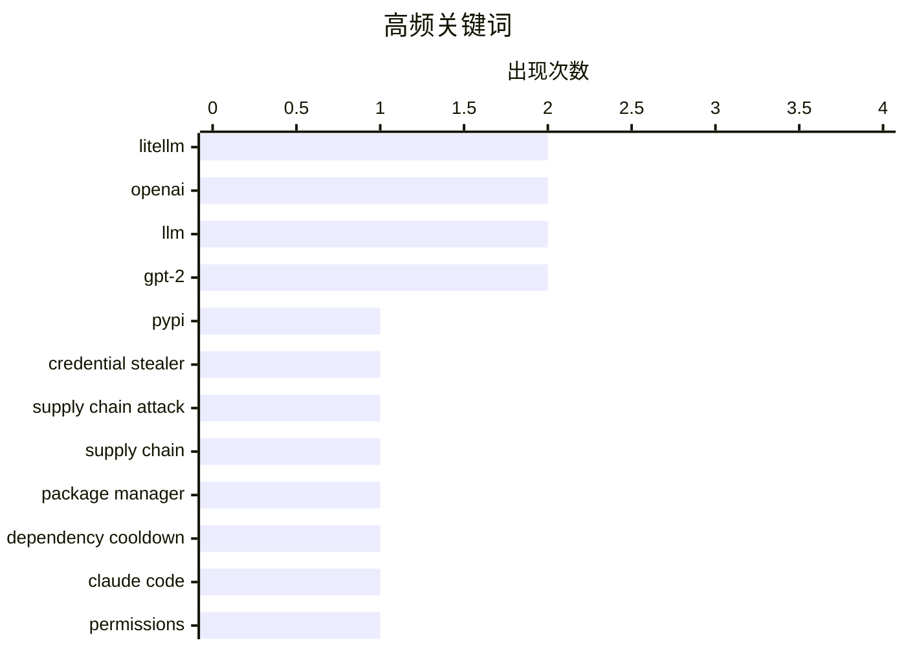

# 📰 AI 博客每日精选 — 2026-03-25

> 来自 Karpathy 推荐的 92 个顶级技术博客，AI 精选 Top 10

## 📝 今日看点

今天的主线之一，是 **AI 助手正从“会聊天”走向“会操作系统”**：Claude 在 macOS 上开放电脑操作与自动权限判定，OpenAI 也被曝在筹划整合聊天、编码、浏览的桌面“超级入口”。这说明产品竞争点正在从模型能力本身，转向“统一工作流 + 可控执行”的体验，但安全性与稳定性仍是落地瓶颈。   第二条主线是 **安全与工程治理被重新抬到台前**：LiteLLM 供应链投毒事件再次证明“安装即中招”的现实风险，也让依赖冷静期、凭证轮换、确定性沙箱等做法从“可选”变成“默认必需”。   第三条主线是 **算力与模型部署进入务实阶段**：一边有 streaming experts 这类技术把超大 MoE 下放到小内存设备，另一边也有对数据中心扩张兑现度的质疑，行业叙事正从“规模想象”回到“能否真实交付”。

---

## 🏆 今日必读

🥇 **LiteLLM 1.82.8 被植入恶意 litellm_init.pth：安装即触发凭证窃取**

[Malicious litellm_init.pth in litellm 1.82.8 — credential stealer](https://simonwillison.net/2026/Mar/24/malicious-litellm/#atom-everything) — simonwillison.net · 7 小时前 · 🔒 安全

> LiteLLM 在 PyPI 发布的 1.82.8 版本被供应链投毒，攻击者将凭证窃取载荷以 base64 混淆后藏在 `litellm_init.pth` 中。由于 `.pth` 文件可在解释器启动阶段执行代码，用户仅安装该包就可能中招，即使没有 `import litellm`。相比之下，1.82.7 虽也含恶意代码，但位于 `proxy/proxy_server.py`，需要导入后才会生效。该窃密程序会搜集大量本地敏感信息，包括 SSH、云平台、容器、包管理器配置及多类历史记录与钱包相关目录。PyPI 已隔离该包且暴露窗口仅数小时，但已安装受影响版本的环境仍应立即轮换凭证并进行全面排查。

💡 **为什么值得读**: 这篇内容清楚揭示了“安装即执行”的高危 Python 供应链攻击路径，能直接指导你评估影响面和应急处置优先级。

🏷️ LiteLLM, PyPI, credential stealer, supply chain attack

🥈 **包管理器需要“冷静期”：依赖更新应设置发布延迟**

[Package Managers Need to Cool Down](https://simonwillison.net/2026/Mar/24/package-managers-need-to-cool-down/#atom-everything) — simonwillison.net · 1 小时前 · 🔒 安全

> 作者借 LiteLLM 供应链事件重提“依赖冷静期”策略：新版本发布后先等待几天再安装，让社区有时间发现异常。文中引用 Andrew Nesbitt 的综述，指出这一机制在主流工具中的支持度已显著提升。pnpm、Yarn、Bun、Deno、uv、pip、npm 都已提供最小发布时间或等价的“排除过新版本”能力，并普遍支持白名单豁免。当前 pip 的限制是主要依赖绝对时间戳而非相对时长，但可通过定时任务自动更新配置来变通实现。核心观点是，把“延迟采纳新依赖”纳入默认工程实践，可以显著降低零日投毒命中率。

💡 **为什么值得读**: 它提供了一套低成本、可立即落地的依赖防投毒策略，并列出了各包管理器的可用开关。

🏷️ supply chain, package manager, dependency cooldown, LiteLLM

🥉 **Claude Code 推出 Auto Mode：用模型做权限判定与风险拦截**

[Auto mode for Claude Code](https://simonwillison.net/2026/Mar/24/auto-mode-for-claude-code/#atom-everything) — simonwillison.net · 刚刚 · 🛠 工具 / 开源

> Claude Code 新增 auto mode，作为 `--dangerously-skip-permissions` 的替代方案，由系统在执行前自动做权限决策。其机制是让一个独立分类器模型（Claude Sonnet 4.6）在每次动作前审查上下文，拦截越权、未知基础设施访问和疑似受恶意内容驱动的操作。默认规则集较细，既有允许项（如项目范围内本地操作、只读请求、基于清单文件的依赖安装），也有软拒绝项（如强推 Git 历史、直推默认分支、执行外部下载代码、云存储批量删除）。作者通过 `claude auto-mode defaults` 展示了规则细节，但对其安全性保持怀疑。主要担忧是基于模型的防护具有非确定性，可能在意图模糊或上下文不足时放行高风险动作。作者最终仍主张默认使用确定性的沙箱隔离（文件与网络约束）作为更可靠的防线。

💡 **为什么值得读**: 如果你在用 AI 编码代理，这篇能帮你快速理解“模型守门”方案的边界，并提醒不要替代确定性沙箱。

🏷️ Claude Code, permissions, agent safety, developer tools

---

## 📊 数据概览

| 扫描源 | 抓取文章 | 时间范围 | 精选 |
|:---:|:---:|:---:|:---:|
| 89/92 | 2527 篇 → 33 篇 | 24h | **10 篇** |

### 分类分布



### 高频关键词



<details>
<summary>📈 纯文本关键词图（终端友好）</summary>

```
litellm             │ ████████████████████ 2
openai              │ ████████████████████ 2
llm                 │ ████████████████████ 2
gpt-2               │ ████████████████████ 2
pypi                │ ██████████░░░░░░░░░░ 1
credential stealer  │ ██████████░░░░░░░░░░ 1
supply chain attack │ ██████████░░░░░░░░░░ 1
supply chain        │ ██████████░░░░░░░░░░ 1
package manager     │ ██████████░░░░░░░░░░ 1
dependency cooldown │ ██████████░░░░░░░░░░ 1
```

</details>

### 🏷️ 话题标签

**litellm**(2) · **openai**(2) · **llm**(2) · gpt-2(2) · pypi(1) · credential stealer(1) · supply chain attack(1) · supply chain(1) · package manager(1) · dependency cooldown(1) · claude code(1) · permissions(1) · agent safety(1) · developer tools(1) · claude(1) · computer use(1) · desktop automation(1) · ai agent(1) · desktop app(1) · superapp(1)

---

## 🤖 AI / ML

### 1. Claude 现在可以接管你的 Mac 执行任务

[Claude Can Now Take Control of Your Mac](https://claude.com/blog/dispatch-and-computer-use) — **daringfireball.net** · 2026-03-25 · ⭐ 26/30

> Anthropic 宣布在 Claude Cowork 和 Claude Code 中上线“电脑操作”能力，Claude 可直接在你的 Mac 上点按、输入并完成任务。系统会优先调用 Slack、Google Calendar 等连接器；当没有可用连接器时，才会转为操作浏览器、鼠标、键盘和屏幕。该功能目前以 research preview 形式向 Claude Pro 和 Max 用户开放，且暂仅支持 macOS，需要在桌面端设置中手动启用。官方强调了安全机制：访问新应用前会请求明确授权，用户可随时中止，并加入了针对提示注入等风险的检测。与 Dispatch 结合后，用户可在手机上派发任务，再回到电脑查看结果，但官方也提醒该能力仍不稳定、速度可能慢于原生集成，且不建议处理敏感数据。

🏷️ Claude, computer use, desktop automation, AI agent

---

### 2. WSJ：OpenAI 计划推出桌面端“超级应用”

[WSJ: ‘OpenAI Plans Launch of Desktop “Superapp”’](https://www.wsj.com/tech/openai-plans-launch-of-desktop-superapp-to-refocus-simplify-user-experience-9e19931d?st=25wiu1) — **daringfireball.net** · 2026-03-25 · ⭐ 25/30

> 据《华尔街日报》记者 Berber Jin 报道，OpenAI 正计划打造一款桌面端“超级应用”。该产品方向是把 ChatGPT 应用、Codex 编码平台和浏览器能力整合到同一入口。报道称此举意在重新聚焦产品形态，并简化用户体验。从现有信息看，这仍处于“计划”阶段，公开细节与发布时间尚有限。

🏷️ OpenAI, desktop app, superapp, ChatGPT

---

### 3. 从零写 LLM 第32f篇：干预手段之权重衰减

[Writing an LLM from scratch, part 32f -- Interventions: weight decay](https://www.gilesthomas.com/2026/03/llm-from-scratch-32f-interventions-weight-decay) — **gilesthomas.com** · 23 小时前 · ⭐ 24/30

> 这篇文章是“从零实现 LLM”系列的第 32f 篇，主题聚焦训练干预中的 weight decay（权重衰减）。作者延续前文，对一个基于代码语料训练的 GPT-2 small 级别模型继续优化测试损失。文章核心问题是：权重衰减到底起什么作用，以及应设置到什么量级才能获得更好的训练结果。结合系列上下文，它更像一篇面向实操的超参数调优记录，而非纯理论讲解。由于当前可见正文有限，能确认的重点主要是研究目标与实验方向。

🏷️ LLM, weight decay, GPT-2, training

---

### 4. 从零写 LLM（32g）：干预实验之权重绑定

[Writing an LLM from scratch, part 32g -- Interventions: weight tying](https://www.gilesthomas.com/2026/03/llm-from-scratch-32g-interventions-weight-tying) — **gilesthomas.com** · 3 小时前 · ⭐ 24/30

> 这篇文章讨论了在从零实现 LLM 过程中对“权重绑定（weight tying）”的实验与判断。作者引用了《Build a Large Language Model (from Scratch)》中的观点：虽然权重绑定可以减少参数量，但实测可能会带来性能下降。文章核心问题是：现代 LLM 中较少采用该技巧，是否意味着它在通用场景下确实不划算。结合给出的信息，作者倾向于认为权重绑定在直觉上和实践上都可能不利于效果。由于正文片段缺失，具体实验设置和量化结果在当前材料中不可见。

🏷️ LLM, weight tying, parameter efficiency, GPT-2

---

### 5. 流式专家：把超大 MoE 模型塞进小内存设备

[Streaming experts](https://simonwillison.net/2026/Mar/24/streaming-experts/#atom-everything) — **simonwillison.net** · 17 小时前 · ⭐ 23/30

> 文章介绍了“streaming experts”技巧：在运行 MoE 模型时，不把全部专家权重常驻内存，而是按 token 从 SSD 流式加载所需专家。这样可以在内存不足的硬件上运行远超本机容量的大模型。文中举例称，Qwen3.5-397B-A17B 可在 48GB RAM 上运行，Kimi K2.5（1T 参数、32B 激活）可在 96GB RAM 的 M2 Max 上运行。还有开发者把同一 Qwen 模型跑到了 iPhone 上，速度约 0.6 token/s；后续又有人在 128GB M4 Max 上把 Kimi K2.5 跑到约 1.7 token/s。作者认为该方向很有前景，社区也在通过自动化研究循环持续优化性能。

🏷️ Mixture of Experts, model streaming, SSD offloading, inference

---

### 6. OpenAI 将关闭 Sora 应用

[OpenAI Is Closing Sora](https://x.com/soraofficialapp/status/2036546752535470382) — **daringfireball.net** · 2026-03-25 · ⭐ 23/30

> 这则消息来自 Sora 官方账号，内容是宣布将与 Sora 应用告别。公告向曾经使用、创作和分享内容的社区用户表达了感谢，并肯定了这些作品的价值。现有片段显示该服务进入关闭流程，但未提供明确的停服时间、迁移方案或替代产品细节。信息来源为社交平台短公告，属于官方口径但细节有限。基于当前材料，能确认的是“Sora app 将被关闭”这一结论。

🏷️ OpenAI, Sora, product shutdown, API

---

## 🔒 安全

### 7. LiteLLM 1.82.8 被植入恶意 litellm_init.pth：安装即触发凭证窃取

[Malicious litellm_init.pth in litellm 1.82.8 — credential stealer](https://simonwillison.net/2026/Mar/24/malicious-litellm/#atom-everything) — **simonwillison.net** · 7 小时前 · ⭐ 28/30

> LiteLLM 在 PyPI 发布的 1.82.8 版本被供应链投毒，攻击者将凭证窃取载荷以 base64 混淆后藏在 `litellm_init.pth` 中。由于 `.pth` 文件可在解释器启动阶段执行代码，用户仅安装该包就可能中招，即使没有 `import litellm`。相比之下，1.82.7 虽也含恶意代码，但位于 `proxy/proxy_server.py`，需要导入后才会生效。该窃密程序会搜集大量本地敏感信息，包括 SSH、云平台、容器、包管理器配置及多类历史记录与钱包相关目录。PyPI 已隔离该包且暴露窗口仅数小时，但已安装受影响版本的环境仍应立即轮换凭证并进行全面排查。

🏷️ LiteLLM, PyPI, credential stealer, supply chain attack

---

### 8. 包管理器需要“冷静期”：依赖更新应设置发布延迟

[Package Managers Need to Cool Down](https://simonwillison.net/2026/Mar/24/package-managers-need-to-cool-down/#atom-everything) — **simonwillison.net** · 1 小时前 · ⭐ 27/30

> 作者借 LiteLLM 供应链事件重提“依赖冷静期”策略：新版本发布后先等待几天再安装，让社区有时间发现异常。文中引用 Andrew Nesbitt 的综述，指出这一机制在主流工具中的支持度已显著提升。pnpm、Yarn、Bun、Deno、uv、pip、npm 都已提供最小发布时间或等价的“排除过新版本”能力，并普遍支持白名单豁免。当前 pip 的限制是主要依赖绝对时间戳而非相对时长，但可通过定时任务自动更新配置来变通实现。核心观点是，把“延迟采纳新依赖”纳入默认工程实践，可以显著降低零日投毒命中率。

🏷️ supply chain, package manager, dependency cooldown, LiteLLM

---

## 🛠 工具 / 开源

### 9. Claude Code 推出 Auto Mode：用模型做权限判定与风险拦截

[Auto mode for Claude Code](https://simonwillison.net/2026/Mar/24/auto-mode-for-claude-code/#atom-everything) — **simonwillison.net** · 刚刚 · ⭐ 26/30

> Claude Code 新增 auto mode，作为 `--dangerously-skip-permissions` 的替代方案，由系统在执行前自动做权限决策。其机制是让一个独立分类器模型（Claude Sonnet 4.6）在每次动作前审查上下文，拦截越权、未知基础设施访问和疑似受恶意内容驱动的操作。默认规则集较细，既有允许项（如项目范围内本地操作、只读请求、基于清单文件的依赖安装），也有软拒绝项（如强推 Git 历史、直推默认分支、执行外部下载代码、云存储批量删除）。作者通过 `claude auto-mode defaults` 展示了规则细节，但对其安全性保持怀疑。主要担忧是基于模型的防护具有非确定性，可能在意图模糊或上下文不足时放行高风险动作。作者最终仍主张默认使用确定性的沙箱隔离（文件与网络约束）作为更可靠的防线。

🏷️ Claude Code, permissions, agent safety, developer tools

---

## 💡 观点 / 杂谈

### 10. AI 行业在对你撒谎

[The AI Industry Is Lying To You](https://www.wheresyoured.at/the-ai-industry-is-lying-to-you/) — **wheresyoured.at** · 5 小时前 · ⭐ 25/30

> 这篇文章认为，AI 产业叙事建立在“规模会自动兑现”的乐观假设上，但现实受制于电力、建设周期和资金约束。作者援引 Wood Mackenzie 数据指出，美国 2025 年第四季度新增数据中心“管线”规模环比腰斩，而且已披露的 241GW 容量中仅约 33% 处于实际开发阶段，其余大量是许可、拿地或高度投机性项目。更关键的是，约 58% 的项目属于“仅送电不上电源”的模式，许多园区还要自行解决发电问题；在 PJM 区域，承诺负荷已远超可落地发电能力，意味着排队、涨价或延期几乎不可避免。文章进一步质疑市场对 GPU 与算力扩张的线性外推：按现有融资规模、上电能力与交付节奏，远不足以支撑“宣布中的超大规模容量”快速变成可运行设施。作者因此给出更保守判断：真正上线并产生收入的数据中心容量增长远低于市场宣传，AI 基础设施繁荣存在显著泡沫成分。

🏷️ AI industry, critique, hype, accountability

---

*生成于 2026-03-25 07:00 | 扫描 89 源 → 获取 2527 篇 → 精选 10 篇*
*基于 [Hacker News Popularity Contest 2025](https://refactoringenglish.com/tools/hn-popularity/) RSS 源列表*
