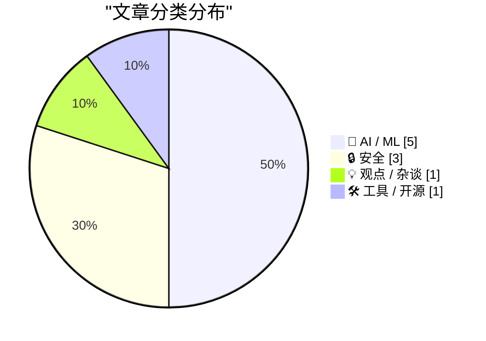
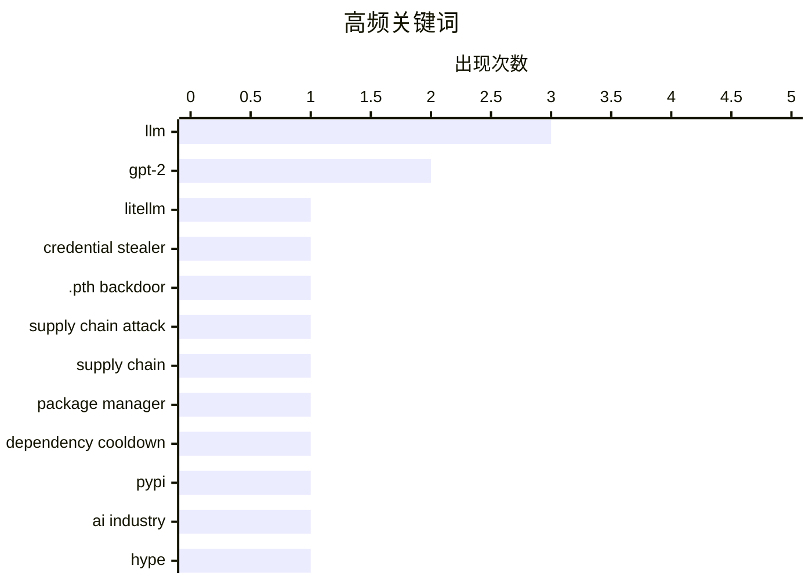

# 📰 AI 博客每日精选 — 2026-03-25

> 来自 Karpathy 推荐的 92 个顶级技术博客，AI 精选 Top 10

## 📝 今日看点

今天技术圈最突出的信号是：供应链安全正在从“老问题”变成“当下危机”，LiteLLM 投毒事件再次证明包管理与默认信任机制存在系统性风险。与之并行，AI 领域一边在加速工程化探索（如流式专家、权重衰减与权重绑定等训练细节优化），一边也在经历更强烈的叙事反思，行业宣传与真实能力之间的张力被持续放大。整体看，讨论重心正在从“能做什么”转向“是否可信、如何稳健落地”，安全治理与可验证性成为共同关键词。

---

## 🏆 今日必读

🥇 **LiteLLM 1.82.8 中恶意的 litellm_init.pth——凭证窃取器**

[Malicious litellm_init.pth in litellm 1.82.8 — credential stealer](https://simonwillison.net/2026/Mar/24/malicious-litellm/#atom-everything) — simonwillison.net · 7 小时前 · 🔒 安全

> 核心问题是 PyPI 上发布的 LiteLLM v1.82.8 遭到供应链投毒，包含可窃取凭证的恶意载荷。恶意代码被以 base64 形式隐藏在 `litellm_init.pth` 中，危险点在于用户只要安装该包就会触发执行，即使没有运行 `import litellm`。对比前一受影响版本 1.82.7，恶意逻辑位于 `proxy/proxy_server.py`，需要导入后才会生效，1.82.8 的触发门槛更低、影响面更广。文章还指向了对此事件的详细技术拆解，强调了 Python 包安装阶段执行路径被滥用的现实风险。结论是这是一次“安装即中招”的高危凭证窃取事件，暴露出 AI 依赖生态在发布与更新环节的严重供应链安全隐患。

💡 **为什么值得读**: 它用一个真实且最新的投毒案例说明“仅安装依赖也会被攻陷”，能直接提升你对 Python/LLM 供应链风险的防御优先级。

🏷️ LiteLLM, credential stealer, .pth backdoor, supply chain attack

🥈 **Package Managers Need to Cool Down**

[Package Managers Need to Cool Down](https://simonwillison.net/2026/Mar/24/package-managers-need-to-cool-down/#atom-everything) — simonwillison.net · 1 小时前 · 🔒 安全

> Package Managers Need to Cool Down Today's LiteLLM supply chain attack inspired me to revisit the idea of dependency cooldowns , the practice of only installing updated dependencies once they've been 

🏷️ supply chain, package manager, dependency cooldown, PyPI

🥉 **The AI Industry Is Lying To You**

[The AI Industry Is Lying To You](https://www.wheresyoured.at/the-ai-industry-is-lying-to-you/) — wheresyoured.at · 5 小时前 · 🤖 AI / ML

> Hi! If you like this piece and want to support my independent reporting and analysis, why not subscribe to my premium newsletter? It’s $70 a year, or $7 a month, and in return you get a weekly newslet

🏷️ AI industry, hype, LLM, critical analysis

---

## 📊 数据概览

| 扫描源 | 抓取文章 | 时间范围 | 精选 |
|:---:|:---:|:---:|:---:|
| 88/92 | 2502 篇 → 27 篇 | 24h | **10 篇** |

### 分类分布



### 高频关键词



<details>
<summary>📈 纯文本关键词图（终端友好）</summary>

```
llm                 │ ████████████████████ 3
gpt-2               │ █████████████░░░░░░░ 2
litellm             │ ███████░░░░░░░░░░░░░ 1
credential stealer  │ ███████░░░░░░░░░░░░░ 1
.pth backdoor       │ ███████░░░░░░░░░░░░░ 1
supply chain attack │ ███████░░░░░░░░░░░░░ 1
supply chain        │ ███████░░░░░░░░░░░░░ 1
package manager     │ ███████░░░░░░░░░░░░░ 1
dependency cooldown │ ███████░░░░░░░░░░░░░ 1
pypi                │ ███████░░░░░░░░░░░░░ 1
```

</details>

### 🏷️ 话题标签

**llm**(3) · **gpt-2**(2) · **litellm**(1) · credential stealer(1) · .pth backdoor(1) · supply chain attack(1) · supply chain(1) · package manager(1) · dependency cooldown(1) · pypi(1) · ai industry(1) · hype(1) · critical analysis(1) · mixture of experts(1) · model streaming(1) · ssd offloading(1) · inference(1) · weight decay(1) · training(1) · weight tying(1)

---

## 🤖 AI / ML

### 1. The AI Industry Is Lying To You

[The AI Industry Is Lying To You](https://www.wheresyoured.at/the-ai-industry-is-lying-to-you/) — **wheresyoured.at** · 5 小时前 · ⭐ 26/30

> Hi! If you like this piece and want to support my independent reporting and analysis, why not subscribe to my premium newsletter? It’s $70 a year, or $7 a month, and in return you get a weekly newslet

🏷️ AI industry, hype, LLM, critical analysis

---

### 2. Streaming experts

[Streaming experts](https://simonwillison.net/2026/Mar/24/streaming-experts/#atom-everything) — **simonwillison.net** · 17 小时前 · ⭐ 23/30

> I wrote about Dan Woods' experiments with streaming experts the other day , the trick where you run larger Mixture-of-Experts models on hardware that doesn't have enough RAM to fit the entire model by

🏷️ Mixture of Experts, model streaming, SSD offloading, inference

---

### 3. Writing an LLM from scratch, part 32f -- Interventions: weight decay

[Writing an LLM from scratch, part 32f -- Interventions: weight decay](https://www.gilesthomas.com/2026/03/llm-from-scratch-32f-interventions-weight-decay) — **gilesthomas.com** · 23 小时前 · ⭐ 23/30

> I'm still working on improving the test loss for a from-scratch GPT-2 small base model, trained on code based on Sebastian Raschka 's book " Build a Large Language Model (from Scratch) ". In my traini

🏷️ LLM, weight decay, GPT-2, training

---

### 4. Writing an LLM from scratch, part 32g -- Interventions: weight tying

[Writing an LLM from scratch, part 32g -- Interventions: weight tying](https://www.gilesthomas.com/2026/03/llm-from-scratch-32g-interventions-weight-tying) — **gilesthomas.com** · 3 小时前 · ⭐ 23/30

> In Sebastian Raschka 's book " Build a Large Language Model (from Scratch) ", he writes that weight tying, while it reduces the parameter count of a model, in his experience makes it worse. As such, a

🏷️ LLM, weight tying, GPT-2, model optimization

---

### 5. Weekly Update 496

[Weekly Update 496](https://www.troyhunt.com/weekly-update-496/) — **troyhunt.com** · 18 小时前 · ⭐ 23/30

> Watching OpenClaw do its thing must be like watching the first plane take flight. It's a bit rickety and stuck together with a lot of sticky tape, but squint and you can see the potential for agentic 

🏷️ agentic AI, OpenClaw, security commentary, weekly roundup

---

## 🔒 安全

### 6. LiteLLM 1.82.8 中恶意的 litellm_init.pth——凭证窃取器

[Malicious litellm_init.pth in litellm 1.82.8 — credential stealer](https://simonwillison.net/2026/Mar/24/malicious-litellm/#atom-everything) — **simonwillison.net** · 7 小时前 · ⭐ 28/30

> 核心问题是 PyPI 上发布的 LiteLLM v1.82.8 遭到供应链投毒，包含可窃取凭证的恶意载荷。恶意代码被以 base64 形式隐藏在 `litellm_init.pth` 中，危险点在于用户只要安装该包就会触发执行，即使没有运行 `import litellm`。对比前一受影响版本 1.82.7，恶意逻辑位于 `proxy/proxy_server.py`，需要导入后才会生效，1.82.8 的触发门槛更低、影响面更广。文章还指向了对此事件的详细技术拆解，强调了 Python 包安装阶段执行路径被滥用的现实风险。结论是这是一次“安装即中招”的高危凭证窃取事件，暴露出 AI 依赖生态在发布与更新环节的严重供应链安全隐患。

🏷️ LiteLLM, credential stealer, .pth backdoor, supply chain attack

---

### 7. Package Managers Need to Cool Down

[Package Managers Need to Cool Down](https://simonwillison.net/2026/Mar/24/package-managers-need-to-cool-down/#atom-everything) — **simonwillison.net** · 1 小时前 · ⭐ 27/30

> Package Managers Need to Cool Down Today's LiteLLM supply chain attack inspired me to revisit the idea of dependency cooldowns , the practice of only installing updated dependencies once they've been 

🏷️ supply chain, package manager, dependency cooldown, PyPI

---

### 8. Hosting a Snowflake Proxy

[Hosting a Snowflake Proxy](https://matduggan.com/hosting-a-snowflake-proxy/) — **matduggan.com** · 11 小时前 · ⭐ 23/30

> In the nightmarish world of 2026 it can be difficult to know how to help at all. There are too many horrors happening to quickly to know where one can inject even a small amount of assistance. However

🏷️ Snowflake, proxy, censorship circumvention, network privacy

---

## 💡 观点 / 杂谈

### 9. Pluralistic: Goodhart's Law vs "prediction markets" (24 Mar 2026)

[Pluralistic: Goodhart's Law vs "prediction markets" (24 Mar 2026)](https://pluralistic.net/2026/03/24/degenerated-gambling/) — **pluralistic.net** · 11 小时前 · ⭐ 22/30

> Today's links Goodhart's Law vs "prediction markets": Putting a gun to the metric's head. Hey look at this: Delights to delectate. Object permanence: Apple v interop; Yahoo v the world; Rasputin v the

🏷️ Goodhart's Law, prediction markets, metrics, policy

---

## 🛠 工具 / 开源

### 10. Wander 0.2.0

[Wander 0.2.0](https://susam.net/code/news/wander/0.2.0.html) — **susam.net** · 23 小时前 · ⭐ 22/30

> Wander 0.2.0 is the second release of Wander, a small, decentralised, self-hosted web console that lets visitors to your website explore interesting websites and pages recommended by a community of in

🏷️ Wander, self-hosted, decentralized web, release

---

*生成于 2026-03-25 07:02 | 扫描 88 源 → 获取 2502 篇 → 精选 10 篇*
*基于 [Hacker News Popularity Contest 2025](https://refactoringenglish.com/tools/hn-popularity/) RSS 源列表*
