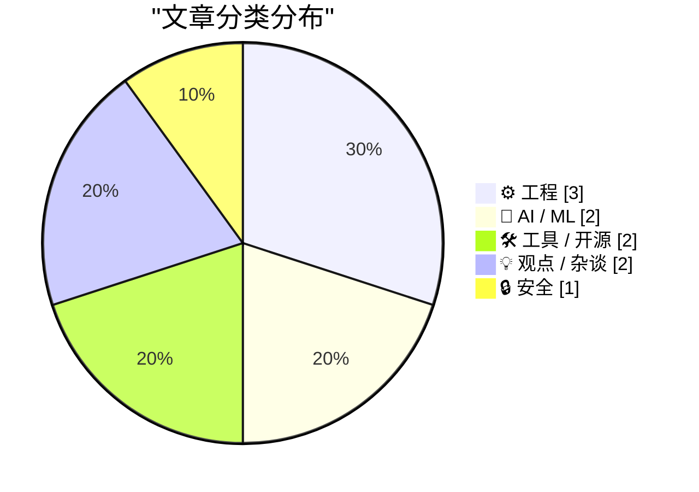
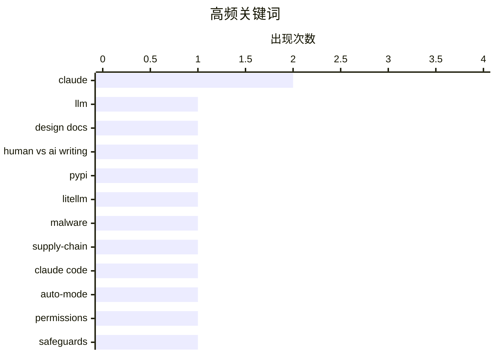

# 📰 AI 博客每日精选 — 2026-03-26

> 来自 Karpathy 推荐的 92 个顶级技术博客，AI 精选 Top 10

## 📝 今日看点

今天技术圈最突出的信号是：AI 正在从“写文档”走向“直接代操作”，人机边界快速前移，焦点也从模型能力本身转向可验证性、权限控制与实际落地效果。与此同时，供应链安全风险再次拉响警报，PyPI 恶意包事件说明开源依赖治理与分钟级应急响应已经成为工程团队的基本功。另一条主线是工程价值观回归务实——无论是底层系统机制、数据库基础实践，还是“简单代码更能带来长期产出”的讨论，都在强调可维护性、可靠性与长期技术复利。

---

## 🏆 今日必读

🥇 **哪份设计文档是人写的？**

[Which Design Doc Did a Human Write?](https://refactoringenglish.com/blog/ai-vs-human-design-doc/) — refactoringenglish.com · 23 小时前 · 🤖 AI / ML

> 作者围绕“人类与 AI 生成设计文档是否可区分”做了一次对照实验：同一开源 Web 应用产出三份设计文档，其中一份手写（16 小时），两份分别由 Claude Opus 4.6（medium effort）和 GPT-5.4/Codex（high effort）在几分钟内生成。实验设置中，AI 代理拿到的是作者书中关于设计文档的章节和骨架模板，且未看到作者手写版本。公布答案后，Version B 是人写，A 和 C 为 AI 生成；读者投票里，不到 50% 能正确识别人类版本，但其得票仍以约 2:1 领先其他版本，同时约四分之一读者把人写稿判为“Definitely AI”。读者给出的“人类痕迹”主要是更强的个人判断与经验细节（如更常出现“I think”“We’ll”式主观表达）、更具人类组织习惯的目录与架构分组，以及像 NixCI、PolyForm-Noncommercial 这类不那么主流的技术与许可选择。作者核心结论是：AI 文档已足够接近人类写作，但个人经验、主观取舍和非主流决策仍是可辨识的人类信号。

💡 **为什么值得读**: 它用同题盲测和读者投票把“AI 文档像不像人写”从抽象争论变成可观察证据，能直接启发你如何写出更有作者性的技术文档。

🏷️ LLM, design docs, human vs AI writing, Claude

🥈 **我对 LiteLLM 恶意软件攻击的逐分钟响应**

[My minute-by-minute response to the LiteLLM malware attack](https://simonwillison.net/2026/Mar/26/response-to-the-litellm-malware-attack/#atom-everything) — simonwillison.net · 2026-03-27 · 🔒 安全

> 根据摘录可见，核心事件是 LiteLLM 在 PyPI 上出现了带恶意代码的版本（litellm==1.82.8），并已可被用户安装到受感染环境。Callum McMahon 将该攻击上报给 PyPI，并公开了他借助 Claude 进行漏洞确认与处置决策的对话记录。对话中在隔离的 Docker 容器里对从 PyPI 重新下载的 wheel 包进行检查，发现了 litellm_init.pth（34628 字节），且前 200 个字符显示通过 base64 解码再执行的可疑代码。Claude 在确认恶意代码后，明确建议立即联系 security@pypi.org 报告事件。作者还提到 Callum 使用了其 claude-code-transcripts 工具来发布这段调查转录，强调了可追溯的应急协作流程。

💡 **为什么值得读**: 它提供了一个真实且时间敏感的供应链安全处置样本，具体展示了如何用隔离环境与 AI 辅助证据快速完成恶意包确认和上报。

🏷️ PyPI, LiteLLM, malware, supply-chain

🥉 **Claude Code 的自动模式**

[Auto mode for Claude Code](https://simonwillison.net/2026/Mar/24/auto-mode-for-claude-code/#atom-everything) — simonwillison.net · 23 小时前 · 🛠 工具 / 开源

> Claude Code 新增了 auto mode，作为 `--dangerously-skip-permissions` 的替代权限模式，由系统代替用户做部分权限决策，并在动作执行前进行防护审查。根据文中引用的文档，每次执行前会由独立分类器审查对话与动作是否匹配用户意图，重点拦截任务越权、访问不受信任基础设施、以及受文件或网页中恶意内容驱动的操作。该分类器固定使用 Claude Sonnet 4.6，即使主会话使用其他模型，并提供默认过滤规则与可自定义规则。作者通过 `claude auto-mode defaults` 展示了规则 JSON：允许项包括项目范围内本地操作、只读请求、按清单安装已声明依赖；同时对高风险行为给出 `soft_deny`，如 `git push --force`、直接推送默认分支、下载并执行外部代码（如 `curl | bash`）等。整体观点是，这一模式通过“自动决策 + 明确护栏”提供了比完全跳过权限更可控的安全路径。

💡 **为什么值得读**: 它把 Claude Code 的实际安全策略（含具体 allow/soft_deny 规则与边界定义）拆解得很具体，能帮助你快速判断 auto mode 是否适合团队开发流程。

🏷️ Claude Code, auto-mode, permissions, safeguards

---

## 📊 数据概览

| 扫描源 | 抓取文章 | 时间范围 | 精选 |
|:---:|:---:|:---:|:---:|
| 89/92 | 2528 篇 → 48 篇 | 24h | **10 篇** |

### 分类分布



### 高频关键词



<details>
<summary>📈 纯文本关键词图（终端友好）</summary>

```
claude              │ ████████████████████ 2
llm                 │ ██████████░░░░░░░░░░ 1
design docs         │ ██████████░░░░░░░░░░ 1
human vs ai writing │ ██████████░░░░░░░░░░ 1
pypi                │ ██████████░░░░░░░░░░ 1
litellm             │ ██████████░░░░░░░░░░ 1
malware             │ ██████████░░░░░░░░░░ 1
supply-chain        │ ██████████░░░░░░░░░░ 1
claude code         │ ██████████░░░░░░░░░░ 1
auto-mode           │ ██████████░░░░░░░░░░ 1
```

</details>

### 🏷️ 话题标签

**claude**(2) · **llm**(1) · **design docs**(1) · human vs ai writing(1) · pypi(1) · litellm(1) · malware(1) · supply-chain(1) · claude code(1) · auto-mode(1) · permissions(1) · safeguards(1) · bell labs(1) · transistor(1) · amplifier(1) · electronics history(1) · win32(1) · msgwaitformultipleobjects(1) · getmessage(1) · dialog loop(1)

---

## ⚙️ 工程

### 1. 放大器时代

[The Age of the Amplifier](https://www.construction-physics.com/p/the-age-of-the-amplifier) — **construction-physics.com** · 2026-03-27 · ⭐ 21/30

> 根据摘录可见，文章围绕 AT&T 贝尔实验室为何长期投入“更好的信号放大器”研发，以及这些投入如何演化为跨行业的基础技术。文中将真空管、负反馈放大器、晶体管和激光并列为关键成果，指出它们最初都与提升电磁信号放大能力有关，并在通信之外产生了巨大外溢价值。摘录给出的影响路径包括：真空管成为20世纪上半叶电子技术核心器件，负反馈放大器推动控制理论发展，晶体管奠定现代数字计算基础，激光扩展到光纤通信、工业切割、条码扫描和打印等场景。文章还把这一技术脉络放回贝尔系统“普遍服务”目标下，展示从电话长距离连接需求到底层器件创新的关系，并列出 AT&T 早期网络扩张数据（如1881年10万用户、世纪之交1300个交换局与80万以上用户）。核心观点是：围绕放大器这一看似具体的工程问题进行持续攻关，能够催生具有通用性的“平台级”发明，并重塑多个技术领域。

🏷️ Bell Labs, transistor, amplifier, electronics history

---

### 2. 如何把对话框的消息循环从 GetMessage 改成 MsgWaitForMultipleObjects？

[How can I change a dialog box’s message loop to do a MsgWaitForMultipleObjects instead of GetMessage?](https://devblogs.microsoft.com/oldnewthing/20260325-00/?p=112165) — **devblogs.microsoft.com/oldnewthing** · 9 小时前 · ⭐ 21/30

> 核心问题是：标准模态对话框循环只等待消息，无法同时等待内核句柄，而调用方又可能无法修改现有对话框过程。摘录给出的关键思路是利用对话框进入空闲前发送给 owner 的 WM_ENTERIDLE，在该时机接管“等待”动作，并在有待处理消息时再返回给对话框。文中指出，虽然可改用无模式对话框并自建消息循环，但外部场景下难以判断对话框是否调用 EndDialog 及其返回码，因此并不总是可行。示例代码通过空格触发创建 waitable timer、弹出通用文件打开对话框，并在 WM_ENTERIDLE 中使用 MsgWaitForMultipleObjects 同时等待定时器与输入队列，定时器触发时每 2 秒蜂鸣一次。作者的核心观点是：在不能改对话框过程时，可借助 WM_ENTERIDLE 从外部定制模态对话框的等待机制。

🏷️ Win32, MsgWaitForMultipleObjects, GetMessage, dialog loop

---

### 3. SQLAlchemy 2 实战——第 2 章：数据库表

[SQLAlchemy 2 In Practice - Chapter 2 - Database Tables](https://blog.miguelgrinberg.com/post/sqlalchemy-2-in-practice---chapter-1---database-tables) — **miguelgrinberg.com** · 2026-03-26 · ⭐ 20/30

> 根据摘录可见，本章聚焦 SQLAlchemy 2 中数据库表的基础用法，涵盖表的创建、更新与查询。内容先区分 SQLAlchemy Core 与 ORM：Core 负责数据库方言适配、表结构描述与基于 Python 构造 SQL，ORM 通过对象关系映射在应用与数据库之间提供抽象层，并说明实践中可混合使用两者。摘录给出了通过 `create_engine()` 和 `DATABASE_URL` 环境变量创建 engine 的示例，并强调 engine 同时服务 Core 与 ORM 的连接管理。还列出若干关键配置项：`echo=True` 用于输出 SQL 日志调试，`pool_size`（默认最多 5）与 `max_overflow`（默认 10）用于连接池容量控制，`future=True` 用于在 SQLAlchemy 1.4 中启用 2.0 风格 API。ORM 建模部分指出应用需先定义声明式基类（常命名为 `Model` 或 `Base`），其子类集合共同描述数据库 schema。

🏷️ SQLAlchemy 2, Python, ORM, database tables

---

## 🤖 AI / ML

### 4. 哪份设计文档是人写的？

[Which Design Doc Did a Human Write?](https://refactoringenglish.com/blog/ai-vs-human-design-doc/) — **refactoringenglish.com** · 23 小时前 · ⭐ 25/30

> 作者围绕“人类与 AI 生成设计文档是否可区分”做了一次对照实验：同一开源 Web 应用产出三份设计文档，其中一份手写（16 小时），两份分别由 Claude Opus 4.6（medium effort）和 GPT-5.4/Codex（high effort）在几分钟内生成。实验设置中，AI 代理拿到的是作者书中关于设计文档的章节和骨架模板，且未看到作者手写版本。公布答案后，Version B 是人写，A 和 C 为 AI 生成；读者投票里，不到 50% 能正确识别人类版本，但其得票仍以约 2:1 领先其他版本，同时约四分之一读者把人写稿判为“Definitely AI”。读者给出的“人类痕迹”主要是更强的个人判断与经验细节（如更常出现“I think”“We’ll”式主观表达）、更具人类组织习惯的目录与架构分组，以及像 NixCI、PolyForm-Noncommercial 这类不那么主流的技术与许可选择。作者核心结论是：AI 文档已足够接近人类写作，但个人经验、主观取舍和非主流决策仍是可辨识的人类信号。

🏷️ LLM, design docs, human vs AI writing, Claude

---

### 5. Claude 现在可以接管你的 Mac

[Claude Can Now Take Control of Your Mac](https://claude.com/blog/dispatch-and-computer-use) — **daringfireball.net** · 21 小时前 · ⭐ 24/30

> Anthropic 在 Claude Cowork 与 Claude Code 中上线了“电脑使用”能力（研究预览），让 Claude 在缺少现成连接器时可直接操作用户电脑完成任务。系统会优先使用 Slack、Google Calendar 等连接器；若无连接器，则可控制浏览器、鼠标、键盘和屏幕，执行打开文件、网页导航、运行开发工具等操作，且无需额外配置。该能力与 Dispatch 联动后，用户可从手机分配任务并在电脑上查看结果，还可用于定时查邮件、拉取指标、生成报告或协助 PR 流程。安全机制包括：操作前显式征求权限、访问新应用前再次请求许可、用户可随时中止，以及对模型激活进行自动扫描以降低提示注入等风险。作者同时强调该功能仍处早期阶段，复杂任务可能需要重试、屏幕操作速度慢于直接集成，并建议先在可信应用中使用且避免敏感数据场景。

🏷️ Claude, computer use, agent, automation

---

## 🛠 工具 / 开源

### 6. Claude Code 的自动模式

[Auto mode for Claude Code](https://simonwillison.net/2026/Mar/24/auto-mode-for-claude-code/#atom-everything) — **simonwillison.net** · 23 小时前 · ⭐ 22/30

> Claude Code 新增了 auto mode，作为 `--dangerously-skip-permissions` 的替代权限模式，由系统代替用户做部分权限决策，并在动作执行前进行防护审查。根据文中引用的文档，每次执行前会由独立分类器审查对话与动作是否匹配用户意图，重点拦截任务越权、访问不受信任基础设施、以及受文件或网页中恶意内容驱动的操作。该分类器固定使用 Claude Sonnet 4.6，即使主会话使用其他模型，并提供默认过滤规则与可自定义规则。作者通过 `claude auto-mode defaults` 展示了规则 JSON：允许项包括项目范围内本地操作、只读请求、按清单安装已声明依赖；同时对高风险行为给出 `soft_deny`，如 `git push --force`、直接推送默认分支、下载并执行外部代码（如 `curl | bash`）等。整体观点是，这一模式通过“自动决策 + 明确护栏”提供了比完全跳过权限更可控的安全路径。

🏷️ Claude Code, auto-mode, permissions, safeguards

---

### 7. 在 WordPress 中添加 human.json

[Adding human.json to WordPress](https://shkspr.mobi/blog/2026/03/adding-human-json-to-wordpress/) — **shkspr.mobi** · 2026-03-26 · ⭐ 20/30

> 内容围绕一种新的信任声明格式 human.json，以及如何在 WordPress 站点中接入它。文中先对比了 FOAF、PGP、XML RDF 和 XHTML Friends Network 等历史方案，指出这些方式在可用性、生态或隐私层面都未形成广泛采用。human.json 被定义为轻量协议，使用“URL 所有权即身份”，通过站点间可爬取的 vouch 关系传播信任，并给出了 version 0.1.1 的 JSON 示例字段（url、vouches、vouched_at）。实现部分提供了两种思路：手工上传静态 JSON 文件，或在 WordPress 中通过 index.php 的 `<link rel="human-json">`、`add_rewrite_rule` 与 `query_vars` 拦截 `/json/human.json`，再在 `template_redirect` 动态输出 JSON 与响应头。根据摘录可见，作者也明确这种机制本质是“声明与背书”而非可证明的人类性验证，必要时可通过移除条目撤销背书。

🏷️ human.json, WordPress, identity, trust graph

---

## 💡 观点 / 杂谈

### 8. 我看不见苹果的愿景

[I Can't See Apple's Vision](https://matduggan.com/i-cant-see-apples-vision/) — **matduggan.com** · 2026-03-26 · ⭐ 20/30

> 根据摘录可见，作者的核心担忧不是某一次产品翻车，而是苹果在 macOS 与 watchOS 上缺乏连贯、统一的产品愿景。文中先承认苹果工程团队能力很强，且 Tahoe 并非一无是处，仍有剪贴板管理器、自动化 API、改进后的 Spotlight 等亮点。与此同时，作者认为其视觉层面表现“很糟”，这与苹果“重视设计”的品牌定位形成冲突。作者还对比指出，这种问题并非覆盖苹果所有平台：iPadOS 与 iOS 愿景更清晰，visionOS/tvOS虽相对弱一些但各有阶段性解释，Apple TV 也整体表现尚可。最终观点是，macOS 和 watchOS 这两套软件正在拖累本已出色的硬件，这比单次版本失误更危险。

🏷️ Apple, product design, organizational culture, UX critique

---

### 9. 工程师确实会因编写简单代码而获得晋升

[Engineers do get promoted for writing simple code](https://seangoedecke.com/simple-work-gets-rewarded/) — **seangoedecke.com** · 2026-03-26 · ⭐ 20/30

> 核心观点是：把代码写得简单、可维护，并不会妨碍职业发展，反而更有利于晋升。作者承认“复杂看起来更难、更显能力”在短期内可能迷惑评价者，但强调多数非技术经理最终更看重可量化的交付结果。文中对比了“简单工程师”和“复杂工程师”的长期表现：前者完成任务更快、Bug 更少、项目成功记录更长，并逐步建立“低摩擦交付”的口碑。作者还指出，转嫁复杂系统维护成本或以“我拿到的是最难问题”为由自我辩护，通常难以长期奏效，因为同事反馈和跨项目表现会暴露问题。结论是，简单代码与持续交付能力高度相关，而“能稳定上线功能”的工程师更容易获得管理层认可与回报。

🏷️ software-engineering, simplicity, career-growth, maintainability

---

## 🔒 安全

### 10. 我对 LiteLLM 恶意软件攻击的逐分钟响应

[My minute-by-minute response to the LiteLLM malware attack](https://simonwillison.net/2026/Mar/26/response-to-the-litellm-malware-attack/#atom-everything) — **simonwillison.net** · 2026-03-27 · ⭐ 24/30

> 根据摘录可见，核心事件是 LiteLLM 在 PyPI 上出现了带恶意代码的版本（litellm==1.82.8），并已可被用户安装到受感染环境。Callum McMahon 将该攻击上报给 PyPI，并公开了他借助 Claude 进行漏洞确认与处置决策的对话记录。对话中在隔离的 Docker 容器里对从 PyPI 重新下载的 wheel 包进行检查，发现了 litellm_init.pth（34628 字节），且前 200 个字符显示通过 base64 解码再执行的可疑代码。Claude 在确认恶意代码后，明确建议立即联系 security@pypi.org 报告事件。作者还提到 Callum 使用了其 claude-code-transcripts 工具来发布这段调查转录，强调了可追溯的应急协作流程。

🏷️ PyPI, LiteLLM, malware, supply-chain

---

*生成于 2026-03-26 07:00 | 扫描 89 源 → 获取 2528 篇 → 精选 10 篇*
*基于 [Hacker News Popularity Contest 2025](https://refactoringenglish.com/tools/hn-popularity/) RSS 源列表*
