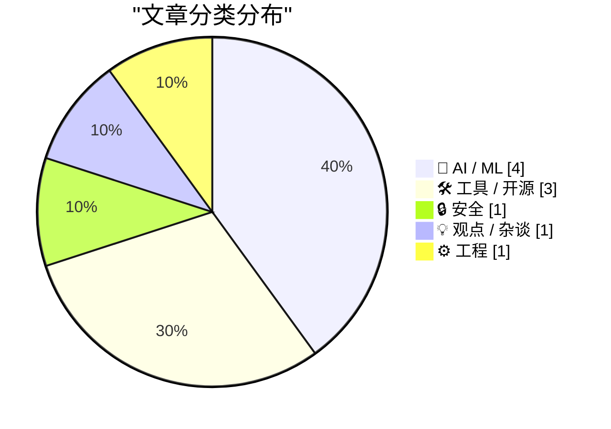
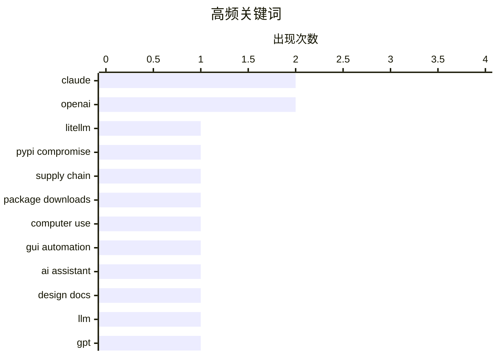

# 📰 AI 博客每日精选 — 2026-03-26

> 来自 Karpathy 推荐的 92 个顶级技术博客，AI 精选 Top 10

## 📝 今日看点

今天技术圈的主线非常清晰：AI 正在从“会聊天”迈向“会操作”，无论是 Claude 可直接控制电脑、Claude Code 的自动模式，还是 OpenAI 传出的桌面超级应用布局，都在加速把大模型变成真正的系统级助手。与此同时，生态进入快速重组期，新能力密集上线的同时，旧产品与形态也在迅速退场，平台竞争从单点模型能力转向端到端体验整合。另一条被反复敲响的警钟是供应链与信任问题：从 LiteLLM 投毒事件到“人写还是 AI 写”的辨识讨论，开发者如今既要追求效率跃迁，也必须把安全、可验证性和工程节奏放到同等优先级。

---

## 🏆 今日必读

🥇 **LiteLLM 被黑：你是 4.7 万人中的一员吗？**

[LiteLLM Hack: Were You One of the 47,000?](https://simonwillison.net/2026/Mar/25/litellm-hack/#atom-everything) — simonwillison.net · 5 小时前 · 🔒 安全

> 核心问题是：在 LiteLLM 两个被投毒版本短暂上线期间，实际有多少用户可能受到影响。基于 BigQuery 的 PyPI 下载数据，Daniel Hnyk 统计出恶意版本 1.82.7 和 1.82.8 在 46 分钟窗口内共被下载 46,996 次，说明供应链攻击传播速度极快。进一步分析发现有 2,337 个包依赖 LiteLLM，其中 88% 没有采用可规避该风险版本的严格版本锁定策略。这个结果把“理论风险”量化成了可验证的生态级暴露面，也暴露了 Python 包管理中版本约束实践的薄弱环节。结论是：即便攻击窗口很短，缺乏版本 pinning 的依赖链仍会放大影响范围，供应链防护必须前移到依赖治理层面。

💡 **为什么值得读**: 它用真实下载量和依赖图数据把一次安全事件的实际冲击量化出来，能直接指导你改进 Python 依赖锁定与供应链防护策略。

🏷️ LiteLLM, PyPI compromise, supply chain, package downloads

🥈 **Claude Can Now Take Control of Your Mac**

[Claude Can Now Take Control of Your Mac](https://claude.com/blog/dispatch-and-computer-use) — daringfireball.net · 21 小时前 · 🤖 AI / ML

> Claude: In Claude Cowork and Claude Code, you can now enable Claude to use your computer to complete tasks. When Claude doesn’t have access to the tools it needs, it will point, click, and navigate wh

🏷️ Claude, computer use, GUI automation, AI assistant

🥉 **Which Design Doc Did a Human Write?**

[Which Design Doc Did a Human Write?](https://refactoringenglish.com/blog/ai-vs-human-design-doc/) — refactoringenglish.com · 23 小时前 · 🤖 AI / ML

> I created three design docs for the same open-source web app: I spent 16 hours writing one of the design docs completely by hand. I generated one using Claude Opus 4.6 (medium effort). I generated one

🏷️ design docs, LLM, Claude, GPT

---

## 📊 数据概览

| 扫描源 | 抓取文章 | 时间范围 | 精选 |
|:---:|:---:|:---:|:---:|
| 82/92 | 2403 篇 → 17 篇 | 24h | **10 篇** |

### 分类分布



### 高频关键词



<details>
<summary>📈 纯文本关键词图（终端友好）</summary>

```
claude            │ ████████████████████ 2
openai            │ ████████████████████ 2
litellm           │ ██████████░░░░░░░░░░ 1
pypi compromise   │ ██████████░░░░░░░░░░ 1
supply chain      │ ██████████░░░░░░░░░░ 1
package downloads │ ██████████░░░░░░░░░░ 1
computer use      │ ██████████░░░░░░░░░░ 1
gui automation    │ ██████████░░░░░░░░░░ 1
ai assistant      │ ██████████░░░░░░░░░░ 1
design docs       │ ██████████░░░░░░░░░░ 1
```

</details>

### 🏷️ 话题标签

**claude**(2) · **openai**(2) · **litellm**(1) · pypi compromise(1) · supply chain(1) · package downloads(1) · computer use(1) · gui automation(1) · ai assistant(1) · design docs(1) · llm(1) · gpt(1) · agentic engineering(1) · ai agents(1) · developer discipline(1) · workflow(1) · claude code(1) · auto mode(1) · permissions(1) · developer tooling(1)

---

## 🤖 AI / ML

### 1. Claude Can Now Take Control of Your Mac

[Claude Can Now Take Control of Your Mac](https://claude.com/blog/dispatch-and-computer-use) — **daringfireball.net** · 21 小时前 · ⭐ 27/30

> Claude: In Claude Cowork and Claude Code, you can now enable Claude to use your computer to complete tasks. When Claude doesn’t have access to the tools it needs, it will point, click, and navigate wh

🏷️ Claude, computer use, GUI automation, AI assistant

---

### 2. Which Design Doc Did a Human Write?

[Which Design Doc Did a Human Write?](https://refactoringenglish.com/blog/ai-vs-human-design-doc/) — **refactoringenglish.com** · 23 小时前 · ⭐ 25/30

> I created three design docs for the same open-source web app: I spent 16 hours writing one of the design docs completely by hand. I generated one using Claude Opus 4.6 (medium effort). I generated one

🏷️ design docs, LLM, Claude, GPT

---

### 3. WSJ: ‘OpenAI Plans Launch of Desktop “Superapp”’

[WSJ: ‘OpenAI Plans Launch of Desktop “Superapp”’](https://www.wsj.com/tech/openai-plans-launch-of-desktop-superapp-to-refocus-simplify-user-experience-9e19931d?st=25wiu1) — **daringfireball.net** · 22 小时前 · ⭐ 24/30

> Berber Jin, reporting last week for The Wall Street Journal (gift link): OpenAI is planning to unify its ChatGPT app, coding platform Codex and browser into a desktop “superapp,” a step to simplify th

🏷️ OpenAI, desktop superapp, ChatGPT, Codex

---

### 4. OpenAI Is Closing Sora

[OpenAI Is Closing Sora](https://x.com/soraofficialapp/status/2036546752535470382) — **daringfireball.net** · 22 小时前 · ⭐ 23/30

> Sora, on Twitter/X: We’re saying goodbye to the Sora app. To everyone who created with Sora, shared it, and built community around it: thank you. What you made with Sora mattered, and we know this new

🏷️ OpenAI, Sora, product shutdown, video generation

---

## 🛠 工具 / 开源

### 5. Auto mode for Claude Code

[Auto mode for Claude Code](https://simonwillison.net/2026/Mar/24/auto-mode-for-claude-code/#atom-everything) — **simonwillison.net** · 23 小时前 · ⭐ 24/30

> Auto mode for Claude Code Really interesting new development in Claude Code today as an alternative to --dangerously-skip-permissions : Today, we're introducing auto mode, a new permissions mode in Cl

🏷️ Claude Code, auto mode, permissions, developer tooling

---

### 6. datasette-llm 0.1a1

[datasette-llm 0.1a1](https://simonwillison.net/2026/Mar/25/datasette-llm/#atom-everything) — **simonwillison.net** · 1 小时前 · ⭐ 22/30

> Release: datasette-llm 0.1a1 New release of the base plugin that makes models from LLM available for use by other Datasette plugins such as datasette-enrichments-llm . New register_llm_purposes() plug

🏷️ Datasette, LLM plugin, release, plugin hooks

---

### 7. Improved Analytics in App Store Connect

[Improved Analytics in App Store Connect](https://developer.apple.com/news/?id=hh6v4b55) — **daringfireball.net** · 3 小时前 · ⭐ 21/30

> Apple Developer: Analytics in App Store Connect receives its biggest update since its launch, including a refreshed user experience that makes it easier to measure the performance of your apps and gam

🏷️ App Store Connect, analytics, privacy, app performance

---

## 🔒 安全

### 8. LiteLLM 被黑：你是 4.7 万人中的一员吗？

[LiteLLM Hack: Were You One of the 47,000?](https://simonwillison.net/2026/Mar/25/litellm-hack/#atom-everything) — **simonwillison.net** · 5 小时前 · ⭐ 27/30

> 核心问题是：在 LiteLLM 两个被投毒版本短暂上线期间，实际有多少用户可能受到影响。基于 BigQuery 的 PyPI 下载数据，Daniel Hnyk 统计出恶意版本 1.82.7 和 1.82.8 在 46 分钟窗口内共被下载 46,996 次，说明供应链攻击传播速度极快。进一步分析发现有 2,337 个包依赖 LiteLLM，其中 88% 没有采用可规避该风险版本的严格版本锁定策略。这个结果把“理论风险”量化成了可验证的生态级暴露面，也暴露了 Python 包管理中版本约束实践的薄弱环节。结论是：即便攻击窗口很短，缺乏版本 pinning 的依赖链仍会放大影响范围，供应链防护必须前移到依赖治理层面。

🏷️ LiteLLM, PyPI compromise, supply chain, package downloads

---

## 💡 观点 / 杂谈

### 9. Thoughts on slowing the fuck down

[Thoughts on slowing the fuck down](https://simonwillison.net/2026/Mar/25/thoughts-on-slowing-the-fuck-down/#atom-everything) — **simonwillison.net** · 1 小时前 · ⭐ 24/30

> Thoughts on slowing the fuck down Mario Zechner created the Pi agent framework used by OpenClaw, giving considerable credibility to his opinions on current trends in agentic engineering. He's not impr

🏷️ agentic engineering, AI agents, developer discipline, workflow

---

## ⚙️ 工程

### 10. How can I change a dialog box’s message loop to do a Msg­Wait­For­Multiple­Objects instead of Get­Message?

[How can I change a dialog box’s message loop to do a Msg­Wait­For­Multiple­Objects instead of Get­Message?](https://devblogs.microsoft.com/oldnewthing/20260325-00/?p=112165) — **devblogs.microsoft.com/oldnewthing** · 9 小时前 · ⭐ 20/30

> The dialog box lets you change how it waits. The post How can I change a dialog box’s message loop to do a Msg&shy;Wait&shy;For&shy;Multiple&shy;Objects instead of Get&shy;Message ? appeared first on 

🏷️ Win32, message loop, MsgWaitForMultipleObjects, dialog

---

*生成于 2026-03-26 07:01 | 扫描 82 源 → 获取 2403 篇 → 精选 10 篇*
*基于 [Hacker News Popularity Contest 2025](https://refactoringenglish.com/tools/hn-popularity/) RSS 源列表*
