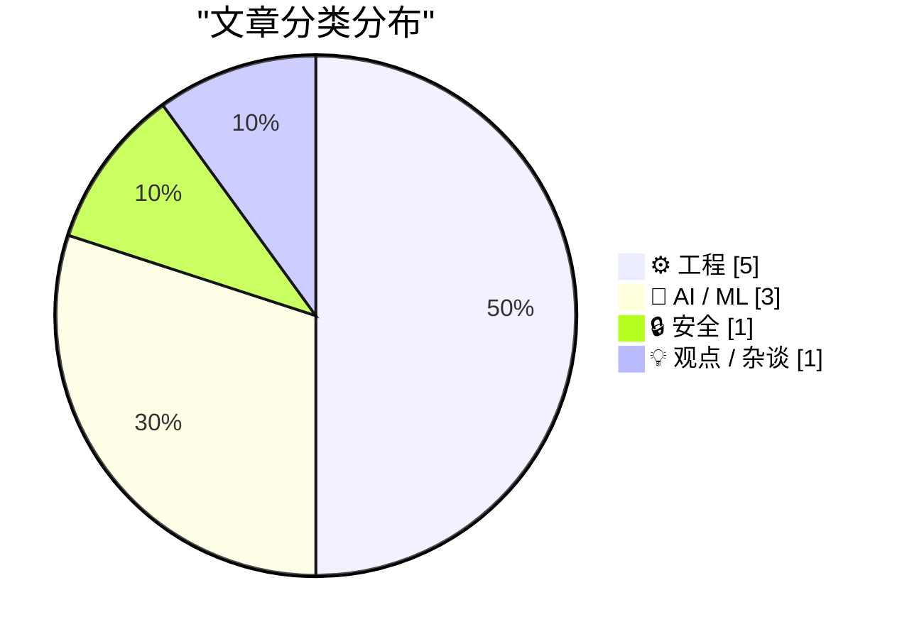
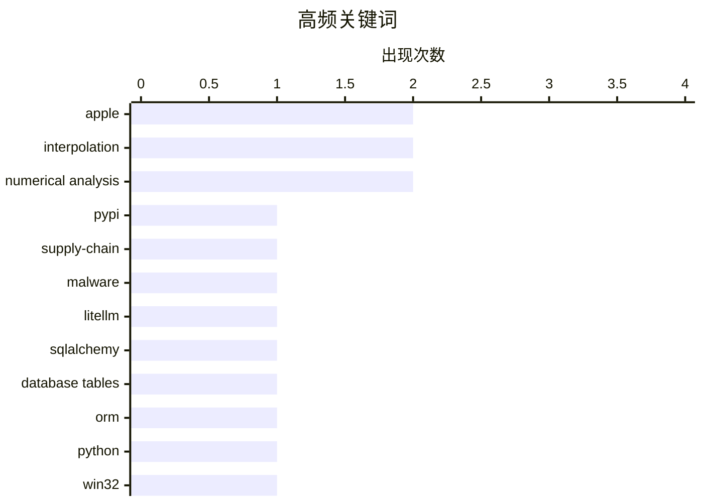

# 📰 AI 博客每日精选 — 2026-03-27

> 来自 Karpathy 推荐的 92 个顶级技术博客，AI 精选 Top 10

## 📝 今日看点

今天技术圈最突出的主线，是“AI加速落地”与“风险外溢”并行：一边在量化、蒸馏等模型工程上持续提效，另一边供应链安全与商业预期波动也在同步放大。围绕LiteLLM恶意包事件的快速响应，凸显了开源生态进入“分钟级防御”时代，AI工具本身也开始参与漏洞确认与协同处置。与此同时，开发者议题明显回归基础功：从数据库建模、系统消息机制到数值精度与插值稳定性，工程社区在性能与可靠性细节上持续深挖。再叠加对苹果等大厂产品战略的质疑，行业情绪呈现出“技术乐观、商业审慎”的新平衡。

---

## 🏆 今日必读

🥇 **我对 LiteLLM 恶意软件攻击的逐分钟响应**

[My minute-by-minute response to the LiteLLM malware attack](https://simonwillison.net/2026/Mar/26/response-to-the-litellm-malware-attack/#atom-everything) — simonwillison.net · 9 小时前 · 🔒 安全

> 核心主题是 LiteLLM 在 PyPI 上出现恶意版本后的应急响应过程，以及 AI 工具在安全确认与上报中的作用。摘录显示，Callum McMahon 使用 Claude 对话记录来确认漏洞，并在隔离的 Docker 容器中检查到 litellm-1.82.8-py3-none-any.whl 含有 litellm_init.pth，且其前 200 个字符包含通过 base64 解码并执行的可疑代码。记录明确指出恶意版本 litellm==1.82.8 当时仍在线，安装或升级该版本会被感染，并建议立即上报至 security@pypi.org。Simon Willison 还提到对方使用了自己发布的 claude-code-transcripts 工具来公开这段确认与决策过程的对话。作者传达的重点是：面对供应链安全事件，应快速验证、隔离复现并及时通过官方安全渠道上报。

💡 **为什么值得读**: 值得读在于它给出了一个真实且可复用的供应链攻击处置样例：如何借助 Claude 与 Docker 在分钟级完成确认、决策和责任上报。

🏷️ PyPI, supply-chain, malware, LiteLLM

🥈 **SQLAlchemy 2 In Practice - Chapter 2 - Database Tables**

[SQLAlchemy 2 In Practice - Chapter 2 - Database Tables](https://blog.miguelgrinberg.com/post/sqlalchemy-2-in-practice---chapter-1---database-tables) — miguelgrinberg.com · 20 小时前 · ⚙️ 工程

> miguelgrinberg.com Home My Courses and Books Consulting About Me Light Mode Dark Mode System Default --> SQLAlchemy 2 In Practice - Chapter 2 - Database Tables Posted by on 2026-03-26T12:30:03Z under 

🏷️ SQLAlchemy, database tables, ORM, Python

🥉 **Why doesn’t WM_ENTER­IDLE work if the dialog box is a Message­Box?**

[Why doesn’t WM_ENTER­IDLE work if the dialog box is a Message­Box?](https://devblogs.microsoft.com/oldnewthing/20260326-00/?p=112167) — devblogs.microsoft.com/oldnewthing · 19 小时前 · ⚙️ 工程

> Dev Blogs The Old New Thing Why doesn’t WM_ENTER&shy;IDLE work if the dialog box is a Message&shy;Box? March 26th, 2026 2 reactions Why doesn’t WM_ ENTER&shy;IDLE work if the dialog box is a Message&s

🏷️ Win32, WM_ENTERIDLE, MessageBox, dialog loop

---

## 📊 数据概览

| 扫描源 | 抓取文章 | 时间范围 | 精选 |
|:---:|:---:|:---:|:---:|
| 88/92 | 2503 篇 → 25 篇 | 24h | **10 篇** |

### 分类分布



### 高频关键词



<details>
<summary>📈 纯文本关键词图（终端友好）</summary>

```
apple              │ ████████████████████ 2
interpolation      │ ████████████████████ 2
numerical analysis │ ████████████████████ 2
pypi               │ ██████████░░░░░░░░░░ 1
supply-chain       │ ██████████░░░░░░░░░░ 1
malware            │ ██████████░░░░░░░░░░ 1
litellm            │ ██████████░░░░░░░░░░ 1
sqlalchemy         │ ██████████░░░░░░░░░░ 1
database tables    │ ██████████░░░░░░░░░░ 1
orm                │ ██████████░░░░░░░░░░ 1
```

</details>

### 🏷️ 话题标签

**apple**(2) · **interpolation**(2) · **numerical analysis**(2) · pypi(1) · supply-chain(1) · malware(1) · litellm(1) · sqlalchemy(1) · database tables(1) · orm(1) · python(1) · win32(1) · wm_enteridle(1) · messagebox(1) · dialog loop(1) · quantization(1) · llm(1) · perplexity(1) · qwen(1) · human.json(1)

---

## ⚙️ 工程

### 1. SQLAlchemy 2 In Practice - Chapter 2 - Database Tables

[SQLAlchemy 2 In Practice - Chapter 2 - Database Tables](https://blog.miguelgrinberg.com/post/sqlalchemy-2-in-practice---chapter-1---database-tables) — **miguelgrinberg.com** · 20 小时前 · ⭐ 24/30

> miguelgrinberg.com Home My Courses and Books Consulting About Me Light Mode Dark Mode System Default --> SQLAlchemy 2 In Practice - Chapter 2 - Database Tables Posted by on 2026-03-26T12:30:03Z under 

🏷️ SQLAlchemy, database tables, ORM, Python

---

### 2. Why doesn’t WM_ENTER­IDLE work if the dialog box is a Message­Box?

[Why doesn’t WM_ENTER­IDLE work if the dialog box is a Message­Box?](https://devblogs.microsoft.com/oldnewthing/20260326-00/?p=112167) — **devblogs.microsoft.com/oldnewthing** · 19 小时前 · ⭐ 23/30

> Dev Blogs The Old New Thing Why doesn’t WM_ENTER&shy;IDLE work if the dialog box is a Message&shy;Box? March 26th, 2026 2 reactions Why doesn’t WM_ ENTER&shy;IDLE work if the dialog box is a Message&s

🏷️ Win32, WM_ENTERIDLE, MessageBox, dialog loop

---

### 3. Adding human.json to WordPress

[Adding human.json to WordPress](https://shkspr.mobi/blog/2026/03/adding-human-json-to-wordpress/) — **shkspr.mobi** · 20 小时前 · ⭐ 22/30

> Terence Eden’s Blog Theme Switcher: 🌒 Dark 🌞 Light 📰 eInk 💻 xterm 🥴 Drunk 👻 Nude ♻️ Reset Adding human.json to WordPress AI humans WordPress · 3 comments · 800 words · Viewed ~281 times Every fe

🏷️ human.json, WordPress, identity, web trust

---

### 4. Lebesgue constants

[Lebesgue constants](https://www.johndcook.com/blog/2026/03/26/lebesgue-constants/) — **johndcook.com** · 13 小时前 · ⭐ 19/30

> I alluded to Lebesgue constants in the previous post without giving them a name. There I said that the bound on order n interpolation error has the form where h is the spacing between interpolation po

🏷️ Lebesgue constants, interpolation, Chebyshev nodes, numerical analysis

---

### 5. How much precision can you squeeze out of a table?

[How much precision can you squeeze out of a table?](https://www.johndcook.com/blog/2026/03/26/table-precision/) — **johndcook.com** · 18 小时前 · ⭐ 19/30

> Richard Feynman said that almost everything becomes interesting if you look into it deeply enough. Looking up numbers in a table is certainly not interesting, but it becomes more interesting when you 

🏷️ interpolation, numerical analysis, precision, error bounds

---

## 🤖 AI / ML

### 6. Quantization from the ground up

[Quantization from the ground up](https://simonwillison.net/2026/Mar/26/quantization-from-the-ground-up/#atom-everything) — **simonwillison.net** · 16 小时前 · ⭐ 22/30

> Simon Willison’s Weblog Subscribe Sponsored by: WorkOS &mdash; Ready to sell to Enterprise clients? Build and ship securely with WorkOS. 26th March 2026 - Link Blog Quantization from the ground up . S

🏷️ quantization, LLM, perplexity, Qwen

---

### 7. The Information: ‘Apple Can “Distill” Google’s Big Gemini Model’

[The Information: ‘Apple Can “Distill” Google’s Big Gemini Model’](https://www.theinformation.com/newsletters/ai-agenda/apple-can-distill-googles-big-gemini-model?rc=jfy0lk) — **daringfireball.net** · 15 小时前 · ⭐ 25/30

> Jessica E. Lessin, Amir Efrati, and Erin Woo, reporting for the paywalled-without-gift-links The Information: While we have reported that Apple can tweak, or fine-tune, a version of Google’s Gemini AI

🏷️ Apple, Gemini, distillation, model-optimization

---

### 8. Disney Drops Vaporware $1B Investment in OpenAI After Sora Got Axed

[Disney Drops Vaporware $1B Investment in OpenAI After Sora Got Axed](https://variety.com/2026/digital/news/openai-shutting-down-sora-video-disney-1236698277/) — **daringfireball.net** · 13 小时前 · ⭐ 23/30

> Plus Icon Film Plus Icon TV Plus Icon What To Watch Plus Icon Music Plus Icon Docs Plus Icon Digital & Gaming Plus Icon Global Plus Icon Awards Circuit Plus Icon Video Plus Icon What To Hear Plus Icon

🏷️ OpenAI, Sora, Disney, generative-video

---

## 🔒 安全

### 9. 我对 LiteLLM 恶意软件攻击的逐分钟响应

[My minute-by-minute response to the LiteLLM malware attack](https://simonwillison.net/2026/Mar/26/response-to-the-litellm-malware-attack/#atom-everything) — **simonwillison.net** · 9 小时前 · ⭐ 24/30

> 核心主题是 LiteLLM 在 PyPI 上出现恶意版本后的应急响应过程，以及 AI 工具在安全确认与上报中的作用。摘录显示，Callum McMahon 使用 Claude 对话记录来确认漏洞，并在隔离的 Docker 容器中检查到 litellm-1.82.8-py3-none-any.whl 含有 litellm_init.pth，且其前 200 个字符包含通过 base64 解码并执行的可疑代码。记录明确指出恶意版本 litellm==1.82.8 当时仍在线，安装或升级该版本会被感染，并建议立即上报至 security@pypi.org。Simon Willison 还提到对方使用了自己发布的 claude-code-transcripts 工具来公开这段确认与决策过程的对话。作者传达的重点是：面对供应链安全事件，应快速验证、隔离复现并及时通过官方安全渠道上报。

🏷️ PyPI, supply-chain, malware, LiteLLM

---

## 💡 观点 / 杂谈

### 10. I Can't See Apple's Vision

[I Can't See Apple's Vision](https://matduggan.com/i-cant-see-apples-vision/) — **matduggan.com** · 21 小时前 · ⭐ 20/30

> Companies, as they grow to become multi-billion-dollar entities, somehow lose their vision. They insert lots of layers of middle management between the people running the company and the people doing 

🏷️ Apple, product design, management, software quality

---

*生成于 2026-03-27 17:05 | 扫描 88 源 → 获取 2503 篇 → 精选 10 篇*
*基于 [Hacker News Popularity Contest 2025](https://refactoringenglish.com/tools/hn-popularity/) RSS 源列表*
